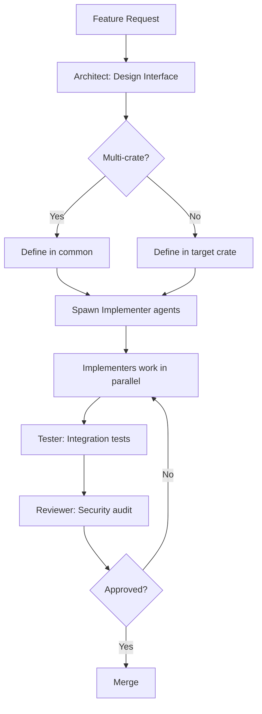
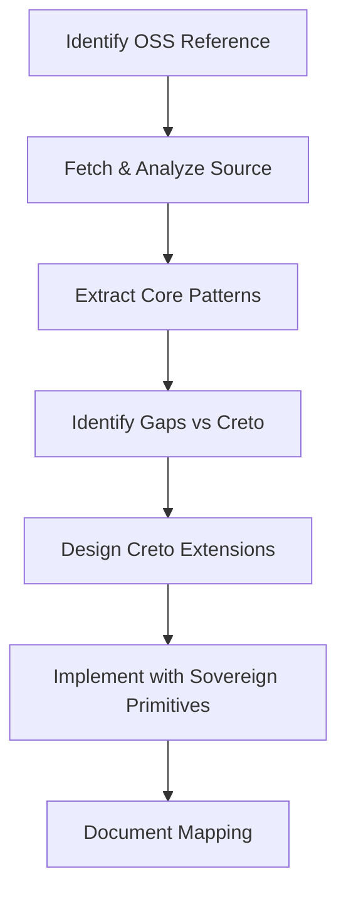
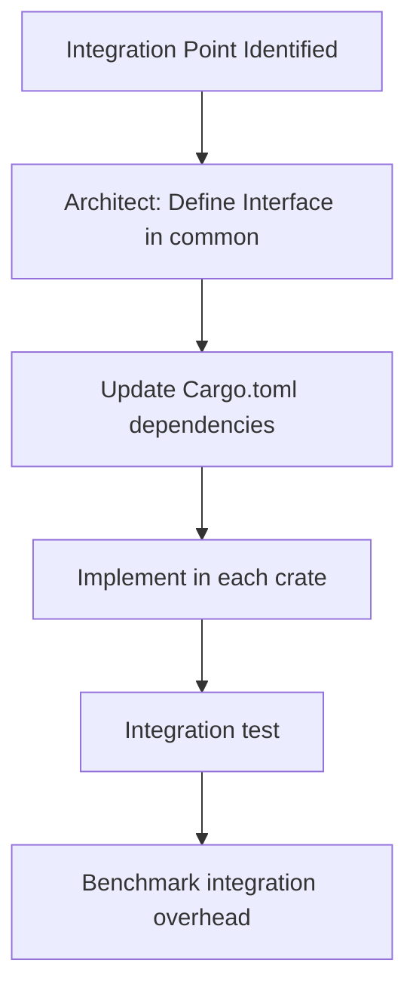

# Claude Code + Claude Flow Playbook

## creto-enablement Development Workflows

This playbook defines multi-agent workflows for developing the Creto Enablement Layer using Claude Code with Claude Flow orchestration patterns.

---

## Quick Reference

```bash
# Start Claude Code in the repo
cd creto-enablement
claude

# Common commands
/compact                    # Compress context when running low
/cost                      # Check token usage
/memory                    # View session memory
```

---

## 1. Agent Role Definitions

### 1.1 Architect Agent
**Purpose**: Design traits, integration points, cross-crate interfaces
**Trigger phrases**: "design", "architect", "interface", "trait", "integration"

```
You are the Architect agent for creto-enablement.

Your responsibilities:
1. Define trait interfaces in creto-enablement-common
2. Design cross-crate integration patterns
3. Ensure consistency with Platform/Security layer interfaces
4. Review for NHI integration completeness

Output format:
- Trait definitions with full documentation
- Integration diagrams (Mermaid)
- Dependency graphs
- Migration notes if changing existing interfaces
```

### 1.2 Implementer Agent (per crate)
**Purpose**: Implement traits, write business logic
**Variants**: metering, oversight, runtime, messaging

```
You are the Implementer agent for creto-{crate}.

Your responsibilities:
1. Implement traits defined by Architect
2. Follow OSS patterns from CLAUDE.md references
3. Write unit tests for all public functions
4. Add tracing/logging instrumentation

Code style:
- Rust 2021 edition idioms
- async/await with tokio
- Error handling via thiserror
- All public items documented
```

### 1.3 Tester Agent
**Purpose**: Write integration tests, property tests, benchmarks
**Trigger phrases**: "test", "benchmark", "coverage", "integration"

```
You are the Tester agent for creto-enablement.

Your responsibilities:
1. Write integration tests across crates
2. Write property-based tests (proptest)
3. Write benchmarks (criterion)
4. Ensure >80% code coverage

Test patterns:
- Mock Platform/Security layer dependencies
- Test error paths explicitly
- Benchmark hot paths (quota check <10µs, etc.)
```

### 1.4 Reviewer Agent
**Purpose**: Security review, compliance check, code quality
**Trigger phrases**: "review", "security", "audit", "compliance"

```
You are the Reviewer agent for creto-enablement.

Your responsibilities:
1. Security review all code changes
2. Verify NHI integration is complete
3. Check compliance mapping (EU AI Act, SOX, FedRAMP)
4. Ensure audit logging is comprehensive

Review checklist:
□ No hardcoded secrets
□ All actions logged to audit
□ NHI present in all data structures
□ Crypto-agility maintained (no hardcoded algorithms)
□ Error messages don't leak sensitive info
```

---

## 2. Workflow Patterns

### 2.1 New Feature Workflow



**Claude Code commands**:
```bash
# Step 1: Architect designs
claude "Design the trait interface for [feature]. Include integration with Authorization and Audit."

# Step 2: Implement (can run in parallel terminals)
claude "Implement [trait] in creto-metering following Lago patterns from CLAUDE.md"
claude "Implement [trait] in creto-oversight following HumanLayer patterns"

# Step 3: Test
claude "Write integration tests for [feature] across all crates that use it"

# Step 4: Review
claude "Security review the [feature] implementation. Check NHI integration and audit logging."
```

### 2.2 OSS Pattern Extraction Workflow



**Claude Code commands**:
```bash
# Step 1: Analyze OSS
claude "Analyze the Lago event ingestion code at https://github.com/getlago/lago.
Extract the core data model and API patterns."

# Step 2: Identify gaps
claude "Compare Lago's event model to Creto requirements.
What's missing for NHI attribution and delegation chain?"

# Step 3: Design extension
claude "Design BillableEvent trait that extends Lago patterns with:
- agent_nhi: AgentIdentity
- delegation_chain: Vec<AgentIdentity>
- consensus timestamp
- signature"

# Step 4: Implement
claude "Implement the BillableEvent trait and StandardEvent struct in creto-metering/src/event.rs"
```

### 2.3 Cross-Crate Integration Workflow



**Example: Quota Enforcement Integration**
```bash
# Authorization calls Metering's QuotaEnforcer inline
claude "Design the integration point where creto-authz calls creto-metering QuotaEnforcer.
Requirements:
- Must add <10µs to 168ns authorization path
- Return QuotaDecision that authz can include in its Decision
- Support async with timeout"

# Then implement each side
claude "Implement QuotaEnforcer::check_quota in creto-metering with in-memory bloom filter"
claude "Add quota_enforcer integration to authorization check flow (mock creto-authz for now)"
```

---

## 3. Task Templates

### 3.1 Implement New Trait

```markdown
## Task: Implement [TraitName] in creto-[crate]

### Context
- OSS Reference: [link to OSS code/docs]
- SDD Section: [section number]
- Related traits: [list]

### Requirements
1. [ ] Follow pattern from [OSS reference]
2. [ ] Add NHI integration (agent_nhi, delegation_chain)
3. [ ] Connect to Authorization service
4. [ ] Log to Audit service
5. [ ] Use Crypto-Agility layer (no hardcoded algorithms)

### Acceptance Criteria
- [ ] All methods documented with examples
- [ ] Unit tests with >80% coverage
- [ ] Integration test with mock dependencies
- [ ] Benchmark if on hot path

### Files to Create/Modify
- `crates/creto-[crate]/src/[module].rs`
- `crates/creto-[crate]/src/lib.rs` (re-exports)
- `tests/[crate]_[module]_test.rs`
```

### 3.2 Add Notification Channel (Oversight)

```markdown
## Task: Add [Channel] notification channel

### Context
- HumanLayer reference: channels/[channel].py
- Creto extension: signed responses, NHI context

### Requirements
1. [ ] Implement NotificationChannel trait
2. [ ] Support interactive responses (approve/deny buttons)
3. [ ] Include agent NHI and delegation chain in notification
4. [ ] Collect signed response from approver
5. [ ] Handle timeouts and escalation

### Files
- `crates/creto-oversight/src/channels/[channel].rs`
- `crates/creto-oversight/src/channels/mod.rs`
- Feature flag in `Cargo.toml`
```

### 3.3 Add Runtime Backend

```markdown
## Task: Add [Backend] sandbox backend

### Context
- Agent Sandbox reference: [link]
- Creto extension: NHI binding, attestation

### Requirements
1. [ ] Implement SandboxRuntime trait
2. [ ] Implement Attestor for this platform
3. [ ] Bind NHI at spawn time
4. [ ] Network egress via Authorization
5. [ ] Secret injection via NHI delegation

### Files
- `crates/creto-runtime/src/backend/[backend].rs`
- Feature flag in `Cargo.toml`
```

---

## 4. Development Sessions

### 4.1 Session: Bootstrap creto-metering

```bash
# Session goal: Get creto-metering to compile with core functionality

# 1. Check current state
claude "What's the current implementation status of creto-metering?
List implemented vs TODO items."

# 2. Fix compilation issues
claude "Fix any compilation errors in creto-metering.
The crate should build with 'cargo build -p creto-metering'"

# 3. Implement core event flow
claude "Implement the full event ingestion flow:
1. EventBuilder creates StandardEvent
2. Event validated (idempotency check)
3. Event logged to audit (mock)
4. Event stored for aggregation"

# 4. Add quota integration
claude "Implement InMemoryQuotaEnforcer with bloom filter for fast negative lookups.
Target: <10µs check time."

# 5. Test
claude "Write comprehensive tests for the event → quota → aggregation flow"

# 6. Benchmark
claude "Add criterion benchmarks for:
- quota_check (target: <10µs)
- event_creation
- aggregation (1000 events)"
```

### 4.2 Session: Implement Oversight State Machine

```bash
# Session goal: Implement OversightRequest state machine with checkpoint/resume

# 1. Design state machine
claude "Design the OversightRequest state machine based on HumanLayer patterns:
States: Pending, Approved, Denied, Escalated, TimedOut, Cancelled
Transitions: with signed approvals and audit logging"

# 2. Implement
claude "Implement OversightRequest in creto-oversight/src/request.rs.
Include checkpoint() and resume() for durability."

# 3. Add Slack channel
claude "Implement SlackNotificationChannel following HumanLayer's Slack integration.
Use interactive message buttons for approve/deny."

# 4. Integration test
claude "Write integration test:
Create request → send notification → receive approval → verify signature → log audit"
```

### 4.3 Session: Implement Runtime with gVisor

```bash
# Session goal: Basic gVisor sandbox with NHI binding

# 1. Study Agent Sandbox
claude "Analyze kubernetes-sigs/agent-sandbox gVisor implementation.
Extract the sandbox lifecycle: create → bind → exec → terminate"

# 2. Design Creto extension
claude "Design SandboxSpec with:
- agent_nhi binding at spawn
- attestation generation
- network policy via Authorization"

# 3. Implement mock backend
claude "Implement MockSandboxRuntime for testing.
Should simulate gVisor behavior without actual container runtime."

# 4. Implement gVisor backend (stub)
claude "Create gVisor backend stub in creto-runtime/src/backend/gvisor.rs.
Document what system integration is needed for real implementation."

# 5. Warm pool
claude "Implement WarmPoolManager with:
- Pre-spawn sandboxes
- Claim binds NHI
- Release scrubs and returns to pool
- Target: <100ms claim time"
```

### 4.4 Session: Implement E2E Messaging

```bash
# Session goal: Basic E2E encrypted messaging between agents

# 1. Study Signal Protocol
claude "Review Signal Protocol Double Ratchet concepts.
For Creto, we need simpler: fresh key per message, NHI-based encryption."

# 2. Design MessageEnvelope
claude "Design MessageEnvelope with:
- AES-256-GCM encrypted payload
- ML-KEM-768 wrapped symmetric key
- Ed25519 + ML-DSA signature (non-repudiation)
- Authorization check before delivery"

# 3. Implement encryption
claude "Implement MessageEncryptor using ring crate for AES-256-GCM.
Use x25519-dalek for key exchange (placeholder for ML-KEM)."

# 4. Implement delivery policy
claude "Implement DeliveryPolicy that calls Authorization service.
Check: can sender message recipient? Rate limited?"

# 5. Full flow test
claude "Write test: Agent A sends encrypted message to Agent B.
Verify: encryption, signature, authorization check, delivery."
```

---

## 5. Parallel Development Pattern

When multiple developers (or Claude instances) work simultaneously:

### 5.1 Crate Isolation

Each crate can be developed independently after common traits are stable:

```
Developer 1: creto-metering
Developer 2: creto-oversight
Developer 3: creto-runtime
Developer 4: creto-messaging
```

**Sync points**:
1. After Architect defines traits in `creto-enablement-common`
2. Before integration tests
3. Before release

### 5.2 Branch Strategy

```
main
├── feature/metering-core
├── feature/oversight-state-machine
├── feature/runtime-gvisor
└── feature/messaging-e2e
```

Each feature branch can be developed in parallel, merged after review.

### 5.3 Integration Points

Define integration contracts early:

```rust
// In creto-enablement-common/src/integration.rs

/// Contract: Authorization calls this inline
#[async_trait]
pub trait InlineQuotaCheck: Send + Sync {
    async fn check(&self, agent: &AgentIdentity, action: &Action)
        -> Result<QuotaDecision, Error>;
}

/// Contract: Authorization triggers this when policy requires oversight
#[async_trait]
pub trait OversightTrigger: Send + Sync {
    async fn trigger(&self, request: OversightRequest) -> Result<RequestId, Error>;
}

/// Contract: Runtime calls this for network egress
#[async_trait]
pub trait EgressCheck: Send + Sync {
    async fn check_egress(&self, agent: &AgentIdentity, dest: &str)
        -> Result<bool, Error>;
}

/// Contract: Messaging calls this before delivery
#[async_trait]
pub trait DeliveryCheck: Send + Sync {
    async fn can_deliver(&self, sender: &AgentIdentity, recipient: &AgentIdentity)
        -> Result<bool, Error>;
}
```

---

## 6. Quality Gates

### 6.1 Before PR

```bash
# Must pass
cargo fmt --all -- --check
cargo clippy --workspace -- -D warnings
cargo test --workspace
cargo doc --workspace --no-deps

# Should pass
cargo audit
cargo deny check
```

### 6.2 Reviewer Checklist

```markdown
## PR Review Checklist

### Security
- [ ] No hardcoded secrets or keys
- [ ] All crypto via creto-crypto (no direct ring usage in prod)
- [ ] Error messages don't leak internal state
- [ ] Input validation on all public APIs

### NHI Integration
- [ ] agent_nhi present in all data structures
- [ ] delegation_chain tracked where applicable
- [ ] Signatures use Crypto-Agility layer

### Audit
- [ ] All state changes logged to creto-audit
- [ ] Audit records include who/what/when/why
- [ ] Sensitive data redacted from logs

### Compliance
- [ ] EU AI Act: Human oversight paths exist
- [ ] SOX: Billing audit trail complete
- [ ] FedRAMP: Authorization checks in place

### Performance
- [ ] Hot paths benchmarked
- [ ] No blocking in async contexts
- [ ] Memory allocations minimized
```

---

## 7. Troubleshooting

### 7.1 Compilation Errors

```bash
# Dependency version conflicts
claude "Fix Cargo.toml dependency conflicts in the workspace.
Use workspace dependencies consistently."

# Trait bound issues
claude "Fix trait bound error: '[error message]'.
Ensure async_trait and Send+Sync bounds are correct."
```

### 7.2 Test Failures

```bash
# Flaky async tests
claude "This test is flaky: [test name].
Add proper synchronization or timeouts."

# Mock issues
claude "The mock for [trait] isn't working correctly.
Review mockall usage and expectations."
```

### 7.3 Performance Issues

```bash
# Benchmark regression
claude "Benchmark shows quota_check at 50µs, target is <10µs.
Profile and optimize the hot path."

# Memory usage
claude "Memory usage is high in [function].
Review allocations and consider zero-copy alternatives."
```

---

## 8. Release Checklist

```markdown
## Release v0.1.0

### Pre-release
- [ ] All tests passing
- [ ] Documentation complete
- [ ] CHANGELOG updated
- [ ] Version bumped in all Cargo.toml
- [ ] Security review complete

### Crate publish order
1. creto-enablement-common
2. creto-metering
3. creto-oversight
4. creto-runtime
5. creto-messaging

### Post-release
- [ ] Tag created
- [ ] GitHub release with notes
- [ ] crates.io published (if public)
- [ ] Docs deployed
```

---

## Appendix: Claude Code Tips

### Context Management
```bash
/compact          # When context is filling up
/clear            # Start fresh (loses context)
/cost             # Monitor token usage
```

### File Operations
```bash
# Edit existing file
claude "In creto-metering/src/event.rs, add a new method to StandardEvent..."

# Create new file
claude "Create creto-metering/src/wallet.rs implementing prepaid credits..."

# View file
claude "Show me creto-metering/src/quota.rs lines 50-100"
```

### Multi-file Changes
```bash
# Refactoring across files
claude "Rename QuotaEnforcer to UsageEnforcer across all crates.
Update imports, trait bounds, and documentation."
```

### Running Commands
```bash
claude "Run cargo test -p creto-metering and fix any failures"
claude "Run cargo bench -p creto-metering -- quota and show results"
```
