# C4 Container Diagram - Enablement Layer

## Overview

This C4 Container diagram provides a detailed view of the Enablement Layer's internal architecture, showing the four product containers (Metering, Oversight, Runtime, Messaging), shared infrastructure components (databases, caches, message queues), and external-facing API gateway.

## Purpose

- Identify all containers (services, databases, queues) within the Enablement Layer
- Show technology choices for each container (PostgreSQL, Redis, Kafka, etc.)
- Illustrate communication patterns between containers
- Visualize shared infrastructure and data stores

## Diagram

```mermaid
C4Container
    title Container Diagram - Enablement Layer

    Person(humanOps, "Human Operators", "Engineers configuring policies and monitoring usage")
    Person(aiAgents, "AI Agents", "Autonomous agents consuming Enablement services")

    System_Ext(slack, "Slack API", "Notification delivery")
    System_Ext(email, "Email Service", "SMTP notifications")
    System_Ext(stripe, "Stripe API", "Payment processing")
    System_Ext(externalLLM, "External LLMs", "OpenAI, Anthropic APIs")

    System_Boundary(enablement, "Enablement Layer") {

        Container_Boundary(gateway, "API Gateway") {
            Container(loadBalancer, "Load Balancer", "AWS ALB", "TLS termination, request routing, health checks")
            Container(apiGateway, "API Gateway", "Kong/Envoy", "Rate limiting, authentication, request validation")
        }

        Container_Boundary(meteringContainer, "Metering Product") {
            Container(eventIngestion, "Event Ingestion Service", "Go/gRPC", "Receives usage events, validates schemas, publishes to Kafka")
            Container(quotaEnforcer, "Quota Enforcer", "Go/gRPC", "Real-time quota checks using Bloom filters + Redis")
            Container(aggregationEngine, "Aggregation Engine", "Go/Stream Processing", "Consumes Kafka, aggregates events, writes to PostgreSQL")
            Container(billingService, "Billing Service", "Go/gRPC", "Generates invoices, integrates with Stripe")
        }

        Container_Boundary(oversightContainer, "Oversight Product") {
            Container(policyEngine, "Policy Engine", "Rust/gRPC", "Evaluates policies against requests, CEL expressions")
            Container(requestManager, "Request Manager", "Rust/gRPC", "State machine for approval workflows (PENDING→APPROVED/REJECTED)")
            Container(channelRouter, "Channel Router", "Rust/gRPC", "Routes notifications to Slack/Email/Webhook")
            Container(durabilityManager, "Durability Manager", "Rust/gRPC", "Persists approval state, handles retries")
        }

        Container_Boundary(runtimeContainer, "Runtime Product") {
            Container(sandboxController, "Sandbox Controller", "Go/gRPC", "Orchestrates sandbox lifecycle (create, start, stop, destroy)")
            Container(warmPoolManager, "Warm Pool Manager", "Go/Background", "Maintains pool of pre-warmed sandboxes for fast startup")
            Container(runtimeAdapter, "Runtime Adapter", "Go/gRPC", "Abstracts gVisor/Kata/Firecracker implementations")
            Container(egressController, "Egress Controller", "Go/gRPC", "Controls sandbox network egress, enforces allowlists")
        }

        Container_Boundary(messagingContainer, "Messaging Product") {
            Container(keyAgreement, "Key Agreement Service", "Rust/gRPC", "X3DH protocol for initial key exchange")
            Container(ratchetEngine, "Ratchet Engine", "Rust/gRPC", "Double Ratchet state machine for forward secrecy")
            Container(envelopeProcessor, "Envelope Processor", "Rust/gRPC", "Encrypts/decrypts message payloads")
            Container(deliveryRouter, "Delivery Router", "Rust/gRPC", "Routes encrypted messages, handles offline queuing")
        }

        Container_Boundary(dataStores, "Shared Data Stores") {
            ContainerDb(postgres, "PostgreSQL", "PostgreSQL 15", "Primary data store: events, approvals, sandbox state, messages")
            ContainerDb(redis, "Redis", "Redis 7", "Hot cache: quota counters, ratchet state, session tokens")
            ContainerDb(s3, "S3 Storage", "AWS S3", "Cold storage: billing archives, policy snapshots, sandbox images")
            ContainerQueue(kafka, "Kafka", "Apache Kafka", "Event streaming: usage events, audit logs, notifications")
        }

        Container_Boundary(sharedServices, "Shared Services") {
            Container(authzLib, "AuthZ Library", "Rust/In-process", "Delegation chain validation, HMAC verification (168ns)")
            Container(nhiFacade, "NHI Facade", "Go/gRPC", "Agent identity resolution, key management")
            Container(cryptoLib, "Crypto Library", "Rust/In-process", "HMAC, ChaCha20-Poly1305, Ed25519")
            Container(auditLogger, "Audit Logger", "Go/gRPC", "Append-only log writer, cryptographic linking")
        }
    }

    %% External Actor → API Gateway
    Rel(humanOps, loadBalancer, "Configures via HTTPS", "HTTPS/JSON")
    Rel(aiAgents, loadBalancer, "Consumes APIs via HTTPS", "HTTPS/JSON")
    Rel(loadBalancer, apiGateway, "Routes requests", "HTTP/2")

    %% API Gateway → Products
    Rel(apiGateway, eventIngestion, "POST /metering/events", "gRPC")
    Rel(apiGateway, quotaEnforcer, "GET /metering/quotas/{agent_id}", "gRPC")
    Rel(apiGateway, billingService, "GET /metering/invoices", "gRPC")

    Rel(apiGateway, policyEngine, "POST /oversight/evaluate", "gRPC")
    Rel(apiGateway, requestManager, "POST /oversight/requests", "gRPC")

    Rel(apiGateway, sandboxController, "POST /runtime/sandboxes", "gRPC")
    Rel(apiGateway, egressController, "POST /runtime/egress", "gRPC")

    Rel(apiGateway, keyAgreement, "POST /messaging/prekeys", "gRPC")
    Rel(apiGateway, deliveryRouter, "POST /messaging/send", "gRPC")

    %% Metering Internal Flows
    Rel(eventIngestion, kafka, "Publishes events", "Kafka Protocol")
    Rel(aggregationEngine, kafka, "Consumes events", "Kafka Protocol")
    Rel(quotaEnforcer, redis, "Checks quota counters", "Redis Protocol")
    Rel(aggregationEngine, postgres, "Writes aggregated data", "SQL")
    Rel(billingService, postgres, "Queries usage data", "SQL")
    Rel(billingService, stripe, "Creates invoices", "HTTPS/REST")
    Rel(billingService, s3, "Archives billing records", "S3 API")

    %% Oversight Internal Flows
    Rel(requestManager, policyEngine, "Evaluates request", "In-process")
    Rel(requestManager, postgres, "Persists approval state", "SQL")
    Rel(requestManager, channelRouter, "Sends notification", "In-process")
    Rel(channelRouter, slack, "Posts message", "HTTPS/Webhook")
    Rel(channelRouter, email, "Sends email", "SMTP")
    Rel(durabilityManager, redis, "Caches pending requests", "Redis Protocol")
    Rel(durabilityManager, s3, "Snapshots policies", "S3 API")

    %% Runtime Internal Flows
    Rel(sandboxController, warmPoolManager, "Claims warm sandbox", "In-process")
    Rel(sandboxController, runtimeAdapter, "Creates sandbox", "gRPC")
    Rel(sandboxController, postgres, "Tracks sandbox state", "SQL")
    Rel(warmPoolManager, redis, "Manages pool inventory", "Redis Protocol")
    Rel(egressController, runtimeAdapter, "Configures network", "gRPC")
    Rel(runtimeAdapter, s3, "Loads sandbox images", "S3 API")

    %% Messaging Internal Flows
    Rel(keyAgreement, postgres, "Stores prekeys", "SQL")
    Rel(ratchetEngine, redis, "Caches ratchet state", "Redis Protocol")
    Rel(envelopeProcessor, ratchetEngine, "Gets encryption key", "In-process")
    Rel(deliveryRouter, postgres, "Queues offline messages", "SQL")
    Rel(deliveryRouter, kafka, "Publishes delivery events", "Kafka Protocol")

    %% Shared Service Dependencies
    Rel(eventIngestion, authzLib, "Validates delegation", "In-process")
    Rel(quotaEnforcer, authzLib, "Checks permissions", "In-process")
    Rel(policyEngine, authzLib, "Verifies requester", "In-process")
    Rel(sandboxController, authzLib, "Validates execution rights", "In-process")
    Rel(keyAgreement, authzLib, "Authenticates sender", "In-process")

    Rel(eventIngestion, nhiFacade, "Resolves agent identity", "gRPC")
    Rel(requestManager, nhiFacade, "Looks up approver", "gRPC")
    Rel(sandboxController, nhiFacade, "Associates sandbox", "gRPC")
    Rel(keyAgreement, nhiFacade, "Fetches public key", "gRPC")

    Rel(billingService, cryptoLib, "Signs records", "In-process")
    Rel(policyEngine, cryptoLib, "Encrypts policies", "In-process")
    Rel(ratchetEngine, cryptoLib, "Performs ratchet", "In-process")

    Rel(eventIngestion, auditLogger, "Logs events", "gRPC")
    Rel(requestManager, auditLogger, "Logs decisions", "gRPC")
    Rel(sandboxController, auditLogger, "Logs lifecycle", "gRPC")
    Rel(deliveryRouter, auditLogger, "Logs metadata", "gRPC")

    UpdateLayoutConfig($c4ShapeInRow="3", $c4BoundaryInRow="2")
```

## Legend

| Symbol | Meaning |
|--------|---------|
| **Container** | Independently deployable service/application |
| **ContainerDb** | Database or data store |
| **ContainerQueue** | Message queue or event stream |
| **Container_Boundary** | Logical grouping of related containers |
| **Rel** | Relationship showing protocol/technology |

## Container Inventory

### API Gateway Layer
| Container | Technology | Responsibilities |
|-----------|-----------|------------------|
| Load Balancer | AWS ALB | TLS termination, health checks, multi-AZ routing |
| API Gateway | Kong/Envoy | Rate limiting, JWT validation, request transformation |

### Metering Product Containers
| Container | Technology | Responsibilities |
|-----------|-----------|------------------|
| Event Ingestion Service | Go/gRPC | Schema validation, deduplication, Kafka publishing |
| Quota Enforcer | Go/gRPC | Real-time quota checks (Bloom + Redis + PostgreSQL) |
| Aggregation Engine | Go/Kafka Streams | Event aggregation, time-bucketing, database writes |
| Billing Service | Go/gRPC | Invoice generation, Stripe integration, archive to S3 |

### Oversight Product Containers
| Container | Technology | Responsibilities |
|-----------|-----------|------------------|
| Policy Engine | Rust/gRPC | CEL policy evaluation, decision caching |
| Request Manager | Rust/gRPC | Approval state machine, timeout handling |
| Channel Router | Rust/gRPC | Multi-channel notifications (Slack/Email/Webhook) |
| Durability Manager | Rust/gRPC | State persistence, retry logic, policy snapshots |

### Runtime Product Containers
| Container | Technology | Responsibilities |
|-----------|-----------|------------------|
| Sandbox Controller | Go/gRPC | Lifecycle orchestration, quota enforcement |
| Warm Pool Manager | Go/Background | Pre-warming, pool sizing, eviction policies |
| Runtime Adapter | Go/gRPC | gVisor/Kata/Firecracker abstraction layer |
| Egress Controller | Go/gRPC | Network policy enforcement, allowlist filtering |

### Messaging Product Containers
| Container | Technology | Responsibilities |
|-----------|-----------|------------------|
| Key Agreement Service | Rust/gRPC | X3DH prekey bundles, initial key exchange |
| Ratchet Engine | Rust/gRPC | Double Ratchet state transitions, key rotation |
| Envelope Processor | Rust/gRPC | ChaCha20-Poly1305 encryption/decryption |
| Delivery Router | Rust/gRPC | Message routing, offline queuing, delivery receipts |

### Shared Data Stores
| Container | Technology | Purpose |
|-----------|-----------|---------|
| PostgreSQL | PostgreSQL 15 | Primary data: events, approvals, sandboxes, messages |
| Redis | Redis 7 | Hot cache: quotas, ratchet state, session tokens |
| S3 Storage | AWS S3 | Cold storage: billing archives, policy snapshots, images |
| Kafka | Apache Kafka | Event streaming: usage events, audit logs, notifications |

### Shared Services
| Container | Technology | Purpose |
|-----------|-----------|---------|
| AuthZ Library | Rust/In-process | Delegation chain validation (168ns) |
| NHI Facade | Go/gRPC | Agent identity resolution, key lookup |
| Crypto Library | Rust/In-process | Cryptographic primitives |
| Audit Logger | Go/gRPC | Immutable audit trail writer |

## Communication Patterns

### Synchronous (gRPC)
- **API Gateway → Products**: Client requests requiring immediate response
- **NHI Facade**: Identity lookups (cached aggressively)
- **Audit Logger**: Fire-and-forget logging with buffering

### Asynchronous (Kafka)
- **Event Ingestion → Aggregation**: Usage events streamed for processing
- **Delivery Router → Audit**: Message delivery events for forensics
- **Cross-product events**: Metering → Oversight cost triggers

### In-Process
- **AuthZ Library**: All products validate delegation chains in <200ns
- **Crypto Library**: HMAC, encryption, signing within service process
- **Policy Engine ↔ Request Manager**: CEL evaluation in same container

### Database Access Patterns
- **PostgreSQL**: Transactional writes, complex queries, analytical workloads
- **Redis**: Hot path reads (quota checks, ratchet state), TTL-based eviction
- **S3**: Append-only archives, infrequent access, lifecycle policies

## Implementation Considerations

### Scalability
- **Horizontal scaling**: All services stateless, scale on CPU/memory metrics
- **Database sharding**: PostgreSQL partitioned by `agent_id` hash (16 shards)
- **Kafka partitioning**: Events partitioned by `agent_id` for ordering guarantees
- **Redis clustering**: 6-node cluster (3 primaries + 3 replicas)

### Performance
- **AuthZ in-process**: 168ns p99 latency, no network calls
- **gRPC multiplexing**: HTTP/2 streams, binary serialization
- **Bloom filters**: Quota checks avoid 95% of Redis lookups
- **Warm pools**: Sandbox startup <50ms (vs. 2-5s cold start)

### Resilience
- **Circuit breakers**: Envoy configured with 5-second windows, 50% error threshold
- **Retry policies**: Exponential backoff (100ms, 200ms, 400ms) with jitter
- **Kafka replication**: 3x replication factor, min in-sync replicas = 2
- **Database backups**: PostgreSQL continuous archiving (PITR), S3 versioning

### Security
- **TLS everywhere**: mTLS between services, TLS 1.3 for external
- **Secret management**: AWS Secrets Manager rotation, least-privilege IAM
- **Network policies**: Kubernetes NetworkPolicies restrict pod-to-pod
- **Audit immutability**: Cryptographic chaining of log entries

### Monitoring
- **Metrics**: Prometheus scraping all containers (RED metrics: Rate, Errors, Duration)
- **Tracing**: OpenTelemetry with Jaeger backend for distributed traces
- **Logging**: Structured JSON logs to CloudWatch with correlation IDs
- **Alerting**: PagerDuty integration for p99 > 100ms, error rate > 1%

## Data Flow Highlights

### Metering: Event → Invoice
1. Event Ingestion receives usage event via gRPC
2. Publishes to Kafka topic `metering.events.v1`
3. Aggregation Engine consumes, aggregates by (agent_id, hour)
4. Writes to PostgreSQL `metering_events` table
5. Billing Service queries aggregated data, generates invoice
6. Calls Stripe API to create invoice, archives to S3

### Oversight: Request → Approval
1. Request Manager receives approval request via gRPC
2. Policy Engine evaluates CEL rules against request
3. If requires approval, writes to PostgreSQL `oversight_requests`
4. Channel Router sends Slack notification with buttons
5. Human approver clicks button, webhook received
6. Request Manager transitions state to APPROVED, publishes event

### Runtime: Create → Execute → Destroy
1. Sandbox Controller receives create request via gRPC
2. Warm Pool Manager claims pre-warmed sandbox from Redis inventory
3. Runtime Adapter configures gVisor sandbox, injects agent code
4. Egress Controller applies network policy (allowlist)
5. Agent executes code, returns result via gRPC
6. Controller recycles sandbox to warm pool or destroys

### Messaging: Send → Deliver
1. Key Agreement Service exchanges prekeys using X3DH
2. Ratchet Engine initializes Double Ratchet state
3. Envelope Processor encrypts message with ChaCha20-Poly1305
4. Delivery Router routes to recipient's delivery queue
5. If offline, queues in PostgreSQL `messaging_queue`
6. On delivery, logs metadata to Audit Logger

## Related Diagrams

- [C4 Context Diagram](./c4-context.md) - High-level system context
- [Metering Components](./component-metering.md) - Detailed Metering internals
- [Oversight Components](./component-oversight.md) - Detailed Oversight internals
- [Runtime Components](./component-runtime.md) - Detailed Runtime internals
- [Messaging Components](./component-messaging.md) - Detailed Messaging internals
- [Data Flow Matrix](./data-flow-matrix.md) - Cross-product data flows

## Version History

| Version | Date | Changes |
|---------|------|---------|
| 1.0 | 2025-12-25 | Initial C4 container diagram for Issue #60 |
