# C4 System Context Diagram - Enablement Layer

## Overview

This C4 Context diagram illustrates the Enablement Layer as the central system within the larger ecosystem, showing its relationships with external actors, dependencies on security and platform layers, and integrations with third-party services.

## Purpose

- Visualize the system boundary of the Enablement Layer
- Identify all external actors (human and AI agents)
- Show dependencies on foundational layers (Security, Platform)
- Display external service integrations (Slack, Email, Stripe)

## Diagram

```mermaid
C4Context
    title System Context Diagram - Enablement Layer

    Person(humanOps, "Human Operators", "Engineers, SREs, Product Managers who configure and monitor AI agent operations")

    Person(aiAgents, "AI Agents", "Autonomous agents performing tasks on behalf of users with delegated authority")

    System_Ext(externalLLM, "External LLMs", "Third-party AI models (OpenAI, Anthropic, etc.) used by agents for inference")

    System_Boundary(enablement, "Enablement Layer") {
        System(meteringProduct, "Metering Product", "Tracks resource usage, enforces quotas, generates billing events")
        System(oversightProduct, "Oversight Product", "Manages approval workflows, policy enforcement, human-in-the-loop controls")
        System(runtimeProduct, "Runtime Product", "Provides secure sandboxed execution environments for AI agents")
        System(messagingProduct, "Messaging Product", "End-to-end encrypted communication between agents using Double Ratchet")
    }

    System_Boundary(security, "Security Layer") {
        System(authz, "Authorization (AuthZ)", "Delegation chain validation, permission checking, HMAC verification (168ns)")
        System(memory, "Memory Service", "Agent context storage, conversation history, state persistence")
        System(storage, "Secure Storage", "Encrypted data at rest, S3-compatible object storage")
    }

    System_Boundary(platform, "Platform Layer") {
        System(nhi, "Non-Human Identity (NHI)", "Ed25519 keypairs, agent identity lifecycle management")
        System(crypto, "Cryptographic Services", "HMAC-SHA256, ChaCha20-Poly1305, Ed25519 signing")
        System(consensus, "Consensus Engine", "Byzantine fault-tolerant coordination for distributed decisions")
        System(audit, "Audit Logging", "Immutable audit trail, tamper-evident logs, compliance records")
    }

    System_Ext(slack, "Slack API", "Notification delivery, approval request channels, interactive workflows")
    System_Ext(email, "Email Service", "SMTP delivery for oversight notifications, escalation alerts")
    System_Ext(stripe, "Stripe API", "Payment processing, subscription management, invoice generation")

    %% Human Operator Relationships
    Rel(humanOps, oversightProduct, "Configures policies, approves requests", "HTTPS/JSON")
    Rel(humanOps, meteringProduct, "Sets quotas, monitors usage", "HTTPS/JSON")
    Rel(humanOps, runtimeProduct, "Manages sandbox templates", "HTTPS/JSON")

    %% AI Agent Relationships
    Rel(aiAgents, meteringProduct, "Reports usage events", "gRPC/Protobuf")
    Rel(aiAgents, oversightProduct, "Requests approvals", "gRPC/Protobuf")
    Rel(aiAgents, runtimeProduct, "Executes code in sandboxes", "gRPC/Protobuf")
    Rel(aiAgents, messagingProduct, "Sends encrypted messages", "gRPC/Protobuf")
    Rel(aiAgents, externalLLM, "Queries for inference", "HTTPS/JSON")

    %% Enablement → Security Layer Dependencies
    Rel(meteringProduct, authz, "Validates delegation chains", "In-process (168ns)")
    Rel(oversightProduct, authz, "Checks permissions", "In-process (168ns)")
    Rel(runtimeProduct, authz, "Verifies execution rights", "In-process (168ns)")
    Rel(messagingProduct, authz, "Validates message sender", "In-process (168ns)")

    Rel(meteringProduct, memory, "Stores aggregated metrics", "gRPC/Protobuf")
    Rel(oversightProduct, memory, "Persists approval state", "gRPC/Protobuf")
    Rel(messagingProduct, memory, "Caches ratchet state", "gRPC/Protobuf")

    Rel(meteringProduct, storage, "Archives billing data", "S3 API")
    Rel(oversightProduct, storage, "Stores policy snapshots", "S3 API")
    Rel(runtimeProduct, storage, "Saves sandbox images", "S3 API")

    %% Enablement → Platform Layer Dependencies
    Rel(meteringProduct, nhi, "Identifies billable agents", "gRPC/Protobuf")
    Rel(oversightProduct, nhi, "Verifies requester identity", "gRPC/Protobuf")
    Rel(runtimeProduct, nhi, "Associates sandbox with agent", "gRPC/Protobuf")
    Rel(messagingProduct, nhi, "Manages agent keypairs", "gRPC/Protobuf")

    Rel(meteringProduct, crypto, "Signs billing records", "In-process")
    Rel(oversightProduct, crypto, "Encrypts sensitive policies", "In-process")
    Rel(runtimeProduct, crypto, "Generates sandbox tokens", "In-process")
    Rel(messagingProduct, crypto, "Performs Double Ratchet", "In-process")

    Rel(oversightProduct, consensus, "Multi-approver decisions", "gRPC/Protobuf")
    Rel(runtimeProduct, consensus, "Distributed scheduling", "gRPC/Protobuf")

    Rel(meteringProduct, audit, "Logs usage events", "gRPC/Protobuf")
    Rel(oversightProduct, audit, "Records approval decisions", "gRPC/Protobuf")
    Rel(runtimeProduct, audit, "Tracks sandbox lifecycle", "gRPC/Protobuf")
    Rel(messagingProduct, audit, "Logs message metadata", "gRPC/Protobuf")

    %% External Service Integrations
    Rel(oversightProduct, slack, "Sends approval requests", "HTTPS/Webhook")
    Rel(oversightProduct, email, "Escalation notifications", "SMTP")
    Rel(meteringProduct, stripe, "Generates invoices", "HTTPS/REST")

    UpdateLayoutConfig($c4ShapeInRow="3", $c4BoundaryInRow="2")
```

## Legend

| Symbol | Meaning |
|--------|---------|
| **Person** | Human actors (operators, engineers) |
| **Person (AI)** | AI agents acting autonomously |
| **System** | Internal system/product within Enablement Layer |
| **System_Ext** | External systems/services outside our control |
| **System_Boundary** | Logical grouping of related systems |
| **Rel** | Relationship/data flow with protocol/format |

## Key Relationships

### External Actors
- **Human Operators**: Configure policies, monitor dashboards, approve high-risk operations
- **AI Agents**: Execute tasks, consume resources, request permissions
- **External LLMs**: Provide inference capabilities (OpenAI GPT-4, Anthropic Claude, etc.)

### Security Layer Dependencies
- **AuthZ**: All products validate delegation chains in 168ns using in-process HMAC verification
- **Memory**: Stores agent context, approval state, ratchet keys
- **Storage**: Archives billing records, policy snapshots, sandbox images

### Platform Layer Dependencies
- **NHI**: Manages Ed25519 agent identities across all products
- **Crypto**: Provides HMAC, encryption, signing primitives
- **Consensus**: Coordinates multi-approver decisions, distributed scheduling
- **Audit**: Immutable logging for compliance and forensics

### External Integrations
- **Slack**: Interactive approval workflows via slash commands and buttons
- **Email**: Fallback notification channel for oversight escalations
- **Stripe**: Automated billing, subscription management, usage-based pricing

## Implementation Considerations

### Performance
- **AuthZ calls are in-process (168ns)**: No network latency for permission checks
- **gRPC for inter-service communication**: Binary protocol with HTTP/2 multiplexing
- **S3 for cold storage**: Cost-effective archival of historical data

### Security
- **Delegation chains verified at edge**: Every request validated before processing
- **Encrypted storage**: All sensitive data encrypted at rest (ChaCha20-Poly1305)
- **Audit trail immutability**: Append-only logs with cryptographic linking

### Scalability
- **Horizontal scaling**: All products designed as stateless services
- **Database sharding**: PostgreSQL partitioned by agent_id hash
- **Cache layers**: Redis for hot data, Bloom filters for quota checks

### Resilience
- **Multi-region deployment**: Active-active across 3+ AWS regions
- **Circuit breakers**: Graceful degradation when external services fail
- **Retry policies**: Exponential backoff with jitter for transient failures

## Related Diagrams

- [C4 Container Diagram](./c4-container.md) - Detailed view of Enablement Layer containers
- [Metering Components](./component-metering.md) - Internal architecture of Metering product
- [Oversight Components](./component-oversight.md) - Internal architecture of Oversight product
- [Runtime Components](./component-runtime.md) - Internal architecture of Runtime product
- [Messaging Components](./component-messaging.md) - Internal architecture of Messaging product
- [Data Flow Matrix](./data-flow-matrix.md) - Cross-product data flows

## Notes

- This is a **high-level view** showing system boundaries, not implementation details
- **Protocol annotations** (gRPC, HTTPS) indicate transport, not exact API contracts
- **Latency targets**: AuthZ <200ns, gRPC <10ms p99, S3 <100ms p99
- **External dependencies**: Design for failure (Slack/Email/Stripe unavailability)

## Version History

| Version | Date | Changes |
|---------|------|---------|
| 1.0 | 2025-12-25 | Initial C4 context diagram for Issue #59 |
