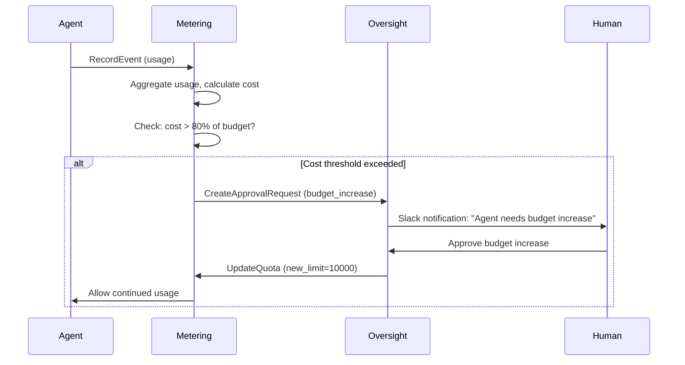
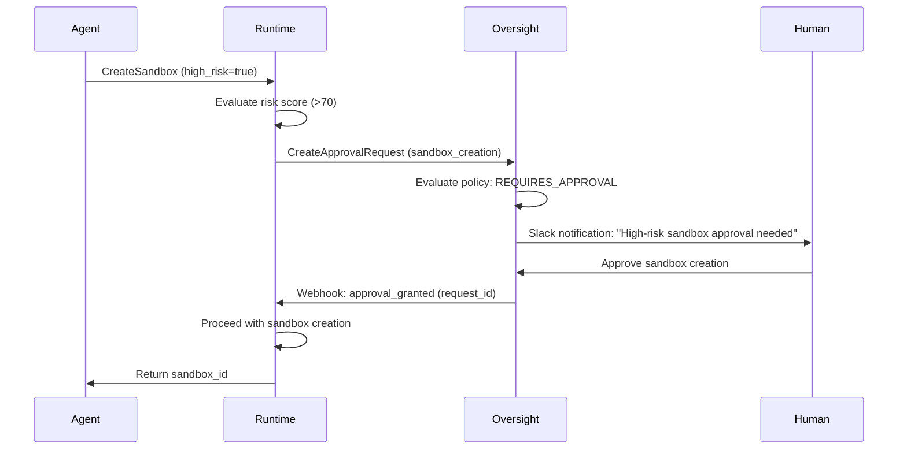
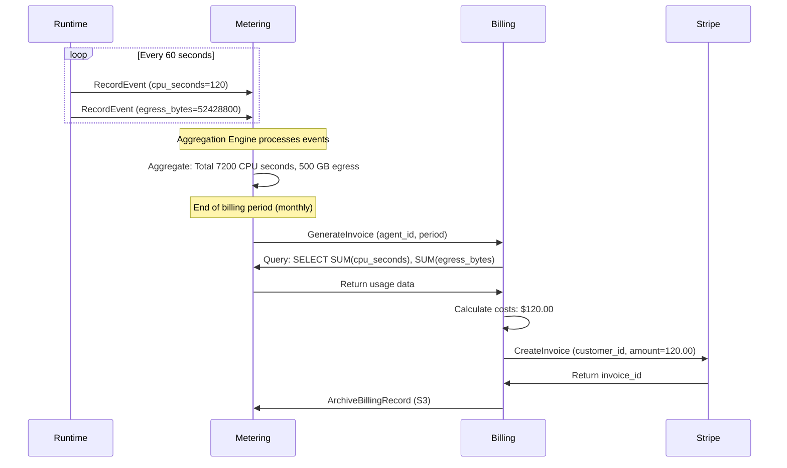

# Cross-Product Data Flow Matrix

## Overview

This data flow matrix illustrates how the four Enablement products (Metering, Oversight, Runtime, Messaging) integrate with each other and share data through the Security and Platform layers. It shows trigger relationships, shared data models, and the critical 168ns AuthZ path.

## Purpose

- Visualize data flows between all four Enablement products
- Show integration points with AuthZ (168ns performance path)
- Document shared data models (agent identity, delegation chains, audit records)
- Illustrate trigger relationships (cost thresholds, approval gates)
- Provide a comprehensive reference for cross-product dependencies

## Data Flow Matrix Diagram

```mermaid
graph TB
    subgraph SecurityLayer["Security Layer (168ns AuthZ Path)"]
        AuthZ[Authorization Service<br/>Delegation Chain Validation<br/>HMAC Verification<br/>168ns p99]
        Memory[Memory Service<br/>Agent Context<br/>Session State]
        Storage[Secure Storage<br/>S3-Compatible<br/>Encrypted at Rest]
    end

    subgraph PlatformLayer["Platform Layer"]
        NHI[Non-Human Identity<br/>Ed25519 Keypairs<br/>Agent Lifecycle]
        Crypto[Cryptographic Services<br/>HMAC, ChaCha20, Ed25519]
        Consensus[Consensus Engine<br/>Byzantine Fault Tolerance]
        Audit[Audit Logging<br/>Immutable Trail]
    end

    subgraph EnablementProducts["Enablement Layer Products"]

        subgraph Metering["Metering Product"]
            M_Events[Event Ingestion<br/>Usage Tracking]
            M_Quotas[Quota Enforcement<br/>Bloom + Redis + PostgreSQL]
            M_Billing[Billing Service<br/>Stripe Integration]
        end

        subgraph Oversight["Oversight Product"]
            O_Policy[Policy Engine<br/>CEL Evaluation]
            O_Request[Request Manager<br/>Approval State Machine]
            O_Channel[Channel Router<br/>Slack/Email/Webhook]
        end

        subgraph Runtime["Runtime Product"]
            R_Sandbox[Sandbox Controller<br/>Lifecycle Management]
            R_WarmPool[Warm Pool Manager<br/>Pre-warmed Instances]
            R_Egress[Egress Controller<br/>Network Policies]
        end

        subgraph Messaging["Messaging Product"]
            MSG_KeyAgreement[Key Agreement<br/>X3DH Protocol]
            MSG_Ratchet[Ratchet Engine<br/>Double Ratchet]
            MSG_Delivery[Delivery Router<br/>Offline Queuing]
        end
    end

    %% AuthZ Integration (168ns Path)
    M_Events -->|1. Validate Delegation<br/>168ns| AuthZ
    M_Quotas -->|2. Check Permissions<br/>168ns| AuthZ
    O_Policy -->|3. Verify Requester<br/>168ns| AuthZ
    O_Request -->|4. Validate Approver<br/>168ns| AuthZ
    R_Sandbox -->|5. Check Execution Rights<br/>168ns| AuthZ
    R_Egress -->|6. Validate Network Access<br/>168ns| AuthZ
    MSG_KeyAgreement -->|7. Authenticate Sender<br/>168ns| AuthZ
    MSG_Delivery -->|8. Verify Recipient<br/>168ns| AuthZ

    %% NHI Integration
    M_Events -.->|Agent Identity Resolution| NHI
    O_Request -.->|Approver Identity Lookup| NHI
    R_Sandbox -.->|Associate Sandbox with Agent| NHI
    MSG_KeyAgreement -.->|Fetch Public Keys| NHI

    %% Crypto Integration
    M_Billing -.->|Sign Billing Records| Crypto
    O_Policy -.->|Encrypt Sensitive Policies| Crypto
    R_Egress -.->|Generate Sandbox Tokens| Crypto
    MSG_Ratchet -.->|Double Ratchet KDF| Crypto

    %% Audit Integration
    M_Events -.->|Log Usage Events| Audit
    M_Quotas -.->|Log Quota Denials| Audit
    O_Request -.->|Log Approval Decisions| Audit
    R_Sandbox -.->|Log Sandbox Lifecycle| Audit
    MSG_Delivery -.->|Log Message Metadata| Audit

    %% Memory Integration
    M_Quotas -.->|Cache Quota Counters| Memory
    O_Request -.->|Persist Approval State| Memory
    MSG_Ratchet -.->|Cache Ratchet State| Memory

    %% Storage Integration
    M_Billing -.->|Archive Billing Records| Storage
    O_Policy -.->|Snapshot Policies| Storage
    R_Sandbox -.->|Store Sandbox Images| Storage

    %% Cross-Product Data Flows
    M_Quotas -->|Cost Threshold Alert<br/>Trigger| O_Request
    M_Events -->|Usage Data for Approval<br/>Context| O_Policy
    O_Request -->|Approval Gate<br/>Unblock Execution| R_Sandbox
    O_Request -->|Budget Increase Approval<br/>Trigger| M_Quotas
    R_Sandbox -->|Resource Usage Events<br/>CPU, Memory, Network| M_Events
    R_Egress -->|Egress Bandwidth Events<br/>Billing Data| M_Events
    MSG_Delivery -->|Message Volume Events<br/>Billing Data| M_Events
    R_Sandbox -->|Sandbox-to-Sandbox Messaging<br/>Future Integration| MSG_Delivery

    %% Shared Data Models
    AuthZ -.->|Delegation Chains<br/>HMAC Tokens| M_Events
    AuthZ -.->|Delegation Chains<br/>HMAC Tokens| O_Request
    AuthZ -.->|Delegation Chains<br/>HMAC Tokens| R_Sandbox
    AuthZ -.->|Delegation Chains<br/>HMAC Tokens| MSG_KeyAgreement

    NHI -.->|Agent Identity<br/>Ed25519 Public Key| M_Events
    NHI -.->|Agent Identity<br/>Ed25519 Public Key| O_Request
    NHI -.->|Agent Identity<br/>Ed25519 Public Key| R_Sandbox
    NHI -.->|Agent Identity<br/>Ed25519 Public Key| MSG_KeyAgreement

    Audit -.->|Audit Records<br/>Compliance Trail| M_Billing
    Audit -.->|Audit Records<br/>Compliance Trail| O_Request
    Audit -.->|Audit Records<br/>Compliance Trail| R_Sandbox

    classDef authz fill:#ffe1e1,stroke:#cc0000,stroke-width:3px
    classDef product fill:#e1f5ff,stroke:#0066cc,stroke-width:2px
    classDef security fill:#fff4e1,stroke:#ff9900,stroke-width:2px
    classDef platform fill:#f0f0f0,stroke:#333,stroke-width:2px

    class AuthZ authz
    class M_Events,M_Quotas,M_Billing,O_Policy,O_Request,O_Channel,R_Sandbox,R_WarmPool,R_Egress,MSG_KeyAgreement,MSG_Ratchet,MSG_Delivery product
    class Memory,Storage security
    class NHI,Crypto,Consensus,Audit platform
```



## Data Flow Matrix Table

### Metering ↔ Other Products

| Source | Target | Data Flow | Trigger/Frequency | Protocol |
|--------|--------|-----------|-------------------|----------|
| **Metering → Oversight** | Cost Threshold Alert | When agent exceeds 80% of monthly budget, create approval request for budget increase | Event-driven | gRPC |
| **Metering → Oversight** | Usage Context | Provide cost data for approval policy evaluation (e.g., "approve if cost < $10") | On-demand | gRPC |
| **Oversight → Metering** | Budget Increase Approval | When approval granted, update agent's quota limits in Metering | Event-driven | gRPC |
| **Runtime → Metering** | Resource Usage Events | Report CPU seconds, memory GB-hours, disk I/O bytes | Real-time (every 60s) | gRPC |
| **Runtime → Metering** | Egress Bandwidth Events | Report network egress bytes for billing | Real-time (every 60s) | gRPC |
| **Messaging → Metering** | Message Volume Events | Report encrypted message count, total bytes | Real-time (every 60s) | gRPC |

### Oversight ↔ Other Products

| Source | Target | Data Flow | Trigger/Frequency | Protocol |
|--------|--------|-----------|-------------------|----------|
| **Oversight → Runtime** | Approval Gate Unblock | When high-risk sandbox creation approved, notify Runtime to proceed | Event-driven | gRPC/Webhook |
| **Runtime → Oversight** | Approval Request | Request approval for high-risk operations (e.g., privileged sandbox, external API access) | On-demand | gRPC |
| **Oversight → Metering** | Budget Override Approval | Approve temporary quota increase for agent | Event-driven | gRPC |
| **Messaging → Oversight** | Encrypted Approval Requests (Future) | Use Messaging for E2E encrypted approval workflows | Future feature | gRPC |

### Runtime ↔ Other Products

| Source | Target | Data Flow | Trigger/Frequency | Protocol |
|--------|--------|-----------|-------------------|----------|
| **Runtime → Messaging** | Sandbox-to-Sandbox IPC (Future) | Enable encrypted communication between sandboxes using Messaging | Future feature | gRPC |
| **Messaging → Runtime** | Secure Code Injection (Future) | Deliver encrypted code to sandbox via Messaging | Future feature | gRPC |

### Messaging ↔ Other Products

| Source | Target | Data Flow | Trigger/Frequency | Protocol |
|--------|--------|-----------|-------------------|----------|
| **Messaging → Metering** | Message Volume Billing | Report number of messages sent, total encrypted bytes | Real-time (every 60s) | gRPC |
| **Messaging → Oversight** | Encrypted Notifications (Future) | Send E2E encrypted approval requests via Messaging | Future feature | gRPC |

## Integration with Security & Platform Layers

### AuthZ Integration (168ns Critical Path)

All four products validate delegation chains using the AuthZ service with **168ns p99 latency**:

| Product | AuthZ Usage | Validation Frequency | Impact if Unavailable |
|---------|-------------|----------------------|----------------------|
| **Metering** | Validates event ingestion requests, quota checks | Every API call | Reject all events, deny all quota checks |
| **Oversight** | Validates approval requesters, approvers | Every approval request | Reject all approval workflows |
| **Runtime** | Validates sandbox creation, execution rights | Every sandbox lifecycle operation | Reject all sandbox operations |
| **Messaging** | Validates message senders, recipients | Every message send/receive | Reject all message operations |

**AuthZ Performance Requirements:**
- **Latency**: p99 < 200ns (in-process HMAC verification)
- **Throughput**: 1M validations/second per service instance
- **Failure mode**: Fail closed (deny access on AuthZ failure)

### NHI Integration

All products resolve agent identities via the NHI service:

| Product | NHI Usage | Data Retrieved |
|---------|-----------|----------------|
| **Metering** | Resolve agent_id to public key hash | Ed25519 public key, agent tier, delegation chain |
| **Oversight** | Lookup approver identity | Ed25519 public key, role, permissions |
| **Runtime** | Associate sandbox with agent | Ed25519 public key, resource quotas, trust level |
| **Messaging** | Fetch prekey bundles | Ed25519 identity key, X25519 prekeys, signatures |

**Shared Data Model (Agent Identity):**
```protobuf
message AgentIdentity {
  string agent_id = 1;               // Public key hash (SHA-256)
  bytes ed25519_public_key = 2;      // 32-byte Ed25519 public key
  string tier = 3;                   // "basic", "standard", "premium"
  repeated DelegationChain delegations = 4;
  google.protobuf.Timestamp created_at = 5;
  map<string, string> metadata = 6;
}
```

### Crypto Integration

All products use the Crypto library for cryptographic operations:

| Product | Crypto Operations | Algorithms Used |
|---------|-------------------|-----------------|
| **Metering** | Sign billing records, HMAC event IDs | HMAC-SHA256, Ed25519 |
| **Oversight** | Encrypt sensitive policies, sign decisions | ChaCha20-Poly1305, Ed25519 |
| **Runtime** | Generate sandbox tokens, sign egress rules | HMAC-SHA256, Ed25519 |
| **Messaging** | Double Ratchet KDF, message encryption | HKDF-SHA256, ChaCha20-Poly1305, X25519, Ed25519 |

**Shared Cryptographic Primitives:**
- **HMAC-SHA256**: Delegation chain validation (168ns)
- **ChaCha20-Poly1305**: Authenticated encryption (AEAD)
- **Ed25519**: Digital signatures (agent identity, policy signing)
- **X25519**: Elliptic curve Diffie-Hellman (key exchange)
- **HKDF-SHA256**: Key derivation function (Double Ratchet)

### Audit Integration

All products log to the centralized Audit service:

| Product | Audit Events | Retention | Use Case |
|---------|--------------|-----------|----------|
| **Metering** | Usage events, quota denials, invoices generated | 7 years | Compliance (SOX, GDPR), billing disputes |
| **Oversight** | Approval requests, policy evaluations, approver decisions | 7 years | Compliance (SOC 2), forensics |
| **Runtime** | Sandbox created/destroyed, code executed, egress violations | 1 year | Security investigations, incident response |
| **Messaging** | Message metadata (no plaintext), key exchanges | 90 days | Abuse investigations, forensics |

**Shared Audit Record Schema:**
```protobuf
message AuditRecord {
  string record_id = 1;              // UUID v7 (time-sortable)
  string product = 2;                // "metering", "oversight", "runtime", "messaging"
  string event_type = 3;             // "usage_event", "approval_request", etc.
  string agent_id = 4;               // Actor (agent or human)
  string resource_id = 5;            // Affected resource (sandbox_id, request_id, etc.)
  string action = 6;                 // "created", "approved", "executed", "sent"
  google.protobuf.Timestamp timestamp = 7;
  map<string, string> metadata = 8;  // Event-specific details
  bytes signature = 9;               // Ed25519 signature for tamper-evidence
}
```

## Trigger Relationships & Event Flows

### 1. Cost Threshold → Approval Workflow



**Trigger Conditions:**
- Agent's monthly spend exceeds 80% of allocated budget
- Agent's hourly spend exceeds 120% of average (spike detection)
- Agent requests resource type not in quota policy

### 2. Approval Gate → Sandbox Execution



**Trigger Conditions:**
- Sandbox requests privileged mode (root access, kernel modules)
- Sandbox requests external network access (egress to internet)
- Sandbox estimated cost > $50 for single execution
- Agent trust level = "untrusted" (newly created agent)

### 3. Resource Usage → Billing Event Chain



**Data Flow:**
1. **Runtime → Metering**: Real-time usage events (every 60s)
2. **Metering → Metering**: Aggregation (hourly, daily, monthly)
3. **Metering → Billing**: End-of-month invoice generation
4. **Billing → Stripe**: External payment processing
5. **Billing → Storage**: Archive for 7-year compliance retention

## Shared Data Models

### 1. Delegation Chain (AuthZ)

All products share the same delegation chain validation logic:

```rust
pub struct DelegationChain {
    pub agent_id: String,           // Public key hash
    pub delegator_id: String,       // Parent agent (if delegated)
    pub permissions: Vec<String>,   // Scoped permissions
    pub expires_at: Timestamp,      // Expiration
    pub hmac: [u8; 32],            // HMAC-SHA256 signature
}

impl DelegationChain {
    pub fn validate(&self, secret_key: &[u8]) -> Result<(), AuthError> {
        // Verify HMAC (168ns operation)
        let computed_hmac = hmac_sha256(secret_key, &self.serialize());
        if !constant_time_eq(&computed_hmac, &self.hmac) {
            return Err(AuthError::InvalidHMAC);
        }

        // Check expiration
        if self.expires_at < Timestamp::now() {
            return Err(AuthError::Expired);
        }

        Ok(())
    }
}
```

**Shared by:**
- Metering: Validates every usage event ingestion
- Oversight: Validates every approval request
- Runtime: Validates every sandbox creation
- Messaging: Validates every message send

### 2. Agent Identity (NHI)

```protobuf
message AgentIdentity {
  string agent_id = 1;               // SHA-256(ed25519_public_key)
  bytes ed25519_public_key = 2;      // 32-byte public key
  string tier = 3;                   // "basic", "standard", "premium"
  string trust_level = 4;            // "trusted", "untrusted", "suspended"
  AgentQuotas quotas = 5;
  google.protobuf.Timestamp created_at = 6;
  google.protobuf.Timestamp last_active = 7;
}

message AgentQuotas {
  int64 monthly_token_limit = 1;
  int64 hourly_token_limit = 2;
  int64 sandbox_count_limit = 3;
  int64 egress_gb_limit = 4;
  int64 message_count_limit = 5;
}
```

**Used by:**
- Metering: Quota enforcement, billing tier
- Oversight: Policy evaluation (tier-based policies)
- Runtime: Sandbox backend selection (basic→gVisor, premium→Firecracker)
- Messaging: Prekey bundle storage, key rotation schedule

### 3. Audit Record (Audit Service)

```protobuf
message AuditRecord {
  string record_id = 1;              // UUID v7
  string product = 2;                // Source product
  string event_type = 3;             // Event classification
  string agent_id = 4;               // Actor
  string resource_id = 5;            // Affected resource
  string action = 6;                 // Action performed
  google.protobuf.Timestamp timestamp = 7;
  map<string, string> metadata = 8;
  bytes signature = 9;               // Ed25519 signature (tamper-evidence)
  bytes previous_record_hash = 10;   // Cryptographic chaining
}
```

**Event Types by Product:**
- **Metering**: `usage_event`, `quota_denial`, `invoice_generated`
- **Oversight**: `approval_request`, `policy_evaluation`, `approval_granted`
- **Runtime**: `sandbox_created`, `code_executed`, `egress_violation`
- **Messaging**: `key_exchange`, `message_sent`, `message_delivered`

## Performance Characteristics

### Latency Targets

| Integration Path | p50 Latency | p99 Latency | p99.9 Latency |
|------------------|-------------|-------------|---------------|
| **AuthZ validation (in-process)** | 80ns | 168ns | 300ns |
| **NHI identity lookup (cached)** | 1ms | 5ms | 10ms |
| **NHI identity lookup (uncached)** | 5ms | 15ms | 30ms |
| **Crypto operations (HMAC)** | 100ns | 200ns | 500ns |
| **Crypto operations (ChaCha20)** | 1μs | 5μs | 10μs |
| **Audit logging (async)** | 50μs | 100μs | 500μs |
| **Cross-product gRPC call** | 2ms | 10ms | 30ms |

### Throughput Requirements

| Integration | Throughput (RPS) | Notes |
|-------------|------------------|-------|
| **Metering → AuthZ** | 100,000 | Every usage event validated |
| **Runtime → Metering** | 50,000 | Usage events every 60s from 3000 sandboxes |
| **Oversight → Metering** | 1,000 | Cost threshold checks |
| **Messaging → NHI** | 10,000 | Key agreement requests |
| **All → Audit** | 200,000 | Buffered, asynchronous writes |

## Error Handling & Fallback Strategies

### AuthZ Failure

**Impact**: All products reject operations (fail closed)

**Mitigation:**
- In-process library (no network dependency)
- Cache validated delegation chains for 5 minutes
- Metrics: Track AuthZ failure rate, alert if > 0.1%

### NHI Unavailable

**Impact**: Cannot resolve agent identities

**Mitigation:**
- Redis cache with 1-hour TTL (95% hit rate)
- Stale cache fallback: Use expired cache for 10 minutes during outage
- Queue operations for retry when NHI recovers

### Audit Service Unavailable

**Impact**: Audit records dropped (compliance risk)

**Mitigation:**
- Local buffering: 10,000 records in memory
- Persistent queue: Kafka topic as backup
- Alert on-call: "Audit service down, records buffering"

### Cross-Product Communication Failure

**Example**: Metering → Oversight trigger fails

**Mitigation:**
- Retry policy: 3 attempts with exponential backoff
- Dead letter queue: Failed triggers queued for manual review
- Circuit breaker: Stop triggering after 10 consecutive failures

## Related Diagrams

- [C4 Context Diagram](./c4-context.md) - System-level context
- [C4 Container Diagram](./c4-container.md) - Container-level architecture
- [Metering Components](./component-metering.md) - Metering internal architecture
- [Oversight Components](./component-oversight.md) - Oversight internal architecture
- [Runtime Components](./component-runtime.md) - Runtime internal architecture
- [Messaging Components](./component-messaging.md) - Messaging internal architecture

## Version History

| Version | Date | Changes |
|---------|------|---------|
| 1.0 | 2025-12-25 | Initial cross-product data flow matrix for Issue #65 |
