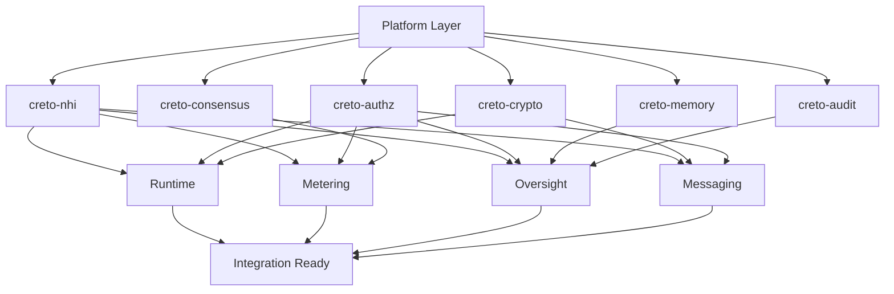
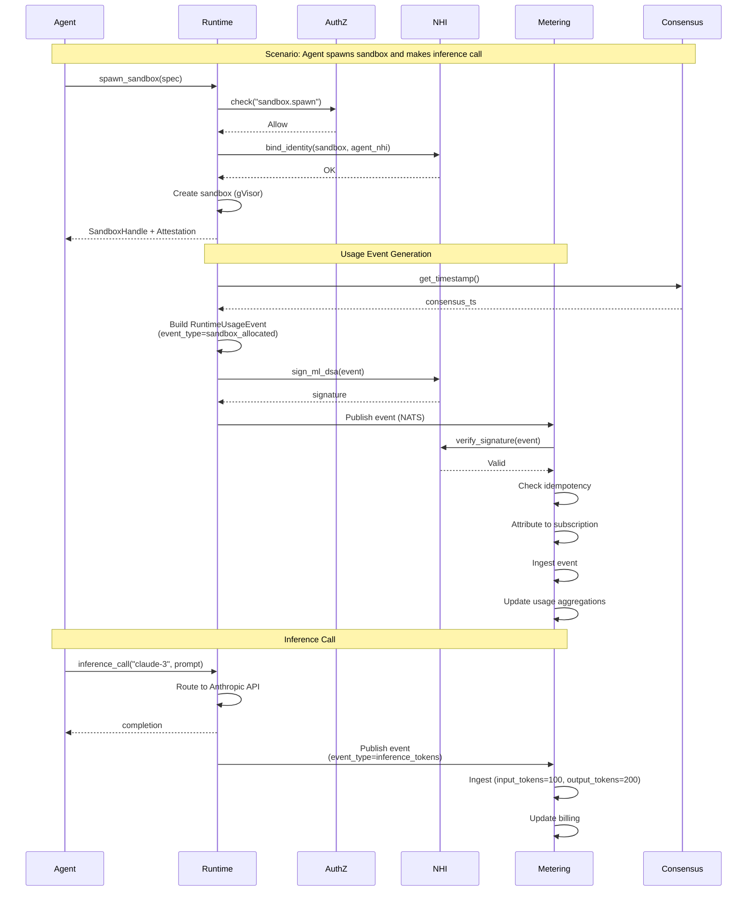
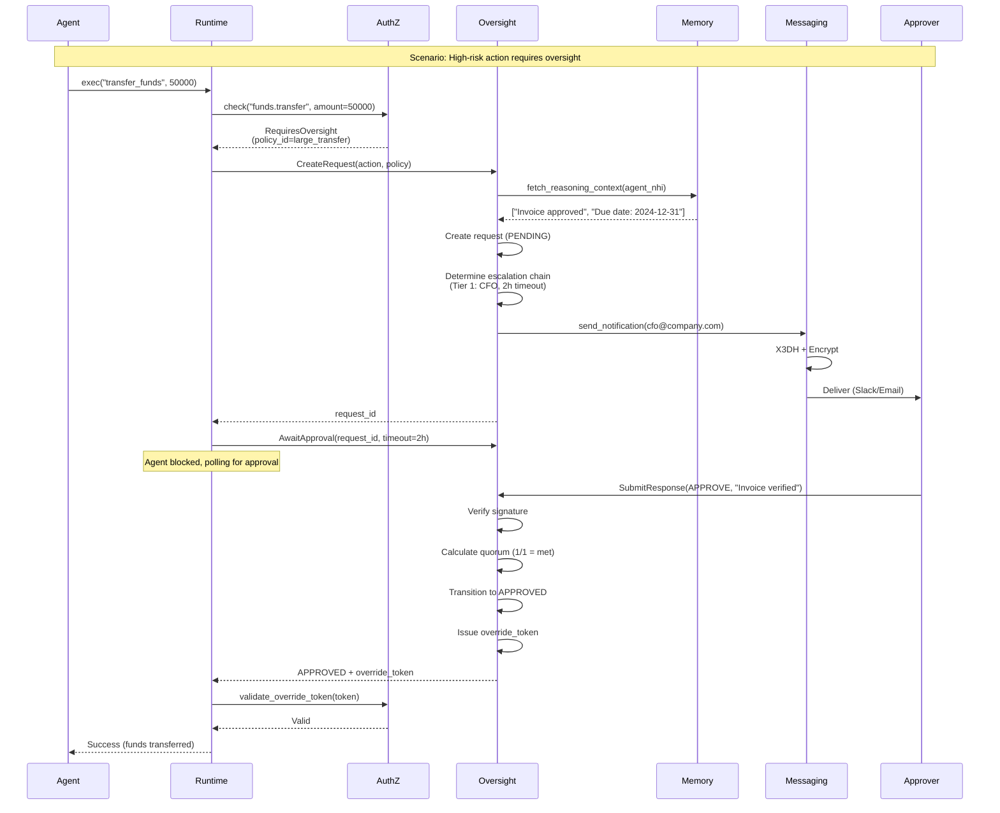
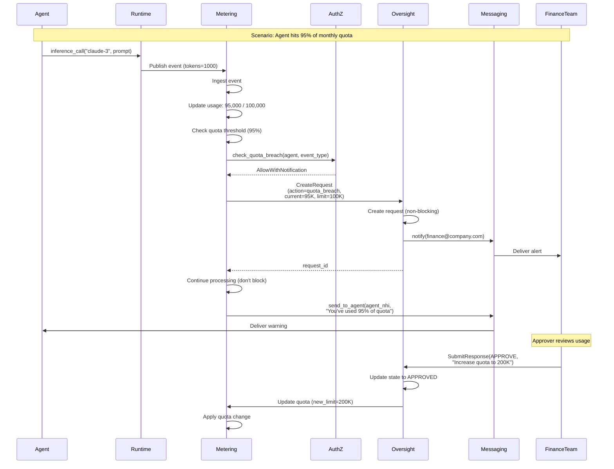
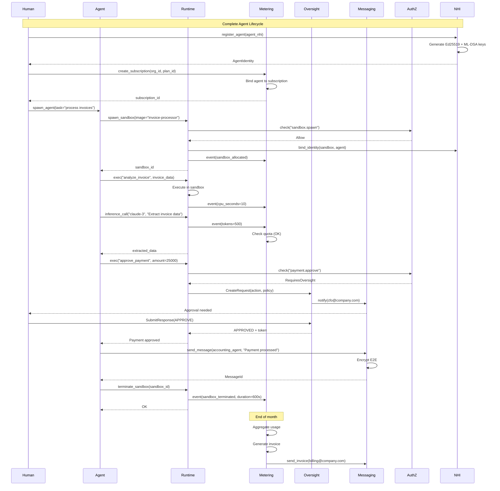

# Cross-Product Integration Architecture

**Authoritative Reference for Enablement Layer Integration**

This document specifies how the four Enablement Layer products (Runtime, Metering, Oversight, Messaging) integrate with each other and the underlying Sovereign platform layers.

---

## Table of Contents

1. [Integration Overview](#1-integration-overview)
2. [Dependency Graph](#2-dependency-graph)
3. [Shared Platform Services](#3-shared-platform-services)
4. [Data Flow Contracts](#4-data-flow-contracts)
5. [API Contract Summary](#5-api-contract-summary)
6. [Shared Data Types](#6-shared-data-types)
7. [Cross-Product Sequence Diagrams](#7-cross-product-sequence-diagrams)
8. [Unified Error Propagation](#8-unified-error-propagation)
9. [Cross-Product Transactions](#9-cross-product-transactions)
10. [Observability Integration](#10-observability-integration)
11. [Deployment Dependencies](#11-deployment-dependencies)
12. [Integration Testing Strategy](#12-integration-testing-strategy)

---

## 1. Integration Overview

### 1.1 Product Relationships

```
┌─────────────────────────────────────────────────────────────────────┐
│                     ENABLEMENT LAYER TOPOLOGY                        │
├─────────────────────────────────────────────────────────────────────┤
│                                                                     │
│  ┌────────────────┐       ┌────────────────┐                       │
│  │   RUNTIME      │◄─────►│   METERING     │                       │
│  │  (execution)   │       │   (billing)    │                       │
│  └────────┬───────┘       └────────┬───────┘                       │
│           │                        │                                │
│           │ events                 │ quota breach                   │
│           │                        │                                │
│           ▼                        ▼                                │
│  ┌────────────────┐       ┌────────────────┐                       │
│  │   OVERSIGHT    │◄─────►│   MESSAGING    │                       │
│  │     (HITL)     │       │     (E2E)      │                       │
│  └────────────────┘       └────────────────┘                       │
│           ▲                        ▲                                │
│           │ approval needed        │ notifications                  │
│           │                        │                                │
└───────────┼────────────────────────┼────────────────────────────────┘
            │                        │
            │                        │
┌───────────┼────────────────────────┼────────────────────────────────┐
│           │   SOVEREIGN PLATFORM   │                                │
│           │                        │                                │
│  ┌────────▼──────┐   ┌────────────▼──┐   ┌──────────────┐          │
│  │  creto-authz  │   │  creto-nhi    │   │ creto-audit  │          │
│  │  (168ns path) │   │  (identity)   │   │ (immutable)  │          │
│  └───────────────┘   └───────────────┘   └──────────────┘          │
│                                                                     │
│  ┌───────────────┐   ┌───────────────┐   ┌──────────────┐          │
│  │ creto-crypto  │   │ creto-consensus│   │ creto-memory │          │
│  │(crypto-agile) │   │  (ordering)   │   │  (context)   │          │
│  └───────────────┘   └───────────────┘   └──────────────┘          │
│                                                                     │
└─────────────────────────────────────────────────────────────────────┘
```

### 1.2 Integration Patterns

| Pattern | Description | Products | Mechanism |
|---------|-------------|----------|-----------|
| **Inline Enforcement** | Real-time policy check during operation | Runtime ↔ AuthZ, Metering ↔ AuthZ | gRPC (168ns target) |
| **Event Streaming** | Asynchronous event propagation | Runtime → Metering, Oversight → Messaging | Kafka/NATS |
| **Request/Response** | Synchronous approval workflows | Oversight ↔ Runtime | gRPC + polling |
| **Shared State** | Distributed coordination | All → Memory, Consensus | Distributed cache |
| **Audit Trail** | Immutable logging | All → Audit | Event stream → Merkle tree |

### 1.3 Communication Protocols

| Layer | Protocol | Port | TLS | Mutual Auth |
|-------|----------|------|-----|-------------|
| gRPC Services | HTTP/2 + gRPC | 8080 | Required | NHI certificates |
| Event Streaming | NATS JetStream | 4222 | Required | Token auth |
| REST APIs | HTTP/1.1 + REST | 8081 | Required | Bearer token |
| Metrics | Prometheus | 9090 | Optional | None |
| Health Checks | HTTP/1.1 | 9091 | Optional | None |

---

## 2. Dependency Graph

### 2.1 Startup Order Dependencies



### 2.2 Hard Dependencies (Blocking)

| Product | Depends On | Reason | Startup Timeout |
|---------|------------|--------|-----------------|
| **Runtime** | creto-nhi | Agent identity for sandboxes | 30s |
| **Runtime** | creto-authz | Network policy enforcement | 30s |
| **Runtime** | creto-crypto | Attestation signatures | 30s |
| **Metering** | creto-nhi | Agent attribution | 30s |
| **Metering** | creto-authz | Quota inline enforcement | 10s |
| **Metering** | creto-consensus | Timestamp ordering | 30s |
| **Oversight** | creto-nhi | Delegation chain validation | 30s |
| **Oversight** | creto-authz | Policy triggers | 10s |
| **Oversight** | creto-memory | Agent reasoning context | 60s |
| **Messaging** | creto-nhi | Key bundles | 30s |
| **Messaging** | creto-crypto | Hybrid signatures | 30s |

### 2.3 Soft Dependencies (Degraded Mode)

| Product | Depends On | Degraded Behavior | Recovery |
|---------|------------|-------------------|----------|
| Runtime | creto-audit | Logs buffered locally | Flush on reconnect |
| Metering | creto-audit | Events queued | Replay from queue |
| Oversight | creto-memory | No reasoning context shown | Fetch on restore |
| Messaging | creto-audit | Receipt logging delayed | Async replay |

---

## 3. Shared Platform Services

### 3.1 creto-nhi (Agent Identity)

**Purpose**: Cryptographic identity for all agents

**Used By**: All 4 products

**Integration Points**:

```rust
// Runtime: Bind NHI to sandbox
pub async fn spawn_sandbox(spec: &SandboxSpec) -> Result<SandboxHandle> {
    nhi_client.bind_identity(&sandbox_id, &spec.agent_nhi).await?;
    // ...
}

// Metering: Attribute events to agent
pub async fn ingest_event(event: &Event) -> Result<EventId> {
    nhi_client.validate_signature(&event.agent_nhi, &event.signature).await?;
    // ...
}

// Oversight: Validate delegation chain
pub async fn create_request(trigger: &OversightTrigger) -> Result<RequestId> {
    nhi_client.validate_delegation_chain(&trigger.delegation_chain).await?;
    // ...
}

// Messaging: Fetch key bundle
pub async fn initiate_x3dh(recipient: &AgentIdentity) -> Result<X3dhSession> {
    let bundle = nhi_client.get_key_bundle(recipient).await?;
    // ...
}
```

**Performance SLA**:
- Key lookup: <5ms (p99)
- Signature verification: <2ms (p99)
- Delegation validation: <10ms (p99)

### 3.2 creto-authz (Authorization)

**Purpose**: 168ns policy evaluation path

**Used By**: All 4 products

**Integration Points**:

```rust
// Runtime: Check network egress
pub async fn check_egress(sandbox_id: &SandboxId, destination: &str) -> Result<bool> {
    authz_client.check(AuthzRequest {
        principal: sandbox_nhi,
        action: "network.egress",
        resource: format!("network:{}", destination),
    }).await?
}

// Metering: Inline quota check
pub async fn check_quota(agent: &AgentIdentity, event_type: &str) -> Result<QuotaDecision> {
    authz_client.check_quota(agent, event_type).await?
}

// Oversight: Determine if approval needed
pub async fn evaluate_action(action: &Action) -> Result<AuthzDecision> {
    let decision = authz_client.check(AuthzRequest {
        principal: agent_nhi,
        action: action.name,
        resource: action.resource,
    }).await?;

    // Returns RequiresOversight if policy triggers HITL
}

// Messaging: Check delivery permission
pub async fn deliver_message(envelope: &MessageEnvelope) -> Result<()> {
    authz_client.check(AuthzRequest {
        principal: envelope.sender_nhi,
        action: "messaging:send",
        resource: format!("agent:{}", envelope.recipient_nhi),
    }).await?
}
```

**Performance SLA**:
- Policy evaluation: <168ns (p99, cache hit)
- Policy evaluation: <1ms (p99, cache miss)
- Override token validation: <500ns

### 3.3 creto-audit (Immutable Log)

**Purpose**: Merkle-anchored audit trail

**Used By**: All 4 products

**Integration Points**:

```rust
// Unified audit event structure
#[derive(Debug, Serialize, Deserialize)]
pub struct UnifiedAuditEvent {
    pub event_id: Uuid,
    pub product: ProductId,
    pub agent_nhi: AgentIdentity,
    pub action: String,
    pub resource: String,
    pub outcome: Outcome,
    pub timestamp: ConsensusTimestamp,
    pub metadata: serde_json::Value,
    pub merkle_proof: MerkleProof,
}

pub enum ProductId {
    Runtime,
    Metering,
    Oversight,
    Messaging,
}

// Runtime audit events
AuditEvent::SandboxSpawned { sandbox_id, agent_nhi, attestation_hash }
AuditEvent::SandboxTerminated { sandbox_id, reason }
AuditEvent::EgressAttempt { sandbox_id, destination, decision }

// Metering audit events
AuditEvent::EventIngested { event_id, agent_nhi, event_type, value }
AuditEvent::QuotaExceeded { agent_nhi, event_type, limit, overflow_action }
AuditEvent::InvoiceGenerated { subscription_id, amount, period }

// Oversight audit events
AuditEvent::RequestCreated { request_id, agent_nhi, action, policy_id }
AuditEvent::ResponseReceived { request_id, approver, decision }
AuditEvent::StateTransition { request_id, old_state, new_state }

// Messaging audit events
AuditEvent::MessageSent { message_id, sender, recipient, encrypted_size }
AuditEvent::MessageDelivered { message_id, latency_ms }
AuditEvent::SessionEstablished { initiator, responder, protocol }
```

**Performance SLA**:
- Event append: <5ms (p99, async)
- Merkle proof generation: <10ms
- Event query: <50ms (p99)

### 3.4 creto-crypto (Crypto-Agility)

**Purpose**: Hybrid classical + PQC primitives

**Used By**: Runtime, Messaging

**Integration Points**:

```rust
// Runtime: Sign attestations
pub async fn generate_attestation(sandbox: &Sandbox) -> Result<Attestation> {
    let signature = crypto_client.sign_hybrid(
        &signing_key,
        &attestation.canonical_bytes(),
    ).await?;
}

// Messaging: Hybrid signatures on envelopes
pub async fn send_message(envelope: &MessageEnvelope) -> Result<MessageId> {
    let sig_ed25519 = crypto_client.sign_ed25519(&sender_key, &envelope).await?;
    let sig_ml_dsa = crypto_client.sign_ml_dsa(&sender_key, &envelope).await?;
}
```

**Algorithms**:
- Classical: Ed25519 (signatures), X25519 (ECDH)
- Post-Quantum: ML-DSA-65 (signatures), ML-KEM-768 (KEM)

### 3.5 creto-consensus (Timestamp Ordering)

**Purpose**: Consensus-ordered timestamps

**Used By**: Metering (critical), Messaging, Oversight

**Integration Points**:

```rust
// Metering: Order events for idempotency
pub async fn ingest_event(event: &Event) -> Result<EventId> {
    let consensus_ts = consensus_client.get_timestamp().await?;

    // Use consensus timestamp, not agent-provided timestamp
    event.consensus_timestamp = consensus_ts;
}

// Messaging: Prevent replay attacks
pub async fn verify_envelope(envelope: &MessageEnvelope) -> Result<()> {
    let now = consensus_client.get_timestamp().await?;
    if envelope.timestamp + envelope.ttl < now {
        return Err(MessageError::Expired);
    }
}
```

**Performance SLA**:
- Timestamp acquisition: <1ms (p99)
- Clock skew tolerance: ±100ms

### 3.6 creto-memory (Agent Context)

**Purpose**: Agent reasoning and context storage

**Used By**: Oversight (critical), Runtime

**Integration Points**:

```rust
// Oversight: Fetch agent reasoning for approval context
pub async fn create_request(trigger: &OversightTrigger) -> Result<RequestId> {
    let reasoning = memory_client.fetch_reasoning_context(
        &trigger.agent_nhi,
        &trigger.action,
        10, // limit
    ).await?;

    request.reasoning_context = reasoning;
}

// Runtime: Store sandbox execution context
pub async fn checkpoint_sandbox(sandbox: &Sandbox) -> Result<CheckpointId> {
    memory_client.store_context(
        &sandbox.agent_nhi,
        "sandbox_state",
        &sandbox.serialize(),
    ).await?;
}
```

---

## 4. Data Flow Contracts

### 4.1 Runtime → Metering (Usage Events)

**Trigger**: Sandbox allocated, inference called, egress allowed

**Event Schema**:

```rust
#[derive(Debug, Serialize, Deserialize)]
pub struct RuntimeUsageEvent {
    // Metering event header
    pub event_id: Uuid,
    pub agent_nhi: AgentIdentity,
    pub delegation_chain: Vec<AgentIdentity>,
    pub event_type: String,
    pub timestamp: ConsensusTimestamp,

    // Runtime-specific properties
    pub properties: RuntimeEventProperties,

    // Cryptographic proof
    pub signature: MlDsa65Signature,
    pub idempotency_key: String,
}

#[derive(Debug, Serialize, Deserialize)]
#[serde(tag = "type")]
pub enum RuntimeEventProperties {
    SandboxAllocated {
        sandbox_id: SandboxId,
        runtime_class: RuntimeClass,
        cpu_millicores: u32,
        memory_bytes: u64,
        duration_seconds: u64,
    },
    InferenceCall {
        sandbox_id: SandboxId,
        model_id: String,
        provider: String,
        input_tokens: u64,
        output_tokens: u64,
        cost_usd: Decimal,
    },
    NetworkEgress {
        sandbox_id: SandboxId,
        destination: String,
        bytes_transferred: u64,
    },
}
```

**Delivery Guarantee**: At-least-once via NATS JetStream

**Flow**:

```
[Runtime]
    ↓ 1. Sandbox terminates
    ↓ 2. Calculate resource usage
    ↓ 3. Generate RuntimeUsageEvent
    ↓ 4. Sign with sandbox NHI
    ↓ 5. Publish to NATS: subject="metering.events.runtime"
    ↓
[NATS JetStream]
    ↓ Persist, ACK to Runtime
    ↓ Deliver to Metering consumer
    ↓
[Metering]
    ↓ 1. Verify signature
    ↓ 2. Check idempotency (prevent duplicates)
    ↓ 3. Validate event schema
    ↓ 4. Attribute to subscription via agent_nhi
    ↓ 5. Ingest into events table
    ↓ 6. Update usage aggregations
    ↓ 7. ACK to NATS
```

**Error Handling**:

| Error | Recovery |
|-------|----------|
| NATS unavailable | Buffer events locally (max 10K), retry with backoff |
| Signature invalid | Drop event, audit log, alert |
| Duplicate event | Idempotent ignore, log warning |
| Unknown agent_nhi | Retry 3x, dead-letter queue, manual review |

### 4.2 Runtime → Oversight (Approval Requests)

**Trigger**: Authorization returns `RequiresOversight`

**Request Schema**:

```rust
#[derive(Debug, Serialize, Deserialize)]
pub struct RuntimeOversightRequest {
    pub agent_nhi: AgentIdentity,
    pub delegation_chain: Vec<AgentIdentity>,
    pub action: Action,
    pub resource: Resource,
    pub policy_id: PolicyId,
    pub requirement: OversightRequirement,

    // Runtime context
    pub sandbox_id: Option<SandboxId>,
    pub action_description: String,
    pub risk_factors: Vec<RiskFactor>,
}

pub struct Action {
    pub name: String,  // e.g., "spawn_sandbox", "egress_connect"
    pub parameters: serde_json::Value,
}

pub struct Resource {
    pub resource_type: String,  // e.g., "sandbox", "network"
    pub resource_id: String,
}
```

**Flow (Synchronous)**:

```
[Runtime]
    ↓ 1. Agent requests action (e.g., spawn sandbox)
    ↓ 2. Check AuthZ
    ↓ 3. AuthZ returns RequiresOversight
    ↓ 4. Call Oversight.CreateRequest() via gRPC
    ↓ 5. Receive request_id
    ↓ 6. Poll Oversight.GetRequest() or await via AwaitApproval()
    ↓
[Oversight]
    ↓ 1. Validate agent NHI
    ↓ 2. Fetch reasoning from Memory
    ↓ 3. Create request in PENDING state
    ↓ 4. Send notifications via Messaging
    ↓ 5. Wait for human response
    ↓ 6. Return APPROVED/DENIED
    ↓
[Runtime]
    ↓ If APPROVED: Execute action with override token
    ↓ If DENIED: Return error to agent
```

**Timeout Handling**:

| Timeout | Runtime Behavior |
|---------|------------------|
| `await_approval()` timeout | Return error to agent, request remains pending |
| Oversight tier timeout | Escalates to next tier, Runtime continues waiting |
| Final timeout | Oversight executes `final_action` (AUTO_DENY/APPROVE) |

### 4.3 Runtime → Messaging (Agent Communication)

**Trigger**: Agent code calls messaging API from sandbox

**Flow**:

```
[Sandbox Code]
    ↓ 1. messaging_client.send_message(recipient, payload)
    ↓
[Runtime InferenceProxy]
    ↓ 2. Intercept messaging API call
    ↓ 3. Extract sender NHI from sandbox context
    ↓ 4. Add delegation chain metadata
    ↓ 5. Forward to Messaging service
    ↓
[Messaging]
    ↓ 1. X3DH key agreement (if first message)
    ↓ 2. Encrypt with Double Ratchet
    ↓ 3. Sign with hybrid signature
    ↓ 4. Check AuthZ for delivery
    ↓ 5. Deliver to recipient
```

### 4.4 Oversight → Messaging (Notifications)

**Trigger**: New oversight request created or state transition

**Flow**:

```
[Oversight]
    ↓ 1. Request created in PENDING state
    ↓ 2. Determine notification channels (Slack, Email, Webhook)
    ↓ 3. Build approval context (action, reasoning, risk)
    ↓ 4. For Slack channel:
    ↓     a. Send via Messaging E2E to slack-bot agent
    ↓     b. Slack bot renders interactive message
    ↓     c. Approver clicks Approve/Deny
    ↓     d. Slack bot submits response via Oversight.SubmitResponse()
    ↓
[Messaging]
    ↓ 1. Encrypt notification for slack-bot agent
    ↓ 2. Deliver via persistent queue
    ↓ 3. Bot acknowledges receipt
```

### 4.5 Metering → Oversight (Quota Breach Alerts)

**Trigger**: Quota exceeded with `allow_with_notification` overflow action

**Flow**:

```
[Metering]
    ↓ 1. Event ingestion triggers quota check
    ↓ 2. Quota exceeded: 95% of monthly limit
    ↓ 3. OverflowAction = AllowWithNotification
    ↓ 4. Allow event (don't block)
    ↓ 5. Create oversight request:
    ↓     action = "quota_breach"
    ↓     resource = {event_type, current_usage, limit}
    ↓     policy_id = "quota_notification_policy"
    ↓
[Oversight]
    ↓ 1. Create request (non-blocking)
    ↓ 2. Notify finance team via Messaging
    ↓ 3. Approver can:
    ↓     - Increase quota
    ↓     - Block future events
    ↓     - Do nothing (auto-approve after timeout)
```

---

## 5. API Contract Summary

### 5.1 gRPC Service Dependencies

```protobuf
// Runtime depends on these external services
service RuntimeExternalDeps {
    rpc CheckAuthorization(creto.authz.AuthzRequest) returns (creto.authz.AuthzDecision);
    rpc BindAgentIdentity(creto.nhi.BindRequest) returns (creto.nhi.BindResponse);
    rpc GenerateAttestation(creto.crypto.SignRequest) returns (creto.crypto.Signature);
}

// Metering depends on these external services
service MeteringExternalDeps {
    rpc ValidateSignature(creto.nhi.VerifyRequest) returns (creto.nhi.VerifyResponse);
    rpc GetConsensusTimestamp(creto.consensus.TimestampRequest) returns (creto.consensus.Timestamp);
    rpc CheckQuota(creto.authz.QuotaRequest) returns (creto.authz.QuotaDecision);
}

// Oversight depends on these external services
service OversightExternalDeps {
    rpc ValidateDelegationChain(creto.nhi.ValidateChainRequest) returns (creto.nhi.ValidationResult);
    rpc FetchReasoningContext(creto.memory.FetchContextRequest) returns (creto.memory.ContextResponse);
    rpc LogAuditEvent(creto.audit.AuditEvent) returns (creto.audit.AuditReceipt);
}

// Messaging depends on these external services
service MessagingExternalDeps {
    rpc GetKeyBundle(creto.nhi.GetKeyBundleRequest) returns (creto.nhi.KeyBundle);
    rpc SignHybrid(creto.crypto.HybridSignRequest) returns (creto.crypto.HybridSignature);
    rpc CheckDeliveryPermission(creto.authz.AuthzRequest) returns (creto.authz.AuthzDecision);
}
```

### 5.2 Event Schemas (NATS/Kafka)

```yaml
# Subject: metering.events.runtime
# Producer: Runtime
# Consumer: Metering
schema:
  event_id: uuid
  agent_nhi: string (agent:xxx)
  delegation_chain: array<string>
  event_type: string (enum)
  consensus_timestamp: int64 (unix nano)
  properties:
    # Varies by event_type
  signature: bytes (ML-DSA-65)
  idempotency_key: string

# Subject: oversight.notifications.{channel_type}
# Producer: Oversight
# Consumer: Messaging (for delivery)
schema:
  request_id: uuid
  approver_identity: string
  channel_type: enum (slack, email, webhook)
  notification_payload:
    action_description: string
    risk_factors: array<object>
    reasoning_context: string
    approval_link: string

# Subject: messaging.delivery_receipts
# Producer: Messaging
# Consumer: Audit
schema:
  message_id: uuid
  recipient_nhi: string
  receipt_type: enum (delivered, read, failed)
  timestamp: int64
  signature: bytes
  failure_reason: string (optional)
```

---

## 6. Shared Data Types

### 6.1 Agent Identity (NHI)

```rust
/// Shared across all products
#[derive(Debug, Clone, PartialEq, Eq, Hash, Serialize, Deserialize)]
pub struct AgentIdentity {
    /// Format: "agent:nhi:ed25519:<base58_pubkey>"
    pub nhi: String,
    /// Public key bytes (Ed25519)
    pub public_key_ed25519: [u8; 32],
    /// Optional PQC public key (ML-DSA-65)
    pub public_key_ml_dsa: Option<Vec<u8>>,
}

impl AgentIdentity {
    pub fn to_string(&self) -> String {
        self.nhi.clone()
    }

    pub fn from_string(nhi: &str) -> Result<Self, ParseError> {
        // Parse "agent:nhi:ed25519:<key>"
    }
}
```

### 6.2 Delegation Chain

```rust
/// Spawn hierarchy: agent spawned by agent spawned by human
#[derive(Debug, Clone, Serialize, Deserialize)]
pub struct DelegationChain {
    /// Ordered from root (human) to leaf (current agent)
    pub chain: Vec<AgentIdentity>,
}

impl DelegationChain {
    /// Root principal (human or platform service)
    pub fn root(&self) -> &AgentIdentity {
        self.chain.first().expect("empty chain")
    }

    /// Current agent (leaf)
    pub fn current(&self) -> &AgentIdentity {
        self.chain.last().expect("empty chain")
    }

    /// Validate chain integrity
    pub async fn validate(&self, nhi_client: &NhiClient) -> Result<(), ValidationError> {
        for window in self.chain.windows(2) {
            let parent = &window[0];
            let child = &window[1];
            nhi_client.verify_delegation(parent, child).await?;
        }
        Ok(())
    }
}
```

### 6.3 Consensus Timestamp

```rust
/// Consensus-ordered timestamp (prevents clock manipulation)
#[derive(Debug, Clone, Copy, PartialEq, Eq, PartialOrd, Ord, Serialize, Deserialize)]
pub struct ConsensusTimestamp(pub i64);  // Unix nanoseconds

impl ConsensusTimestamp {
    pub fn now() -> Self {
        // Fetches from creto-consensus
        ConsensusClient::global().get_timestamp()
    }

    pub fn as_chrono(&self) -> chrono::DateTime<chrono::Utc> {
        chrono::DateTime::from_timestamp_nanos(self.0)
    }
}
```

### 6.4 Policy ID

```rust
/// Reference to Authorization policy
#[derive(Debug, Clone, PartialEq, Eq, Hash, Serialize, Deserialize)]
pub struct PolicyId(pub String);

impl PolicyId {
    pub fn new(id: impl Into<String>) -> Self {
        Self(id.into())
    }
}
```

### 6.5 Resource Identifiers

```rust
/// Unified resource ID format across products
#[derive(Debug, Clone, Serialize, Deserialize)]
pub enum ResourceId {
    Sandbox(SandboxId),
    Message(Uuid),
    OversightRequest(Uuid),
    Subscription(Uuid),
    Channel(Uuid),
    Custom { product: String, id: String },
}

impl ResourceId {
    pub fn to_uri(&self) -> String {
        match self {
            Self::Sandbox(id) => format!("runtime:sandbox:{}", id),
            Self::Message(id) => format!("messaging:message:{}", id),
            Self::OversightRequest(id) => format!("oversight:request:{}", id),
            Self::Subscription(id) => format!("metering:subscription:{}", id),
            Self::Channel(id) => format!("messaging:channel:{}", id),
            Self::Custom { product, id } => format!("{}:{}", product, id),
        }
    }
}
```

---

## 7. Cross-Product Sequence Diagrams

### 7.1 Agent Spawns Sandbox, Makes Inference, Triggers Billing



### 7.2 Agent Action Requires Human Approval, Sends Notification



### 7.3 Quota Exceeded, Oversight Triggered, Agent Notified



### 7.4 Full Agent Workflow with All 4 Products



---

## 8. Unified Error Propagation

### 8.1 Error Code Namespace

| Product | Prefix | Range | Example |
|---------|--------|-------|---------|
| Runtime | `RT-` | 001-999 | `RT-404` (Sandbox not found) |
| Metering | `MT-` | 001-999 | `MT-429` (Quota exceeded) |
| Oversight | `OV-` | 001-999 | `OV-403` (Approver not eligible) |
| Messaging | `MS-` | 001-999 | `MS-001` (Signature invalid) |
| Platform | `PL-` | 001-999 | `PL-503` (NHI unavailable) |

### 8.2 Error Propagation Chain

```rust
/// Unified error structure
#[derive(Debug, Serialize, Deserialize)]
pub struct EnablementError {
    /// Product-specific error code
    pub code: String,
    /// Human-readable message
    pub message: String,
    /// Originating product
    pub product: ProductId,
    /// Upstream error (if caused by another product)
    pub caused_by: Option<Box<EnablementError>>,
    /// Retry strategy
    pub retryable: bool,
    pub retry_after: Option<Duration>,
    /// Trace ID for debugging
    pub trace_id: TraceId,
}

// Example: Runtime error caused by Metering quota
EnablementError {
    code: "RT-429",
    message: "Cannot spawn sandbox: quota exceeded",
    product: ProductId::Runtime,
    caused_by: Some(Box::new(EnablementError {
        code: "MT-429",
        message: "Monthly sandbox quota exceeded (100/100)",
        product: ProductId::Metering,
        caused_by: None,
        retryable: false,
        retry_after: Some(Duration::from_secs(86400)),  // 1 day
        trace_id: "trace-xyz",
    })),
    retryable: false,
    retry_after: Some(Duration::from_secs(86400)),
    trace_id: "trace-xyz",
}
```

### 8.3 Error Mapping Matrix

| Upstream Error | Product | Mapped Error | Action |
|----------------|---------|--------------|--------|
| `AuthZ: PERMISSION_DENIED` | Runtime | `RT-403` (Spawn denied) | Log, return to agent |
| `AuthZ: RequiresOversight` | Runtime | `RT-202` (Pending approval) | Create oversight request |
| `Metering: QUOTA_EXCEEDED` | Runtime | `RT-429` (Quota limit) | Block, return quota error |
| `NHI: SIGNATURE_INVALID` | Metering | `MT-401` (Invalid signature) | Drop event, alert |
| `Memory: UNAVAILABLE` | Oversight | `OV-503` (No reasoning) | Proceed without context |
| `Messaging: RECIPIENT_OFFLINE` | Oversight | `OV-202` (Notification queued) | Continue, retry delivery |

### 8.4 Retry Strategies

```rust
pub enum RetryStrategy {
    /// No retry
    Never,
    /// Exponential backoff
    ExponentialBackoff {
        initial_delay: Duration,
        max_delay: Duration,
        max_attempts: u32,
    },
    /// Fixed delay
    FixedDelay {
        delay: Duration,
        max_attempts: u32,
    },
    /// Retry after specific time
    RetryAfter(Duration),
}

// Error category → Retry strategy mapping
impl EnablementError {
    pub fn retry_strategy(&self) -> RetryStrategy {
        match self.code.as_str() {
            // Transient errors: retry with backoff
            "PL-503" | "RT-503" | "MT-503" | "OV-503" | "MS-503" => {
                RetryStrategy::ExponentialBackoff {
                    initial_delay: Duration::from_millis(100),
                    max_delay: Duration::from_secs(30),
                    max_attempts: 5,
                }
            }
            // Quota exceeded: retry after period
            "MT-429" | "RT-429" => {
                RetryStrategy::RetryAfter(
                    self.retry_after.unwrap_or(Duration::from_secs(3600))
                )
            }
            // Permanent errors: never retry
            "RT-404" | "MT-401" | "OV-403" | "MS-001" => {
                RetryStrategy::Never
            }
            _ => RetryStrategy::Never,
        }
    }
}
```

---

## 9. Cross-Product Transactions

### 9.1 Saga Pattern for Multi-Product Operations

**Example: Agent Spawn + Subscription Creation + Sandbox Allocation**

```rust
/// Saga coordinator for multi-product workflows
pub struct EnablementSaga {
    runtime_client: Arc<RuntimeClient>,
    metering_client: Arc<MeteringClient>,
    oversight_client: Arc<OversightClient>,
    messaging_client: Arc<MessagingClient>,
}

impl EnablementSaga {
    /// Saga: Create agent subscription and spawn first sandbox
    pub async fn provision_agent(
        &self,
        agent_nhi: &AgentIdentity,
        plan_id: &PlanId,
    ) -> Result<ProvisionResult, SagaError> {
        let saga_id = Uuid::new_v4();
        let mut compensations = Vec::new();

        // Step 1: Create subscription in Metering
        let subscription_id = match self.metering_client
            .create_subscription(CreateSubscriptionRequest {
                agent_nhi: agent_nhi.clone(),
                plan_id: plan_id.clone(),
            })
            .await
        {
            Ok(sub) => {
                // Record compensation action
                compensations.push(Compensation::DeleteSubscription(sub.subscription_id));
                sub.subscription_id
            }
            Err(e) => {
                // No compensations needed yet
                return Err(SagaError::Step1Failed(e));
            }
        };

        // Step 2: Spawn sandbox in Runtime
        let sandbox_id = match self.runtime_client
            .spawn_sandbox(SandboxSpec {
                agent_nhi: agent_nhi.clone(),
                image: "agent-base:latest".to_string(),
                runtime_class: RuntimeClass::GVisor,
                ..Default::default()
            })
            .await
        {
            Ok(handle) => {
                compensations.push(Compensation::TerminateSandbox(handle.id));
                handle.id
            }
            Err(e) => {
                // Compensate: delete subscription
                self.compensate(compensations).await;
                return Err(SagaError::Step2Failed(e));
            }
        };

        // Step 3: Send welcome message via Messaging
        match self.messaging_client
            .send_message(SendMessageRequest {
                sender_nhi: AgentIdentity::platform_bot(),
                recipient_nhi: agent_nhi.clone(),
                payload: b"Welcome to Creto! Your agent is ready.".to_vec(),
                ..Default::default()
            })
            .await
        {
            Ok(_) => {
                // Success! No compensation needed for messages
            }
            Err(e) => {
                // Non-critical: log warning but don't fail saga
                warn!("Failed to send welcome message: {}", e);
            }
        };

        Ok(ProvisionResult {
            subscription_id,
            sandbox_id,
        })
    }

    /// Execute compensation actions in reverse order
    async fn compensate(&self, compensations: Vec<Compensation>) {
        for comp in compensations.into_iter().rev() {
            match comp {
                Compensation::DeleteSubscription(id) => {
                    if let Err(e) = self.metering_client.delete_subscription(&id).await {
                        error!("Compensation failed: delete subscription: {}", e);
                    }
                }
                Compensation::TerminateSandbox(id) => {
                    if let Err(e) = self.runtime_client.terminate_sandbox(&id).await {
                        error!("Compensation failed: terminate sandbox: {}", e);
                    }
                }
            }
        }
    }
}

enum Compensation {
    DeleteSubscription(Uuid),
    TerminateSandbox(SandboxId),
}
```

### 9.2 Idempotency Requirements

| Product | Operation | Idempotency Key | Deduplication Window |
|---------|-----------|-----------------|----------------------|
| Runtime | spawn_sandbox | `agent_nhi + spec_hash` | 1 hour |
| Metering | ingest_event | `event.idempotency_key` | 7 days |
| Oversight | create_request | `agent_nhi + action + resource` | 24 hours |
| Messaging | send_message | `message_id` | 30 days |

```rust
/// Idempotency enforcement
pub struct IdempotencyGuard {
    redis: Arc<RedisClient>,
}

impl IdempotencyGuard {
    /// Check if operation already processed
    pub async fn check(
        &self,
        product: ProductId,
        operation: &str,
        idempotency_key: &str,
    ) -> Result<IdempotencyCheck, IdempotencyError> {
        let redis_key = format!("idem:{}:{}:{}", product, operation, idempotency_key);

        // Check if key exists
        if let Some(result) = self.redis.get::<String>(&redis_key).await? {
            // Already processed, return cached result
            return Ok(IdempotencyCheck::AlreadyProcessed {
                result: serde_json::from_str(&result)?,
            });
        }

        // Not processed, acquire lock
        let lock_acquired = self.redis
            .set_nx(&redis_key, "PROCESSING", Duration::from_secs(300))
            .await?;

        if lock_acquired {
            Ok(IdempotencyCheck::ProceedWithLock)
        } else {
            // Another instance is processing
            Ok(IdempotencyCheck::Retry(Duration::from_millis(100)))
        }
    }

    /// Store result after successful processing
    pub async fn store_result(
        &self,
        product: ProductId,
        operation: &str,
        idempotency_key: &str,
        result: &serde_json::Value,
        ttl: Duration,
    ) -> Result<(), IdempotencyError> {
        let redis_key = format!("idem:{}:{}:{}", product, operation, idempotency_key);
        self.redis.set_ex(&redis_key, &serde_json::to_string(result)?, ttl).await?;
        Ok(())
    }
}
```

---

## 10. Observability Integration

### 10.1 Distributed Tracing (OpenTelemetry)

**Trace Context Propagation**:

```rust
use opentelemetry::trace::{Tracer, SpanContext};

// Runtime initiates trace when agent calls API
pub async fn spawn_sandbox(spec: &SandboxSpec) -> Result<SandboxHandle> {
    let span = tracer.start("runtime.spawn_sandbox");

    // Propagate trace context to downstream services
    let trace_ctx = span.context();

    // Call AuthZ with trace context
    let authz_result = authz_client
        .check_with_trace(request, trace_ctx)
        .await?;

    // Call Metering with trace context
    metering_client
        .publish_event_with_trace(event, trace_ctx)
        .await?;

    span.end();
    Ok(handle)
}
```

**Trace Attributes**:

```yaml
# Standard attributes across all products
trace.id: "64-char-hex"
span.id: "16-char-hex"
parent.span.id: "16-char-hex"

# Product-specific attributes
runtime.sandbox_id: "sb-abc123"
runtime.agent_nhi: "agent:nhi:ed25519:xxx"
runtime.runtime_class: "gvisor"

metering.event_type: "sandbox_allocated"
metering.subscription_id: "sub-xyz789"
metering.event_value: 3600

oversight.request_id: "req-123"
oversight.state: "PENDING"
oversight.approver: "cfo@company.com"

messaging.message_id: "msg-456"
messaging.protocol: "PQXDH"
messaging.encrypted_size: 4096
```

### 10.2 Shared Metrics Namespace

```yaml
# Prometheus metrics naming convention
<product>_<subsystem>_<metric>_<unit>

# Examples:
runtime_sandbox_spawn_duration_seconds{runtime_class="gvisor"}
runtime_inference_requests_total{provider="anthropic", model="claude-3"}
runtime_egress_bytes_total{destination_type="api"}

metering_events_ingested_total{event_type="sandbox_allocated"}
metering_quota_checks_total{result="allowed"}
metering_invoices_generated_total{currency="USD"}

oversight_requests_created_total{policy_id="large_transfer"}
oversight_approvals_latency_seconds{tier="1"}
oversight_state_transitions_total{from="PENDING", to="APPROVED"}

messaging_messages_sent_total{protocol="double_ratchet"}
messaging_delivery_latency_seconds{channel_type="direct"}
messaging_encryption_duration_seconds{algorithm="ML-KEM-768"}
```

### 10.3 Correlated Logging

```json
// Structured log format (JSON)
{
  "timestamp": "2025-12-26T10:30:00.123456Z",
  "level": "INFO",
  "product": "runtime",
  "trace_id": "64-char-hex",
  "span_id": "16-char-hex",
  "agent_nhi": "agent:nhi:ed25519:xxx",
  "operation": "spawn_sandbox",
  "message": "Sandbox spawned successfully",
  "duration_ms": 1523,
  "attributes": {
    "sandbox_id": "sb-abc123",
    "runtime_class": "gvisor",
    "cpu_millicores": 1000,
    "memory_bytes": 2147483648
  }
}

// Cross-product log correlation query (Loki/Elasticsearch)
// Find all logs related to a specific agent across all products
{product=~"runtime|metering|oversight|messaging"}
  |= "agent:nhi:ed25519:AbCdEfGh12345678"
```

---

## 11. Deployment Dependencies

### 11.1 Startup Order

```yaml
# Phase 1: Platform Layer (parallel)
- creto-nhi
- creto-authz
- creto-crypto
- creto-consensus
- creto-memory
- creto-audit

# Phase 2: Enablement Layer (parallel after platform ready)
# Wait for all platform services healthy
wait_for:
  - creto-nhi: http://creto-nhi:9091/ready
  - creto-authz: http://creto-authz:9091/ready
  - creto-crypto: http://creto-crypto:9091/ready

then_start:
  - creto-runtime
  - creto-metering
  - creto-oversight
  - creto-messaging

# Phase 3: Integration Tests
after_all_ready:
  - run: integration-tests/cross-product/
```

### 11.2 Health Check Dependencies

```yaml
# creto-runtime health check
readiness_probe:
  exec:
    - /bin/grpc_health_probe
    - -addr=localhost:8080
  dependencies:
    - service: creto-nhi
      endpoint: http://creto-nhi:9091/ready
    - service: creto-authz
      endpoint: http://creto-authz:9091/ready
  initial_delay: 10s
  period: 5s
  timeout: 2s
  failure_threshold: 3

# creto-metering health check
readiness_probe:
  exec:
    - /bin/grpc_health_probe
    - -addr=localhost:8080
  dependencies:
    - service: creto-nhi
      endpoint: http://creto-nhi:9091/ready
    - service: creto-authz
      endpoint: http://creto-authz:9091/ready
    - service: creto-consensus
      endpoint: http://creto-consensus:9091/ready
  initial_delay: 10s
  period: 5s

# creto-oversight health check
readiness_probe:
  dependencies:
    - service: creto-nhi
      endpoint: http://creto-nhi:9091/ready
    - service: creto-memory
      endpoint: http://creto-memory:9091/ready
      optional: true  # Can start without Memory (degraded mode)

# creto-messaging health check
readiness_probe:
  dependencies:
    - service: creto-nhi
      endpoint: http://creto-nhi:9091/ready
    - service: creto-crypto
      endpoint: http://creto-crypto:9091/ready
```

### 11.3 Graceful Degradation

| Product | Degraded Dependency | Behavior | Impact |
|---------|---------------------|----------|--------|
| Runtime | creto-audit down | Buffer events locally | Events delayed, not lost |
| Runtime | creto-memory down | Continue without context | No impact on core function |
| Metering | creto-audit down | Queue events | Audit trail delayed |
| Metering | creto-consensus down | Use local timestamp | Potential clock skew issues |
| Oversight | creto-memory down | No reasoning shown | Approvers see less context |
| Oversight | creto-messaging down | Notification retry | Delayed notifications |
| Messaging | creto-audit down | Receipt logging delayed | Receipts eventually consistent |

```rust
/// Circuit breaker for graceful degradation
pub struct CircuitBreaker {
    state: Arc<RwLock<CircuitState>>,
    failure_threshold: u32,
    timeout: Duration,
}

enum CircuitState {
    Closed,  // Normal operation
    Open { until: Instant },  // Blocking calls
    HalfOpen,  // Testing recovery
}

impl CircuitBreaker {
    pub async fn call<F, T>(&self, f: F) -> Result<T, CircuitError>
    where
        F: Future<Output = Result<T, Error>>,
    {
        match *self.state.read().await {
            CircuitState::Open { until } => {
                if Instant::now() < until {
                    return Err(CircuitError::CircuitOpen);
                }
                // Transition to HalfOpen
                *self.state.write().await = CircuitState::HalfOpen;
            }
            _ => {}
        }

        match f.await {
            Ok(result) => {
                // Success: reset to Closed
                *self.state.write().await = CircuitState::Closed;
                Ok(result)
            }
            Err(e) => {
                // Failure: increment counter, maybe open circuit
                self.record_failure().await;
                Err(CircuitError::CallFailed(e))
            }
        }
    }
}
```

---

## 12. Integration Testing Strategy

### 12.1 Test Levels

```
┌─────────────────────────────────────────────────────────────┐
│                   INTEGRATION TEST PYRAMID                   │
├─────────────────────────────────────────────────────────────┤
│                                                             │
│  ┌───────────────────────────────────────────────────┐      │
│  │         E2E Tests (Full Stack)                    │      │
│  │  - All 4 products + platform                      │      │
│  │  - Real agent workflows                           │      │
│  │  - ~20 scenarios                                  │      │
│  └───────────────────────────────────────────────────┘      │
│                         ▲                                   │
│                         │                                   │
│  ┌──────────────────────┴──────────────────────────────┐    │
│  │         Cross-Product Integration Tests            │    │
│  │  - 2 products at a time                            │    │
│  │  - Contract validation                             │    │
│  │  - ~100 test cases                                 │    │
│  └────────────────────────────────────────────────────┘    │
│                         ▲                                   │
│                         │                                   │
│  ┌──────────────────────┴──────────────────────────────┐    │
│  │         Component Tests (Single Product)           │    │
│  │  - Mocked dependencies                             │    │
│  │  - API contract validation                         │    │
│  │  - ~1000 test cases                                │    │
│  └────────────────────────────────────────────────────┘    │
│                                                             │
└─────────────────────────────────────────────────────────────┘
```

### 12.2 Cross-Product Test Scenarios

```yaml
# tests/integration/cross-product/runtime-metering.yaml
scenarios:
  - name: "Sandbox allocation generates billing event"
    steps:
      - spawn_sandbox:
          agent_nhi: "test:agent:001"
          runtime_class: "gvisor"
      - wait_for_event:
          product: metering
          event_type: "sandbox_allocated"
          timeout: 5s
      - assert_event_properties:
          agent_nhi: "test:agent:001"
          cpu_millicores: 1000
          memory_bytes: 2147483648
      - terminate_sandbox
      - assert_event:
          event_type: "sandbox_terminated"

  - name: "Quota exceeded blocks sandbox spawn"
    steps:
      - set_quota:
          agent_nhi: "test:agent:002"
          event_type: "sandbox_allocated"
          limit: 1
      - spawn_sandbox:
          agent_nhi: "test:agent:002"
      - assert_success
      - spawn_sandbox:
          agent_nhi: "test:agent:002"
          expect_error: "RT-429"
          error_message: "quota exceeded"

# tests/integration/cross-product/runtime-oversight.yaml
scenarios:
  - name: "High-value action triggers approval"
    steps:
      - configure_policy:
          rule: "amount > 10000 requires CFO approval"
      - spawn_sandbox:
          agent_nhi: "test:agent:003"
      - exec_in_sandbox:
          command: "transfer_funds"
          args: { amount: 50000 }
          expect_state: "pending_approval"
      - get_oversight_request:
          assert_state: "PENDING"
          assert_approver: "cfo@test.com"
      - submit_approval:
          approver: "cfo@test.com"
          decision: "APPROVE"
      - assert_execution:
          result: "success"

# tests/integration/cross-product/oversight-messaging.yaml
scenarios:
  - name: "Approval notification delivered via E2E encryption"
    steps:
      - create_oversight_request:
          action: "delete_database"
          approver: "test:agent:approver"
      - wait_for_message:
          recipient: "test:agent:approver"
          timeout: 10s
      - assert_message:
          encrypted: true
          protocol: "PQXDH"
          contains: "Approval Required: delete_database"
```

### 12.3 Contract Testing

```rust
/// Contract test: Runtime → Metering event schema
#[tokio::test]
async fn test_runtime_metering_event_contract() {
    let event = RuntimeUsageEvent {
        event_id: Uuid::new_v4(),
        agent_nhi: AgentIdentity::test(),
        delegation_chain: vec![],
        event_type: "sandbox_allocated".to_string(),
        timestamp: ConsensusTimestamp::now(),
        properties: RuntimeEventProperties::SandboxAllocated {
            sandbox_id: SandboxId::test(),
            runtime_class: RuntimeClass::GVisor,
            cpu_millicores: 1000,
            memory_bytes: 2147483648,
            duration_seconds: 3600,
        },
        signature: vec![0u8; 64],
        idempotency_key: "test-key".to_string(),
    };

    // Serialize to JSON
    let json = serde_json::to_value(&event).unwrap();

    // Validate against schema
    let schema = include_str!("../../schemas/runtime-usage-event.json");
    validate_json_schema(&json, schema).expect("Event violates contract");

    // Metering should be able to deserialize
    let deserialized: MeteringEvent = serde_json::from_value(json).unwrap();
    assert_eq!(deserialized.event_type, "sandbox_allocated");
}
```

---

## Appendix A: Integration Checklist

When integrating a new feature across products:

- [ ] Update API contracts (protobuf/OpenAPI)
- [ ] Define event schemas (if async communication)
- [ ] Add distributed tracing spans
- [ ] Update metrics dashboards
- [ ] Add integration tests
- [ ] Document error propagation
- [ ] Test graceful degradation
- [ ] Update deployment dependencies
- [ ] Add runbook procedures
- [ ] Verify idempotency

---

## Appendix B: Revision History

| Version | Date | Author | Changes |
|---------|------|--------|---------|
| 1.0.0 | 2025-12-26 | Architecture Team | Initial cross-product integration SDD |

---

**END OF CROSS-PRODUCT INTEGRATION DOCUMENT**
