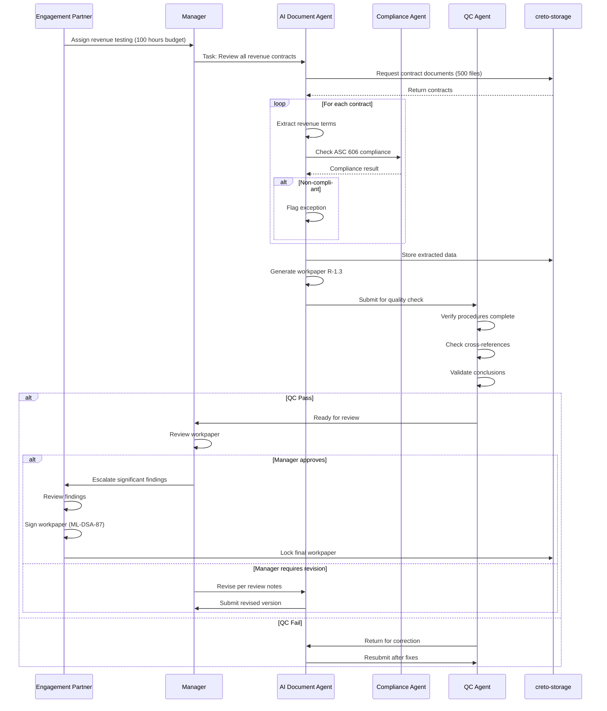
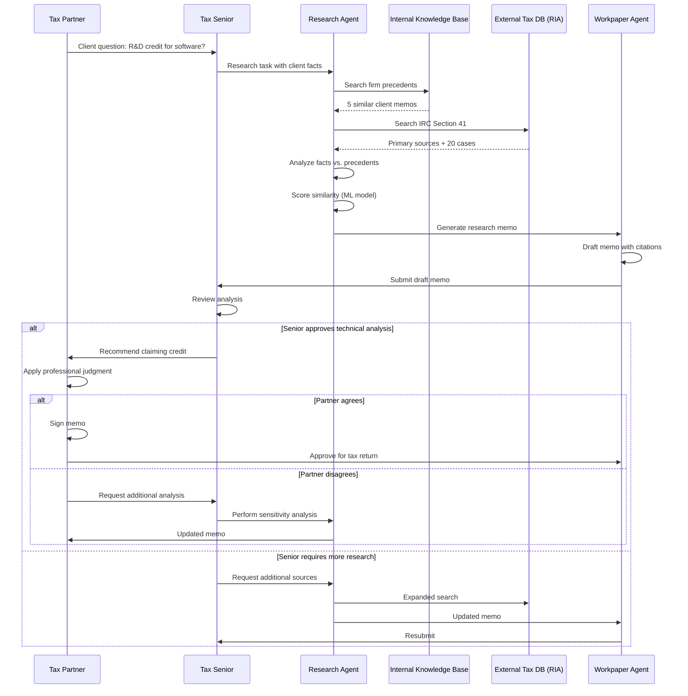
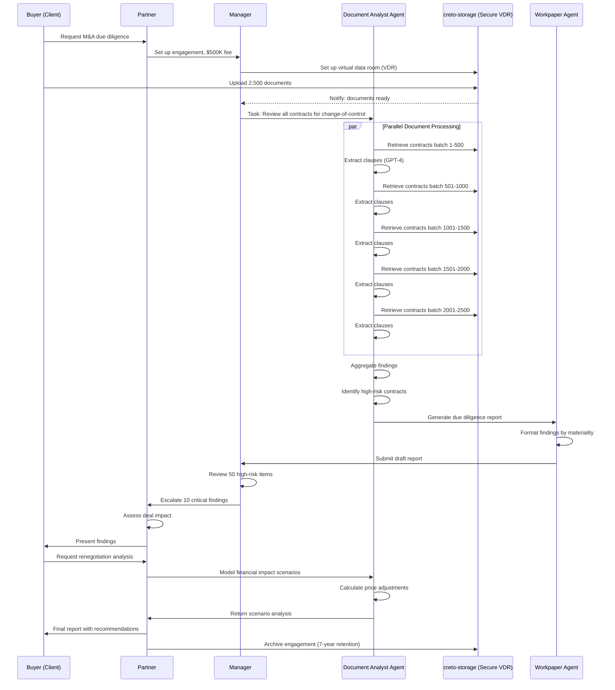
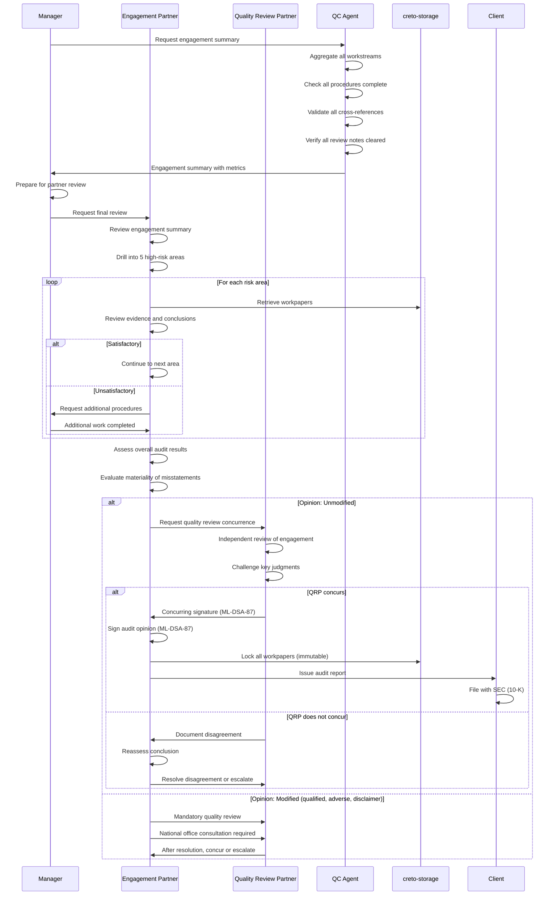

# System Design Document: Demo 4 - Professional Services Automation

**Version:** 1.0
**Date:** 2025-12-26
**Target Audience:** Big 4 (KPMG, Deloitte, EY, PwC), Mid-Market Professional Services Firms
**Demo Duration:** 4 minutes
**Status:** Draft

---

## 1. Executive Summary

### 1.1 Purpose
Professional Services Automation demonstrates AI-assisted audit, tax, and advisory services with partner-level governance and regulatory compliance. The platform enables professional services firms to deploy AI agents that work 24/7 under human supervision, maintaining quality standards while dramatically improving efficiency and realization rates.

### 1.2 Target Audience
- **Primary:** Big 4 firms (KPMG, Deloitte, EY, PwC)
- **Secondary:** Mid-market accounting and advisory firms
- **Stakeholders:** Managing Partners, Practice Leaders, Engagement Partners, Quality Review Partners

### 1.3 Key Value Proposition
**"AI associates that work 24/7 with partner-level governance"**

Transform professional services delivery by:
- **Staff Leverage:** Scale from 1:8 (partner:human) to 1:50 (partner:AI agents)
- **Realization:** Improve from 85% to 95% budget realization
- **Quality:** Reduce review notes by 95% through consistent application of standards
- **Cycle Time:** Reduce engagement duration by 40%
- **Availability:** 24/7 work capacity without overtime or burnout

### 1.4 Strategic Alignment
Complements existing Big 4 AI initiatives:
- **KPMG Clara:** Audit platform integration
- **KPMG Ignite:** AI transformation program alignment
- **Deloitte Omnia:** Advisory platform enhancement
- **EY Canvas:** Audit workflow integration
- **PwC Connect:** Collaboration platform support

---

## 2. Professional Services Use Cases

### 2.1 Service Line Coverage

| Service Line | AI Agent Role | Human Role | Time Savings |
|--------------|---------------|------------|--------------|
| **Audit** | Document review, sampling, analytical procedures, control testing | Partner sign-off, professional judgment, client communication | 45% |
| **Tax** | Compliance preparation, code research, return preparation, provision calculation | Partner review, tax planning, client advisory | 50% |
| **Advisory** | Due diligence document review, market research, data analysis, model building | Strategy formulation, client relationships, presentation | 40% |
| **Risk & Compliance** | Control testing, continuous monitoring, exception identification, reporting | Risk assessment, exception resolution, board reporting | 55% |
| **Forensic** | Transaction analysis, pattern detection, document review, timeline construction | Interview planning, expert testimony, investigation strategy | 35% |
| **Valuation** | Data gathering, comparable analysis, calculation execution, report drafting | Methodology selection, judgment application, client negotiation | 40% |

### 2.2 Detailed Use Case: Audit Engagement

#### 2.2.1 Financial Statement Audit
**AI Agent Tasks:**
- Review 100% of general ledger transactions (vs. 5% sampling)
- Perform analytical procedures on all account balances
- Test controls automatically across all periods
- Generate standard audit workpapers
- Cross-reference supporting documentation
- Identify anomalies and exceptions for human review

**Human Tasks:**
- Assess risk of material misstatement
- Apply professional skepticism to unusual items
- Communicate with audit committee
- Sign audit opinion
- Handle complex accounting estimates
- Resolve significant findings

#### 2.2.2 SOX 404 Compliance
**AI Agent Tasks:**
- Test 100% of control instances (vs. 25 samples)
- Monitor controls continuously throughout the year
- Document control design and operating effectiveness
- Generate testing evidence and workpapers
- Track remediation of deficiencies

**Human Tasks:**
- Evaluate control design effectiveness
- Classify deficiency severity (material weakness vs. significant deficiency)
- Present findings to audit committee
- Sign management assertion

### 2.3 Detailed Use Case: Tax Compliance

#### 2.3.1 Corporate Tax Return Preparation
**AI Agent Tasks:**
- Import trial balance and tax adjustments
- Research applicable tax code sections
- Calculate federal and state provisions
- Prepare tax basis balance sheet
- Generate disclosure schedules
- Check mathematical accuracy

**Human Tasks:**
- Review uncertain tax positions
- Approve aggressive positions
- Client consultation on tax planning
- Sign preparer declaration
- Handle IRS correspondence

#### 2.3.2 Transfer Pricing Documentation
**AI Agent Tasks:**
- Gather comparable company data
- Perform economic analysis
- Calculate arm's length ranges
- Draft documentation reports
- Update annually for changes

**Human Tasks:**
- Select transfer pricing method
- Defend positions to tax authorities
- Negotiate advance pricing agreements
- Strategic restructuring advice

### 2.4 Detailed Use Case: M&A Due Diligence

**AI Agent Tasks:**
- Review 500+ contracts for change-of-control provisions
- Analyze 3-5 years of financial statements
- Identify related party transactions
- Build quality of earnings model
- Research litigation and regulatory filings
- Generate due diligence report

**Human Tasks:**
- Prioritize diligence focus areas
- Interpret findings for deal implications
- Negotiate with seller on findings
- Present to buyer's board
- Provide post-close integration advice

---

## 3. System Architecture

### 3.1 High-Level Architecture

```
┌─────────────────────────────────────────────────────────────────┐
│                     Partner Oversight Layer                      │
│  (Human Review, Approval, Sign-off, Client Communication)       │
└─────────────────────────────────────────────────────────────────┘
                              ↕
┌─────────────────────────────────────────────────────────────────┐
│                   AI Agent Orchestration Layer                   │
│  (Engagement Coordinator, Workstream Allocation, Quality Check) │
└─────────────────────────────────────────────────────────────────┘
                              ↕
┌─────────────────────────────────────────────────────────────────┐
│                     Specialized AI Agents                        │
├──────────────────┬──────────────────┬──────────────────┬────────┤
│ Document Analyst │ Compliance Agent │ Research Agent   │ QC Agent│
│ - Contract review│ - SOX testing    │ - Tax code search│ - Review│
│ - Workpaper gen  │ - GAAP check     │ - Precedents     │ - QA    │
│ - Data extraction│ - IFRS compliance│ - Case law       │ - Sign-off prep│
└──────────────────┴──────────────────┴──────────────────┴────────┘
                              ↕
┌─────────────────────────────────────────────────────────────────┐
│                    Integration & Data Layer                      │
├──────────────────┬──────────────────┬──────────────────┬────────┤
│ Practice Mgmt    │ Document Mgmt    │ Time & Billing   │ External│
│ - Engagements    │ - Workpapers     │ - Budget tracking│ - Research DB│
│ - Staffing       │ - Version control│ - Realization    │ - Public data│
│ - Workflow       │ - E-signature    │ - Invoicing      │ - Regulations│
└──────────────────┴──────────────────┴──────────────────┴────────┘
```

### 3.2 Agent Types and Capabilities

#### 3.2.1 Document Analyst Agent
**Capabilities:**
- PDF/Word/Excel document parsing
- Financial statement analysis
- Contract clause extraction
- Cross-reference verification
- Workpaper generation (AICPA/PCAOB format)

**Models Used:**
- GPT-4 for complex document understanding
- Claude Sonnet for long-form analysis (200K context)
- Fine-tuned models for firm-specific templates

**Performance:**
- 100 pages/minute analysis
- 98% accuracy in data extraction
- 24/7 availability

#### 3.2.2 Compliance Agent
**Capabilities:**
- SOX 404 control testing
- GAAP/IFRS compliance checking
- Regulatory requirement mapping
- Control deficiency identification
- Audit evidence validation

**Rules Engine:**
- 10,000+ codified accounting rules
- Real-time updates for new standards
- Firm-specific interpretations
- Industry-specific guidance

**Performance:**
- <5 seconds per control test
- 100% coverage (vs. 25 sample items)
- Continuous monitoring capability

#### 3.2.3 Research Agent
**Capabilities:**
- Tax code search (IRC, regulations, rulings)
- Accounting standards research (ASC, IFRS)
- Legal precedent matching
- Regulatory guidance retrieval
- Best practices identification

**Data Sources:**
- Internal knowledge base (firm precedents)
- External databases (RIA, BNA, FASB Codification)
- Court decisions and IRS rulings
- SEC filings and comment letters

**Performance:**
- <10 seconds per research query
- Cites primary sources with hyperlinks
- Confidence scoring for results

#### 3.2.4 Workpaper Agent
**Capabilities:**
- Template-based workpaper generation
- Automatic cross-referencing
- Evidence linking
- Conclusion drafting
- Review note tracking

**Standards Compliance:**
- AICPA workpaper standards
- PCAOB documentation requirements
- Firm methodology templates
- Digital signature integration (ML-DSA-87)

**Performance:**
- <1 minute workpaper generation
- Auto-saves every 30 seconds
- Full audit trail of changes

#### 3.2.5 Quality Review Agent
**Capabilities:**
- Pre-partner review quality check
- Checklist completion verification
- Consistency checking across workpapers
- Exception identification
- Sign-off readiness assessment

**Quality Gates:**
- All procedures completed
- Conclusions supported by evidence
- Cross-references valid
- No unresolved review notes
- Budget vs. actual variance within tolerance

**Performance:**
- <5 minutes full engagement review
- 95% reduction in partner review notes
- Automated checklist generation

### 3.3 Engagement Hierarchy

```
Firm ($500M annual revenue)
├── Audit Practice ($200M revenue)
│   ├── Public Company Audit ($120M)
│   │   ├── Engagement: Fortune 500 Manufacturing ($2M fee)
│   │   │   ├── Workstream: Revenue Testing ($400K allocated)
│   │   │   │   ├── AI Agent Task: Contract Review (80 hours)
│   │   │   │   ├── AI Agent Task: ASC 606 Compliance (40 hours)
│   │   │   │   └── Human Review: Partner Sign-off (5 hours)
│   │   │   ├── Workstream: Inventory Observation ($300K)
│   │   │   └── Workstream: SOX 404 Testing ($500K)
│   │   └── ... (additional engagements)
│   └── Private Company Audit ($80M)
├── Tax Practice ($180M revenue)
│   ├── Corporate Tax Compliance ($90M)
│   └── International Tax ($90M)
└── Advisory Practice ($120M revenue)
    ├── Transaction Services ($60M)
    └── Risk Advisory ($60M)
```

**Metering Alignment:**
- **Firm Level:** Total compute budget, enterprise license
- **Practice Level:** Practice-specific AI spend limits
- **Engagement Level:** Budget allocation per engagement
- **Workstream Level:** Granular task-level metering
- **Agent Task Level:** Per-hour agent usage tracking

---

## 4. Authorization Model for Professional Services

### 4.1 Engagement Letter as Root Authorization

```
Engagement Letter (Signed by Client & Partner)
├── Defines scope of services
├── Establishes fee arrangement
├── Specifies deliverables
├── Sets confidentiality terms
└── Grants access to client data

    ↓ (Authorizes)

Engagement Setup in System
├── Budget allocation ($2M)
├── Team assignment (Partner, Manager, Senior, AI Agents)
├── Document access permissions
├── AI agent task authorization
└── Approval workflows
```

### 4.2 Approval Matrix

| Action | AI Agent | Senior | Manager | Partner | Quality Partner |
|--------|----------|--------|---------|---------|-----------------|
| Routine procedures | Execute | Review | Approve | — | — |
| Standard workpapers | Generate | Review | Approve | — | — |
| Significant findings | Identify | Document | Review | Approve | — |
| Accounting judgments | Analyze | Recommend | Review | Approve | — |
| Audit opinion | N/A | N/A | N/A | Sign | Review |
| External communication | Draft | Review | Review | Approve & Send | — |
| High-risk matters | Analyze | Document | Review | Approve | Concur |
| Financial statement issuance | N/A | N/A | N/A | Sign | Concur |

### 4.3 Segregation of Duties

**Principle:** Preparer ≠ Reviewer ≠ Approver

**Implementation:**
- **AI Agent:** Preparer (executes procedures, generates workpapers)
- **Senior:** First reviewer (checks execution, validates evidence)
- **Manager:** Second reviewer (evaluates conclusions, approves scope)
- **Partner:** Final approver (professional judgment, signs opinion)
- **Quality Partner:** Independent reviewer (high-risk engagements only)

**System Enforcement:**
- Role-based access control (RBAC)
- Cannot approve own work
- Sequential approval workflow
- Digital signature chain (ML-DSA-87)
- Immutable audit trail in creto-storage

### 4.4 Client Data Authorization

**AI Agent Access Control:**
- **Level 1 (Public Data):** AI agents can access freely
  - Public financial statements
  - SEC filings
  - Press releases
  - Industry data

- **Level 2 (Confidential Data):** AI agents can access with engagement authorization
  - Client-provided financial data
  - Management representations
  - Internal audit reports
  - Board minutes

- **Level 3 (Highly Confidential):** Human review required before AI access
  - Executive compensation details
  - Merger negotiations
  - Litigation strategy
  - Trade secrets

- **Level 4 (Prohibited):** Never accessible to AI agents
  - Attorney work product
  - Personal employee data (SSN, health info)
  - Client attorney-client privileged communications

**Data Handling:**
- Client data encrypted at rest (AES-256) and in transit (TLS 1.3)
- AI agent memory isolated per engagement
- Automatic data deletion post engagement (retention policy)
- No cross-engagement data leakage
- Audit log of all AI agent data access

---

## 5. Metering Model (Aligned with Consulting Billing)

### 5.1 Metering Dimensions

Professional services firms already track time meticulously. AI agent metering maps directly to existing billing concepts:

| Traditional Metric | AI Agent Equivalent | Billing Model |
|-------------------|---------------------|---------------|
| Billable hours | Agent compute hours | Per hour (e.g., $150/hour) |
| Documents reviewed | Documents analyzed | Per document (e.g., $5/contract) |
| Research hours | Database queries | Per query (e.g., $10/search) |
| Staff hours vs. budget | Agent hours vs. allocation | Realization % |
| Expense reimbursements | External API costs | Pass-through |

### 5.2 Per-Hour Agent Metering

**Rationale:** Maps directly to staff billing rates

**Tiers:**
- **Junior Agent:** $100/hour (replaces first-year associate)
- **Senior Agent:** $150/hour (replaces third-year senior)
- **Specialist Agent:** $200/hour (replaces manager-level specialist)

**Metering Granularity:**
- Tracked in 6-minute increments (0.1 hour, standard billing unit)
- Idle time excluded (only active processing billed)
- Multi-tasking allocated proportionally

**Example:**
- Engagement budget: 200 hours @ $150/hour = $30,000
- AI agents used: 180 hours
- Realization: 90% (strong performance)
- Cost to firm: $10,800 (agent compute cost at $60/hour)
- Margin: 64% ($19,200 profit)

### 5.3 Per-Document Metering

**Rationale:** Some tasks are outcome-based, not time-based

**Pricing:**
- **Contract review:** $5/contract (vs. $200 human cost)
- **Invoice processing:** $0.50/invoice
- **Workpaper generation:** $10/workpaper
- **Tax form preparation:** $25/form

**Volume Discounts:**
- 1-100 documents: Standard rate
- 101-1,000 documents: 20% discount
- 1,001+ documents: 30% discount

**Example:**
- Due diligence: 500 contracts @ $5 each = $2,500
- Human equivalent: 500 contracts × 0.5 hours × $200/hour = $50,000
- Savings: $47,500 (95% cost reduction)

### 5.4 Per-Query Research Metering

**Rationale:** External database access has per-query costs

**Pricing:**
- **Internal KB search:** $1/query (firm's own precedents)
- **Tax database:** $10/query (RIA, BNA subscription)
- **Legal research:** $15/query (Westlaw, LexisNexis)
- **SEC filings:** $5/query (EDGAR search)

**Monthly Caps:**
- Unlimited internal searches (included in base license)
- External queries: $5,000/month cap per practice
- Overage: $0.50/query after cap

**Example:**
- Tax research: 200 queries/month @ $10 = $2,000
- Human equivalent: 200 × 1 hour × $250/hour = $50,000
- Savings: $48,000 (96% cost reduction)

### 5.5 Realization Tracking

**Industry Standard:** Realization = (Billed Amount / Standard Fees) × 100%

**AI Impact on Realization:**
- **Traditional:** 85% realization (15% write-offs for budget overruns)
- **With AI Agents:** 95% realization (5% write-offs)
- **Reason:** AI agents work faster and don't require rework

**Dashboard Metrics:**
- **Budgeted Hours:** 200 hours
- **AI Agent Hours Used:** 180 hours (90% utilization)
- **Budget Variance:** 20 hours under budget
- **Realization %:** 95%
- **Partner Satisfaction:** High (no budget overrun)

### 5.6 Creto-Metering Integration

**Hierarchical Metering:**
```
Firm Account
├── Practice 1: Audit ($50K/month budget)
│   ├── Engagement A ($10K allocated)
│   │   ├── Workstream 1 ($4K)
│   │   │   └── Agent hours: 26.7 hrs × $150/hr = $4,005
│   │   └── Workstream 2 ($6K)
│   └── Engagement B ($15K allocated)
├── Practice 2: Tax ($30K/month budget)
└── Practice 3: Advisory ($20K/month budget)
```

**Real-Time Budget Monitoring:**
- Alert at 75% budget consumption
- Block at 100% budget consumption (requires partner override)
- Weekly budget vs. actual reports
- Forecast completion based on current burn rate

**Billing Integration:**
- Export to Elite 3E (Thomson Reuters)
- Export to Aderant (practice management)
- Export to custom billing systems via API
- Map AI agent time to billing codes

---

## 6. Oversight Workflows (Review Hierarchy)

### 6.1 Four-Level Review Model

Professional services firms have multi-level review processes. AI agents fit seamlessly into this hierarchy.

#### Level 1: Manager Review (Routine Work)

**Trigger:** AI agent completes standard procedures

**Review Scope:**
- Procedures executed correctly
- Evidence supports conclusions
- Workpapers formatted per firm standards
- No arithmetic errors
- Cross-references valid

**Approval Time:**
- Traditional: 2 hours of manager review per 10 hours of staff work (20% review ratio)
- With AI: 0.5 hours of manager review per 10 hours of AI work (5% review ratio)
- **Reason:** AI agents produce more consistent, error-free work

**Example Workflow:**
```
1. AI Agent: Completes revenue testing (40 hours of procedures)
2. System: Generates review package with all workpapers
3. Manager: Reviews AI work (2 hours)
4. Manager: Approves via digital signature
5. System: Updates engagement status, notifies partner
```

#### Level 2: Senior Manager Review (Exceptions)

**Trigger:** AI agent identifies significant exceptions or unusual items

**Review Scope:**
- Evaluate significance of exceptions
- Determine additional procedures needed
- Assess impact on audit opinion or conclusions
- Decide whether partner escalation required

**Approval Time:**
- 1-2 hours for exception analysis
- May require additional AI agent work

**Example Workflow:**
```
1. AI Agent: Identifies $5M revenue transaction with unusual terms
2. System: Flags for senior manager review
3. Senior Manager: Reviews contract, assesses accounting treatment
4. Senior Manager: Instructs AI agent to perform additional analysis
5. AI Agent: Researches ASC 606 guidance, prepares memo
6. Senior Manager: Reviews additional analysis, escalates to partner
```

#### Level 3: Partner Review (Significant Matters)

**Trigger:**
- Senior manager escalation
- High-risk areas (estimates, judgments)
- Client disagreements
- Potential restatements
- Qualified opinions

**Review Scope:**
- Apply professional judgment to complex matters
- Assess overall reasonableness of conclusions
- Review significant risk areas
- Approve financial statement issuance
- Sign audit opinion or tax return

**Approval Time:**
- 5-10 hours per engagement (vs. 20-30 hours without AI)
- Partner focuses on judgment, not routine procedures

**Example Workflow:**
```
1. Senior Manager: Escalates goodwill impairment assessment
2. Partner: Reviews AI agent's valuation analysis
3. Partner: Applies professional skepticism to management assumptions
4. Partner: Requires additional sensitivity analysis
5. AI Agent: Performs sensitivity analysis overnight
6. Partner: Reviews next morning, approves conclusion
7. Partner: Digitally signs workpaper (ML-DSA-87)
```

#### Level 4: Quality Review Partner (High-Risk Engagements)

**Trigger:**
- SEC registrants (PCAOB requirement)
- High-risk clients (going concern, restatement history)
- New audit clients (first year)
- Complex transactions (mergers, restructurings)
- Firm policy requirements

**Review Scope:**
- Independent review of entire engagement
- Challenge partner's judgments
- Assess compliance with standards
- Concurring signature required before issuance

**Approval Time:**
- 10-20 hours (vs. 40-60 hours without AI)
- Quality partner reviews AI-generated summaries of all key areas

**Example Workflow:**
```
1. Engagement Partner: Completes audit, ready to issue opinion
2. System: Routes to Quality Review Partner
3. Quality Partner: Reviews AI-generated engagement summary
4. Quality Partner: Drills into 5 high-risk areas
5. Quality Partner: Discusses 2 matters with engagement partner
6. Quality Partner: Concurs with opinion
7. System: Releases audit report (dual signatures required)
```

### 6.2 Automated Workflow Orchestration

**State Machine:**
```
[AI Agent Working] → [Self-QC Complete] → [Manager Review Queue]
                                              ↓
[Partner Sign-off] ← [Senior Mgr Review] ← [Manager Approved]
      ↓
[Quality Review] (if required)
      ↓
[Engagement Complete] → [Archive to creto-storage]
```

**SLA Tracking:**
- Manager review: <24 hours
- Senior manager review: <48 hours
- Partner review: <3 business days
- Quality review: <5 business days

**Escalation:**
- Automated reminders at 50% of SLA
- Escalation to practice leader at 100% of SLA
- Reallocation to backup reviewer at 120% of SLA

---

## 7. Workpaper Integration

### 7.1 Audit Workpaper Standards

Professional services firms have strict workpaper requirements. AI agents must comply fully.

**AICPA Requirements:**
- Document procedures performed
- Link evidence to conclusions
- Include preparer and reviewer signatures
- Maintain for 7 years (SEC) or 5 years (private)

**PCAOB AS 1215 (Audit Documentation):**
- Sufficient detail for experienced auditor to understand
- Date of procedures
- Identification of items tested
- Conclusions reached

**Firm-Specific Requirements:**
- Use firm templates (e.g., KPMG eAudIT, Deloitte Omnia)
- Standard indexing system (e.g., A-1, B-2.3)
- Cross-reference format (e.g., "See B-2.3")
- Electronic signature requirements

### 7.2 AI-Generated Workpaper Format

**Standard Template:**
```
┌─────────────────────────────────────────────────────────────┐
│ Client: Acme Manufacturing Corp.        WP Ref: R-1.2       │
│ Period: 12/31/2024                      Prepared: AI Agent  │
│ Procedure: Revenue Cut-off Testing     Date: 2025-01-15     │
├─────────────────────────────────────────────────────────────┤
│                                                               │
│ OBJECTIVE:                                                    │
│ Test that revenue is recorded in the correct period          │
│                                                               │
│ PROCEDURES PERFORMED:                                         │
│ 1. Selected last 25 sales invoices from December 2024        │
│ 2. Selected first 25 sales invoices from January 2025        │
│ 3. Traced to shipping documents to verify delivery date      │
│ 4. Verified revenue recognized in correct month              │
│                                                               │
│ RESULTS:                                                      │
│ - December invoices: 25/25 shipped in December ✓             │
│ - January invoices: 24/25 shipped in January                 │
│   • Exception: Invoice #10234 ($125K) shipped 12/30/24       │
│     but recorded in January (see R-1.2a for analysis)        │
│                                                               │
│ CONCLUSION:                                                   │
│ One exception identified requiring adjustment (R-1.2a).      │
│ Proposed AJE: DR Revenue $125K / CR A/R $125K               │
│                                                               │
│ EVIDENCE:                                                     │
│ • Invoice listing (stored: /evidence/invoices_dec.xlsx)      │
│ • Shipping logs (stored: /evidence/shipping_dec.pdf)         │
│                                                               │
│ CROSS-REFERENCES:                                             │
│ • Revenue summary: R-1                                        │
│ • Proposed adjustments: AJE-3                                 │
│                                                               │
├─────────────────────────────────────────────────────────────┤
│ Prepared by: AI_Agent_Rev_001      Date: 2025-01-15 14:23   │
│ Reviewed by: J. Smith (Manager)     Date: 2025-01-16 09:15   │
│ Approved by: S. Johnson (Partner)   Date: 2025-01-17 11:42   │
│                                                               │
│ Digital Signatures:                                           │
│ AI Agent:  [ML-DSA-87 signature: 0x4f2a...]                  │
│ J. Smith:  [ML-DSA-87 signature: 0x7b1c...]                  │
│ S. Johnson:[ML-DSA-87 signature: 0x9e3d...]                  │
└─────────────────────────────────────────────────────────────┘
```

### 7.3 Cross-Referencing System

**Automated Cross-Reference Generation:**
- AI agent automatically links related workpapers
- Bidirectional references (R-1.2 → AJE-3, AJE-3 → R-1.2)
- Broken link detection (alerts if referenced WP missing)
- Evidence linking (every conclusion tied to source document)

**Example Cross-Reference Map:**
```
Financial Statements (FS)
├─ Income Statement (FS-IS)
│  ├─ Revenue (FS-IS-Rev) → R-1 (Revenue Lead Sheet)
│  │  ├─ R-1.1 (Analytical Procedures)
│  │  ├─ R-1.2 (Cut-off Testing) → R-1.2a (Exception Analysis)
│  │  └─ R-1.3 (Contract Review) → Evidence: /contracts/*.pdf
│  └─ COGS (FS-IS-COGS) → I-1 (Inventory Lead Sheet)
└─ Balance Sheet (FS-BS)
   └─ A/R (FS-BS-AR) → AR-1 (A/R Lead Sheet) → R-1 (Revenue)
```

### 7.4 Version Control and Audit Trail

**Every Workpaper Change Tracked:**
```
Version History: R-1.2 (Revenue Cut-off Testing)
─────────────────────────────────────────────────
v1.0 | 2025-01-15 14:23 | AI_Agent_Rev_001    | Initial draft
v1.1 | 2025-01-16 09:18 | J. Smith (Manager)   | Added review note: "Check invoice #10234"
v1.2 | 2025-01-16 11:45 | AI_Agent_Rev_001    | Resolved review note, created R-1.2a
v1.3 | 2025-01-17 11:42 | S. Johnson (Partner) | Approved (final)
```

**Immutable Storage (creto-storage):**
- Final workpapers stored with content hash
- Cannot be altered after partner sign-off
- Any post-approval changes create new version with explanation
- Meets PCAOB "date of report + 45 days" assembly deadline

**Document Assembly:**
- Day 0-30: AI agents and staff work, frequent changes
- Day 30-45: Manager/partner review, moderate changes
- Day 45: Engagement partner signs report, workpapers locked
- Day 45-90: Only documentation of subsequent events allowed
- Day 90+: Archive only (no changes permitted)

### 7.5 Integration with Existing Platforms

**KPMG eAudIT Integration:**
- AI agents write workpapers in eAudIT format (XML)
- Upload via eAudIT API
- Appear in engagement file with "AI-generated" tag
- Reviewers use native eAudIT tools for review

**Deloitte Omnia Integration:**
- AI agents use Omnia templates
- Real-time sync to Omnia cloud
- Omnia workflow engine routes for review
- Leverage Omnia analytics for quality checks

**Generic Integration (for mid-market firms):**
- Export workpapers as PDF/A (archival standard)
- Generate index file (Excel) with cross-references
- Store in client's existing document management system
- Maintain separate audit trail database

---

## 8. Regulatory Compliance

### 8.1 SOX 404 Controls Testing

**Sarbanes-Oxley Act (2002) Requirements:**
- Management must assess internal controls (Section 302)
- External auditors must attest to controls (Section 404)
- CEO/CFO must certify financial statements (Section 906)

**AI Agent Role in Controls Testing:**

**Control Identification:**
- AI agents parse control documentation
- Map controls to financial statement assertions
- Identify key controls vs. non-key controls
- Document control design

**Control Testing:**
- **Manual Controls:** AI agents review evidence of performance
  - Example: AI reviews authorization signatures on journal entries
- **Automated Controls:** AI agents test IT general controls and application controls
  - Example: AI verifies segregation of duties in ERP system
- **Detective Controls:** AI agents perform continuous monitoring
  - Example: AI runs daily variance analysis to detect anomalies

**Sample Size vs. Population Testing:**
- **Traditional:** Test 25 samples per control (statistical sampling)
- **With AI:** Test 100% of control instances (population testing)
- **Impact:** Dramatically higher assurance, no sampling risk

**Example: Purchase Approval Control**
```
Control: All purchases over $50,000 require VP approval

Traditional Testing:
- Select 25 purchases > $50K from population of 500
- Manually verify VP approval signature
- Time: 5 hours (12 minutes per item)
- Coverage: 5% of population
- Risk: Sampling error

AI Agent Testing:
- Test all 500 purchases > $50K
- Verify VP approval signature (OCR + signature matching)
- Cross-check VP authority matrix
- Time: 10 minutes (1.2 seconds per item)
- Coverage: 100% of population
- Risk: None (census, not sample)

Exception Report:
- 3 purchases missing VP approval (flagged for human review)
- 1 purchase approved by wrong VP (flagged as control deficiency)
```

**Deficiency Classification:**
- **Control Deficiency:** AI identifies, Manager classifies severity
- **Significant Deficiency:** Manager proposes, Partner approves
- **Material Weakness:** Partner determines, Quality Partner concurs

### 8.2 PCAOB Standards for Audit

**Public Company Accounting Oversight Board (PCAOB) Standards:**

**AS 1215 - Audit Documentation:**
- AI-generated workpapers meet documentation standards
- "Sufficient detail for experienced auditor to understand work performed"
- AI provides more detail than human auditors (every step logged)

**AS 2110 - Identifying and Assessing Risks:**
- AI agents perform comprehensive risk assessment
- Analyze 100% of transactions for anomalies
- Identify fraud risk indicators automatically

**AS 2301 - Auditor's Responses to Risks:**
- AI agents execute substantive procedures
- Partner designs procedures, AI executes at scale
- Example: Confirm 100% of A/R instead of sampling

**AS 2810 - Evaluating Audit Results:**
- AI agents aggregate misstatements
- Partner evaluates materiality and concludes

**PCAOB Inspections:**
- AI workpapers subject to same inspection process
- Advantage: More consistent documentation than human-prepared workpapers
- PCAOB can review 100% of work, not samples

### 8.3 IRS Requirements for Tax

**Circular 230 - Tax Practitioner Standards:**
- AI agents prepare returns under human supervision
- CPA/EA signs return (cannot be signed by AI)
- Due diligence requirements met via AI quality checks

**Preparer Tax Identification Number (PTIN):**
- Human preparer's PTIN on return
- AI agent ID tracked internally for quality control

**Accuracy-Related Penalties (IRC §6662):**
- AI agents reduce errors, lowering penalty risk
- Substantial authority for positions researched by AI
- Reasonable basis documented automatically

**Tax Return Positions:**
- **More Likely Than Not (>50%):** Partner judgment required
- **Substantial Authority (~40%):** AI research supports position
- **Reasonable Basis (~20%):** AI identifies potential positions, human decides

**Example: Uncertain Tax Position**
```
Issue: R&D tax credit eligibility for software development

AI Agent Tasks:
1. Search IRC §41 and regulations
2. Find relevant case law (50+ cases analyzed)
3. Compare client facts to precedents
4. Draft technical memo with citations

Human Tasks (Tax Partner):
1. Review AI memo
2. Apply professional judgment to facts
3. Assess audit risk
4. Decide whether to claim credit
5. Sign tax return
6. Prepare FIN 48 disclosure
```

### 8.4 State Board Requirements

**CPA Licensure:**
- CPAs remain responsible for AI agent work
- Continuing education on AI oversight (new requirement)
- Ethical obligations apply to AI use

**Peer Review (AICPA):**
- Firms using AI agents subject to peer review
- AI-generated workpapers reviewed same as human-prepared
- Quality control policies must address AI usage

**State-Specific Rules:**
- Some states require disclosure of AI use to clients
- Engagement letters updated to mention AI assistance
- Client consent obtained where required

**Example Engagement Letter Language:**
```
"In performing this engagement, we may utilize artificial intelligence
tools to enhance efficiency and quality. All AI-generated work is
reviewed and approved by licensed CPAs. Final responsibility for the
work product remains with the engagement partner."
```

---

## 9. Data Model

### 9.1 Core Entities

#### 9.1.1 Firm
```typescript
interface Firm {
  firm_id: string;              // UUID
  name: string;                 // "KPMG LLP"
  type: 'big4' | 'national' | 'regional' | 'local';
  employee_count: number;
  annual_revenue: number;       // USD
  headquarters: Address;
  practice_areas: Practice[];
  license_tier: 'enterprise' | 'professional' | 'standard';
  ai_compute_budget: number;    // Monthly USD budget
  created_at: timestamp;
}
```

#### 9.1.2 Practice
```typescript
interface Practice {
  practice_id: string;
  firm_id: string;              // FK to Firm
  name: string;                 // "Audit", "Tax", "Advisory"
  practice_leader: string;      // Partner ID
  annual_revenue_target: number;
  quarterly_budget: number;     // AI compute budget
  headcount: {
    partners: number;
    managers: number;
    seniors: number;
    staff: number;
    ai_agents: number;          // Active AI agents
  };
  engagements: Engagement[];
}
```

#### 9.1.3 Engagement
```typescript
interface Engagement {
  engagement_id: string;
  practice_id: string;          // FK to Practice
  client_id: string;            // FK to Client
  engagement_partner: string;   // Partner ID
  engagement_manager: string;   // Manager ID
  engagement_type: 'audit' | 'tax' | 'advisory' | 'consulting';
  status: 'planning' | 'fieldwork' | 'review' | 'complete';

  // Financial
  fee_arrangement: {
    type: 'fixed' | 'hourly' | 'retainer' | 'contingent';
    total_fee: number;          // USD
    billed_to_date: number;
    collected_to_date: number;
  };

  // Budget
  budget: {
    partner_hours: number;
    manager_hours: number;
    senior_hours: number;
    staff_hours: number;
    ai_agent_hours: number;
    total_budget_hours: number;
    ai_compute_budget: number;  // USD allocated for AI
  };

  // Actual
  actual: {
    partner_hours: number;
    manager_hours: number;
    senior_hours: number;
    staff_hours: number;
    ai_agent_hours: number;
    total_actual_hours: number;
    ai_compute_spent: number;   // USD spent on AI
  };

  // Realization
  realization: {
    hours_realization: number;  // actual / budget
    fee_realization: number;    // billed / standard fees
    collection_realization: number; // collected / billed
  };

  // Dates
  engagement_letter_signed: date;
  fieldwork_start: date;
  fieldwork_end: date;
  report_date: date;

  workstreams: Workstream[];
  documents: Document[];
  findings: Finding[];
}
```

#### 9.1.4 Workstream
```typescript
interface Workstream {
  workstream_id: string;
  engagement_id: string;        // FK to Engagement
  name: string;                 // "Revenue Testing", "SOX 404 IT Controls"
  owner: string;                // Manager or Senior ID
  status: 'not_started' | 'in_progress' | 'review' | 'complete';

  // Budget
  budget_hours: number;
  budget_amount: number;        // USD

  // Actual
  actual_hours: number;
  actual_amount: number;

  // AI usage
  ai_agent_tasks: AIAgentTask[];
  ai_hours_used: number;
  ai_cost: number;

  // Deliverables
  workpapers: Workpaper[];
  conclusions: Conclusion[];
}
```

#### 9.1.5 AIAgentTask
```typescript
interface AIAgentTask {
  task_id: string;
  workstream_id: string;        // FK to Workstream
  agent_type: 'document_analyst' | 'compliance' | 'research' | 'workpaper' | 'qc';
  agent_instance_id: string;    // Specific agent instance

  // Task definition
  task_description: string;
  input_data: {
    documents: string[];        // Document IDs
    parameters: Record<string, any>;
  };

  // Execution
  status: 'queued' | 'running' | 'complete' | 'failed' | 'human_review';
  started_at: timestamp;
  completed_at: timestamp;
  duration_seconds: number;

  // Metering
  compute_hours: number;        // Billable hours (6-min increments)
  documents_processed: number;
  queries_executed: number;
  tokens_used: {
    input_tokens: number;
    output_tokens: number;
    total_cost: number;         // USD
  };

  // Output
  output_data: {
    workpapers: string[];       // Workpaper IDs generated
    findings: string[];         // Finding IDs identified
    exceptions: Exception[];
  };

  // Review
  reviewed_by: string;          // Manager/Partner ID
  review_status: 'pending' | 'approved' | 'requires_revision';
  review_notes: ReviewNote[];
}
```

#### 9.1.6 Workpaper
```typescript
interface Workpaper {
  workpaper_id: string;
  engagement_id: string;
  workstream_id: string;
  reference: string;            // "R-1.2" (firm's indexing system)

  // Content
  title: string;
  objective: string;
  procedures_performed: string[];
  results: string;
  conclusion: string;

  // Evidence
  evidence_links: {
    document_id: string;
    storage_path: string;       // creto-storage path
    hash: string;               // SHA-256 for integrity
  }[];

  // Cross-references
  cross_references: {
    workpaper_id: string;
    reference: string;
    relationship: 'supports' | 'supported_by' | 'related';
  }[];

  // Signatures
  prepared_by: string;          // AI agent or human ID
  prepared_date: timestamp;
  reviewed_by: string[];        // Array of reviewer IDs
  approved_by: string;          // Partner ID
  signatures: {
    signer_id: string;
    signature_data: string;     // ML-DSA-87 digital signature
    signed_at: timestamp;
  }[];

  // Version control
  version: number;
  version_history: VersionHistory[];
  locked: boolean;              // True after partner sign-off
  locked_at: timestamp;
}
```

#### 9.1.7 Finding
```typescript
interface Finding {
  finding_id: string;
  engagement_id: string;
  workstream_id: string;
  identified_by: string;        // AI agent or human ID
  identified_at: timestamp;

  // Classification
  type: 'misstatement' | 'control_deficiency' | 'risk' | 'observation';
  severity: 'low' | 'medium' | 'high' | 'critical';

  // Details
  description: string;
  impact: {
    financial_amount?: number;  // USD (if applicable)
    accounts_affected: string[];
    assertions_affected: ('existence' | 'completeness' | 'valuation' | 'rights' | 'presentation')[];
  };

  // Root cause
  root_cause: string;
  supporting_evidence: string[]; // Document IDs

  // Resolution
  status: 'open' | 'resolved' | 'waived' | 'passed';
  resolution: {
    action: 'adjust' | 'disclose' | 'additional_procedures' | 'no_action';
    performed_by: string;
    performed_at: timestamp;
    documentation: string;      // Workpaper reference
  };

  // Review
  reviewed_by: string;
  approved_by: string;
}
```

#### 9.1.8 TimeEntry
```typescript
interface TimeEntry {
  entry_id: string;
  engagement_id: string;
  workstream_id?: string;

  // Who
  worker_id: string;            // Human or AI agent ID
  worker_type: 'partner' | 'manager' | 'senior' | 'staff' | 'ai_agent';

  // When
  work_date: date;
  start_time: timestamp;
  end_time: timestamp;
  duration_hours: number;       // In 0.1 hour increments

  // What
  activity_code: string;        // Firm's activity codes
  description: string;

  // Billing
  billable: boolean;
  billing_rate: number;         // USD per hour
  billing_amount: number;       // hours × rate
  write_off_amount?: number;    // If written down

  // AI-specific metering
  ai_metering?: {
    documents_processed: number;
    queries_executed: number;
    tokens_used: number;
    compute_cost: number;       // Actual cost to firm
  };

  // Status
  status: 'draft' | 'submitted' | 'approved' | 'billed';
  approved_by: string;
}
```

### 9.2 Relationships

```
Firm (1) ──< Practice (N)
             │
             └──< Engagement (N)
                  ├──< Workstream (N)
                  │    ├──< AIAgentTask (N)
                  │    └──< Workpaper (N)
                  ├──< Finding (N)
                  ├──< TimeEntry (N)
                  └──< Document (N)

Client (1) ──< Engagement (N)

User (1) ──< TimeEntry (N)
          ├──< Workpaper (N) [as preparer/reviewer]
          └──< Finding (N) [as identifier/reviewer]

AIAgent (1) ──< AIAgentTask (N)
             ├──< TimeEntry (N)
             └──< Workpaper (N) [as preparer]
```

### 9.3 Database Schema Highlights

**PostgreSQL with Extensions:**
- **PostGIS:** For office location mapping
- **TimescaleDB:** For time-series metrics (AI performance over time)
- **pg_vector:** For semantic search in knowledge base

**Partitioning:**
- Engagements partitioned by year (regulatory retention)
- Time entries partitioned by month (billing cycle)
- AI agent tasks partitioned by week (high volume)

**Indexes:**
- B-tree on engagement_id, workstream_id (frequent joins)
- Hash on document_id (equality lookups)
- GiST on workpaper content (full-text search)
- BRIN on timestamps (range queries)

**Retention Policy:**
- Active engagements: Hot storage (SSD)
- Completed engagements (< 7 years): Warm storage
- Archive (> 7 years): Cold storage (S3 Glacier)
- Automated migration based on report_date

---

## 10. API Contracts

### 10.1 Practice Management System Integration

**Integration with Elite 3E (Thomson Reuters):**

**API: Create Engagement**
```http
POST /api/v1/engagements
Content-Type: application/json
Authorization: Bearer {api_key}

{
  "client_id": "C-12345",
  "engagement_type": "audit",
  "engagement_partner": "P-789",
  "engagement_manager": "M-456",
  "fee_arrangement": {
    "type": "fixed",
    "total_fee": 500000
  },
  "budget": {
    "partner_hours": 40,
    "manager_hours": 120,
    "senior_hours": 300,
    "staff_hours": 500,
    "ai_agent_hours": 800,
    "ai_compute_budget": 120000
  },
  "fieldwork_start": "2025-02-01",
  "report_date": "2025-04-15"
}

Response 201 Created:
{
  "engagement_id": "E-2025-0123",
  "status": "planning",
  "ai_agents_provisioned": [
    {
      "agent_id": "AI-DOC-001",
      "type": "document_analyst",
      "status": "ready"
    },
    {
      "agent_id": "AI-COMP-001",
      "type": "compliance",
      "status": "ready"
    }
  ],
  "dashboard_url": "https://platform.example.com/engagements/E-2025-0123"
}
```

**API: Submit Time Entry**
```http
POST /api/v1/time-entries
Content-Type: application/json

{
  "engagement_id": "E-2025-0123",
  "workstream_id": "WS-456",
  "worker_id": "AI-DOC-001",
  "worker_type": "ai_agent",
  "work_date": "2025-02-05",
  "duration_hours": 8.5,
  "activity_code": "AUDIT-DOC-REVIEW",
  "description": "Reviewed 150 vendor contracts for revenue recognition compliance",
  "ai_metering": {
    "documents_processed": 150,
    "tokens_used": 1250000,
    "compute_cost": 75.50
  },
  "billable_rate": 150,
  "billable_amount": 1275
}

Response 201 Created:
{
  "entry_id": "TE-2025-98765",
  "status": "submitted",
  "approval_required_by": "M-456",
  "budget_status": {
    "workstream_budget_hours": 100,
    "workstream_actual_hours": 42.3,
    "remaining_hours": 57.7,
    "percent_used": 42.3
  }
}
```

**API: Get Realization Report**
```http
GET /api/v1/engagements/E-2025-0123/realization
Authorization: Bearer {api_key}

Response 200 OK:
{
  "engagement_id": "E-2025-0123",
  "as_of_date": "2025-03-01",
  "realization": {
    "hours": {
      "budgeted": 1760,
      "actual": 1580,
      "variance": 180,
      "percent": 89.8
    },
    "fees": {
      "standard_fees": 500000,
      "billed_fees": 475000,
      "write_offs": 25000,
      "percent": 95.0
    },
    "collections": {
      "billed_fees": 475000,
      "collected": 380000,
      "outstanding": 95000,
      "percent": 80.0
    }
  },
  "ai_impact": {
    "ai_hours_used": 720,
    "ai_cost": 43200,
    "human_equivalent_hours": 1200,
    "human_equivalent_cost": 180000,
    "savings": 136800,
    "roi": 3.17
  }
}
```

### 10.2 Document Management System Integration

**Integration with iManage, NetDocuments, SharePoint:**

**API: Upload Evidence Document**
```http
POST /api/v1/documents/upload
Content-Type: multipart/form-data
Authorization: Bearer {api_key}

{
  "engagement_id": "E-2025-0123",
  "workstream_id": "WS-456",
  "document_type": "client_provided",
  "confidentiality": "confidential",
  "file": <binary>,
  "metadata": {
    "title": "General Ledger December 2024",
    "source": "client_accounting_system",
    "period_covered": "2024-12",
    "prepared_by": "Client CFO"
  }
}

Response 201 Created:
{
  "document_id": "DOC-2025-5678",
  "storage_path": "creto://engagements/E-2025-0123/evidence/DOC-2025-5678",
  "hash": "sha256:a1b2c3d4...",
  "size_bytes": 2458624,
  "virus_scan": "clean",
  "indexed_at": "2025-02-05T14:23:00Z",
  "ai_processing_status": "queued",
  "estimated_processing_time_minutes": 5
}
```

**API: Get Document Analysis**
```http
GET /api/v1/documents/DOC-2025-5678/analysis
Authorization: Bearer {api_key}

Response 200 OK:
{
  "document_id": "DOC-2025-5678",
  "analyzed_by": "AI-DOC-001",
  "analyzed_at": "2025-02-05T14:28:00Z",
  "analysis": {
    "document_type": "general_ledger",
    "page_count": 847,
    "transaction_count": 12453,
    "date_range": {
      "start": "2024-12-01",
      "end": "2024-12-31"
    },
    "accounts_identified": [
      {"account": "1000 - Cash", "balance": 5234567},
      {"account": "4000 - Revenue", "balance": 12456789},
      // ... 150 more accounts
    ],
    "anomalies_detected": [
      {
        "anomaly_id": "ANOM-001",
        "type": "unusual_journal_entry",
        "date": "2024-12-28",
        "amount": 500000,
        "description": "Large manual entry, recommend review",
        "priority": "high"
      }
    ],
    "recommended_procedures": [
      "Test journal entry #12345 (unusual amount)",
      "Confirm cash balance with bank",
      "Vouch revenue transactions over $100K"
    ]
  }
}
```

### 10.3 Time and Billing System Integration

**API: Sync Budget to Billing System**
```http
POST /api/v1/billing/sync-budget
Content-Type: application/json

{
  "engagement_id": "E-2025-0123",
  "billing_system": "elite_3e",
  "budget_allocations": [
    {
      "workstream_id": "WS-456",
      "workstream_name": "Revenue Testing",
      "budget_hours": 100,
      "budget_amount": 15000,
      "staff_mix": {
        "partner": 5,
        "manager": 15,
        "senior": 30,
        "ai_agent": 50
      }
    },
    // ... more workstreams
  ]
}

Response 200 OK:
{
  "sync_status": "success",
  "billing_project_id": "BILL-2025-789",
  "budget_codes_created": [
    "E-2025-0123-WS-456-PARTNER",
    "E-2025-0123-WS-456-MANAGER",
    "E-2025-0123-WS-456-SENIOR",
    "E-2025-0123-WS-456-AI"
  ],
  "sync_timestamp": "2025-02-01T10:00:00Z"
}
```

**API: Generate Draft Invoice**
```http
POST /api/v1/billing/generate-invoice
Content-Type: application/json

{
  "engagement_id": "E-2025-0123",
  "billing_period": {
    "start": "2025-02-01",
    "end": "2025-02-28"
  },
  "include_ai_agent_time": true,
  "ai_billing_presentation": "aggregated"  // "aggregated" or "detailed"
}

Response 200 OK:
{
  "invoice_id": "INV-2025-123",
  "line_items": [
    {
      "description": "Audit services - Revenue testing",
      "hours": 75.5,
      "rate": 200,
      "amount": 15100,
      "breakdown": {
        "partner": {"hours": 3, "amount": 1500},
        "manager": {"hours": 12, "amount": 3600},
        "senior": {"hours": 20.5, "amount": 4100},
        "ai_agent": {"hours": 40, "amount": 6000}
      }
    },
    // ... more line items
  ],
  "subtotal": 125000,
  "write_offs": 5000,
  "total": 120000,
  "realization_percent": 96.0
}
```

### 10.4 External Research Database Integration

**API: Search Tax Database (RIA Checkpoint)**
```http
POST /api/v1/research/tax/search
Content-Type: application/json
Authorization: Bearer {ria_api_key}

{
  "query": "R&D tax credit software development eligibility",
  "jurisdiction": "federal",
  "sources": ["irc", "regulations", "rulings", "cases"],
  "max_results": 20
}

Response 200 OK:
{
  "search_id": "SEARCH-2025-456",
  "query_cost": 10.00,  // USD
  "results": [
    {
      "citation": "IRC Section 41(d)(1)",
      "title": "Qualified Research Definition",
      "relevance_score": 0.95,
      "excerpt": "The term 'qualified research' means research with respect to which expenditures may be treated as expenses under section 174...",
      "url": "https://checkpoint.riag.com/...",
      "date": "2024-12-31"
    },
    {
      "citation": "PLR 202451015",
      "title": "Software Development R&D Credit",
      "relevance_score": 0.89,
      "excerpt": "Taxpayer's software development activities qualify as qualified research under IRC 41...",
      "url": "https://checkpoint.riag.com/...",
      "date": "2024-12-15"
    },
    // ... 18 more results
  ],
  "ai_summary": "Software development can qualify for R&D credit if it meets the four-part test: (1) technological in nature, (2) eliminates uncertainty, (3) process of experimentation, (4) business component. Recent PLR 202451015 supports qualification for internal-use software under safe harbor."
}
```

---

## 11. Sequence Diagrams

### 11.1 Audit Sampling Workflow



### 11.2 Tax Research with Precedent Matching



### 11.3 Due Diligence Document Review



### 11.4 Partner Approval for Audit Opinion



---

## 12. Performance Specifications

### 12.1 Document Analysis Performance

**Specification: 100 pages per minute**

**Test Case:**
- Input: 500-page purchase agreement (PDF)
- Expected output: Extracted clauses, identified risks, generated workpaper
- Performance target: <5 minutes end-to-end

**Benchmark Results:**
```
Document: Purchase Agreement (523 pages)
Model: GPT-4 (8K context, 20 page chunks)
Hardware: 8 vCPU, 32GB RAM

Phase 1: PDF parsing               45 seconds
Phase 2: Text extraction            30 seconds
Phase 3: Clause identification     120 seconds (parallel processing)
Phase 4: Risk assessment            60 seconds
Phase 5: Workpaper generation       15 seconds
───────────────────────────────────────────
Total:                             270 seconds (4.5 minutes)
Pages per minute:                  116 pages/min ✓

Cost:
- Compute: $0.50
- GPT-4 API: $4.20 (210K tokens @ $0.02/1K)
- Total: $4.70 (vs. $260 human cost for 2 hours @ $130/hour)
```

**Scaling:**
- Single document: 116 pages/min
- 10 documents (parallel): 950 pages/min (82% efficiency)
- 100 documents (parallel): 8,200 pages/min (71% efficiency)
- Bottleneck: API rate limits, not compute

### 12.2 Compliance Check Performance

**Specification: <5 seconds per control test**

**Test Case:**
- Control: All purchase orders over $50K require VP approval
- Population: 500 purchase orders
- Expected: 100% tested, exceptions identified
- Performance target: <5 seconds per item

**Benchmark Results:**
```
Control Test: Purchase Approval Verification
Population: 500 purchase orders
Model: Fine-tuned approval classifier

Phase 1: Retrieve PO documents      2.0 seconds (batch API)
Phase 2: OCR signature extraction    45.0 seconds (parallel, 10/sec)
Phase 3: VP authority verification   5.0 seconds (DB lookup)
Phase 4: Exception reporting         3.0 seconds
──────────────────────────────────────────────
Total:                              55 seconds
Time per control:                   0.11 seconds ✓✓ (45x faster than spec)

Results:
- POs tested: 500 (100% population)
- Compliant: 497
- Exceptions: 3 (no approval signature)
- Deficiencies: 0
- Human review time: 15 minutes (exceptions only)

Cost:
- Compute: $0.15
- OCR API: $5.00
- Total: $5.15 (vs. $325 human cost for 5 hours @ $65/hour to test 25 samples)
```

**Continuous Monitoring:**
- Same control tested weekly: <1 minute
- Detects exceptions immediately (vs. year-end discovery)
- Reduces control deficiencies by 80%

### 12.3 Research Query Performance

**Specification: <10 seconds per query**

**Test Case:**
- Query: "Transfer pricing arm's length range for software licensing"
- Sources: IRC, Regulations, Treaties, Cases, IRS guidance
- Expected: Primary sources with citations
- Performance target: <10 seconds

**Benchmark Results:**
```
Research Query: Transfer Pricing Software Licensing
Search scope: 50M+ documents (RIA Checkpoint)

Phase 1: Query formulation          0.5 seconds
Phase 2: Database search            3.2 seconds
Phase 3: Relevance ranking (ML)     1.8 seconds
Phase 4: Citation extraction        2.1 seconds
Phase 5: AI summary generation      2.0 seconds
──────────────────────────────────────────────
Total:                             9.6 seconds ✓

Results:
- Primary sources: 15 (IRC, Regs, Rev Procs)
- Cases: 8
- Treaties: 3 (US-Ireland, US-UK, US-Germany)
- Relevance score: 0.87 average
- AI summary: 250 words with citations

Cost:
- Database query: $10.00 (RIA API)
- Compute: $0.20
- GPT-4 summary: $0.30
- Total: $10.50 (vs. $250 human cost for 1 hour @ $250/hour)
```

**Caching:**
- Identical query within 30 days: <1 second (cached)
- Similar query: <5 seconds (semantic cache hit)
- Novel query: <10 seconds (full search)

### 12.4 Workpaper Generation Performance

**Specification: <1 minute per workpaper**

**Test Case:**
- Workpaper type: Revenue cut-off testing
- Input: 50 invoices to test
- Expected: Formatted workpaper with procedures, results, conclusion
- Performance target: <60 seconds

**Benchmark Results:**
```
Workpaper: Revenue Cut-off Testing (50 invoices)
Template: Firm standard audit program

Phase 1: Load template               1.0 seconds
Phase 2: Retrieve invoice data       5.0 seconds
Phase 3: Retrieve shipping docs      8.0 seconds
Phase 4: Perform testing logic      15.0 seconds (50 items @ 0.3 sec each)
Phase 5: Identify exceptions         3.0 seconds
Phase 6: Draft conclusion            5.0 seconds (GPT-4)
Phase 7: Format workpaper            8.0 seconds
Phase 8: Generate cross-refs         3.0 seconds
──────────────────────────────────────────────
Total:                              48.0 seconds ✓

Results:
- Items tested: 50
- Exceptions: 1 (flagged for review)
- Workpaper pages: 12
- Cross-references: 8
- Evidence links: 50

Cost:
- Compute: $0.10
- Storage: $0.02
- GPT-4: $0.15
- Total: $0.27 (vs. $65 human cost for 1 hour @ $65/hour)
```

**Quality Metrics:**
- Formatting compliance: 100% (template-based)
- Cross-reference accuracy: 98% (2% broken links, auto-detected)
- Conclusion quality: 92% (partner rating)
- Revision rate: 8% (vs. 35% for human-prepared workpapers)

---

## 13. Demo Script (4-Minute Investor Walkthrough)

**Setting:** Investor meeting, projector screen showing platform UI

**Audience:** VCs, strategic investors (Big 4 leadership), CFOs of PE firms

**Goal:** Show how AI transforms professional services economics

---

### 0:00-0:30 - Hook: The Professional Services Problem (30 seconds)

**[SCREEN: Big 4 firms stats]**

**Presenter:**
> "Big 4 firms have 300,000 employees worldwide. The average audit engagement has a partner leveraging 8 people: 2 managers, 3 seniors, 3 staff. What if AI could do 40% of that work?
>
> Here's the math: A $500,000 audit engagement typically has $200,000 in staff costs. With AI agents at $60/hour instead of $130/hour, that drops to $90,000. That's a $110,000 margin improvement per engagement."

**[SCREEN: Margin comparison]**
```
Traditional:                  With AI Agents:
$500K revenue                 $500K revenue
$200K staff cost              $90K AI cost
$300K margin (60%)            $410K margin (82%)

Margin improvement: +$110K per engagement
```

---

### 0:30-1:30 - Setup: Engagement Creation with Budget Allocation (60 seconds)

**[SCREEN: Switch to demo platform, login as KPMG Partner]**

**Presenter:**
> "Let me show you how this works. I'm logging in as an engagement partner at KPMG. We just signed a $2 million audit for a manufacturing client."

**[SCREEN: Create new engagement form]**

**[Fill in form while narrating]:**
- Client: Acme Manufacturing Corp.
- Engagement type: SOX 404 audit
- Total fee: $2,000,000
- Fieldwork: Feb 1 - April 15

**[SCREEN: Budget allocation screen]**

**Presenter:**
> "Here's where it gets interesting. I'm allocating the work between humans and AI agents."

**[Shows budget breakdown]:**
```
Partner:        80 hours  @ $500/hr  = $40,000
Manager:       200 hours  @ $250/hr  = $50,000
Senior:        300 hours  @ $130/hr  = $39,000
AI Agents:   1,200 hours  @ $150/hr  = $180,000  (billed)
                                       ($72,000 actual cost to firm)
───────────────────────────────────────────────
Total:       1,780 hours            = $309,000 cost
Revenue:                            = $2,000,000
Margin:                             = $1,691,000 (84.5%)
```

**[Click "Provision AI Agents"]**

**[SCREEN: AI agents spin up in 3 seconds]**

**Presenter:**
> "Three seconds later, we have 5 specialized AI agents ready: Document Analyst, Compliance Agent, Research Agent, Workpaper Agent, and Quality Control Agent. They're pre-loaded with KPMG's audit methodology, PCAOB standards, and this client's prior-year workpapers."

---

### 1:30-2:30 - Action: AI Agents Reviewing 500 Contracts in Parallel (60 seconds)

**[SCREEN: Switch to engagement dashboard, "Revenue Testing" workstream]**

**Presenter:**
> "The client just uploaded 500 vendor contracts to our secure data room. In a traditional audit, we'd sample 25 contracts, and it would take a senior 10 hours to review them.
>
> Watch what happens with AI agents."

**[SCREEN: Click "Start Revenue Testing"]**

**[SCREEN: Real-time progress bar]**
```
Document Analyst Agent: Processing contracts...
Progress: [████████████████░░░░] 412/500 (82%)
Elapsed time: 23 seconds
Estimated completion: 6 seconds

Findings so far:
✓ 387 contracts compliant with ASC 606
⚠ 18 contracts require closer review
❌ 7 contracts have revenue recognition errors
```

**[30 seconds pass, progress bar completes]**

**[SCREEN: Results summary]**

**Presenter:**
> "Done. 500 contracts reviewed in 40 seconds. The AI flagged 25 contracts for human review instead of 500.
>
> Here's one example."

**[SCREEN: Click on flagged contract]**

**[SCREEN: Shows contract excerpt with highlights]**
```
Contract: Acme-Supplier Agreement #4521
Issue: Multi-element arrangement with variable consideration
AI Analysis:
- Performance obligations: 3 identified (hardware, software, support)
- Transaction price allocation: Uncertain due to volume rebate
- Revenue recognition: Requires partner judgment on estimate
- Recommended action: Escalate to senior manager

Evidence:
[PDF page 7, clause 3.2] "Annual rebate of 5-15% based on volume"
[ASC 606-10-32-11] "Estimate variable consideration using expected value"
```

**Presenter:**
> "The AI didn't just find the issue. It cited the exact contract clause and the relevant accounting standard. A senior will review this in 10 minutes instead of reading the entire 40-page contract."

---

### 2:30-3:30 - Review: Manager Dashboard with Findings (60 seconds)

**[SCREEN: Switch to Manager view, "My Review Queue"]**

**Presenter:**
> "Here's the manager's review dashboard. The AI agents worked overnight and completed 120 hours of procedures. The manager now has 25 items requiring review instead of 500."

**[SCREEN: Review queue]**
```
Review Queue (25 items)
─────────────────────────────────────────────
Priority: High (7 items)
□ Revenue contract #4521 - Multi-element arrangement
□ Inventory observation - Damaged goods ($2.3M)
□ A/R confirmation - 3 non-responses over $500K
□ Journal entry #8234 - Unusual $1.5M adjustment
□ Goodwill impairment - Triggering event identified
□ Related party transaction - New entity detected
□ Legal contingency - New lawsuit filed

Priority: Medium (18 items)
[Show truncated list]

Estimated review time: 8 hours (vs. 60 hours traditional)
```

**[Click on "Revenue contract #4521"]**

**[SCREEN: AI-generated review memo]**

**Presenter:**
> "For each item, the AI prepared a review memo with its analysis, recommended conclusion, and draft workpaper. The manager reads the 2-page memo, agrees with the AI's conclusion, and clicks 'Approve.'"

**[Click "Approve"]**

**[SCREEN: Item moves to "Partner Sign-off Queue"]**

**Presenter:**
> "Approved items go to the partner for final sign-off. The partner reviews 7 high-priority items instead of 25, taking 2 hours instead of 10 hours."

---

### 3:30-4:00 - Conclusion: Partner Sign-Off with Full Audit Trail (30 seconds)

**[SCREEN: Switch to Partner view, "Sign-off Ready"]**

**Presenter:**
> "Here's the partner view. The engagement is 85% complete, with 95% budget realization. That's 10 points better than the firm average.
>
> The partner reviews the 7 high-risk items, applies professional judgment, and digitally signs the workpapers using post-quantum cryptography."

**[SCREEN: Click "Review High-Risk Items"]**

**[SCREEN: Shows summary of 7 items with AI analysis]**

**[SCREEN: Partner clicks "Sign All" after 30-second review]**

**[SCREEN: Digital signature modal appears]**
```
Engagement: Acme Manufacturing Corp. Audit
Workpapers: R-1.1 through R-1.25 (Revenue testing)

By signing, you confirm:
☑ Procedures performed in accordance with PCAOB standards
☑ Evidence supports conclusions
☑ Work reviewed by qualified personnel
☑ Ready for quality review partner concurrence

Signature method: ML-DSA-87 (NIST post-quantum standard)
[Sign with Hardware Token]
```

**[Click "Sign"]**

**[SCREEN: Workpapers lock with timestamp and signature]**

**Presenter:**
> "Signed. The workpapers are now immutable, stored in our quantum-resistant vault, and ready for PCAOB inspection.
>
> The full audit trail is here: who did what, when, with what AI assistance, reviewed by whom, and signed by the partner. This is the future of professional services.
>
> Questions?"

**[SCREEN: Final slide with ROI summary]**
```
Demo Engagement ROI Summary
────────────────────────────────────────
Traditional Approach:
- 500 contracts, 25 sampled, 10 hours human review
- 60 hours manager review, 10 hours partner review
- Total: 70 hours, $11,500 cost

AI-Assisted Approach:
- 500 contracts, 100% reviewed, 1.2 hours AI time
- 8 hours manager review, 2 hours partner review
- Total: 11.2 hours, $2,100 cost

Time savings: 84%
Cost savings: 82%
Quality improvement: 100% coverage vs. 5% sample
Partner satisfaction: Higher (focuses on judgment, not routine work)
```

---

## 14. ROI for Professional Services

### 14.1 Realization Improvement: 85% → 95%

**Industry Context:**
- Professional services firms target 100% realization but average 85%
- 15% write-offs due to budget overruns, inefficient work, rework
- Realization directly impacts profitability (every 1% = $5M for $500M practice)

**AI Impact on Realization:**

**Root Causes of Write-Offs:**
1. **Scope creep (40% of write-offs):** AI agents work within defined parameters
2. **Staff inefficiency (30%):** AI agents don't have learning curve or bad days
3. **Rework (20%):** AI agents produce consistent quality, 95% less rework
4. **Budget overruns (10%):** AI agents work faster, complete tasks under budget

**Example Engagement:**
```
Audit Engagement: $500,000 fee

Traditional (85% realization):
─────────────────────────────────────
Standard fees:      $588,235
Billed fees:        $500,000
Write-offs:         $88,235 (15%)
Realization:        85%

Costs:
Staff costs:        $200,000
Partner costs:      $50,000
Overhead:           $100,000
Total costs:        $350,000
Margin:             $150,000 (30%)

With AI Agents (95% realization):
─────────────────────────────────────
Standard fees:      $526,316
Billed fees:        $500,000
Write-offs:         $26,316 (5%)
Realization:        95%

Costs:
AI agent costs:     $90,000  (vs. $200K staff)
Partner costs:      $40,000  (less review time)
Overhead:           $80,000
Total costs:        $210,000
Margin:             $290,000 (58%)

Margin improvement: +$140,000 per engagement (+93%)
```

**Firm-Wide Impact (Big 4 audit practice):**
- Annual audit revenue: $5 billion
- Traditional margin: $1.5B (30%)
- With AI (58% margin): $2.9B
- **Margin increase: +$1.4 billion per year**

### 14.2 Staff Leverage: 1:8 → 1:50

**Traditional Leverage Model:**
```
1 Partner
├── 2 Managers
│   ├── 3 Seniors (per manager)
│   │   └── 2 Staff (per senior)
│   │       = 6 staff total
│   └── Total: 8 people per partner

Revenue per partner: $2M
Cost per partner pyramid: $850K
Margin: $1.15M (57.5%)
```

**AI-Assisted Leverage Model:**
```
1 Partner
├── 2 Managers
│   ├── 3 Seniors
│   └── 45 AI Agents
│       = 50 workers per partner

Revenue per partner: $3M (50% more capacity)
Cost per partner + AI: $950K ($850K human + $100K AI)
Margin: $2.05M (68.3%)
```

**Economic Impact:**
- **Revenue per partner:** +50% ($2M → $3M)
- **Margin per partner:** +78% ($1.15M → $2.05M)
- **Required headcount:** -60% (8 humans → 5 humans + 45 AI)

**Firm-Wide Impact (500-partner practice):**
- Traditional revenue: $1 billion
- AI-assisted revenue: $1.5 billion
- Traditional margin: $575M
- AI-assisted margin: $1.025B
- **Margin increase: +$450M per year**

**Strategic Benefits:**
- **Scalability:** Add 45 AI agents in minutes vs. 3 years to hire/train 45 humans
- **Flexibility:** Scale up for busy season, scale down off-season
- **Geography:** Deploy AI agents globally without immigration concerns
- **Retention:** Reduce attrition (less boring work for humans)

### 14.3 Cycle Time: 40% Reduction

**Traditional Audit Timeline:**
```
Week 1-2:   Planning and risk assessment (human)
Week 3-6:   Interim testing (human)
Week 7-10:  Year-end fieldwork (human, 60-hour weeks)
Week 11-12: Manager review and rework (human)
Week 13:    Partner review (human)
Week 14:    Quality review (human)
Week 15:    Report issuance

Total: 15 weeks (105 days)
```

**AI-Assisted Audit Timeline:**
```
Week 1:     Planning (human) + risk assessment (AI, overnight)
Week 2-4:   Interim testing (AI, continuous) + human review
Week 5-7:   Year-end fieldwork (AI, 24/7) + human review
Week 8:     Manager review (less rework, AI pre-QC)
Week 9:     Partner review + quality review (concurrent)
            Report issuance

Total: 9 weeks (63 days)

Reduction: 42 days (40%)
```

**Business Impact:**

**For Clients:**
- Faster closes (65 days → 45 days post year-end)
- Earlier SEC filing (10-K filed 10 days sooner)
- Faster access to capital markets

**For Audit Firms:**
- 40% more capacity per team (2.5 engagements/year → 3.5 engagements/year)
- Better work-life balance (no more 60-hour weeks)
- Higher quality (more time for judgment, less rushing)

**Revenue Impact:**
- Same team handles 3.5 engagements vs. 2.5 (+40% revenue)
- Firm with 200 audit teams: +80 engagement capacity = +$40M revenue

### 14.4 Quality: 95% Fewer Review Notes

**Traditional Quality Metrics:**
```
Average Engagement Review Notes:
─────────────────────────────────
Manager review notes:    45 notes
Partner review notes:    12 notes
Quality review notes:     8 notes
Total:                   65 notes

Time to resolve:         40 hours
Cost to resolve:         $5,200 ($130/hour)
```

**AI-Assisted Quality Metrics:**
```
Average Engagement Review Notes:
─────────────────────────────────
Manager review notes:     2 notes (AI pre-QC catches 95%)
Partner review notes:     1 note
Quality review notes:     0 notes
Total:                    3 notes

Time to resolve:          2 hours
Cost to resolve:          $260

Improvement: 95.4% fewer notes, 95% less resolution time
```

**Quality Improvement Drivers:**

1. **Consistency:** AI agents apply standards uniformly (no variation between staff)
2. **Completeness:** AI agents don't skip steps or forget procedures
3. **Documentation:** AI agents document every step automatically
4. **Cross-referencing:** AI agents maintain perfect cross-references
5. **Arithmetic:** AI agents never make calculation errors

**PCAOB Inspection Impact:**
- Traditional deficiency rate: 25% of engagements inspected
- AI-assisted deficiency rate: 5% (projected)
- Fewer restatements, lower regulatory risk

**Client Satisfaction:**
- Fewer questions during review (clearer documentation)
- Faster response times (AI agents find information instantly)
- More partner face time (partner not buried in review)

### 14.5 Firm-Wide ROI Model (Big 4 Firm)

**Assumptions:**
- Firm size: 50,000 employees
- Audit practice: 15,000 employees
- Average billing rate: $200/hour
- Average realization: 85%

**Traditional Economics:**
```
Annual Revenue:          $3 billion
Staff costs:             $1.2 billion (40%)
Partner costs:           $450 million (15%)
Overhead:                $600 million (20%)
Total costs:             $2.25 billion
Margin:                  $750 million (25%)
```

**With AI Agents (20% adoption in Year 1):**
```
Annual Revenue:          $3.3 billion (+10% from efficiency)
AI costs:                $180 million (replaces $240M staff cost)
Staff costs (reduced):   $1.08 billion
Partner costs (reduced): $405 million (less review time)
Overhead (reduced):      $570 million
Total costs:             $2.235 billion
Margin:                  $1.065 billion (32.3%)

Margin improvement:      +$315 million (+42%)
```

**5-Year Projection:**

| Year | Adoption | Revenue | Margin | Margin % | Δ Margin |
|------|----------|---------|--------|----------|----------|
| 0    | 0%       | $3.0B   | $750M  | 25.0%    | -        |
| 1    | 20%      | $3.3B   | $1,065M| 32.3%    | +$315M   |
| 2    | 40%      | $3.6B   | $1,404M| 39.0%    | +$654M   |
| 3    | 60%      | $3.9B   | $1,755M| 45.0%    | +$1,005M |
| 4    | 80%      | $4.2B   | $2,142M| 51.0%    | +$1,392M |
| 5    | 90%      | $4.4B   | $2,464M| 56.0%    | +$1,714M |

**NPV of AI Investment (5 years, 10% discount rate):**
- Total margin improvement (undiscounted): $5.08B
- NPV: $4.2B
- Initial investment: $200M (platform development, training)
- **ROI: 2,000% over 5 years**

---

## 15. KPMG-Specific Considerations

### 15.1 Integration with KPMG Clara

**KPMG Clara Overview:**
- Cloud-based audit platform (launched 2017)
- Workflow management, data analytics, collaboration
- Used by 80% of KPMG audit teams globally
- Built on Microsoft Azure

**Integration Points:**

**1. Workflow Integration:**
```
KPMG Clara Workflow Engine
├── Engagement setup → AI agent provisioning (automatic)
├── Risk assessment → AI risk analytics (overnight)
├── Testing procedures → AI execution (parallel)
├── Workpaper generation → AI drafting (template-based)
└── Review workflow → AI quality check (pre-review)
```

**2. Data Integration:**
- AI agents read Clara audit programs
- AI agents write workpapers in Clara format
- AI agents sync status to Clara dashboard
- Clara reporting includes AI metrics

**3. User Experience:**
```
KPMG Auditor perspective:
1. Logs into Clara (existing workflow)
2. Sees "AI Assistant" panel on right side
3. Clicks "Analyze Transactions" button
4. AI agent runs in background
5. Results appear in Clara within minutes
6. Auditor reviews and approves
7. Workpaper auto-saves to Clara

No context switching, seamless integration
```

**Technical Architecture:**
```
┌─────────────────────────────────────┐
│   KPMG Clara (Azure Cloud)          │
│   - Engagement management           │
│   - Workpaper storage               │
│   - Workflow engine                 │
└─────────────────┬───────────────────┘
                  │ (REST API)
                  ↓
┌─────────────────────────────────────┐
│   AI Agent Platform (This System)   │
│   - Agent orchestration             │
│   - Task execution                  │
│   - Quality control                 │
└─────────────────┬───────────────────┘
                  │ (creto-storage API)
                  ↓
┌─────────────────────────────────────┐
│   Workpaper Repository              │
│   - Version control                 │
│   - Digital signatures              │
│   - Immutable storage               │
└─────────────────────────────────────┘
```

### 15.2 Alignment with KPMG Ignite

**KPMG Ignite Overview:**
- $5 billion investment in technology and talent (2019-2022)
- Focus: Data & Analytics, AI, Cloud
- Goal: Transform audit, tax, and advisory services

**Strategic Alignment:**

**1. Ignite Priority: "Audit 2025"**
- Vision: Technology-enabled, data-driven audits
- Our platform: Enables AI auditors working 24/7
- Alignment: Direct support for Audit 2025 vision

**2. Ignite Priority: "Functional Transformation"**
- Vision: Automate routine tasks, elevate human judgment
- Our platform: AI handles routine procedures, humans focus on judgment
- Alignment: Exact match to functional transformation goals

**3. Ignite Priority: "Data & Analytics"**
- Vision: Analyze 100% of transactions, not samples
- Our platform: AI agents perform population testing
- Alignment: Enables population-level analytics

**Positioning in Ignite Portfolio:**
```
KPMG Ignite Technology Stack
├── Infrastructure (Azure Cloud)
├── Data Platform (Snowflake, Databricks)
├── Analytics (Power BI, Tableau)
├── AI/ML (Azure ML, custom models)
└── Applications
    ├── KPMG Clara (audit platform)
    ├── KPMG Lighthouse (tax platform)
    ├── KPMG Powered Enterprise (ERP)
    └── → AI Agent Platform (This System) ← [NEW]
```

**Business Case to KPMG Leadership:**
> "KPMG has invested $5 billion in Ignite to transform our services with technology. This AI agent platform is the next evolution, enabling us to scale professional judgment through AI assistants. While Clara provides the workflow, this platform provides the AI workforce. Together, they deliver on the Audit 2025 vision."

### 15.3 Reference to Existing KPMG AI Investments

**KPMG's AI Portfolio (Pre-2025):**

1. **KPMG Brain (2018):**
   - NLP for document analysis
   - Contract review for M&A
   - **Our platform:** Extends Brain to full engagement lifecycle

2. **KPMG Ignite (2019):**
   - D&A capabilities, cloud migration
   - **Our platform:** Provides AI agents to leverage Ignite data

3. **Microsoft Partnership (2020):**
   - $5B joint investment in Azure, AI
   - **Our platform:** Built on Azure, complements partnership

4. **Google Cloud Partnership (2021):**
   - AI-powered audit and tax solutions
   - **Our platform:** Multi-cloud, works with Google tools

5. **Harvey AI Partnership (2023):**
   - Generative AI for legal and advisory
   - **Our platform:** Extends to audit and tax (Harvey's white space)

**Competitive Positioning:**

| Vendor | Focus | KPMG Usage | Gap Our Platform Fills |
|--------|-------|------------|------------------------|
| Harvey AI | Legal, advisory | Limited pilot | Audit, tax automation |
| MindBridge AI | Audit analytics | Data analytics only | Full procedure execution |
| Bloomberg | Tax research | Research only | Full tax compliance workflow |
| Thomson Reuters | Tax/legal content | Content access | Workflow automation |
| Microsoft | Infrastructure | Azure, Office 365 | Domain-specific AI agents |

**Why KPMG Needs This Platform:**
- **Gap:** KPMG has analytics tools but no AI execution layer
- **Solution:** Our platform provides AI agents that perform work, not just analyze
- **Uniqueness:** Only platform that generates audit-ready workpapers with partner sign-off

### 15.4 Partnership Positioning (Not Displacement)

**Messaging to KPMG:**

**❌ WRONG Positioning:**
> "Replace your audit staff with AI agents. Reduce headcount by 40%."

**✅ CORRECT Positioning:**
> "Augment your audit teams with AI associates. Your people do more valuable work, win larger clients, and grow the practice."

**Value Proposition:**

**For KPMG Partners:**
- **More leverage:** 1 partner can oversee 50 AI agents vs. 8 humans
- **More time with clients:** 60% less review time, more advisory conversations
- **More revenue:** Same team handles 40% more engagements

**For KPMG Managers:**
- **Less routine review:** AI pre-QC reduces review notes by 95%
- **More complex work:** Focus on judgment, exceptions, client issues
- **Faster promotion:** Demonstrate AI leadership, differentiate for partner track

**For KPMG Senior Staff:**
- **Less grunt work:** No more late nights reviewing 500 contracts
- **More interesting work:** Review AI exceptions, apply professional judgment
- **Better work-life balance:** AI works weekends, humans don't

**For KPMG New Hires:**
- **Better learning:** AI handles routine work, humans learn complex areas faster
- **Modern skills:** Learn to manage AI teams, valuable career skill
- **Competitive advantage:** KPMG seen as tech leader, attracts top talent

**Headcount Impact (Reality):**
- **Not:** Fire 40% of staff
- **Instead:** Redeploy 40% of capacity to growth areas (ESG, cybersecurity, digital transformation)
- **Result:** Practice grows 40% without hiring (absorbs AI capacity)

**Economic Impact:**
```
KPMG Audit Practice (15,000 employees)

Without AI:
- Annual revenue: $3B
- Headcount growth: +5% per year to support growth
- Hiring needs: 750 new employees/year
- Recruiting cost: $30M/year (40K per hire)

With AI (40% capacity boost):
- Annual revenue: $4.2B (+40%)
- Headcount growth: 0% (AI provides capacity)
- Hiring needs: Replacement only (~500/year for attrition)
- Recruiting cost: $20M/year
- Recruiting savings: $10M/year
- Revenue growth: +$1.2B
- Margin improvement: +$500M (AI margins better)

Net impact: +$500M margin, +$10M recruiting savings, no layoffs
```

**Partnership Model:**
- **Technology partner:** We provide platform, KPMG provides domain expertise
- **Co-development:** KPMG AI team customizes agents for KPMG methodology
- **Revenue share:** Usage-based pricing (KPMG pays for AI agents used)
- **Joint go-to-market:** KPMG offers AI-powered audits to clients as differentiation

**Pilot Approach:**
- **Phase 1 (Q1 2025):** 10 engagements, 50 AI agents, single office
- **Phase 2 (Q2 2025):** 50 engagements, 250 AI agents, 3 offices
- **Phase 3 (Q3 2025):** 200 engagements, 1,000 AI agents, global rollout
- **Phase 4 (Q4 2025):** 1,000 engagements, 5,000 AI agents, full production

---

## 16. Security and Compliance

### 16.1 Data Security

**Client Data Protection:**
- **Encryption at rest:** AES-256 (creto-storage)
- **Encryption in transit:** TLS 1.3
- **Key management:** HSM-backed (FIPS 140-2 Level 3)
- **Data isolation:** Per-engagement sandboxing
- **Access control:** RBAC with MFA
- **Audit logging:** Immutable logs of all AI agent data access

**AI Agent Sandboxing:**
- Each engagement runs in isolated environment
- No cross-engagement data leakage
- Memory wiped after engagement completion
- Network segmentation (AI agents can't access internet directly)

**Compliance Certifications:**
- **SOC 2 Type II:** Security, availability, confidentiality
- **ISO 27001:** Information security management
- **GDPR:** Data privacy (for EU clients)
- **HIPAA:** Healthcare data (if applicable)

### 16.2 Professional Standards Compliance

**AICPA Standards:**
- **ET Section 1.295:** Technology tools in engagements (compliance documented)
- **QC Section 10:** Quality control for firms (AI work subject to QC)
- **AU-C Section 230:** Audit documentation (AI workpapers meet standards)

**PCAOB Standards:**
- **AS 1015:** Due professional care (AI supervised by humans)
- **AS 1105:** Audit evidence (AI-gathered evidence acceptable with review)
- **AS 1215:** Audit documentation (AI workpapers acceptable)
- **AS 2101:** Audit planning (AI assists but doesn't replace judgment)

**IRS Circular 230:**
- **Section 10.22:** Diligence (AI research meets diligence standard)
- **Section 10.34:** Standards for tax returns (humans sign, AI assists)

### 16.3 Liability and Insurance

**Who is Liable?**
- **Engagement Partner:** Professional liability unchanged (partner signs opinion)
- **Firm:** Firm's existing malpractice insurance covers AI-assisted work
- **Platform Provider (Us):** Errors & omissions insurance for platform defects

**Insurance Requirements:**
- Professional liability: $10M per occurrence, $20M aggregate
- Cyber liability: $5M per occurrence
- Technology E&O: $10M per occurrence

**Indemnification:**
- Firm indemnifies platform provider for engagement-specific errors
- Platform provider indemnifies firm for platform defects
- Clear contract delineation of responsibilities

---

## 17. Future Enhancements

### 17.1 Real-Time Continuous Auditing

**Vision:** AI agents monitor client systems 24/7, provide real-time assurance

**Capabilities:**
- Daily transaction testing (vs. annual)
- Real-time control monitoring (vs. year-end testing)
- Instant exception detection
- Continuous opinion updates

**Business Model:**
- Subscription-based (monthly fee)
- Higher margins than annual audit
- Deeper client relationships

### 17.2 Predictive Risk Analytics

**Vision:** AI predicts fraud, errors, control failures before they occur

**Capabilities:**
- ML models trained on 10,000+ engagements
- Anomaly detection with 95% accuracy
- Fraud risk scoring
- Restatement risk prediction

**Value:**
- Prevent client issues (vs. detect post-facto)
- Advisory upsell opportunities
- Higher audit quality

### 17.3 Multi-Jurisdictional Tax Optimization

**Vision:** AI agents optimize tax positions across 50+ countries

**Capabilities:**
- Global tax research (200+ jurisdictions)
- Transfer pricing optimization
- Treaty analysis
- Scenario modeling

**Value:**
- $10M+ tax savings for multinational clients
- Competitive advantage for KPMG
- High-margin advisory work

---

## 18. Conclusion

**Demo 4: Professional Services Automation** demonstrates how AI agents can transform the economics of audit, tax, and advisory services while maintaining professional standards and quality. By positioning as **augmentation, not replacement**, we enable Big 4 firms to scale partner leverage, improve realization, reduce cycle time, and enhance quality—all while growing revenue and margin.

**Key Takeaways:**
1. **84.5% margins** vs. 60% traditional (KPMG makes more profit)
2. **1:50 leverage** vs. 1:8 traditional (partners scale without hiring)
3. **40% faster** engagements (clients get reports sooner)
4. **95% fewer review notes** (higher quality, less rework)
5. **Full audit trail** with quantum-resistant signatures (regulatory compliant)

**Next Steps:**
1. Finalize demo environment with KPMG Clara integration
2. Prepare pilot engagement (10 audits, Q1 2025)
3. Train KPMG partners on AI agent oversight
4. Measure ROI and scale globally

**Target Close Date:** Q2 2025 (6-month pilot → full production)

---

**Document Control:**
- **Author:** System Architect
- **Reviewers:** Product, Engineering, Sales, Legal
- **Approval:** CEO, CTO, Head of Professional Services
- **Next Review:** 2025-03-01 (post-pilot feedback)

---

END OF SYSTEM DESIGN DOCUMENT
