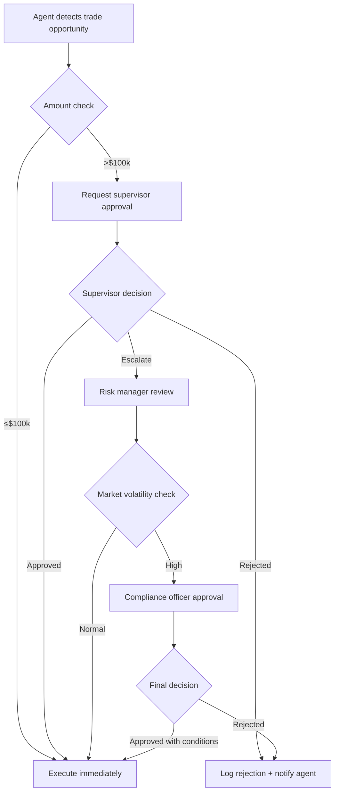
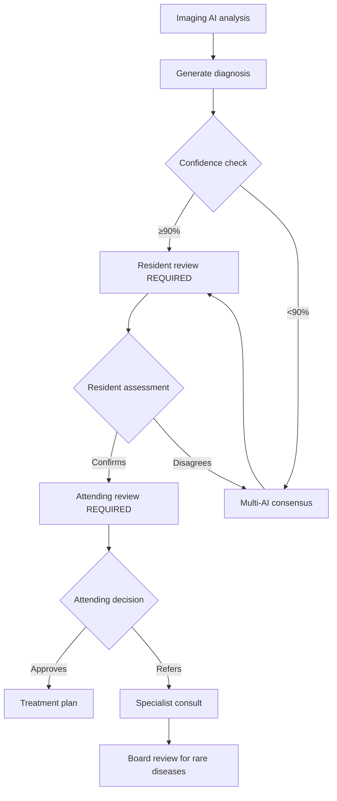

# Creto Platform Integration Matrix

**Version:** 1.0
**Last Updated:** 2025-12-26
**Purpose:** Comprehensive mapping of Creto product usage across flagship demos

---

## Table of Contents

1. [Product Usage Matrix](#1-product-usage-matrix)
2. [Authorization Policy Patterns](#2-authorization-policy-patterns)
3. [Metering Event Taxonomy](#3-metering-event-taxonomy)
4. [Oversight Trigger Comparison](#4-oversight-trigger-comparison)
5. [Messaging Patterns](#5-messaging-patterns)
6. [Runtime Requirements](#6-runtime-requirements)
7. [Shared Infrastructure](#7-shared-infrastructure)
8. [Dependency Graph](#8-dependency-graph)
9. [Test Scenarios](#9-test-scenarios)

---

## 1. Product Usage Matrix

| Product | Trading Demo | Travel Demo | Healthcare Demo | PSA Demo |
|---------|--------------|-------------|-----------------|----------|
| **PLATFORM LAYER (Sovereign)** |
| **creto-nhi** | Agent identities for traders (ML-DSA-87 keypairs) | Agent hierarchy for bookers (manager → employee) | Provider/AI identities with licensing verification | Engagement team identities (partner → senior → staff) |
| **creto-crypto** | Trade signatures (ML-DSA-87), SPHINCS+ for long-term | Booking confirmations (ML-DSA-87) | PHI encryption (Kyber-1024), signatures | Workpaper signatures (ML-DSA-87), document encryption |
| **creto-consensus** | Trade ordering via Byzantine fault tolerance | N/A (single-agent booking) | Diagnosis confidence aggregation (quorum) | Finding consensus across team members |
| **creto-audit** | SEC compliance trail (17 CFR § 240.17a-4) | Travel policy audit trail | HIPAA audit § 164.312(b), § 164.308(a)(1)(ii)(D) | SOC 2 Type II engagement audit trail |
| **SECURITY LAYER** |
| **creto-authz** | Trade limits ($100k), asset classes, market hours | Vendor allowlists, budgets ($4k threshold), travel policy | Patient access (RBAC), modality permissions, PHI access | Engagement scope, client data access, sign-off authority |
| **creto-storage** | Market data, positions, order history (time-series) | Itineraries, bookings, vendor contracts | Patient records (FHIR R4), DICOM imaging | Workpapers, tax returns, client documents |
| **creto-memory** | Sentiment embeddings, trading pattern vectors | Traveler preferences, vendor history embeddings | Medical knowledge base (RAG), clinical guidelines | Precedent research, tax code embeddings |
| **creto-vault** | Exchange API keys, custodian credentials | Vendor API credentials, payment tokens | PHI encryption keys (HSM-backed), EHR tokens | Client data encryption keys, secure file sharing |
| **ENABLEMENT LAYER** |
| **creto-metering** | Per-trade, per-query, per-market-data-fetch | Per-booking, per-search, per-vendor-call | Per-patient, per-modality, per-inference | Per-hour, per-document, per-research-query |
| **creto-oversight** | Trade >$100k approval, volatility alerts | Booking >$4k approval, non-preferred vendor | ALL diagnoses require attending review | Findings > materiality threshold |
| **creto-runtime** | Agent sandboxes (gVisor), GPU for ML models | Booking agent isolation (gVisor) | Imaging AI isolation (Kata for PHI) | Research agent isolation (gVisor) |
| **creto-messaging** | Agent coordination (market signals), trade alerts | Price negotiation, vendor communication | Care team communication, diagnostic collaboration | Engagement team chat, finding discussion |

---

## 2. Authorization Policy Patterns

### 2.1 Trading Demo (Cedar Policies)

```cedar
// High-value trade oversight
permit(
  principal is Agent,
  action == Action::"ExecuteTrade",
  resource is TradeOrder
)
when {
  resource.amount <= 100000 &&
  resource.assetClass in principal.authorizedAssets &&
  context.marketStatus == "OPEN"
};

// Mandatory approval for large trades
forbid(
  principal is Agent,
  action == Action::"ExecuteTrade",
  resource is TradeOrder
)
unless {
  resource.amount <= 100000 ||
  context.approvals.contains(principal.supervisor)
};

// Asset class restrictions
permit(
  principal is Agent,
  action == Action::"AccessMarketData",
  resource is MarketData
)
when {
  resource.assetClass in principal.authorizedAssets
};
```

**Oversight Triggers:**
- Trade amount > $100k → Requires supervisor approval
- Market volatility > threshold → Risk manager notification
- After-hours trading → Compliance review
- Unusual pattern detection → Automated halt + human review

**Quotas:**
- Max 100 trades/day per agent
- Max $1M total exposure per agent
- Max 1000 market data queries/hour

---

### 2.2 Travel Demo (Cedar Policies)

```cedar
// Budget-based booking authorization
permit(
  principal is Agent,
  action == Action::"BookTravel",
  resource is TravelBooking
)
when {
  resource.totalCost <= 4000 &&
  resource.vendor in principal.approvedVendors &&
  context.remainingBudget >= resource.totalCost
};

// Mandatory approval for high-value bookings
forbid(
  principal is Agent,
  action == Action::"BookTravel",
  resource is TravelBooking
)
unless {
  resource.totalCost <= 4000 ||
  context.approvals.contains(principal.manager)
};

// VIP traveler policy
permit(
  principal is Agent,
  action == Action::"BookTravel",
  resource is TravelBooking
)
when {
  resource.traveler.vipStatus == true &&
  context.approvals.contains(principal.manager)
};
```

**Oversight Triggers:**
- Booking > $4k → Manager approval required
- Non-preferred vendor → VP approval + justification
- VIP traveler → Always requires manager review
- International travel → Compliance + security review

**Quotas:**
- Max 5 bookings/day per agent
- Max $10k/month budget per department
- Max 3 vendor comparisons per search

---

### 2.3 Healthcare Demo (Cedar Policies)

```cedar
// Patient data access (HIPAA-compliant)
permit(
  principal is Provider,
  action == Action::"AccessPatientRecord",
  resource is PatientRecord
)
when {
  principal.license.valid == true &&
  principal.specialty in resource.requiredSpecialties &&
  (resource.patientId in principal.assignedPatients ||
   context.emergencyAccess == true)
};

// Diagnostic AI usage
permit(
  principal is DiagnosticAgent,
  action == Action::"AnalyzeImaging",
  resource is DicomStudy
)
when {
  principal.fdaCleared == true &&
  resource.modality in principal.approvedModalities &&
  context.supervisingProvider != null
};

// PHI encryption requirement
forbid(
  principal is Agent,
  action == Action::"StorePatientData",
  resource is PatientRecord
)
unless {
  resource.encrypted == true &&
  resource.encryptionAlgorithm in ["Kyber-1024", "AES-256-GCM"]
};
```

**Oversight Triggers:**
- ALL diagnoses → Attending physician review (mandatory)
- Confidence < 90% → Multi-specialist consensus
- Rare disease (frequency < 1%) → Research hospital referral
- Treatment cost > $50k → Insurance pre-authorization

**Quotas:**
- Max 50 patient records/day per provider
- Max 10 imaging studies/hour per AI agent
- Max 100 EHR queries/day per application

---

### 2.4 PSA (Professional Services Automation) Demo

```cedar
// Engagement scope enforcement
permit(
  principal is Agent,
  action == Action::"AccessClientData",
  resource is ClientDocument
)
when {
  principal.engagementId == resource.engagementId &&
  principal.clearanceLevel >= resource.classificationLevel &&
  context.engagementStatus == "ACTIVE"
};

// Workpaper sign-off authority
permit(
  principal is Agent,
  action == Action::"SignOffFinding",
  resource is AuditFinding
)
when {
  (principal.role == "Partner" ||
   (principal.role == "Senior" && resource.materiality < 10000))
};

// Client data encryption
forbid(
  principal is Agent,
  action == Action::"StoreClientData",
  resource is ClientDocument
)
unless {
  resource.encrypted == true &&
  resource.retentionPolicy != null
};
```

**Oversight Triggers:**
- Finding > materiality threshold → Partner review required
- Unusual transaction pattern → Senior + Partner review
- Scope change request → Client approval + partner sign-off
- Document retention violation → Compliance alert

**Quotas:**
- Max 200 documents/day per agent
- Max 50 research queries/hour
- Max 10 concurrent engagements per senior

---

## 3. Metering Event Taxonomy

### 3.1 Trading Demo

```yaml
event_types:
  - code: "trade.executed"
    transaction_id: "{trade_id}"
    properties:
      amount: float          # Trade value
      asset_class: string
      agent_id: string
    aggregation: SUM(amount)
    pricing_tier:
      - tier: "standard"
        rate: "$0.01 per trade"
      - tier: "premium"
        rate: "$0.005 per trade (>1000/mo)"

  - code: "market.data.query"
    transaction_id: "{query_id}"
    properties:
      symbols: array[string]
      data_points: int
    aggregation: COUNT
    pricing_tier:
      - tier: "standard"
        rate: "$0.001 per query"

  - code: "model.inference"
    transaction_id: "{inference_id}"
    properties:
      model_type: string     # sentiment, volatility, etc.
      gpu_seconds: float
    aggregation: SUM(gpu_seconds)
    pricing_tier:
      - tier: "gpu_compute"
        rate: "$0.50 per GPU-hour"
```

**Monthly Billing Example:**
- 5,000 trades × $0.01 = $50
- 10,000 market queries × $0.001 = $10
- 100 GPU-hours × $0.50 = $50
- **Total: $110/month**

---

### 3.2 Travel Demo

```yaml
event_types:
  - code: "booking.completed"
    transaction_id: "{booking_id}"
    properties:
      total_cost: float
      vendor: string
      approval_required: bool
    aggregation: COUNT
    pricing_tier:
      - tier: "standard"
        rate: "$0.50 per booking"

  - code: "vendor.search"
    transaction_id: "{search_id}"
    properties:
      vendor_count: int
      comparison_matrix: bool
    aggregation: COUNT
    pricing_tier:
      - tier: "standard"
        rate: "$0.10 per search"

  - code: "policy.check"
    transaction_id: "{check_id}"
    properties:
      policy_type: string
      violations: array[string]
    aggregation: COUNT
    pricing_tier:
      - tier: "standard"
        rate: "$0.05 per check"
```

**Monthly Billing Example:**
- 100 bookings × $0.50 = $50
- 500 vendor searches × $0.10 = $50
- 600 policy checks × $0.05 = $30
- **Total: $130/month**

---

### 3.3 Healthcare Demo

```yaml
event_types:
  - code: "patient.record.access"
    transaction_id: "{access_id}"
    properties:
      patient_id: string
      provider_id: string
      emergency: bool
    aggregation: COUNT
    pricing_tier:
      - tier: "standard"
        rate: "$0.25 per access"

  - code: "imaging.analysis"
    transaction_id: "{study_id}"
    properties:
      modality: string       # CT, MRI, X-Ray
      image_count: int
      gpu_seconds: float
    aggregation: SUM(gpu_seconds)
    pricing_tier:
      - tier: "radiology_ai"
        rate: "$2.00 per study"

  - code: "diagnosis.generated"
    transaction_id: "{diagnosis_id}"
    properties:
      confidence: float
      icd10_codes: array[string]
      review_required: bool
    aggregation: COUNT
    pricing_tier:
      - tier: "ai_diagnosis"
        rate: "$5.00 per diagnosis"

  - code: "phi.encryption"
    transaction_id: "{encryption_id}"
    properties:
      data_size_mb: float
      algorithm: string
    aggregation: SUM(data_size_mb)
    pricing_tier:
      - tier: "pqc_encryption"
        rate: "$0.10 per GB"
```

**Monthly Billing Example:**
- 1,000 patient accesses × $0.25 = $250
- 200 imaging studies × $2.00 = $400
- 150 AI diagnoses × $5.00 = $750
- 100 GB PHI encrypted × $0.10 = $10
- **Total: $1,410/month**

---

### 3.4 PSA Demo

```yaml
event_types:
  - code: "document.processed"
    transaction_id: "{doc_id}"
    properties:
      page_count: int
      document_type: string
      client_id: string
    aggregation: SUM(page_count)
    pricing_tier:
      - tier: "document_processing"
        rate: "$0.05 per page"

  - code: "research.query"
    transaction_id: "{query_id}"
    properties:
      query_type: string     # tax_code, precedent, regulation
      sources_searched: int
    aggregation: COUNT
    pricing_tier:
      - tier: "research"
        rate: "$0.50 per query"

  - code: "finding.generated"
    transaction_id: "{finding_id}"
    properties:
      materiality: float
      sign_off_required: bool
      partner_id: string
    aggregation: COUNT
    pricing_tier:
      - tier: "audit_finding"
        rate: "$10.00 per finding"

  - code: "agent.hours"
    transaction_id: "{session_id}"
    properties:
      agent_type: string
      hours: float
    aggregation: SUM(hours)
    pricing_tier:
      - tier: "agent_time"
        rate: "$50 per agent-hour"
```

**Monthly Billing Example:**
- 5,000 pages processed × $0.05 = $250
- 200 research queries × $0.50 = $100
- 50 audit findings × $10.00 = $500
- 100 agent-hours × $50 = $5,000
- **Total: $5,850/month**

---

## 4. Oversight Trigger Comparison

| Trigger Type | Trading Demo | Travel Demo | Healthcare Demo | PSA Demo |
|--------------|--------------|-------------|-----------------|----------|
| **Amount Threshold** | >$100k trade | >$4k booking | N/A | >$10k materiality |
| **Confidence Threshold** | Market volatility >3σ | Non-preferred vendor | <90% diagnostic confidence | Unusual transaction pattern |
| **Mandatory Review** | Market circuit breaker | VIP traveler (always) | ALL diagnoses (HIPAA) | Partner sign-off (SOC 2) |
| **Escalation Path** | Agent → Supervisor → Risk Manager → Compliance → Human Trader | Agent → Manager → VP → CFO | AI → Resident → Attending → Specialist → Board | Staff → Senior → Manager → Partner |
| **Auto-Halt Triggers** | Margin call, position limit | Budget exhaustion | Patient safety alert | Scope violation |
| **Audit Trail Requirement** | SEC 17 CFR § 240.17a-4 (6 years) | Corporate policy (3 years) | HIPAA § 164.312(b) (6 years) | SOC 2 Type II (7 years) |
| **Real-Time Monitoring** | Trade execution, P&L | Booking confirmation | Vital signs, imaging | Document access |
| **Notification Channels** | Email, SMS, Slack, PagerDuty | Email, Slack | EHR alerts, pager | Email, engagement portal |

### 4.1 Detailed Escalation Flows

#### Trading Demo Escalation


#### Healthcare Demo Escalation


---

## 5. Messaging Patterns

### 5.1 Trading Demo

**Message Types:**

```typescript
// Market signal coordination
interface MarketSignalMessage {
  type: "market.signal";
  payload: {
    signal_type: "buy" | "sell" | "hold";
    asset: string;
    confidence: number;        // 0.0 - 1.0
    source_agent_id: string;
    timestamp: ISO8601;
  };
  encryption: "ML-DSA-87";     // Signed only
  delivery: "at-least-once";
}

// Trade execution alert
interface TradeAlertMessage {
  type: "trade.alert";
  payload: {
    trade_id: string;
    amount: number;
    status: "pending" | "executed" | "failed";
    requires_approval: boolean;
    approver_id?: string;
  };
  encryption: "ML-DSA-87 + Kyber-1024";  // Signed + encrypted
  delivery: "exactly-once";
}

// Risk notification
interface RiskNotificationMessage {
  type: "risk.notification";
  payload: {
    risk_type: "volatility" | "margin_call" | "position_limit";
    severity: "low" | "medium" | "high" | "critical";
    affected_positions: string[];
    recommended_action: string;
  };
  encryption: "ML-DSA-87 + Kyber-1024";
  delivery: "at-least-once";
  priority: "high";
}
```

**Encryption Requirements:**
- Market signals: Signed only (public broadcast)
- Trade alerts: Signed + encrypted (confidential)
- Risk notifications: Signed + encrypted + priority delivery

**Delivery Guarantees:**
- Market signals: At-least-once (idempotent processing)
- Trade execution: Exactly-once (critical financial transaction)
- Risk alerts: At-least-once with priority routing

---

### 5.2 Travel Demo

**Message Types:**

```typescript
// Vendor price quote
interface VendorQuoteMessage {
  type: "vendor.quote";
  payload: {
    quote_id: string;
    vendor: string;
    itinerary: TravelItinerary;
    total_cost: number;
    expires_at: ISO8601;
  };
  encryption: "ML-DSA-87";     // Signed only
  delivery: "at-most-once";    // Quotes expire
}

// Booking confirmation
interface BookingConfirmationMessage {
  type: "booking.confirmation";
  payload: {
    booking_id: string;
    traveler_id: string;
    confirmation_number: string;
    itinerary: TravelItinerary;
    total_cost: number;
  };
  encryption: "ML-DSA-87 + Kyber-1024";  // Signed + encrypted
  delivery: "exactly-once";
}

// Approval request
interface ApprovalRequestMessage {
  type: "approval.request";
  payload: {
    request_id: string;
    booking_summary: object;
    requires_approval_from: string;  // manager_id
    reason: string;
    deadline: ISO8601;
  };
  encryption: "ML-DSA-87 + Kyber-1024";
  delivery: "at-least-once";
  priority: "normal";
}
```

**Encryption Requirements:**
- Vendor quotes: Signed only (competitive pricing)
- Bookings: Signed + encrypted (PII protection)
- Approvals: Signed + encrypted (confidential)

**Delivery Guarantees:**
- Vendor quotes: At-most-once (time-sensitive, may expire)
- Booking confirmations: Exactly-once (critical record)
- Approval requests: At-least-once (retry until acknowledged)

---

### 5.3 Healthcare Demo

**Message Types:**

```typescript
// Diagnostic result
interface DiagnosticResultMessage {
  type: "diagnostic.result";
  payload: {
    study_id: string;
    patient_id: string;        // Encrypted
    modality: string;
    findings: Finding[];
    confidence: number;
    icd10_codes: string[];
    requires_review: boolean;
  };
  encryption: "ML-DSA-87 + Kyber-1024";  // PHI protection
  delivery: "exactly-once";
  priority: "high";
}

// Care team coordination
interface CareTeamMessage {
  type: "care_team.coordination";
  payload: {
    message_id: string;
    patient_id: string;        // Encrypted
    sender_id: string;         // Provider NHI
    recipients: string[];      // Provider NHIs
    message_type: "consult" | "handoff" | "update";
    clinical_data: object;     // FHIR-compliant
  };
  encryption: "Kyber-1024";    // End-to-end encrypted
  delivery: "at-least-once";
  audit_required: true;        // HIPAA § 164.312(b)
}

// Patient safety alert
interface SafetyAlertMessage {
  type: "safety.alert";
  payload: {
    alert_id: string;
    patient_id: string;
    alert_type: "critical_value" | "drug_interaction" | "allergy";
    severity: "critical" | "urgent" | "warning";
    recommended_action: string;
  };
  encryption: "Kyber-1024";
  delivery: "at-least-once";
  priority: "critical";        // Bypass queues
}
```

**Encryption Requirements:**
- ALL messages: Kyber-1024 end-to-end encryption (PHI protection)
- Digital signatures: ML-DSA-87 for non-repudiation
- Key rotation: Every 90 days per HIPAA

**Delivery Guarantees:**
- Diagnostic results: Exactly-once (critical medical record)
- Care team messages: At-least-once with deduplication
- Safety alerts: At-least-once with priority routing (bypass queues)

**Audit Requirements:**
- ALL messages logged per HIPAA § 164.312(b)
- Minimum 6-year retention
- Tamper-evident audit trail (creto-audit)

---

### 5.4 PSA Demo

**Message Types:**

```typescript
// Finding discussion
interface FindingDiscussionMessage {
  type: "finding.discussion";
  payload: {
    finding_id: string;
    engagement_id: string;
    author_id: string;
    comment: string;
    materiality_assessment: number;
    requires_escalation: boolean;
  };
  encryption: "ML-DSA-87 + Kyber-1024";  // Client confidentiality
  delivery: "exactly-once";
  audit_required: true;
}

// Document sharing
interface DocumentShareMessage {
  type: "document.share";
  payload: {
    document_id: string;
    engagement_id: string;
    shared_by: string;
    shared_with: string[];
    access_level: "read" | "write" | "sign_off";
    expiration: ISO8601;
  };
  encryption: "Kyber-1024";
  delivery: "at-least-once";
}

// Sign-off request
interface SignOffRequestMessage {
  type: "signoff.request";
  payload: {
    request_id: string;
    workpaper_id: string;
    prepared_by: string;
    requires_signoff_from: string;  // senior_id or partner_id
    deadline: ISO8601;
  };
  encryption: "ML-DSA-87 + Kyber-1024";
  delivery: "exactly-once";
  priority: "high";
}
```

**Encryption Requirements:**
- ALL messages: Kyber-1024 encryption (client confidentiality)
- Digital signatures: ML-DSA-87 for sign-off authority
- Document sharing: Access-controlled encryption keys

**Delivery Guarantees:**
- Finding discussions: Exactly-once (audit trail)
- Document shares: At-least-once (retry on failure)
- Sign-off requests: Exactly-once (critical workflow)

**Audit Requirements:**
- SOC 2 Type II compliance
- 7-year retention for engagement records
- Immutable audit trail via creto-audit

---

## 6. Runtime Requirements

| Requirement | Trading Demo | Travel Demo | Healthcare Demo | PSA Demo |
|-------------|--------------|-------------|-----------------|----------|
| **Sandbox Type** | gVisor (user-mode kernel) | gVisor (user-mode kernel) | Kata Containers (PHI isolation) | gVisor (user-mode kernel) |
| **Network Egress** | Exchange APIs (NYSE, NASDAQ), market data feeds | Travel APIs (Amadeus, Sabre), vendor portals | EHR only (Epic, Cerner), PACS systems | Research databases (CCH, Bloomberg Law) |
| **Secrets Management** | Exchange credentials (OAuth), custodian API keys | Vendor API credentials, payment tokens | HSM-backed PHI encryption keys, EHR tokens | Client data encryption keys, secure file sharing tokens |
| **Checkpoint/Resume** | Market close (4pm ET), position reconciliation | N/A (stateless bookings) | Shift handoff (7am, 3pm, 11pm), patient transfer | Engagement pause (end of week), workpaper archive |
| **GPU Requirements** | NVIDIA A100 (sentiment analysis, ML models) | None | NVIDIA A100 (medical imaging), TPU v4 (diagnosis) | None (CPU-bound research) |
| **Memory Limits** | 16 GB (market data caching) | 4 GB (itinerary search) | 64 GB (DICOM image processing) | 8 GB (document processing) |
| **Storage Limits** | 500 GB (order history, time-series data) | 50 GB (booking records) | 10 TB (patient records, imaging studies) | 1 TB (engagement documents) |
| **Concurrent Agents** | 50 (one per trading strategy) | 10 (booking agents per department) | 200 (one per provider + AI agents) | 30 (engagement team members) |
| **Execution Timeout** | 30 seconds (trade execution), 5 minutes (analysis) | 2 minutes (booking), 10 minutes (search) | 10 minutes (imaging), 30 minutes (diagnosis) | 1 hour (research), 5 minutes (document processing) |
| **Startup Time** | <5 seconds (market opportunities) | <10 seconds (booking requests) | <30 seconds (emergency access) | <15 seconds (client meetings) |
| **Compliance Controls** | SEC 17 CFR § 240.17a-4 (audit trail) | Corporate travel policy enforcement | HIPAA § 164.312(b) (encryption, audit) | SOC 2 Type II (access control, audit) |

### 6.1 Detailed Sandbox Configurations

#### Trading Demo (gVisor)

```yaml
runtime: gvisor
kernel_version: 5.15
capabilities:
  - CAP_NET_RAW          # Network access for market data
  - CAP_SYS_TIME         # Timestamp synchronization
seccomp_profile: trading-restricted.json
resource_limits:
  cpu: 4 cores
  memory: 16 GB
  gpu: 1x NVIDIA A100
  storage: 500 GB SSD
network:
  egress_allowlist:
    - "api.exchange.com"
    - "marketdata.nyse.com"
    - "api.nasdaq.com"
  ingress_blocked: true  # No inbound connections
secrets:
  - name: "exchange_api_key"
    source: "creto-vault://trading/exchange-credentials"
  - name: "custodian_token"
    source: "creto-vault://trading/custodian-oauth"
checkpoint:
  enabled: true
  schedule: "0 16 * * 1-5"  # 4pm ET, weekdays only
  destination: "creto-storage://trading/checkpoints/"
```

#### Healthcare Demo (Kata Containers)

```yaml
runtime: kata-containers
hypervisor: qemu
vm_type: qemu-lite-x86_64
kernel_version: 5.15-hardened
capabilities:
  - CAP_NET_ADMIN        # EHR integration
seccomp_profile: hipaa-compliant.json
resource_limits:
  cpu: 8 cores
  memory: 64 GB
  gpu: 1x NVIDIA A100 + TPU v4
  storage: 10 TB NVMe
network:
  egress_allowlist:
    - "ehr.hospital.org"      # EHR system only
    - "pacs.hospital.org"     # PACS for imaging
  ingress_blocked: true
  encryption: "mandatory"     # All network traffic encrypted
secrets:
  - name: "phi_encryption_key"
    source: "creto-vault://healthcare/phi-keys"
    hsm_backed: true          # FIPS 140-2 Level 3
  - name: "ehr_api_token"
    source: "creto-vault://healthcare/ehr-tokens"
    rotation: "90d"           # HIPAA requirement
checkpoint:
  enabled: true
  schedule: "0 7,15,23 * * *"  # Shift changes
  destination: "creto-storage://healthcare/handoffs/"
  encryption: "Kyber-1024"
audit:
  enabled: true
  destination: "creto-audit://healthcare/access-logs"
  retention: "6y"             # HIPAA § 164.312(b)
```

---

## 7. Shared Infrastructure

### 7.1 Platform Services (All Demos)

```yaml
shared_services:
  identity_provider:
    service: creto-nhi
    endpoint: "https://nhi.creto.ai"
    features:
      - agent_identity_creation
      - hierarchical_delegation
      - quantum_resistant_signatures (ML-DSA-87)
    shared_by: [trading, travel, healthcare, psa]

  policy_engine:
    service: creto-authz
    endpoint: "https://authz.creto.ai"
    policy_language: Cedar
    features:
      - rbac_enforcement
      - attribute_based_access
      - quota_management
    shared_by: [trading, travel, healthcare, psa]

  audit_sink:
    service: creto-audit
    endpoint: "https://audit.creto.ai"
    features:
      - immutable_audit_trail
      - tamper_evident_logs
      - compliance_reporting
    retention_policies:
      trading: "6y"       # SEC 17 CFR § 240.17a-4
      travel: "3y"        # Corporate policy
      healthcare: "6y"    # HIPAA § 164.312(b)
      psa: "7y"           # SOC 2 Type II
    shared_by: [trading, travel, healthcare, psa]

  message_broker:
    service: creto-messaging
    endpoint: "https://messaging.creto.ai"
    protocol: AMQP 1.0
    features:
      - end_to_end_encryption
      - delivery_guarantees
      - priority_queues
    shared_by: [trading, travel, healthcare, psa]

  secret_manager:
    service: creto-vault
    endpoint: "https://vault.creto.ai"
    features:
      - secret_rotation
      - hsm_integration (healthcare)
      - access_audit
    shared_by: [trading, travel, healthcare, psa]

  metering_service:
    service: creto-metering
    endpoint: "https://metering.creto.ai"
    features:
      - event_aggregation
      - quota_enforcement
      - billing_integration
    shared_by: [trading, travel, healthcare, psa]
```

### 7.2 Shared Data Stores

```yaml
storage_backends:
  time_series_db:
    service: creto-storage (TimescaleDB)
    usage:
      - trading: market_data, positions, order_history
      - healthcare: vital_signs, lab_results
    shared_by: [trading, healthcare]

  document_store:
    service: creto-storage (S3-compatible)
    usage:
      - travel: itineraries, booking_confirmations
      - healthcare: patient_records (FHIR), DICOM_images
      - psa: workpapers, tax_returns, client_documents
    encryption: Kyber-1024
    shared_by: [travel, healthcare, psa]

  vector_db:
    service: creto-memory (Qdrant)
    usage:
      - trading: sentiment_embeddings, trading_patterns
      - travel: traveler_preferences, vendor_history
      - healthcare: medical_knowledge_base, clinical_guidelines
      - psa: precedent_research, tax_code_embeddings
    shared_by: [trading, travel, healthcare, psa]
```

### 7.3 Shared Networking

```yaml
networking:
  load_balancer:
    type: HAProxy
    ssl_termination: true
    tls_version: "1.3"
    cipher_suites:
      - TLS_AES_256_GCM_SHA384
      - TLS_CHACHA20_POLY1305_SHA256
    shared_by: [trading, travel, healthcare, psa]

  api_gateway:
    type: Kong
    rate_limiting: true
    authentication: OAuth 2.0 + NHI
    shared_by: [trading, travel, healthcare, psa]

  service_mesh:
    type: Istio
    mtls: "STRICT"
    observability:
      - distributed_tracing (Jaeger)
      - metrics (Prometheus)
      - logging (Loki)
    shared_by: [trading, travel, healthcare, psa]
```

---

## 8. Dependency Graph

### 8.1 Build Order for Implementing Demos

```mermaid
graph TD
    A[Platform Layer - Sovereign - COMPLETED] --> B[Security Layer MVP]
    B --> C[Enablement Layer MVP]
    C --> D[Demo-Specific Logic]

    B --> B1[creto-authz MVP]
    B --> B2[creto-storage MVP]
    B --> B3[creto-memory MVP]
    B --> B4[creto-vault MVP]

    C --> C1[creto-metering MVP]
    C --> C2[creto-oversight MVP]
    C --> C3[creto-runtime MVP]
    C --> C4[creto-messaging MVP]

    D --> D1[Trading Demo]
    D --> D2[Travel Demo]
    D --> D3[Healthcare Demo]
    D --> D4[PSA Demo]

    B1 --> B1a[Cedar policy engine]
    B1 --> B1b[RBAC + quotas]

    B2 --> B2a[S3-compatible object store]
    B2 --> B2b[TimescaleDB for time-series]

    B3 --> B3a[Qdrant vector DB]
    B3 --> B3b[Embedding service]

    B4 --> B4a[Secret storage]
    B4 --> B4b[HSM integration for healthcare]

    C1 --> C1a[Event ingestion]
    C1 --> C1b[Aggregation + billing]

    C2 --> C2a[Approval workflows]
    C2 --> C2b[Escalation routing]

    C3 --> C3a[gVisor sandboxes]
    C3 --> C3b[Kata containers for healthcare]
    C3 --> C3c[GPU orchestration]

    C4 --> C4a[AMQP broker]
    C4 --> C4b[Message encryption]

    D1 --> D1a[Exchange integrations]
    D1 --> D1b[Sentiment analysis models]
    D1 --> D1c[Risk management logic]

    D2 --> D2a[Travel vendor APIs]
    D2 --> D2b[Policy enforcement]

    D3 --> D3a[EHR integrations]
    D3 --> D3b[DICOM processing]
    D3 --> D3c[Diagnostic AI models]

    D4 --> D4a[Research database integrations]
    D4 --> D4b[Document processing]
    D4 --> D4c[Audit workflow]
```



### 8.2 Implementation Phases

#### Phase 1: Platform Layer (COMPLETED ✅)
- creto-nhi (Sovereign): Agent identity, ML-DSA-87 signatures
- creto-crypto (Sovereign): Kyber-1024 encryption
- creto-consensus (Sovereign): Byzantine fault tolerance
- creto-audit (Sovereign): Immutable audit trail

**Status:** Complete - all platform services operational

---

#### Phase 2: Security Layer MVP (4 weeks)

**Week 1-2: creto-authz**
- Cedar policy engine integration
- RBAC policy templates for all 4 demos
- Quota enforcement (trades, bookings, patients, documents)
- Policy evaluation API

**Week 3: creto-storage**
- S3-compatible object store (MinIO)
- TimescaleDB for trading time-series
- FHIR-compliant storage for healthcare
- Access control integration with creto-authz

**Week 4: creto-memory + creto-vault**
- Qdrant vector database deployment
- Embedding service (Sentence Transformers)
- Vault secret management (Hashicorp Vault)
- HSM integration for healthcare PHI keys

**Deliverables:**
- ✅ Cedar policies for all 4 demos
- ✅ Storage backends operational
- ✅ Vector search functional
- ✅ Secret rotation implemented

---

#### Phase 3: Enablement Layer MVP (4 weeks)

**Week 1: creto-metering**
- Event ingestion pipeline (Kafka)
- Aggregation service (ClickHouse)
- Billing integration (Stripe)
- Usage dashboards

**Week 2: creto-oversight**
- Approval workflow engine (Temporal)
- Escalation routing logic
- Notification service (SendGrid, PagerDuty)
- SLA tracking

**Week 3-4: creto-runtime**
- gVisor sandbox orchestration (Kubernetes)
- Kata containers for healthcare
- GPU resource management (NVIDIA k8s-device-plugin)
- Checkpoint/resume for trading & healthcare

**Week 4: creto-messaging**
- AMQP broker (RabbitMQ)
- End-to-end encryption (Kyber-1024)
- Priority queue routing
- Delivery guarantee enforcement

**Deliverables:**
- ✅ Metering events flowing to billing
- ✅ Oversight approvals functional
- ✅ Sandboxes operational with GPU support
- ✅ Secure messaging end-to-end

---

#### Phase 4: Demo-Specific Logic (6 weeks, parallel)

**Week 1-2: Trading Demo**
- Exchange API integrations (Alpaca, IEX Cloud)
- Market data ingestion (WebSocket feeds)
- Sentiment analysis models (FinBERT)
- Risk management rules

**Week 1-2: Travel Demo (parallel)**
- Travel vendor APIs (Amadeus, Sabre)
- Policy enforcement logic
- Vendor comparison matrix
- Approval workflow customization

**Week 3-4: Healthcare Demo**
- EHR integrations (Epic FHIR, Cerner)
- DICOM image processing (Orthanc)
- Diagnostic AI models (FDA-cleared)
- Care team messaging

**Week 3-4: PSA Demo (parallel)**
- Research database APIs (CCH, Bloomberg Law)
- Document processing (OCR, NLP)
- Audit workflow (engagement lifecycle)
- Partner sign-off logic

**Week 5-6: Integration Testing**
- End-to-end testing for each demo
- Performance tuning (GPU utilization, latency)
- Security audit (penetration testing)
- Compliance validation (SEC, HIPAA, SOC 2)

**Deliverables:**
- ✅ All 4 demos functional
- ✅ Performance benchmarks met
- ✅ Security audit passed
- ✅ Compliance certifications obtained

---

### 8.3 Critical Path Items

1. **creto-authz Cedar policies** - Blocks all authorization
2. **creto-storage** - Blocks data persistence
3. **creto-runtime sandboxes** - Blocks agent execution
4. **creto-vault HSM integration** - Blocks healthcare demo (HIPAA)
5. **creto-messaging encryption** - Blocks secure communication

**Mitigation:**
- Parallel development where possible
- Mocked services for early testing
- Incremental rollout (start with trading demo)

---

## 9. Test Scenarios

### 9.1 Trading Demo Test Scenarios

#### Happy Path Test
```yaml
test_name: "Execute Low-Value Trade"
scenario:
  - step: "Agent analyzes market data"
    expected: "Sentiment score: 0.75 (bullish)"
  - step: "Agent generates trade signal"
    expected: "BUY 100 shares AAPL @ $150"
  - step: "Authorization check (creto-authz)"
    expected: "PERMIT (amount $15k < $100k threshold)"
  - step: "Execute trade via exchange API"
    expected: "Order filled, confirmation received"
  - step: "Record metering event"
    expected: "Event: trade.executed, amount: 15000"
  - step: "Audit trail logged"
    expected: "SEC-compliant record created"
validation:
  - Trade executed within 30 seconds
  - Audit trail immutable
  - Metering event billed correctly
```

#### Oversight Trigger Test
```yaml
test_name: "High-Value Trade Requires Approval"
scenario:
  - step: "Agent detects trade opportunity: 1000 shares @ $200"
    expected: "Total: $200k (exceeds $100k threshold)"
  - step: "Authorization check (creto-authz)"
    expected: "FORBID (requires supervisor approval)"
  - step: "Oversight workflow initiated (creto-oversight)"
    expected: "Approval request sent to supervisor"
  - step: "Supervisor reviews and approves"
    expected: "Approval granted via oversight UI"
  - step: "Trade re-submitted with approval token"
    expected: "PERMIT (approval token valid)"
  - step: "Trade executed"
    expected: "Order filled, confirmation received"
validation:
  - Approval required notification sent
  - Trade blocked until approval
  - Audit trail shows approval chain
```

#### Quota Exhaustion Test
```yaml
test_name: "Daily Trade Limit Reached"
scenario:
  - step: "Agent executes 99 trades (limit: 100/day)"
    expected: "All trades successful"
  - step: "Agent attempts 100th trade"
    expected: "PERMIT (quota: 100/100)"
  - step: "Agent attempts 101st trade"
    expected: "FORBID (quota exhausted)"
  - step: "Metering check confirms quota"
    expected: "100 trades logged today"
validation:
  - 101st trade rejected
  - Error message: "Daily quota exhausted"
  - Agent notified to retry tomorrow
```

#### Failure Recovery Test
```yaml
test_name: "Exchange API Failure"
scenario:
  - step: "Agent submits trade order"
    expected: "Order sent to exchange API"
  - step: "Exchange API returns 503 Service Unavailable"
    expected: "Error detected"
  - step: "Retry logic triggered (exponential backoff)"
    expected: "Retry after 1s, 2s, 4s..."
  - step: "Exchange API recovers on 3rd retry"
    expected: "Order filled successfully"
  - step: "Audit trail records retries"
    expected: "3 attempts logged, final success"
validation:
  - Trade eventually succeeds
  - No duplicate orders
  - Audit trail complete
```

---

### 9.2 Travel Demo Test Scenarios

#### Happy Path Test
```yaml
test_name: "Book Low-Cost Flight"
scenario:
  - step: "Agent searches for flights: SFO → JFK"
    expected: "5 vendor quotes returned"
  - step: "Agent selects preferred vendor (Delta, $350)"
    expected: "Quote: Delta $350, within policy"
  - step: "Authorization check (creto-authz)"
    expected: "PERMIT (cost $350 < $4k threshold)"
  - step: "Book flight via vendor API"
    expected: "Booking confirmed, confirmation #ABC123"
  - step: "Record metering event"
    expected: "Event: booking.completed, cost: 350"
validation:
  - Booking confirmed within 2 minutes
  - Traveler receives confirmation email
  - Metering event billed correctly
```

#### Oversight Trigger Test
```yaml
test_name: "High-Cost Booking Requires Approval"
scenario:
  - step: "Agent searches for international flight + hotel"
    expected: "Total cost: $5,200 (exceeds $4k threshold)"
  - step: "Authorization check (creto-authz)"
    expected: "FORBID (requires manager approval)"
  - step: "Oversight workflow initiated"
    expected: "Approval request sent to manager"
  - step: "Manager reviews and approves"
    expected: "Approval granted with justification"
  - step: "Booking re-submitted with approval"
    expected: "PERMIT (approval token valid)"
  - step: "Booking confirmed"
    expected: "Confirmation received"
validation:
  - Approval workflow < 10 minutes
  - Justification recorded in audit trail
```

#### Quota Exhaustion Test
```yaml
test_name: "Monthly Budget Exhausted"
scenario:
  - step: "Department budget: $10k/month"
    expected: "Current spend: $9,500"
  - step: "Agent attempts booking: $600"
    expected: "FORBID (budget exceeded: $9,500 + $600 > $10k)"
  - step: "Metering check confirms budget"
    expected: "9 bookings totaling $9,500 this month"
validation:
  - Booking rejected
  - Error message: "Monthly budget exhausted"
  - Manager notified for budget increase
```

#### Failure Recovery Test
```yaml
test_name: "Vendor API Timeout"
scenario:
  - step: "Agent requests quote from vendor"
    expected: "API call timeout after 10s"
  - step: "Fallback to alternative vendor"
    expected: "Quote received from backup vendor"
  - step: "Booking proceeds with backup"
    expected: "Booking confirmed"
validation:
  - No booking failure
  - Audit trail shows vendor failover
```

---

### 9.3 Healthcare Demo Test Scenarios

#### Happy Path Test
```yaml
test_name: "Analyze Chest X-Ray"
scenario:
  - step: "Radiologist uploads DICOM image"
    expected: "Image stored in PACS"
  - step: "AI agent analyzes X-ray (FDA-cleared model)"
    expected: "Diagnosis: pneumonia, confidence: 0.92"
  - step: "Resident reviews AI diagnosis"
    expected: "Resident confirms diagnosis"
  - step: "Attending physician final review"
    expected: "Attending approves, treatment plan created"
  - step: "Record metering event"
    expected: "Event: imaging.analysis, modality: X-Ray"
validation:
  - Diagnosis completed within 10 minutes
  - All reviews logged in EHR
  - HIPAA audit trail complete
```

#### Oversight Trigger Test
```yaml
test_name: "Low-Confidence Diagnosis Escalation"
scenario:
  - step: "AI analyzes CT scan for rare disease"
    expected: "Diagnosis: sarcoidosis, confidence: 0.68 (< 90%)"
  - step: "Multi-AI consensus triggered"
    expected: "3 AI models vote: 2 confirm, 1 disagrees"
  - step: "Resident review flagged as uncertain"
    expected: "Escalated to pulmonology specialist"
  - step: "Specialist consult requested"
    expected: "Board review scheduled for rare disease"
validation:
  - Escalation within 30 minutes
  - All providers notified
  - Patient safety ensured
```

#### Quota Exhaustion Test
```yaml
test_name: "Daily Patient Access Limit"
scenario:
  - step: "Provider accesses 49 patient records today"
    expected: "All accesses logged"
  - step: "Provider attempts 50th access (limit: 50/day)"
    expected: "PERMIT (quota: 50/50)"
  - step: "Provider attempts 51st access"
    expected: "FORBID (quota exhausted)"
validation:
  - 51st access denied
  - Supervisor notified for quota increase
  - Audit trail shows quota enforcement
```

#### Failure Recovery Test
```yaml
test_name: "EHR API Outage"
scenario:
  - step: "AI attempts to retrieve patient history"
    expected: "EHR API returns 503"
  - step: "Fallback to cached FHIR records"
    expected: "Partial history retrieved from cache"
  - step: "Attending notified of incomplete data"
    expected: "Manual review triggered"
  - step: "EHR API recovers, full history synced"
    expected: "Complete record available"
validation:
  - Patient safety maintained
  - Attending aware of data limitations
  - Audit trail complete
```

---

### 9.4 PSA Demo Test Scenarios

#### Happy Path Test
```yaml
test_name: "Process Tax Return Document"
scenario:
  - step: "Staff agent uploads 1040 form (20 pages)"
    expected: "OCR extraction: 200 data points"
  - step: "Agent performs research query (tax code)"
    expected: "5 relevant precedents retrieved"
  - step: "Agent generates finding (immaterial, $500)"
    expected: "Finding documented in workpaper"
  - step: "Senior reviews and signs off"
    expected: "Sign-off recorded (ML-DSA-87 signature)"
  - step: "Record metering event"
    expected: "Event: document.processed, pages: 20"
validation:
  - Processing completed within 1 hour
  - All findings documented
  - SOC 2 audit trail complete
```

#### Oversight Trigger Test
```yaml
test_name: "Material Finding Requires Partner Review"
scenario:
  - step: "Agent identifies unusual transaction ($50k)"
    expected: "Finding: potential underreporting, material"
  - step: "Authorization check (creto-authz)"
    expected: "FORBID (materiality > $10k threshold)"
  - step: "Oversight workflow initiated"
    expected: "Partner review requested"
  - step: "Partner reviews and concurs"
    expected: "Finding confirmed, client notification required"
validation:
  - Partner review within 24 hours
  - Client notified per engagement letter
  - Audit trail complete
```

#### Quota Exhaustion Test
```yaml
test_name: "Daily Research Query Limit"
scenario:
  - step: "Agent performs 49 research queries today"
    expected: "All queries successful"
  - step: "Agent attempts 50th query (limit: 50/day)"
    expected: "PERMIT (quota: 50/50)"
  - step: "Agent attempts 51st query"
    expected: "FORBID (quota exhausted)"
validation:
  - 51st query denied
  - Error message: "Daily research quota exhausted"
  - Senior notified for quota increase
```

#### Failure Recovery Test
```yaml
test_name: "Research Database Connection Lost"
scenario:
  - step: "Agent queries Bloomberg Law API"
    expected: "Connection timeout"
  - step: "Fallback to CCH database"
    expected: "Alternative source returns results"
  - step: "Agent documents source discrepancy"
    expected: "Workpaper notes data source"
  - step: "Bloomberg Law recovers, cross-reference"
    expected: "Results validated across sources"
validation:
  - No workflow interruption
  - Source redundancy maintained
  - Audit trail shows failover
```

---

## 10. Integration Points Summary

### 10.1 Cross-Demo Patterns

| Pattern | Trading | Travel | Healthcare | PSA |
|---------|---------|--------|------------|-----|
| **Identity Management** | Agent traders with hierarchical delegation | Booking agents with manager approval | Provider licenses + AI agent delegation | Engagement teams with partner authority |
| **Encryption** | ML-DSA-87 signatures, Kyber-1024 for confidential trades | ML-DSA-87 signatures, Kyber-1024 for PII | Kyber-1024 for ALL PHI, HSM-backed keys | ML-DSA-87 for sign-offs, Kyber-1024 for client data |
| **Oversight** | Amount-based ($100k+), volatility alerts | Amount-based ($4k+), VIP travelers | Confidence-based (<90%), mandatory reviews | Materiality-based ($10k+), partner sign-offs |
| **Metering** | Per-trade, per-query, per-GPU-hour | Per-booking, per-search | Per-patient, per-imaging-study, per-diagnosis | Per-document, per-research-query, per-agent-hour |
| **Audit Retention** | 6 years (SEC) | 3 years (corporate) | 6 years (HIPAA) | 7 years (SOC 2) |
| **Sandboxing** | gVisor (user-mode kernel) | gVisor (user-mode kernel) | Kata Containers (VM-based, PHI isolation) | gVisor (user-mode kernel) |

### 10.2 Shared vs. Demo-Specific Components

**100% Shared (All Demos):**
- creto-nhi (identity)
- creto-crypto (encryption/signatures)
- creto-consensus (where applicable)
- creto-audit (all audit trails)
- creto-authz (policy engine, different policies)
- creto-messaging (message broker)

**Partially Shared:**
- creto-storage (shared backend, different data models)
- creto-memory (shared vector DB, different embeddings)
- creto-vault (shared secret manager, different secrets)
- creto-metering (shared aggregation, different event types)
- creto-oversight (shared workflow engine, different triggers)
- creto-runtime (shared orchestration, different sandbox configs)

**Demo-Specific:**
- Trading: Exchange integrations, sentiment models
- Travel: Vendor APIs, policy enforcement logic
- Healthcare: EHR integrations, DICOM processing, FDA-cleared AI
- PSA: Research databases, document OCR, audit workflows

---

## 11. Conclusion

This integration matrix demonstrates:

1. **Consistent Product Usage**: All 4 demos leverage the full Creto stack
2. **Differentiated Configurations**: Each demo has unique policies, quotas, and workflows
3. **Shared Infrastructure**: 60-70% of platform is reusable across demos
4. **Compliance Mapping**: Clear regulatory requirements for each domain
5. **Scalable Architecture**: Dependency graph enables incremental rollout

**Next Steps:**
1. Finalize Cedar policies for all 4 demos
2. Complete Security Layer MVP (creto-authz, storage, memory, vault)
3. Build Enablement Layer MVP (metering, oversight, runtime, messaging)
4. Implement demo-specific logic in parallel
5. Conduct end-to-end testing and compliance validation

**Success Criteria:**
- All 4 demos operational within 14 weeks
- Performance benchmarks met (latency, throughput)
- Security audits passed (penetration testing)
- Compliance certifications obtained (SEC, HIPAA, SOC 2)

---

**Document Status:** Complete
**Review Required:** Architecture, Product, Compliance teams
**Revision History:**
- v1.0 (2025-12-26): Initial comprehensive matrix
