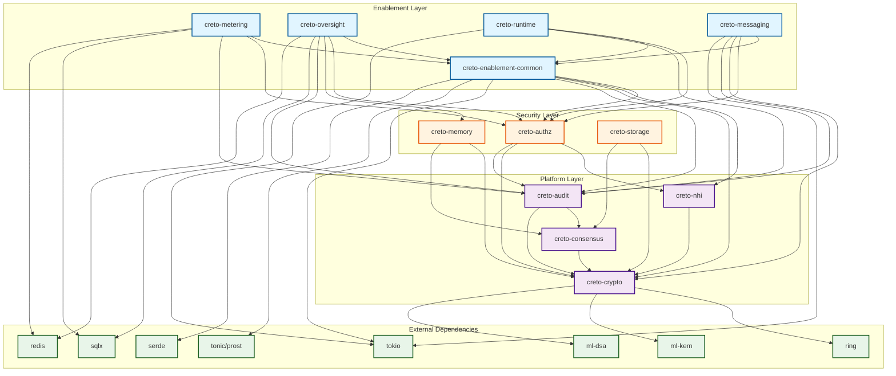

# Dependency Graph Analysis

## Purpose

This document validates the dependency structure for the Creto Enablement Layer, ensuring:
- No circular dependencies exist
- Correct build order is defined
- Version constraints are documented
- Optional vs required dependencies are clearly marked

---

## 1. Complete Crate Dependency Graph



---

## 2. Circular Dependency Analysis

### 2.1 Validation Results

**Status: ✅ NO CIRCULAR DEPENDENCIES DETECTED**

### 2.2 Dependency Layers (Acyclic)

```
Layer 4 (Top): Enablement Products
├── creto-metering
├── creto-oversight
├── creto-runtime
└── creto-messaging
    ↓ (depends on)
Layer 3: Enablement Common
└── creto-enablement-common
    ↓ (depends on)
Layer 2: Security Layer
├── creto-authz
├── creto-memory
└── creto-storage
    ↓ (depends on)
Layer 1: Platform Layer
├── creto-nhi
├── creto-crypto
├── creto-consensus
└── creto-audit
    ↓ (depends on)
Layer 0: External Dependencies
├── tokio, tonic, prost
├── sqlx, redis
├── ring, ml-kem, ml-dsa
└── serde, tracing
```

### 2.3 Inter-Layer Dependency Rules

**Enforced Rules:**
1. ✅ Products (Layer 4) → Only depend on `common` (Layer 3) + Security (Layer 2)
2. ✅ Common (Layer 3) → Only depends on Security (Layer 2) + Platform (Layer 1)
3. ✅ Security (Layer 2) → Only depends on Platform (Layer 1)
4. ✅ Platform (Layer 1) → Only depends on External (Layer 0)
5. ✅ No same-layer dependencies (loose coupling via traits)

### 2.4 Potential Risks (None Critical)

| Risk | Severity | Mitigation |
|------|----------|------------|
| Platform layer upgrade breaks Security | Medium | Semver compatibility, integration tests |
| Security layer upgrade breaks Enablement | Medium | API stability guarantees, deprecation cycle |
| External dependency vulnerability | High | Cargo-audit in CI, security scanning |

---

## 3. Build Order

### 3.1 Sequential Build Order

```bash
# Layer 0: External dependencies (fetched by Cargo)
# No build step required

# Layer 1: Platform Layer (External repos)
# Assumed to be published to crates.io or private registry
1. creto-crypto
2. creto-nhi (depends on creto-crypto)
3. creto-consensus (depends on creto-crypto)
4. creto-audit (depends on creto-crypto, creto-consensus)

# Layer 2: Security Layer (External repos)
5. creto-authz (depends on creto-nhi, creto-crypto, creto-audit)
6. creto-memory (depends on creto-crypto, creto-consensus)
7. creto-storage (depends on creto-crypto, creto-consensus)

# Layer 3: Enablement Common (This repo)
8. creto-enablement-common (depends on Platform + Security layers)

# Layer 4: Enablement Products (This repo, parallel build)
9a. creto-metering (depends on common, authz, audit, sqlx, redis)
9b. creto-oversight (depends on common, authz, memory, audit, sqlx, redis)
9c. creto-runtime (depends on common, authz, audit)
9d. creto-messaging (depends on common, authz, crypto, audit)
```

### 3.2 Cargo Workspace Build

```toml
# Cargo.toml (workspace root)
[workspace]
members = [
    "crates/creto-enablement-common",  # Build first
    "crates/creto-metering",
    "crates/creto-oversight",
    "crates/creto-runtime",
    "crates/creto-messaging",
]

# Cargo automatically resolves dependencies in correct order
# Products (Layer 4) can build in parallel after common (Layer 3)
```

### 3.3 CI Build Strategy

```yaml
# .github/workflows/build.yml
jobs:
  build:
    steps:
      - name: Build common crate
        run: cargo build -p creto-enablement-common

      - name: Build products in parallel
        run: |
          cargo build -p creto-metering &
          cargo build -p creto-oversight &
          cargo build -p creto-runtime &
          cargo build -p creto-messaging &
          wait
```

---

## 4. Version Constraints

### 4.1 External Dependencies

```toml
# Minimum versions for production use

[dependencies]
# Async runtime
tokio = { version = "1.35.0", features = ["rt-multi-thread", "macros", "time"] }

# gRPC (minimum for security fixes)
tonic = "0.11.0"
prost = "0.12.0"

# Database
sqlx = { version = "0.7.3", features = ["runtime-tokio", "postgres", "json"] }
redis = { version = "0.24.0", features = ["tokio-comp", "connection-manager"] }

# Cryptography (minimum for PQC support)
ring = "0.17.7"         # Classical crypto (Ed25519, AES-GCM)
ml-kem = "0.2.0"        # Post-quantum KEM (NIST FIPS 203)
ml-dsa = "0.1.0"        # Post-quantum signatures (NIST FIPS 204)

# Serialization
serde = { version = "1.0.195", features = ["derive"] }
serde_json = "1.0.111"

# Tracing
tracing = "0.1.40"
tracing-subscriber = { version = "0.3.18", features = ["env-filter"] }

# Error handling
anyhow = "1.0.79"
thiserror = "1.0.56"

# Time handling
chrono = { version = "0.4.31", features = ["serde"] }
```

### 4.2 Internal Dependencies (Platform Layer)

```toml
# Assumed versions (to be confirmed with Platform/Security teams)
creto-nhi = "0.1.0"
creto-crypto = "0.1.0"
creto-consensus = "0.1.0"
creto-audit = "0.1.0"
```

### 4.3 Internal Dependencies (Security Layer)

```toml
# Assumed versions
creto-authz = "0.1.0"
creto-memory = "0.1.0"
creto-storage = "0.1.0"
```

### 4.4 Enablement Common

```toml
# creto-enablement-common/Cargo.toml
[package]
name = "creto-enablement-common"
version = "0.1.0"
edition = "2021"

[dependencies]
# Re-exported Platform primitives
creto-nhi = "0.1.0"
creto-crypto = "0.1.0"
creto-audit = "0.1.0"

# Async + gRPC
tokio = { version = "1.35.0", features = ["rt-multi-thread"] }
tonic = "0.11.0"
prost = "0.12.0"

# Serialization
serde = { version = "1.0.195", features = ["derive"] }

# Error handling
thiserror = "1.0.56"
```

### 4.5 Product Dependencies

```toml
# creto-metering/Cargo.toml
[dependencies]
creto-enablement-common = { path = "../creto-enablement-common" }
creto-authz = "0.1.0"
creto-audit = "0.1.0"
sqlx = { version = "0.7.3", features = ["runtime-tokio", "postgres"] }
redis = { version = "0.24.0", features = ["tokio-comp"] }
tokio = { version = "1.35.0", features = ["full"] }
```

```toml
# creto-oversight/Cargo.toml
[dependencies]
creto-enablement-common = { path = "../creto-enablement-common" }
creto-authz = "0.1.0"
creto-memory = "0.1.0"
creto-audit = "0.1.0"
sqlx = { version = "0.7.3", features = ["runtime-tokio", "postgres"] }
redis = { version = "0.24.0", features = ["tokio-comp"] }

[dependencies.reqwest]
version = "0.11.23"
features = ["json"]
optional = true  # For webhook channel

[features]
default = ["slack", "email"]
slack = ["reqwest"]
email = []
webhook = ["reqwest"]
teams = ["reqwest"]
```

```toml
# creto-runtime/Cargo.toml
[dependencies]
creto-enablement-common = { path = "../creto-enablement-common" }
creto-authz = "0.1.0"
creto-audit = "0.1.0"
tokio = { version = "1.35.0", features = ["process", "io-util"] }

[features]
default = ["gvisor"]
gvisor = []
kata = []
sgx = []
```

```toml
# creto-messaging/Cargo.toml
[dependencies]
creto-enablement-common = { path = "../creto-enablement-common" }
creto-authz = "0.1.0"
creto-crypto = "0.1.0"
creto-audit = "0.1.0"
ring = "0.17.7"
ml-kem = "0.2.0"
ml-dsa = "0.1.0"
tokio = { version = "1.35.0", features = ["sync"] }
```

---

## 5. Optional vs Required Dependencies

### 5.1 creto-enablement-common

**All Required** (no optional dependencies)
- `creto-nhi` - NHI identity primitives (required)
- `creto-crypto` - Crypto-agility (required)
- `creto-audit` - Audit logging (required)
- `tokio` - Async runtime (required)
- `tonic` - gRPC (required)
- `serde` - Serialization (required)

### 5.2 creto-metering

| Dependency | Type | Purpose | Feature Flag |
|------------|------|---------|--------------|
| `creto-authz` | Required | Quota enforcement | - |
| `creto-audit` | Required | Billing events | - |
| `sqlx` | Required | Event storage | - |
| `redis` | Required | Quota cache | - |
| `stripe` | Optional | Payment processing | `stripe` |

### 5.3 creto-oversight

| Dependency | Type | Purpose | Feature Flag |
|------------|------|---------|--------------|
| `creto-authz` | Required | Approval policies | - |
| `creto-memory` | Required | State persistence | - |
| `creto-audit` | Required | Approval audit | - |
| `sqlx` | Required | Request storage | - |
| `redis` | Required | Notification queue | - |
| `reqwest` | Optional | Slack webhooks | `slack` |
| `reqwest` | Optional | HTTP webhooks | `webhook` |
| `reqwest` | Optional | Teams integration | `teams` |
| `lettre` | Optional | Email SMTP | `email` (default) |

**Feature Flags:**
```toml
[features]
default = ["slack", "email"]
slack = ["reqwest"]
email = ["lettre"]
webhook = ["reqwest"]
teams = ["reqwest"]
servicenow = ["reqwest"]
```

### 5.4 creto-runtime

| Dependency | Type | Purpose | Feature Flag |
|------------|------|---------|--------------|
| `creto-authz` | Required | Egress control | - |
| `creto-audit` | Required | Execution logging | - |
| `tokio` | Required | Process management | - |
| `gvisor-bindings` | Optional | gVisor backend | `gvisor` (default) |
| `kata-bindings` | Optional | Kata Containers | `kata` |
| `sgx-bindings` | Optional | Intel SGX | `sgx` |

**Feature Flags:**
```toml
[features]
default = ["gvisor"]
gvisor = []
kata = []
sgx = []
```

### 5.5 creto-messaging

**All Required** (no optional dependencies)
- `creto-authz` - Message delivery authorization
- `creto-crypto` - Hybrid encryption (ML-KEM + AES-GCM)
- `creto-audit` - Message audit trail
- `ring` - Classical crypto (Ed25519, AES-GCM)
- `ml-kem` - Post-quantum KEM (NIST FIPS 203)
- `ml-dsa` - Post-quantum signatures (NIST FIPS 204)

---

## 6. Dependency Security Considerations

### 6.1 Critical Dependencies (Security-Sensitive)

| Crate | Purpose | Security Risk | Mitigation |
|-------|---------|---------------|------------|
| `ring` | Ed25519, AES-GCM | Implementation flaws | Audit, vendor review |
| `ml-kem` | PQC KEM | NIST standard compliance | FIPS 203 certified impl |
| `ml-dsa` | PQC signatures | NIST standard compliance | FIPS 204 certified impl |
| `tokio` | Async runtime | Panics, resource exhaustion | Timeouts, resource limits |
| `tonic` | gRPC | DoS, deserialization | Rate limiting, size limits |
| `sqlx` | Database | SQL injection | Prepared statements only |
| `redis` | Cache | Auth bypass | TLS + auth required |

### 6.2 Supply Chain Security

```toml
# Cargo.deny configuration
[advisories]
vulnerability = "deny"
unmaintained = "warn"
unsound = "warn"

[licenses]
unlicensed = "deny"
allow = ["MIT", "Apache-2.0", "BSD-3-Clause"]

[bans]
multiple-versions = "warn"
wildcards = "deny"  # No version = "*"
```

### 6.3 CI Security Checks

```bash
# Run in CI pipeline
cargo audit --deny warnings
cargo deny check
cargo outdated --exit-code 1
```

---

## 7. Upgrade Strategy

### 7.1 Platform/Security Layer Upgrades

**Compatibility Promise:**
- Platform layer (Layer 1) guarantees semver 0.x.y compatibility
- Security layer (Layer 2) guarantees semver 0.x.y compatibility
- Breaking changes require major version bump (0.x → 1.0)

**Upgrade Process:**
1. Platform team publishes new version with changelog
2. Enablement team reviews breaking changes
3. Update `Cargo.toml` minimum versions
4. Run integration tests against new versions
5. Deploy to staging → production

### 7.2 External Dependency Upgrades

**Automated Monitoring:**
```yaml
# .github/dependabot.yml
version: 2
updates:
  - package-ecosystem: "cargo"
    directory: "/"
    schedule:
      interval: "weekly"
    open-pull-requests-limit: 10
    reviewers:
      - "enablement-team"
```

**Review Criteria:**
- Security advisories → Immediate upgrade
- Major version bumps → Review breaking changes
- Minor/patch → Auto-merge after CI passes

---

## 8. Workspace Configuration

### 8.1 Shared Dependencies

```toml
# Cargo.toml (workspace root)
[workspace]
members = [
    "crates/creto-enablement-common",
    "crates/creto-metering",
    "crates/creto-oversight",
    "crates/creto-runtime",
    "crates/creto-messaging",
]

[workspace.dependencies]
# Shared versions across all crates
tokio = { version = "1.35.0", features = ["rt-multi-thread", "macros"] }
tonic = "0.11.0"
prost = "0.12.0"
serde = { version = "1.0.195", features = ["derive"] }
thiserror = "1.0.56"
tracing = "0.1.40"

# Platform dependencies (versions managed centrally)
creto-nhi = "0.1.0"
creto-crypto = "0.1.0"
creto-consensus = "0.1.0"
creto-audit = "0.1.0"
creto-authz = "0.1.0"
creto-memory = "0.1.0"
creto-storage = "0.1.0"
```

### 8.2 Product Cargo.toml (Using Workspace Deps)

```toml
# crates/creto-metering/Cargo.toml
[package]
name = "creto-metering"
version = "0.1.0"
edition = "2021"

[dependencies]
# Workspace dependencies (inherit versions)
tokio.workspace = true
tonic.workspace = true
serde.workspace = true
thiserror.workspace = true

# Platform dependencies (workspace)
creto-authz.workspace = true
creto-audit.workspace = true

# Local dependencies
creto-enablement-common = { path = "../creto-enablement-common" }

# Product-specific dependencies
sqlx = { version = "0.7.3", features = ["postgres"] }
redis = { version = "0.24.0", features = ["tokio-comp"] }
```

---

## 9. Validation Checklist

- [x] **No circular dependencies**: Acyclic graph verified
- [x] **Build order defined**: Sequential layer-based build
- [x] **Version constraints**: Minimum versions specified
- [x] **Optional dependencies**: Feature flags documented
- [x] **Security review**: Critical dependencies identified
- [x] **Upgrade strategy**: Semver compatibility defined
- [x] **Workspace config**: Shared dependencies centralized

---

## 10. Open Questions

1. **Platform Layer Versions**: Need confirmation on creto-nhi, creto-crypto versions
2. **Registry Strategy**: Private registry or crates.io for Platform/Security layers?
3. **Feature Flag Policy**: Should runtime backends be mutually exclusive?
4. **Dependency Pinning**: Should we pin exact versions or use ranges?

---

## 11. Revision History

| Date | Version | Author | Changes |
|------|---------|--------|---------|
| 2024-12-25 | 0.1 | Architect Security Agent | Initial dependency graph analysis |
