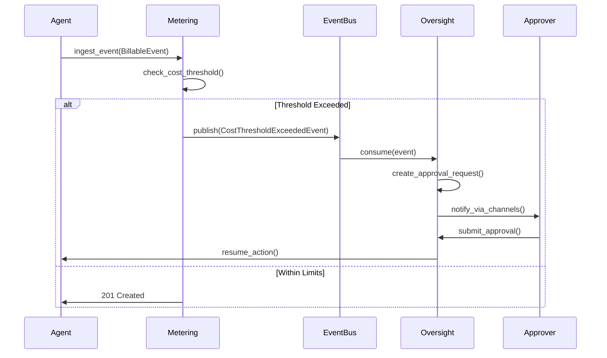
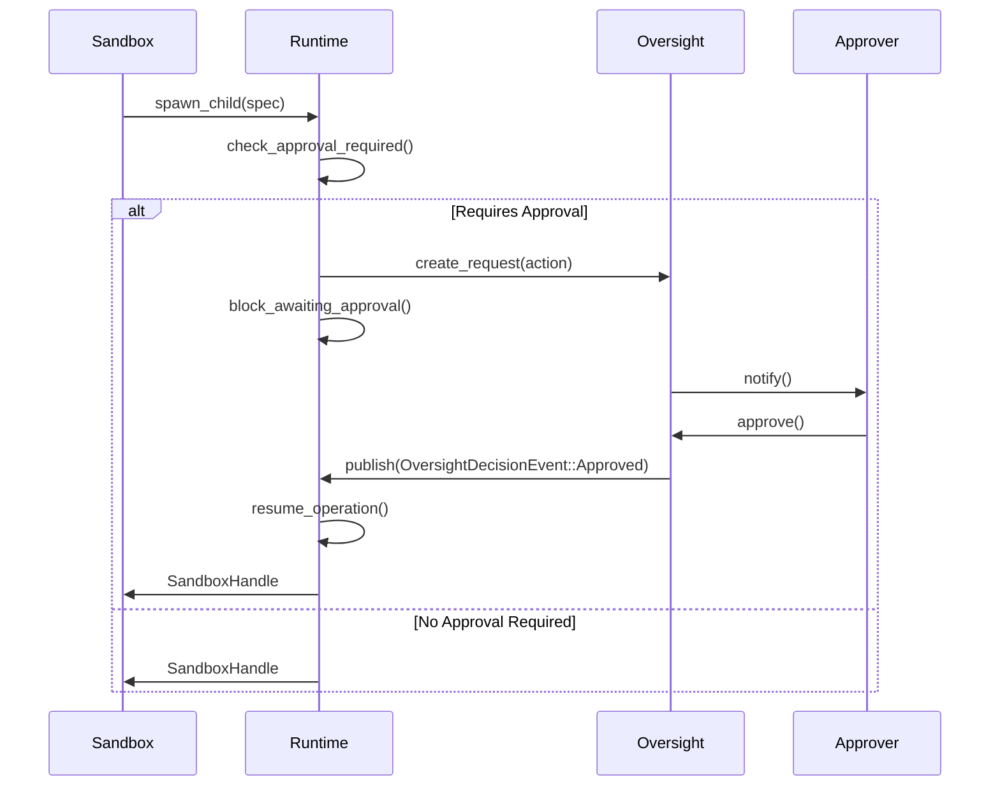
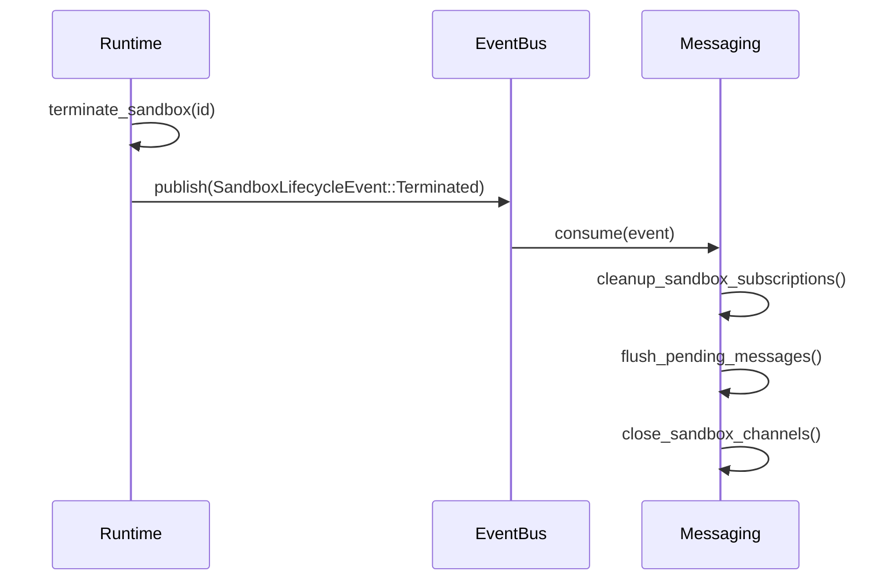
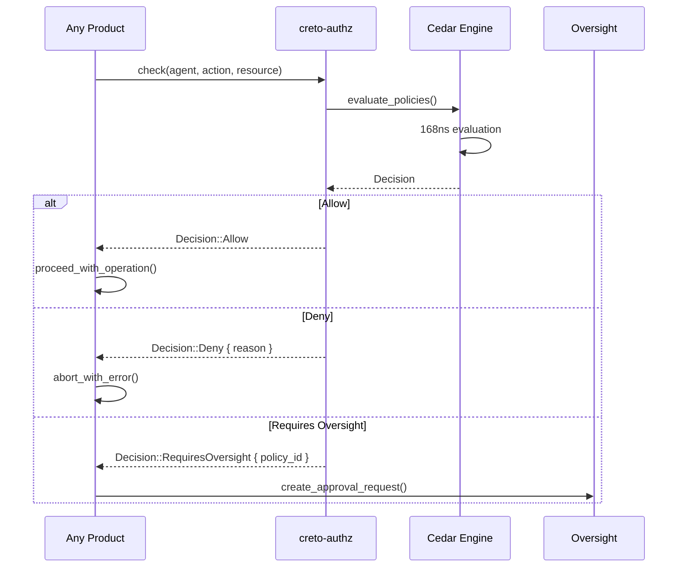
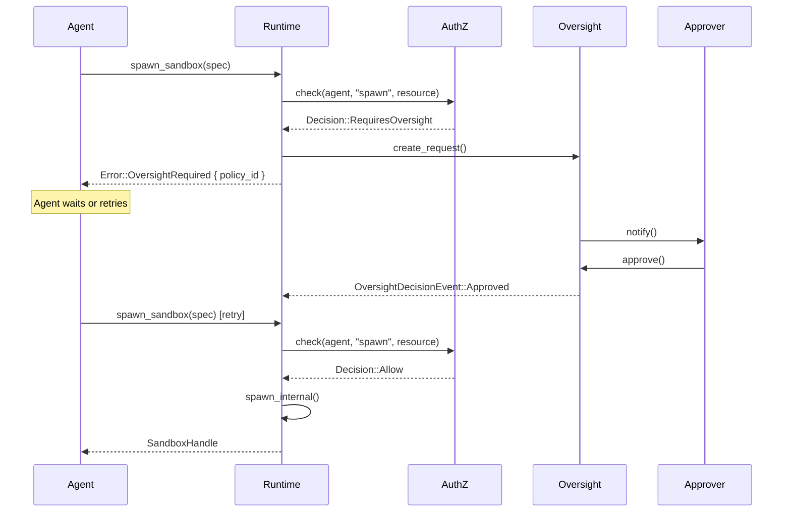
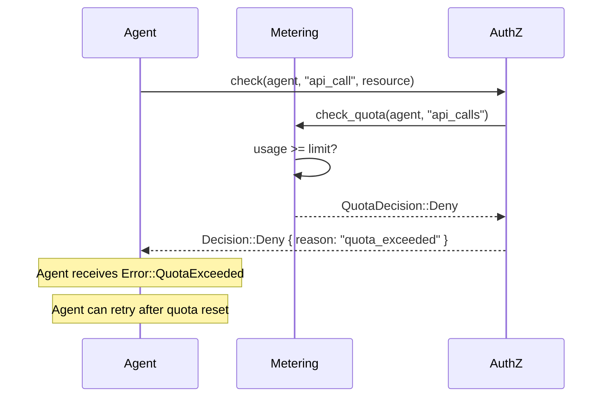
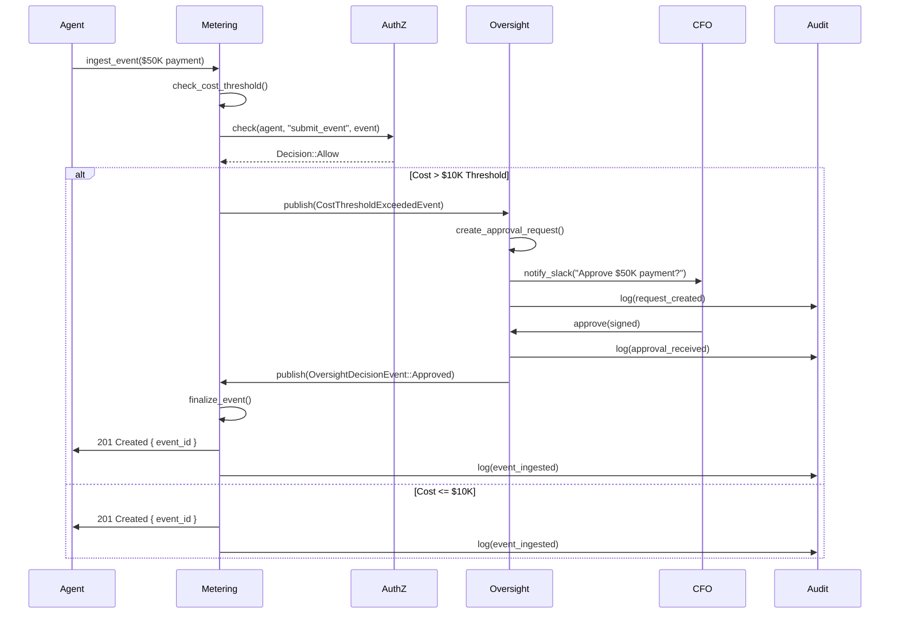
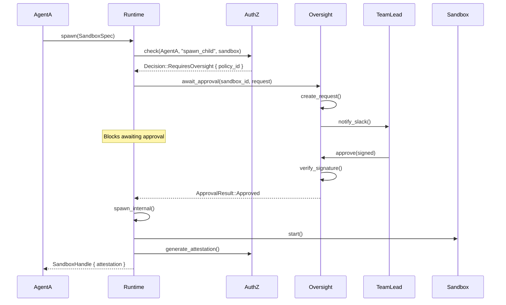
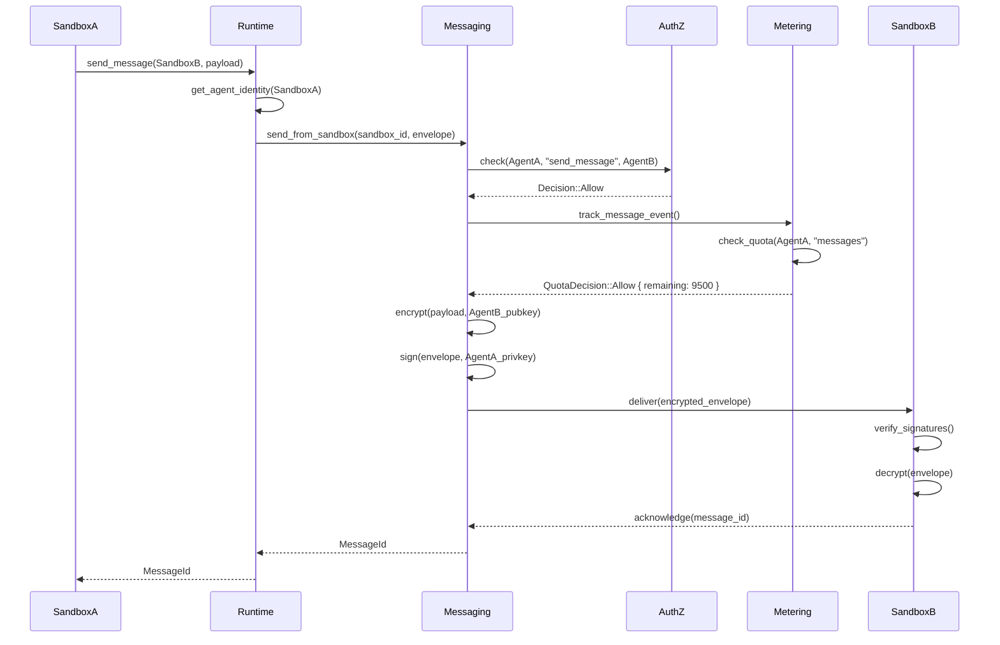
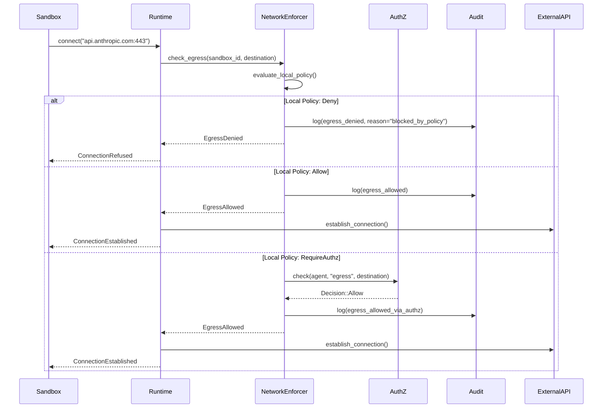

# SDD-06: Interface Contracts Specification

## Purpose

This document defines the **cross-product interface contracts** for the Enablement Layer, specifying the Rust trait interfaces, event schemas, error propagation patterns, and integration points that enable the four products (Metering, Oversight, Runtime, Messaging) to work together cohesively.

## Scope

**In Scope:**
- Cross-product Rust trait interfaces
- Event schemas for inter-product communication
- Integration points with Platform layer (NHI, Crypto, Consensus, Audit)
- Error propagation and handling patterns
- Sequence diagrams for key interaction flows

**Out of Scope:**
- Internal product implementations (see product SDDs)
- Platform layer implementation details
- Network protocols (gRPC, HTTP)

---

## 1. Cross-Product Interface Traits

### 1.1 Metering → Oversight: Cost-Based Oversight Triggers

Oversight policies may trigger based on cost thresholds tracked by Metering. This interface allows Oversight to check current costs before requiring approval.

```rust
use creto_enablement_common::{AgentIdentity, Result, Error};

/// Trait for Metering to provide cost information to Oversight
#[async_trait]
pub trait CostTrigger: Send + Sync {
    /// Check if current cost accumulation triggers oversight requirement
    ///
    /// # Arguments
    /// * `event` - The billable event being considered
    /// * `period` - The billing period to check (e.g., current month)
    ///
    /// # Returns
    /// * `Some(OversightTrigger)` if cost threshold exceeded
    /// * `None` if within limits
    async fn check_cost_threshold(
        &self,
        event: &BillableEvent,
        period: BillingPeriod,
    ) -> Result<Option<OversightTrigger>>;

    /// Get current accumulated cost for agent
    ///
    /// # Arguments
    /// * `agent` - Agent identity to query
    /// * `period` - Billing period (current_month, current_quarter, etc.)
    async fn get_accumulated_cost(
        &self,
        agent: &AgentIdentity,
        period: BillingPeriod,
    ) -> Result<AccumulatedCost>;
}

/// Trigger information for oversight
#[derive(Debug, Clone, Serialize, Deserialize)]
pub struct OversightTrigger {
    pub policy_id: PolicyId,
    pub reason: CostThresholdReason,
    pub current_cost: f64,
    pub threshold: f64,
    pub currency: String,
}

#[derive(Debug, Clone, Serialize, Deserialize)]
pub enum CostThresholdReason {
    /// Single transaction exceeds limit
    TransactionLimit { amount: f64, limit: f64 },

    /// Accumulated cost in period exceeds limit
    PeriodLimit {
        accumulated: f64,
        limit: f64,
        period: BillingPeriod,
    },

    /// Unusual spending pattern detected
    AnomalyDetected {
        expected_rate: f64,
        actual_rate: f64,
        confidence: f64,
    },
}

#[derive(Debug, Clone)]
pub struct AccumulatedCost {
    pub agent_nhi: AgentIdentity,
    pub period: BillingPeriod,
    pub total_cost: f64,
    pub currency: String,
    pub by_event_type: HashMap<String, f64>,
}
```

**Integration Example:**

```rust
// In Oversight policy evaluation
impl OversightPolicy {
    async fn evaluate_cost_policy(
        &self,
        metering: &dyn CostTrigger,
        event: &BillableEvent,
    ) -> Result<Decision> {
        // Check if cost triggers oversight
        if let Some(trigger) = metering.check_cost_threshold(event, BillingPeriod::CurrentMonth).await? {
            return Ok(Decision::RequiresOversight {
                policy_id: trigger.policy_id,
                requirement: OversightRequirement {
                    approvers: vec!["cfo@company.com".into()],
                    reason: format!(
                        "Cost ${:.2} exceeds threshold ${:.2}",
                        trigger.current_cost,
                        trigger.threshold
                    ),
                    timeout: Duration::from_secs(3600),
                    ..Default::default()
                },
            });
        }

        Ok(Decision::Allow)
    }
}
```

---

### 1.2 Oversight → Runtime: Approval Gates for Sandbox Actions

Sandboxes may require approval before performing certain actions (e.g., spawning child sandboxes, accessing sensitive resources). Runtime calls Oversight to block until approval received.

```rust
/// Trait for Runtime to request approval gates from Oversight
#[async_trait]
pub trait ApprovalGate: Send + Sync {
    /// Block until approval received for sandbox action
    ///
    /// # Arguments
    /// * `sandbox_id` - The sandbox requesting permission
    /// * `request` - Description of what action needs approval
    ///
    /// # Returns
    /// * `ApprovalResult::Approved` - Action can proceed
    /// * `ApprovalResult::Denied` - Action must be aborted
    /// * `ApprovalResult::TimedOut` - No response within timeout
    async fn await_approval(
        &self,
        sandbox_id: &SandboxId,
        request: &OversightRequest,
    ) -> Result<ApprovalResult>;

    /// Check if approval is required without blocking
    ///
    /// Returns immediately with decision or RequiresApproval
    async fn check_approval_required(
        &self,
        sandbox_id: &SandboxId,
        action: &SandboxAction,
    ) -> Result<ApprovalCheckResult>;

    /// Cancel pending approval request
    ///
    /// Called if agent aborts action before approval received
    async fn cancel_approval(
        &self,
        request_id: &RequestId,
    ) -> Result<()>;
}

#[derive(Debug, Clone)]
pub enum ApprovalResult {
    Approved {
        approver: HumanIdentity,
        signature: Signature,
        timestamp: Timestamp,
        notes: Option<String>,
    },
    Denied {
        approver: HumanIdentity,
        signature: Signature,
        timestamp: Timestamp,
        reason: String,
    },
    TimedOut {
        timeout_action: TimeoutAction,
    },
}

#[derive(Debug, Clone)]
pub enum ApprovalCheckResult {
    /// Action can proceed immediately
    NotRequired,

    /// Approval is required, use await_approval()
    Required {
        policy_id: PolicyId,
        estimated_wait: Duration,
    },

    /// Action is prohibited by policy
    Prohibited { reason: String },
}

#[derive(Debug, Clone, Serialize, Deserialize)]
pub struct SandboxAction {
    pub action_type: SandboxActionType,
    pub agent_nhi: AgentIdentity,
    pub delegation_chain: Vec<AgentIdentity>,
    pub context: ActionContext,
}

#[derive(Debug, Clone, Serialize, Deserialize)]
pub enum SandboxActionType {
    /// Spawn a child sandbox
    SpawnChild { image: ImageRef, resources: ResourceLimits },

    /// Access external API
    ExternalApiCall { destination: String, method: String },

    /// Modify filesystem outside allowed paths
    FilesystemWrite { path: String },

    /// Execute privileged operation
    PrivilegedOperation { operation: String },
}
```

**Integration Example:**

```rust
// In Runtime sandbox spawner
impl SandboxRuntime {
    async fn spawn_with_approval(
        &self,
        spec: &SandboxSpec,
        oversight: &dyn ApprovalGate,
    ) -> Result<SandboxHandle> {
        // Check if approval required
        let action = SandboxAction {
            action_type: SandboxActionType::SpawnChild {
                image: spec.image.clone(),
                resources: spec.resource_limits.clone(),
            },
            agent_nhi: spec.agent_nhi.clone(),
            delegation_chain: spec.delegation_chain.clone(),
            context: ActionContext::from_spec(spec),
        };

        match oversight.check_approval_required(&spec.sandbox_id, &action).await? {
            ApprovalCheckResult::NotRequired => {
                // Proceed directly
                self.spawn_internal(spec).await
            }
            ApprovalCheckResult::Required { policy_id, .. } => {
                // Create oversight request
                let request = OversightRequest {
                    policy_id,
                    agent_nhi: spec.agent_nhi.clone(),
                    action_description: format!("Spawn sandbox: {:?}", spec.image),
                    // ... more context
                };

                // Block until approval
                match oversight.await_approval(&spec.sandbox_id, &request).await? {
                    ApprovalResult::Approved { .. } => {
                        self.spawn_internal(spec).await
                    }
                    ApprovalResult::Denied { reason, .. } => {
                        Err(Error::approval_denied(reason))
                    }
                    ApprovalResult::TimedOut { timeout_action } => {
                        match timeout_action {
                            TimeoutAction::AutoDeny => Err(Error::approval_timeout()),
                            TimeoutAction::AutoApprove => self.spawn_internal(spec).await,
                            _ => Err(Error::approval_timeout()),
                        }
                    }
                }
            }
            ApprovalCheckResult::Prohibited { reason } => {
                Err(Error::prohibited(reason))
            }
        }
    }
}
```

---

### 1.3 Runtime → Messaging: Sandbox Communication

Sandboxes send messages via the Messaging layer. Runtime provides sandbox context to enforce isolation and attribution.

```rust
/// Trait for Runtime to enable sandbox-to-sandbox messaging
#[async_trait]
pub trait SandboxMessenger: Send + Sync {
    /// Send message from sandbox to another agent/topic
    ///
    /// # Arguments
    /// * `sandbox_id` - Source sandbox ID
    /// * `envelope` - Pre-encrypted message envelope
    ///
    /// # Returns
    /// * `MessageId` - Unique identifier for tracking delivery
    async fn send_from_sandbox(
        &self,
        sandbox_id: &SandboxId,
        envelope: MessageEnvelope,
    ) -> Result<MessageId>;

    /// Subscribe sandbox to topic
    ///
    /// Messages delivered to sandbox via callback or queue
    async fn subscribe_sandbox(
        &self,
        sandbox_id: &SandboxId,
        topic: &TopicName,
    ) -> Result<SubscriptionId>;

    /// Unsubscribe sandbox from topic
    async fn unsubscribe_sandbox(
        &self,
        subscription_id: &SubscriptionId,
    ) -> Result<()>;

    /// Receive messages for sandbox (pull model)
    ///
    /// Returns up to `max_messages` pending messages
    async fn receive_for_sandbox(
        &self,
        sandbox_id: &SandboxId,
        max_messages: usize,
    ) -> Result<Vec<ReceivedMessage>>;
}

#[derive(Debug, Clone)]
pub struct ReceivedMessage {
    pub message_id: MessageId,
    pub sender_nhi: AgentIdentity,
    pub encrypted_payload: Vec<u8>,
    pub wrapped_key: Vec<u8>,
    pub signature_ed25519: Vec<u8>,
    pub signature_ml_dsa: Vec<u8>,
    pub timestamp: Timestamp,
    pub priority: MessagePriority,
}
```

**Integration Example:**

```rust
// In Runtime sandbox I/O handler
impl SandboxRuntime {
    async fn handle_sandbox_send_message(
        &self,
        sandbox_id: &SandboxId,
        recipient: &AgentIdentity,
        plaintext: Vec<u8>,
        messenger: &dyn SandboxMessenger,
    ) -> Result<MessageId> {
        // Get sandbox's agent identity
        let handle = self.get_handle(sandbox_id)?;

        // Encrypt and sign message
        let envelope = self.crypto.create_envelope(
            &handle.agent_nhi,
            recipient,
            &plaintext,
        )?;

        // Delegate to messaging layer
        messenger.send_from_sandbox(sandbox_id, envelope).await
    }
}
```

---

### 1.4 Messaging → Metering: Message Cost Tracking

Messaging layer emits billable events for message delivery to track usage.

```rust
/// Trait for Messaging to emit billable events to Metering
#[async_trait]
pub trait MessageCostTracker: Send + Sync {
    /// Track message send event for billing
    ///
    /// # Arguments
    /// * `event` - Message event details
    async fn track_message_event(
        &self,
        event: &MessageBillableEvent,
    ) -> Result<EventId>;

    /// Query current message quota for agent
    ///
    /// Used for inline quota enforcement
    async fn check_message_quota(
        &self,
        agent: &AgentIdentity,
        event_type: &str,
    ) -> Result<QuotaDecision>;
}

#[derive(Debug, Clone, Serialize, Deserialize)]
pub struct MessageBillableEvent {
    pub idempotency_key: String,
    pub agent_nhi: AgentIdentity,
    pub delegation_chain: Vec<AgentIdentity>,
    pub event_type: MessageEventType,
    pub timestamp: Timestamp,
    pub properties: MessageProperties,
}

#[derive(Debug, Clone, Serialize, Deserialize)]
pub enum MessageEventType {
    MessageSent,
    MessageReceived,
    TopicCreated,
    SubscriptionCreated,
}

#[derive(Debug, Clone, Serialize, Deserialize)]
pub struct MessageProperties {
    pub message_size_bytes: u64,
    pub recipient_count: u64, // For topic broadcasts
    pub priority: MessagePriority,
    pub encrypted: bool,
    pub signature_algorithm: String,
}
```

---

## 2. Event Schemas for Cross-Product Communication

### 2.1 MeteringEvent → OversightService

When a billable event exceeds cost thresholds, Metering publishes an event that Oversight consumes to create approval requests.

```rust
#[derive(Debug, Clone, Serialize, Deserialize)]
pub struct CostThresholdExceededEvent {
    pub event_id: EventId,
    pub agent_nhi: AgentIdentity,
    pub delegation_chain: Vec<AgentIdentity>,

    /// The billable event that triggered threshold
    pub triggering_event: BillableEvent,

    /// Threshold that was exceeded
    pub threshold: CostThreshold,

    /// Current accumulated cost
    pub current_cost: f64,

    /// Billing period
    pub period: BillingPeriod,

    /// Timestamp (consensus-ordered)
    pub timestamp: Timestamp,
}

#[derive(Debug, Clone, Serialize, Deserialize)]
pub struct CostThreshold {
    pub threshold_id: String,
    pub threshold_type: CostThresholdType,
    pub limit: f64,
    pub currency: String,
    pub action: ThresholdAction,
}

#[derive(Debug, Clone, Serialize, Deserialize)]
pub enum CostThresholdType {
    /// Single transaction limit
    PerTransaction,

    /// Accumulated cost per hour
    PerHour,

    /// Accumulated cost per day
    PerDay,

    /// Accumulated cost per month
    PerMonth,

    /// Total lifetime spend
    Lifetime,
}

#[derive(Debug, Clone, Serialize, Deserialize)]
pub enum ThresholdAction {
    /// Block action, require approval
    RequireApproval { approvers: Vec<String> },

    /// Send notification, allow action
    NotifyOnly { channels: Vec<String> },

    /// Block action permanently
    Block,
}
```

**Event Flow:**



---

### 2.2 OversightDecision → RuntimeService

When oversight approves/denies a sandbox action, Runtime must be notified to proceed or abort.

```rust
#[derive(Debug, Clone, Serialize, Deserialize)]
pub struct OversightDecisionEvent {
    pub request_id: RequestId,
    pub sandbox_id: SandboxId,
    pub decision: OversightDecision,
    pub approver: HumanIdentity,
    pub signature: Signature,
    pub timestamp: Timestamp,
    pub notes: Option<String>,
}

#[derive(Debug, Clone, Serialize, Deserialize)]
pub enum OversightDecision {
    Approved,
    Denied { reason: String },
    Escalated { next_tier: String },
}
```

**Event Flow:**



---

### 2.3 SandboxEvent → MessagingService

Sandbox lifecycle events (created, terminated) trigger messaging cleanup.

```rust
#[derive(Debug, Clone, Serialize, Deserialize)]
pub struct SandboxLifecycleEvent {
    pub sandbox_id: SandboxId,
    pub agent_nhi: AgentIdentity,
    pub event_type: SandboxEventType,
    pub timestamp: Timestamp,
}

#[derive(Debug, Clone, Serialize, Deserialize)]
pub enum SandboxEventType {
    Created { attestation: Attestation },
    Terminated { reason: TerminationReason },
    Checkpointed { checkpoint_id: String },
    Restored { from_checkpoint: String },
}

#[derive(Debug, Clone, Serialize, Deserialize)]
pub enum TerminationReason {
    Completed,
    Failed { error: String },
    Timeout,
    ManualTermination,
    ResourceLimitExceeded,
}
```

**Event Flow (Sandbox Terminated → Messaging Cleanup):**



---

## 3. Integration Points with Platform Layer

### 3.1 All Products → AuthZ (Authorization Checks)

Every product integrates with `creto-authz` for inline authorization checks.

```rust
use creto_authz::{AuthzClient, CheckRequest, Decision};

/// Common authorization integration pattern
pub async fn authorized_operation<T, F>(
    authz: &AuthzClient,
    agent: &AgentIdentity,
    action: &str,
    resource: &str,
    operation: F,
) -> Result<T, Error>
where
    F: FnOnce() -> Future<Output = Result<T, Error>>,
{
    // 1. Check authorization (168ns policy evaluation)
    let decision = authz.check(CheckRequest {
        agent: agent.clone(),
        action: action.to_string(),
        resource: resource.to_string(),
    }).await?;

    // 2. Handle decision
    match decision {
        Decision::Allow => {
            operation().await
        }
        Decision::Deny { reason } => {
            Err(Error::unauthorized(reason))
        }
        Decision::RequiresOversight { policy_id } => {
            Err(Error::oversight_required(policy_id))
        }
    }
}
```

**Integration Sequence:**



---

### 3.2 All Products → Audit (Event Logging)

All significant operations log to `creto-audit` for immutable compliance trail.

```rust
use creto_audit::{AuditClient, AuditRecord, Outcome};

/// Common audit integration pattern
pub async fn audited_operation<T, F>(
    audit: &AuditClient,
    agent: &AgentIdentity,
    delegation_chain: &[AgentIdentity],
    action: &str,
    resource: &str,
    operation: F,
) -> Result<T, Error>
where
    F: FnOnce() -> Future<Output = Result<T, Error>>,
{
    let result = operation().await;

    // Log outcome (success or failure)
    audit.log(AuditRecord {
        who: agent.clone(),
        delegation_chain: delegation_chain.to_vec(),
        what: action.to_string(),
        resource: resource.to_string(),
        why: None,
        outcome: match &result {
            Ok(_) => Outcome::Success,
            Err(e) => Outcome::Failure(e.to_string()),
        },
        timestamp: consensus_timestamp(),
        signature: None, // Added by audit service
    }).await?;

    result
}
```

**Audit Events by Product:**

| Product | Events Logged |
|---------|---------------|
| **Metering** | Event ingestion, quota checks, quota exceeded, invoice generation |
| **Oversight** | Request created, notifications sent, approvals received, denials received, escalations |
| **Runtime** | Sandbox spawned, sandbox terminated, egress allowed/denied, attestation generated |
| **Messaging** | Message sent, message received, topic created, subscription created, delivery denied |

---

### 3.3 All Products → NHI (Identity Resolution)

All products use `creto-nhi` for agent identity and delegation chain verification.

```rust
use creto_nhi::{AgentIdentity, DelegationChain, NhiRegistry};

/// Verify agent identity and delegation chain
pub async fn verify_agent_identity(
    nhi: &NhiRegistry,
    agent: &AgentIdentity,
    delegation_chain: &[AgentIdentity],
) -> Result<(), Error> {
    // 1. Verify agent NHI is registered
    if !nhi.is_registered(agent).await? {
        return Err(Error::invalid_agent_identity(agent));
    }

    // 2. Verify delegation chain integrity
    nhi.verify_delegation_chain(agent, delegation_chain).await?;

    // 3. Check for revoked identities
    for identity in std::iter::once(agent).chain(delegation_chain.iter()) {
        if nhi.is_revoked(identity).await? {
            return Err(Error::revoked_identity(identity));
        }
    }

    Ok(())
}
```

---

### 3.4 All Products → Crypto (Signing/Encryption)

All products use `creto-crypto` for cryptographic operations.

```rust
use creto_crypto::{CryptoClient, Algorithm, Signature};

/// Sign data with agent's private key
pub async fn sign_data(
    crypto: &CryptoClient,
    agent: &AgentIdentity,
    data: &[u8],
) -> Result<Signature, Error> {
    crypto.sign(SignRequest {
        agent: agent.clone(),
        algorithm: Algorithm::HybridEdDsaMlDsa,
        data: data.to_vec(),
    }).await
}

/// Verify signature
pub async fn verify_signature(
    crypto: &CryptoClient,
    agent: &AgentIdentity,
    data: &[u8],
    signature: &Signature,
) -> Result<bool, Error> {
    crypto.verify(VerifyRequest {
        agent: agent.clone(),
        data: data.to_vec(),
        signature: signature.clone(),
    }).await
}
```

**Crypto Operations by Product:**

| Product | Crypto Usage |
|---------|-------------|
| **Metering** | Sign billable events (ML-DSA) |
| **Oversight** | Verify approval signatures (Ed25519 + ML-DSA) |
| **Runtime** | Sign attestations (Ed25519 + ML-DSA), verify sandbox identity |
| **Messaging** | E2E encryption (ML-KEM-768 + AES-256-GCM), sign envelopes (Ed25519 + ML-DSA) |

---

## 4. Error Propagation

### 4.1 Error Type Hierarchy

All products use the common `creto-enablement-common::Error` type with product-specific extensions.

```rust
pub struct Error {
    kind: ErrorKind,
    source: Option<Box<dyn std::error::Error + Send + Sync>>,
    context: Vec<String>,
}

pub enum ErrorKind {
    // Common errors (all products)
    NotFound,
    AlreadyExists,
    InvalidInput(String),
    Unauthorized,
    InternalError,

    // Metering-specific
    QuotaExceeded { limit: u64, used: u64 },
    IdempotencyConflict { existing_id: String },

    // Oversight-specific
    OversightRequired { policy_id: PolicyId },
    ApprovalDenied { reason: String },
    ApprovalTimeout,

    // Runtime-specific
    SandboxSpawnFailed,
    SandboxNotFound,
    AttestationFailed,
    EgressDenied { destination: String },

    // Messaging-specific
    EncryptionFailed,
    SignatureVerificationFailed,
    DeliveryDenied { reason: String },
    RecipientNotFound,
    TopicNotFound,

    // Platform integration errors
    AuthzError { details: String },
    AuditError { details: String },
    NhiError { details: String },
    CryptoError { details: String },
}

impl Error {
    pub fn with_context(mut self, context: impl Into<String>) -> Self {
        self.context.push(context.into());
        self
    }

    pub fn chain(mut self, source: impl Into<Box<dyn std::error::Error + Send + Sync>>) -> Self {
        self.source = Some(source.into());
        self
    }
}
```

---

### 4.2 Error Flow Patterns

#### Pattern 1: Authorization Error → Oversight Trigger



#### Pattern 2: Quota Error → Block Action



#### Pattern 3: Platform Error Propagation

```rust
// Example: NHI error propagates through Runtime
impl SandboxRuntime {
    async fn verify_agent(&self, agent: &AgentIdentity) -> Result<(), Error> {
        self.nhi.is_registered(agent)
            .await
            .map_err(|e| Error::nhi_error(e.to_string())
                .with_context("Failed to verify agent identity"))
    }
}

// Caller receives Error with full context chain:
// Error::NhiError { details: "connection refused" }
//   context: ["Failed to verify agent identity"]
```

---

## 5. Sequence Diagrams for Key Flows

### 5.1 Cost-Based Oversight Trigger



---

### 5.2 Sandbox Spawn with Approval Gate



---

### 5.3 Cross-Sandbox Messaging with Authorization



---

### 5.4 Egress Control with Network Policy



---

## 6. Data Contracts

### 6.1 Common Data Types

All products share these common types from `creto-enablement-common`:

```rust
/// Agent identity (from creto-nhi)
pub use creto_nhi::AgentIdentity;

/// Delegation chain
pub type DelegationChain = Vec<AgentIdentity>;

/// Consensus-ordered timestamp
pub type Timestamp = u64; // Unix epoch nanoseconds

/// Resource identifier
#[derive(Debug, Clone, Eq, PartialEq, Hash, Serialize, Deserialize)]
pub struct ResourceId(String);

/// Policy identifier
#[derive(Debug, Clone, Eq, PartialEq, Hash, Serialize, Deserialize)]
pub struct PolicyId(String);

/// Request identifier
#[derive(Debug, Clone, Eq, PartialEq, Hash, Serialize, Deserialize)]
pub struct RequestId(String);

/// Event identifier
#[derive(Debug, Clone, Eq, PartialEq, Hash, Serialize, Deserialize)]
pub struct EventId(String);
```

---

### 6.2 Shared Event Envelope

All cross-product events use a common envelope structure:

```rust
#[derive(Debug, Clone, Serialize, Deserialize)]
pub struct EventEnvelope<T> {
    /// Event type identifier
    pub event_type: String,

    /// Unique event ID
    pub event_id: EventId,

    /// Agent that generated the event
    pub agent_nhi: AgentIdentity,

    /// Full delegation chain
    pub delegation_chain: DelegationChain,

    /// Consensus-ordered timestamp
    pub timestamp: Timestamp,

    /// Event payload
    pub payload: T,

    /// Optional cryptographic signature
    pub signature: Option<Signature>,
}

impl<T: Serialize> EventEnvelope<T> {
    /// Create canonical hash for signing
    pub fn canonical_hash(&self) -> [u8; 32] {
        // Deterministic serialization for signing
        let mut hasher = Sha256::new();
        hasher.update(&self.event_type);
        hasher.update(&self.event_id.0);
        hasher.update(&self.timestamp.to_le_bytes());
        hasher.update(&serde_json::to_vec(&self.payload).unwrap());
        hasher.finalize().into()
    }

    /// Sign event envelope
    pub async fn sign(
        mut self,
        crypto: &CryptoClient,
    ) -> Result<Self, Error> {
        let hash = self.canonical_hash();
        let signature = crypto.sign(SignRequest {
            agent: self.agent_nhi.clone(),
            algorithm: Algorithm::HybridEdDsaMlDsa,
            data: hash.to_vec(),
        }).await?;

        self.signature = Some(signature);
        Ok(self)
    }

    /// Verify event signature
    pub async fn verify_signature(
        &self,
        crypto: &CryptoClient,
    ) -> Result<bool, Error> {
        match &self.signature {
            Some(sig) => {
                let hash = self.canonical_hash();
                crypto.verify(VerifyRequest {
                    agent: self.agent_nhi.clone(),
                    data: hash.to_vec(),
                    signature: sig.clone(),
                }).await
            }
            None => Ok(false),
        }
    }
}
```

---

## 7. Testing Strategy for Interfaces

### 7.1 Interface Contract Tests

Each interface trait has a test suite that implementations must pass:

```rust
#[cfg(test)]
mod tests {
    use super::*;

    /// Test suite for CostTrigger implementations
    #[async_trait]
    pub trait CostTriggerContractTests {
        async fn create_test_instance() -> Box<dyn CostTrigger>;

        #[tokio::test]
        async fn test_check_cost_threshold_under_limit() {
            let trigger = Self::create_test_instance().await;

            let event = BillableEvent {
                // event with cost $5K
            };

            let result = trigger.check_cost_threshold(&event, BillingPeriod::CurrentMonth).await.unwrap();
            assert!(result.is_none(), "Should not trigger for cost under limit");
        }

        #[tokio::test]
        async fn test_check_cost_threshold_over_limit() {
            let trigger = Self::create_test_instance().await;

            let event = BillableEvent {
                // event with cost $15K
            };

            let result = trigger.check_cost_threshold(&event, BillingPeriod::CurrentMonth).await.unwrap();
            assert!(result.is_some(), "Should trigger for cost over $10K limit");

            let trigger_info = result.unwrap();
            assert_eq!(trigger_info.current_cost, 15000.0);
            assert_eq!(trigger_info.threshold, 10000.0);
        }
    }
}
```

---

### 7.2 Integration Tests

Cross-product integration tests verify end-to-end flows:

```rust
#[tokio::test]
async fn test_cost_based_oversight_flow() {
    // Setup all services
    let metering = TestMeteringService::new();
    let oversight = TestOversightService::new();
    let authz = TestAuthzService::new();

    // Configure policy: payments >$10K require CFO approval
    authz.add_policy(/* policy definition */);

    // Agent submits high-cost event
    let event = BillableEvent {
        event_type: "payment".into(),
        properties: json!({ "amount": 50000.0 }),
        // ...
    };

    let result = metering.ingest_event(&event).await;

    // Should trigger oversight
    assert!(matches!(result, Err(Error { kind: ErrorKind::OversightRequired { .. }, .. })));

    // Verify oversight request was created
    let requests = oversight.list_pending_requests().await.unwrap();
    assert_eq!(requests.len(), 1);
    assert_eq!(requests[0].event_id, event.event_id);

    // Simulate approval
    let approval = ApprovalResponse {
        approver: test_cfo_identity(),
        decision: ApprovalDecision::Approve,
        signature: sign_approval(/* ... */),
    };

    oversight.submit_approval(&requests[0].request_id, &approval).await.unwrap();

    // Retry event ingestion
    let result = metering.ingest_event(&event).await;
    assert!(result.is_ok(), "Event should be accepted after approval");
}
```

---

## 8. Versioning and Evolution

### 8.1 Interface Versioning

All trait interfaces are versioned to support backward compatibility:

```rust
/// Version 1 of CostTrigger interface
#[async_trait]
pub trait CostTriggerV1: Send + Sync {
    async fn check_cost_threshold(
        &self,
        event: &BillableEvent,
        period: BillingPeriod,
    ) -> Result<Option<OversightTrigger>>;
}

/// Version 2 adds support for multiple thresholds
#[async_trait]
pub trait CostTriggerV2: CostTriggerV1 {
    async fn check_multiple_thresholds(
        &self,
        event: &BillableEvent,
        thresholds: &[CostThreshold],
    ) -> Result<Vec<OversightTrigger>>;
}

/// Type alias for current version
pub type CostTrigger = dyn CostTriggerV2;
```

---

### 8.2 Event Schema Evolution

Event schemas use versioned fields for backward compatibility:

```rust
#[derive(Debug, Clone, Serialize, Deserialize)]
pub struct CostThresholdExceededEventV2 {
    // V1 fields
    pub event_id: EventId,
    pub agent_nhi: AgentIdentity,
    pub triggering_event: BillableEvent,
    pub threshold: CostThreshold,
    pub current_cost: f64,

    // V2 additions (optional for backward compat)
    #[serde(skip_serializing_if = "Option::is_none")]
    pub cost_breakdown: Option<CostBreakdown>,

    #[serde(skip_serializing_if = "Option::is_none")]
    pub forecast: Option<CostForecast>,
}
```

---

## 9. Performance Budgets

Cross-product interface calls have strict latency budgets:

| Interface | Target Latency (p99) | Rationale |
|-----------|---------------------|-----------|
| `CostTrigger::check_cost_threshold` | <10µs | Inline authorization path |
| `ApprovalGate::check_approval_required` | <1ms | Non-blocking check |
| `ApprovalGate::await_approval` | Variable | Blocking until human response |
| `SandboxMessenger::send_from_sandbox` | <5ms | Hot path for messaging |
| `MessageCostTracker::check_message_quota` | <10µs | Inline messaging path |

---

## 10. Security Considerations

### 10.1 Interface Authentication

All cross-product calls include agent identity for authorization:

```rust
impl CostTrigger for MeteringService {
    async fn check_cost_threshold(
        &self,
        event: &BillableEvent,
        period: BillingPeriod,
    ) -> Result<Option<OversightTrigger>> {
        // Verify caller is authorized to query cost
        self.authz.check(
            &event.agent_nhi,
            "query_cost",
            &format!("cost::{}", period),
        ).await?;

        // Proceed with cost check
        // ...
    }
}
```

---

### 10.2 Event Signature Verification

All cross-product events MUST be signed and verified:

```rust
impl OversightService {
    async fn consume_cost_event(
        &self,
        envelope: EventEnvelope<CostThresholdExceededEvent>,
    ) -> Result<()> {
        // Verify event signature
        if !envelope.verify_signature(&self.crypto).await? {
            return Err(Error::signature_verification_failed());
        }

        // Verify agent identity
        self.nhi.verify_agent(&envelope.agent_nhi).await?;

        // Process event
        self.create_approval_request(&envelope.payload).await
    }
}
```

---

## 11. Open Questions

1. **Should cross-product events use direct RPC or event bus?**
   - Option A: Direct gRPC calls (lower latency, tighter coupling)
   - Option B: Event bus (loose coupling, higher latency)
   - **Proposal**: Hybrid — critical path uses RPC, audit trail uses event bus

2. **How do we handle partial failures in cross-product flows?**
   - Example: Oversight approved, but Runtime spawn failed
   - **Proposal**: Distributed transaction with compensating actions (saga pattern)

3. **Should interfaces support batch operations?**
   - Example: `check_cost_threshold` for batch of events
   - **Proposal**: Add batch variants in V2 after benchmarking

4. **What is the retry policy for cross-product calls?**
   - Transient errors: Exponential backoff (1s, 2s, 4s, 8s, 16s)
   - Permanent errors: Fail immediately
   - **Proposal**: Per-interface retry configuration

---

## 12. Revision History

| Date | Version | Author | Changes |
|------|---------|--------|---------|
| 2024-12-25 | 0.1 | Architect Lead Agent | Initial interface contracts for Issue #6 |

---

## 13. References

- **SDD-02: Architecture** — Component design and dependencies
- **Requirements Traceability Matrix** — Requirements coverage
- **Product Requirements:**
  - Metering: `/docs/sdd/products/metering/01-requirements.md`
  - Oversight: `/docs/sdd/products/oversight/01-requirements.md`
  - Runtime: `/docs/sdd/products/runtime/01-requirements.md`
  - Messaging: `/docs/sdd/products/messaging/01-requirements.md`
- **Platform Layer Documentation:** `creto-nhi`, `creto-authz`, `creto-crypto`, `creto-audit`

---

**Status**: ✅ **Draft Complete** — Cross-product interface contracts defined with Rust traits, event schemas, sequence diagrams, and integration patterns.
