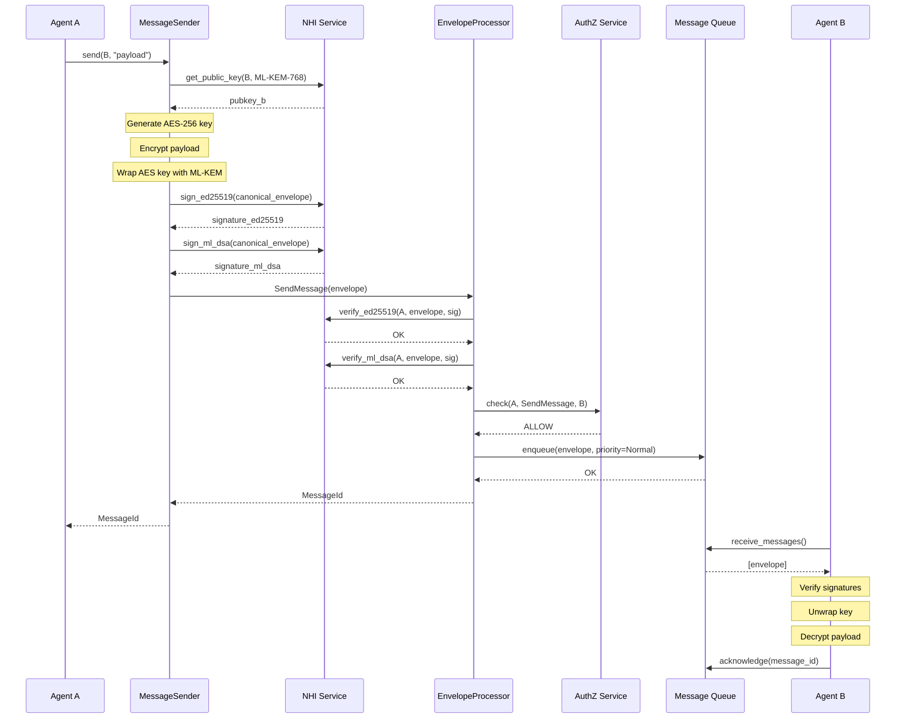
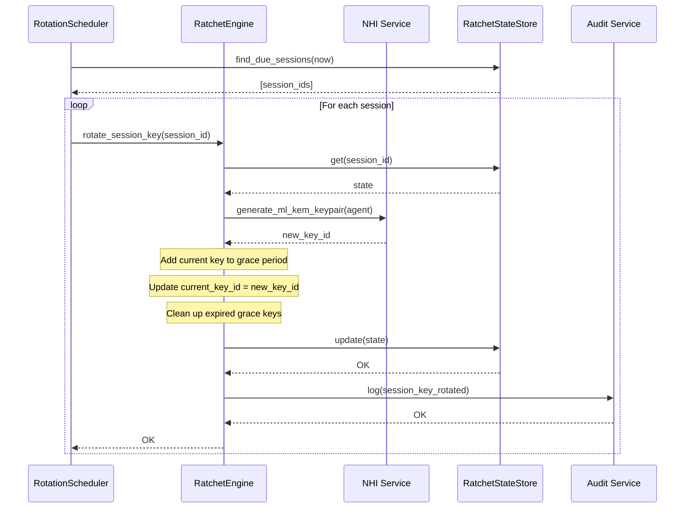
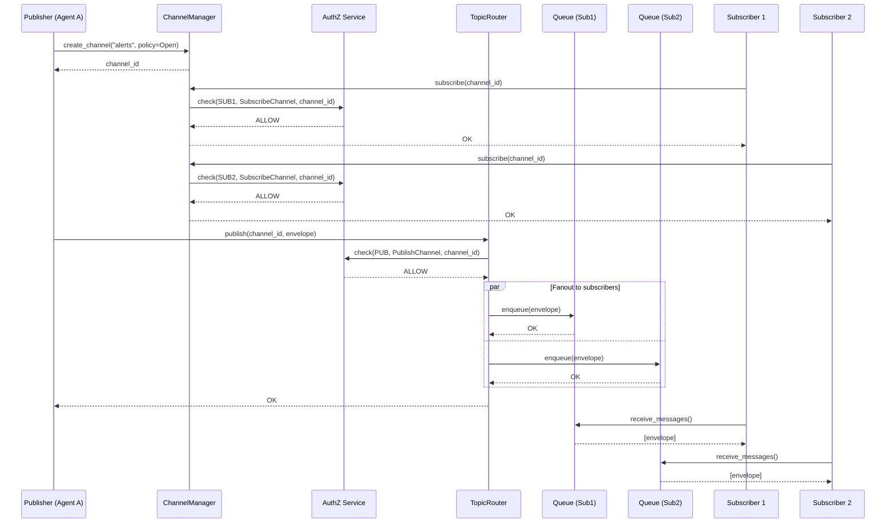
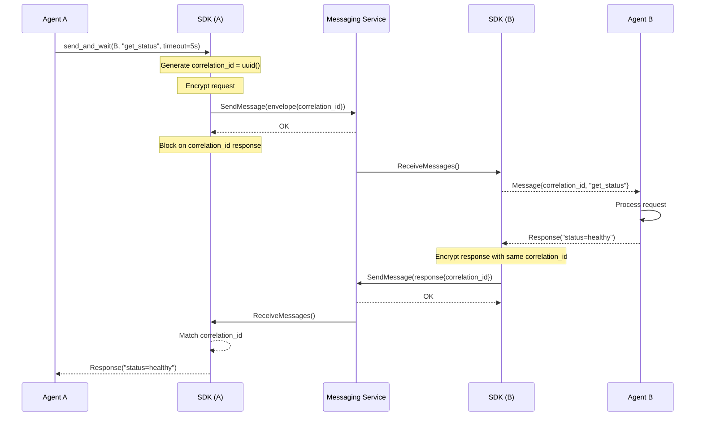

# Messaging Architecture Design

## Table of Contents

1. [Component Overview](#component-overview)
2. [System Components](#system-components)
3. [Data Flow](#data-flow)
4. [Sequence Diagrams](#sequence-diagrams)
5. [Component Interactions](#component-interactions)
6. [Security Architecture](#security-architecture)
7. [Scalability Architecture](#scalability-architecture)
8. [Failure Modes & Recovery](#failure-modes--recovery)

---

## Component Overview

The messaging system consists of three architectural layers:

```
┌─────────────────────────────────────────────────────────────────┐
│                    CLIENT LAYER (Agent SDK)                     │
│  ┌──────────────────────────────────────────────────────────┐  │
│  │  MessageClient                                           │  │
│  │    ├─ MessageSender (encryption, signing)                │  │
│  │    ├─ MessageReceiver (decryption, verification)         │  │
│  │    ├─ KeyAgreementClient (prekey management)             │  │
│  │    └─ ChannelManager (topic subscriptions)               │  │
│  └──────────────────────────────────────────────────────────┘  │
└─────────────────────────────────────────────────────────────────┘
                              ↓ gRPC/REST
┌─────────────────────────────────────────────────────────────────┐
│                   SERVICE LAYER (Stateless)                     │
│  ┌──────────────────────────────────────────────────────────┐  │
│  │  EnvelopeProcessor                                       │  │
│  │    ├─ SignatureVerifier (Ed25519 + ML-DSA)              │  │
│  │    ├─ AuthzGate (policy checks)                         │  │
│  │    └─ DeliveryRouter (queue selection)                  │  │
│  └──────────────────────────────────────────────────────────┘  │
│  ┌──────────────────────────────────────────────────────────┐  │
│  │  KeyManagementService                                    │  │
│  │    ├─ PrekeyStore (upload/fetch prekeys)                │  │
│  │    ├─ RatchetEngine (session key rotation)              │  │
│  │    └─ RotationScheduler (periodic key rotation)         │  │
│  └──────────────────────────────────────────────────────────┘  │
│  ┌──────────────────────────────────────────────────────────┐  │
│  │  ChannelService                                          │  │
│  │    ├─ ChannelManager (create, delete, configure)        │  │
│  │    ├─ SubscriptionManager (subscribe, unsubscribe)      │  │
│  │    └─ TopicRouter (pub/sub fanout)                      │  │
│  └──────────────────────────────────────────────────────────┘  │
└─────────────────────────────────────────────────────────────────┘
                              ↓
┌─────────────────────────────────────────────────────────────────┐
│                   STORAGE LAYER (Persistent)                    │
│  ┌──────────────────────────────────────────────────────────┐  │
│  │  EnvelopeQueue (message delivery queue)                  │  │
│  │  DeliveryReceipts (acknowledgments)                      │  │
│  │  ChannelMetadata (topics, subscriptions)                 │  │
│  │  RatchetState (session keys, rotation history)           │  │
│  │  PrekeyBundles (recipient public keys)                   │  │
│  └──────────────────────────────────────────────────────────┘  │
└─────────────────────────────────────────────────────────────────┘
                              ↓
┌─────────────────────────────────────────────────────────────────┐
│                   PLATFORM LAYER (External)                     │
│  ┌────────┐ ┌──────────┐ ┌───────────┐ ┌──────────────────┐   │
│  │creto   │ │creto     │ │creto      │ │creto             │   │
│  │-nhi    │ │-authz    │ │-audit     │ │-consensus        │   │
│  │(keys)  │ │(policy)  │ │(trail)    │ │(ordering)        │   │
│  └────────┘ └──────────┘ └───────────┘ └──────────────────┘   │
└─────────────────────────────────────────────────────────────────┘
```

---

## System Components

### 1. Client Layer Components

#### 1.1 MessageSender

**Responsibility:** Encrypt and sign outgoing messages.

**Interface:**
```rust
pub struct MessageSender {
    nhi_client: Arc<NhiClient>,
    prekey_client: Arc<PrekeyClient>,
}

impl MessageSender {
    pub async fn send(
        &self,
        recipient_nhi: &AgentIdentity,
        payload: &[u8],
        options: SendOptions,
    ) -> Result<MessageId, MessagingError> {
        // 1. Fetch recipient's ML-KEM public key
        let recipient_pubkey = self.prekey_client
            .get_public_key(recipient_nhi, KeyType::MlKem768)
            .await?;

        // 2. Generate random AES-256 key
        let aes_key = generate_random_key::<Aes256Gcm>();

        // 3. Encrypt payload with AES-256-GCM
        let nonce = generate_nonce();
        let encrypted_payload = aes_key.encrypt(&nonce, payload)?;

        // 4. Wrap AES key with ML-KEM-768
        let wrapped_key = ml_kem_768::encapsulate(&recipient_pubkey, &aes_key)?;

        // 5. Build envelope
        let envelope = MessageEnvelope {
            sender_nhi: self.nhi_client.identity().clone(),
            recipient_nhi: recipient_nhi.clone(),
            encrypted_payload,
            nonce,
            wrapped_key,
            key_id: recipient_pubkey.id,
            priority: options.priority,
            ttl_seconds: options.ttl,
            correlation_id: options.correlation_id,
            ..Default::default()
        };

        // 6. Compute canonical representation
        let canonical = envelope.to_canonical_bytes();

        // 7. Sign with Ed25519
        let sig_ed25519 = self.nhi_client
            .sign_ed25519(&canonical)
            .await?;

        // 8. Sign with ML-DSA-65
        let sig_ml_dsa = self.nhi_client
            .sign_ml_dsa(&canonical)
            .await?;

        envelope.signature_ed25519 = sig_ed25519;
        envelope.signature_ml_dsa = sig_ml_dsa;

        // 9. Send to server
        self.grpc_client.send_message(envelope).await?;

        Ok(envelope.message_id)
    }
}
```

**Performance:**
- AES-256-GCM encrypt: ~500ns for 1KB payload
- ML-KEM-768 encapsulation: ~100µs
- Ed25519 sign: ~40µs
- ML-DSA-65 sign: ~2ms
- **Total: ~2.14ms per message**

**Optimization:** Batch signing (sign multiple envelopes at once, amortize ML-DSA cost)

#### 1.2 MessageReceiver

**Responsibility:** Decrypt and verify incoming messages.

**Interface:**
```rust
pub struct MessageReceiver {
    nhi_client: Arc<NhiClient>,
    audit_client: Arc<AuditClient>,
}

impl MessageReceiver {
    pub async fn receive(
        &self,
    ) -> Result<Vec<Message>, MessagingError> {
        // 1. Fetch pending envelopes from server
        let envelopes = self.grpc_client.receive_messages().await?;

        // 2. Process each envelope
        let messages: Vec<Message> = envelopes
            .into_iter()
            .filter_map(|envelope| {
                self.process_envelope(envelope).ok()
            })
            .collect();

        Ok(messages)
    }

    async fn process_envelope(
        &self,
        envelope: MessageEnvelope,
    ) -> Result<Message, MessagingError> {
        // 1. Verify Ed25519 signature
        let canonical = envelope.to_canonical_bytes();
        self.nhi_client
            .verify_ed25519(&envelope.sender_nhi, &canonical, &envelope.signature_ed25519)
            .await?;

        // 2. Verify ML-DSA signature
        self.nhi_client
            .verify_ml_dsa(&envelope.sender_nhi, &canonical, &envelope.signature_ml_dsa)
            .await?;

        // 3. Unwrap AES key using ML-KEM
        let aes_key = self.nhi_client
            .ml_kem_decapsulate(&envelope.wrapped_key, &envelope.key_id)
            .await?;

        // 4. Decrypt payload
        let plaintext = aes_key.decrypt(&envelope.nonce, &envelope.encrypted_payload)?;

        // 5. Log receipt to audit
        self.audit_client.log(AuditEvent {
            event_type: "message_received",
            actor: envelope.recipient_nhi.clone(),
            target: envelope.sender_nhi.clone(),
            message_id: envelope.message_id,
            ..Default::default()
        }).await?;

        Ok(Message {
            sender: envelope.sender_nhi,
            payload: plaintext,
            timestamp: envelope.timestamp,
            correlation_id: envelope.correlation_id,
        })
    }
}
```

**Performance:**
- Signature verification (Ed25519 + ML-DSA): ~3ms
- ML-KEM decapsulation: ~100µs
- AES-256-GCM decrypt: ~500ns
- **Total: ~3.1ms per message**

---

### 2. Service Layer Components

#### 2.1 EnvelopeProcessor

**Responsibility:** Stateless processing of message envelopes.

**Components:**

##### SignatureVerifier

```rust
pub struct SignatureVerifier {
    nhi_client: Arc<NhiClient>,
}

impl SignatureVerifier {
    pub async fn verify(
        &self,
        envelope: &MessageEnvelope,
    ) -> Result<(), VerificationError> {
        let canonical = envelope.to_canonical_bytes();

        // Parallel verification (both must pass)
        let (ed25519_result, ml_dsa_result) = tokio::join!(
            self.nhi_client.verify_ed25519(
                &envelope.sender_nhi,
                &canonical,
                &envelope.signature_ed25519
            ),
            self.nhi_client.verify_ml_dsa(
                &envelope.sender_nhi,
                &canonical,
                &envelope.signature_ml_dsa
            )
        );

        ed25519_result?;
        ml_dsa_result?;

        Ok(())
    }
}
```

##### AuthzGate

```rust
pub struct AuthzGate {
    authz_client: Arc<AuthzClient>,
    audit_client: Arc<AuditClient>,
}

impl AuthzGate {
    pub async fn check_delivery(
        &self,
        envelope: &MessageEnvelope,
    ) -> Result<(), AuthzError> {
        let decision = self.authz_client.check(
            &envelope.sender_nhi,
            Action::SendMessage,
            &envelope.recipient_nhi,
            context! {
                "priority": envelope.priority,
                "channel": envelope.channel_id,
                "message_size": envelope.encrypted_payload.len(),
            }
        ).await?;

        match decision {
            Decision::Allow => Ok(()),
            Decision::Deny(reason) => {
                self.audit_client.log(AuditEvent {
                    event_type: "message_delivery_denied",
                    actor: envelope.sender_nhi.clone(),
                    target: envelope.recipient_nhi.clone(),
                    outcome: "denied",
                    reason: reason.clone(),
                    ..Default::default()
                }).await?;

                Err(AuthzError::Denied(reason))
            }
        }
    }
}
```

**Performance Target:** <1ms authorization check

##### DeliveryRouter

```rust
pub struct DeliveryRouter {
    queue_clients: HashMap<u32, Arc<QueueClient>>,
    num_partitions: u32,
}

impl DeliveryRouter {
    pub async fn route(
        &self,
        envelope: MessageEnvelope,
    ) -> Result<(), DeliveryError> {
        // Shard by recipient hash
        let partition = self.partition_for_recipient(&envelope.recipient_nhi);
        let queue = &self.queue_clients[&partition];

        // Priority queue insertion
        queue.enqueue(envelope, envelope.priority).await?;

        Ok(())
    }

    fn partition_for_recipient(&self, recipient: &AgentIdentity) -> u32 {
        use std::collections::hash_map::DefaultHasher;
        use std::hash::{Hash, Hasher};

        let mut hasher = DefaultHasher::new();
        recipient.hash(&mut hasher);
        (hasher.finish() % self.num_partitions as u64) as u32
    }
}
```

**Partitioning strategy:**
- Consistent hashing by recipient NHI
- Prevents hot spots (one agent receiving many messages)
- Enables horizontal scaling (add more partitions)

#### 2.2 KeyManagementService

##### RatchetEngine

**Responsibility:** Manage session key rotation (Double Ratchet adaptation).

```rust
pub struct RatchetEngine {
    state_store: Arc<RatchetStateStore>,
    nhi_client: Arc<NhiClient>,
}

pub struct RatchetState {
    pub session_id: Uuid,
    pub agent_a: AgentIdentity,
    pub agent_b: AgentIdentity,
    pub current_key_id: Uuid,
    pub next_key_id: Option<Uuid>,
    pub rotation_schedule: RotationSchedule,
    pub grace_period_keys: Vec<GracePeriodKey>,
    pub last_rotated_at: DateTime<Utc>,
}

pub struct GracePeriodKey {
    pub key_id: Uuid,
    pub expires_at: DateTime<Utc>,
}

impl RatchetEngine {
    pub async fn rotate_session_key(
        &self,
        session_id: Uuid,
    ) -> Result<(), RatchetError> {
        let mut state = self.state_store.get(session_id).await?;

        // 1. Generate new key pair via NHI
        let new_key_id = self.nhi_client
            .generate_ml_kem_keypair(&state.agent_a)
            .await?;

        // 2. Add current key to grace period
        state.grace_period_keys.push(GracePeriodKey {
            key_id: state.current_key_id,
            expires_at: Utc::now() + Duration::days(7),
        });

        // 3. Update current key
        state.current_key_id = new_key_id;
        state.last_rotated_at = Utc::now();

        // 4. Clean up expired grace period keys
        state.grace_period_keys.retain(|k| k.expires_at > Utc::now());

        // 5. Persist state
        self.state_store.update(state).await?;

        // 6. Audit log
        self.audit_client.log(AuditEvent {
            event_type: "session_key_rotated",
            actor: state.agent_a.clone(),
            metadata: json!({
                "session_id": session_id,
                "new_key_id": new_key_id,
                "grace_period_count": state.grace_period_keys.len(),
            }),
            ..Default::default()
        }).await?;

        Ok(())
    }
}
```

**Rotation strategies:**
- **Scheduled:** Hourly, daily, weekly (configurable)
- **On-demand:** Agent-initiated via API
- **Emergency:** Automatic on compromise detection

##### RotationScheduler

```rust
pub struct RotationScheduler {
    ratchet_engine: Arc<RatchetEngine>,
    schedule_store: Arc<ScheduleStore>,
}

impl RotationScheduler {
    pub async fn run(&self) {
        let mut interval = tokio::time::interval(Duration::from_secs(60));

        loop {
            interval.tick().await;

            // Find sessions due for rotation
            let due_sessions = self.schedule_store
                .find_due_sessions(Utc::now())
                .await
                .unwrap_or_default();

            // Rotate in parallel
            let tasks: Vec<_> = due_sessions
                .into_iter()
                .map(|session_id| {
                    let engine = self.ratchet_engine.clone();
                    tokio::spawn(async move {
                        engine.rotate_session_key(session_id).await
                    })
                })
                .collect();

            for task in tasks {
                let _ = task.await;
            }
        }
    }
}
```

**Performance:**
- Key rotation time: <100ms
- Zero message loss during rotation (grace period keys)

#### 2.3 ChannelService

**Responsibility:** Manage topics and subscriptions.

```rust
pub struct ChannelManager {
    channel_store: Arc<ChannelStore>,
    authz_client: Arc<AuthzClient>,
}

pub struct Channel {
    pub id: Uuid,
    pub name: String,
    pub owner: AgentIdentity,
    pub policy: ChannelPolicy,
    pub retention_seconds: u32,
    pub max_subscribers: u32,
    pub created_at: DateTime<Utc>,
}

pub enum ChannelPolicy {
    Open,              // Anyone can subscribe
    Private,           // Owner only
    AuthzRequired,     // Check policy on subscribe
    Allowlist(Vec<AgentIdentity>),
}

impl ChannelManager {
    pub async fn create_channel(
        &self,
        owner: &AgentIdentity,
        name: String,
        policy: ChannelPolicy,
    ) -> Result<Uuid, ChannelError> {
        let channel = Channel {
            id: Uuid::new_v4(),
            name,
            owner: owner.clone(),
            policy,
            retention_seconds: 604800, // 7 days
            max_subscribers: 10000,
            created_at: Utc::now(),
        };

        self.channel_store.insert(channel.clone()).await?;

        Ok(channel.id)
    }

    pub async fn subscribe(
        &self,
        channel_id: Uuid,
        subscriber: &AgentIdentity,
    ) -> Result<(), ChannelError> {
        let channel = self.channel_store.get(channel_id).await?;

        // Check policy
        match channel.policy {
            ChannelPolicy::Open => Ok(()),
            ChannelPolicy::Private => {
                if subscriber == &channel.owner {
                    Ok(())
                } else {
                    Err(ChannelError::Unauthorized)
                }
            }
            ChannelPolicy::AuthzRequired => {
                let decision = self.authz_client.check(
                    subscriber,
                    Action::SubscribeChannel,
                    &channel.owner,
                    context! { "channel_id": channel_id }
                ).await?;

                match decision {
                    Decision::Allow => Ok(()),
                    Decision::Deny(reason) => Err(ChannelError::Denied(reason)),
                }
            }
            ChannelPolicy::Allowlist(ref allowed) => {
                if allowed.contains(subscriber) {
                    Ok(())
                } else {
                    Err(ChannelError::NotAllowlisted)
                }
            }
        }?;

        // Add subscription
        self.channel_store
            .add_subscriber(channel_id, subscriber.clone())
            .await?;

        Ok(())
    }
}
```

---

## Data Flow

### Send Message Flow

```
┌───────┐                                                    ┌─────────┐
│Agent A│                                                    │Agent B  │
└───┬───┘                                                    └────┬────┘
    │                                                             │
    │ 1. send_message(B, "payload")                              │
    ├──────────────────────────────────────────────────────────►│
    │                                                             │
    │ 2. Fetch B's ML-KEM public key                             │
    ├──────────────────────────┐                                 │
    │                          │                                 │
    │ 3. Generate AES-256 key  │                                 │
    │ 4. Encrypt payload       │                                 │
    │ 5. Wrap key with ML-KEM  │                                 │
    │ 6. Sign with Ed25519     │                                 │
    │ 7. Sign with ML-DSA      │                                 │
    │◄─────────────────────────┘                                 │
    │                                                             │
    │ 8. gRPC SendMessage(envelope)                               │
    ├──────────────────────────────────────────────────────────►│
    │                          ▼                                  │
    │                   ┌──────────────┐                          │
    │                   │EnvelopeProc  │                          │
    │                   └──────┬───────┘                          │
    │                          │                                  │
    │                   9. Verify Ed25519                         │
    │                   10. Verify ML-DSA                         │
    │                   11. Check AuthZ                           │
    │                   12. Route to queue                        │
    │                          │                                  │
    │                          ▼                                  │
    │                   ┌──────────────┐                          │
    │                   │ Queue (B)    │                          │
    │                   └──────┬───────┘                          │
    │                          │                                  │
    │                          │ 13. B polls for messages         │
    │                          │◄─────────────────────────────────┤
    │                          │                                  │
    │                          │ 14. Return envelope              │
    │                          ├─────────────────────────────────►│
    │                                                             │
    │                                         15. Verify sigs     │
    │                                         16. Unwrap key      │
    │                                         17. Decrypt payload │
    │                                                             │
    │◄────────────────────────────────────────────────────────────┤
    │ 18. Message delivered                                       │
    │                                                             │
```

**Latency breakdown (same datacenter):**
1. Client encrypt + sign: 2.14ms
2. gRPC send: 0.5ms
3. Server verify + authz + route: 4ms
4. Queue insertion: 0.5ms
5. Recipient poll: 0.5ms
6. gRPC receive: 0.5ms
7. Client verify + decrypt: 3.1ms
**Total: ~11ms (slightly over 10ms target, optimize via batching)**

---

## Sequence Diagrams

### 1. Send Direct Message



### 2. Session Key Rotation



### 3. Topic Publish/Subscribe



### 4. Request/Response Pattern



---

## Component Interactions

### Encryption Pipeline

```
┌──────────────┐
│  Plaintext   │
└──────┬───────┘
       │
       ▼
┌──────────────────────────────┐
│ 1. Generate AES-256 key      │
│    key = random(32 bytes)    │
└──────┬───────────────────────┘
       │
       ▼
┌──────────────────────────────┐
│ 2. AES-256-GCM encrypt       │
│    nonce = random(12 bytes)  │
│    ciphertext = encrypt(     │
│        plaintext, key, nonce)│
└──────┬───────────────────────┘
       │
       ▼
┌──────────────────────────────┐
│ 3. Fetch recipient pubkey    │
│    pubkey_b = NHI.get(B)     │
└──────┬───────────────────────┘
       │
       ▼
┌──────────────────────────────┐
│ 4. ML-KEM-768 encapsulate    │
│    wrapped_key = encap(      │
│        pubkey_b, key)        │
└──────┬───────────────────────┘
       │
       ▼
┌──────────────────────────────┐
│ 5. Build envelope            │
│    envelope {                │
│      ciphertext,             │
│      nonce,                  │
│      wrapped_key,            │
│      ...                     │
│    }                         │
└──────┬───────────────────────┘
       │
       ▼
┌──────────────────────────────┐
│ 6. Sign with Ed25519         │
│    sig_ed = sign_ed25519(    │
│        canonical_envelope)   │
└──────┬───────────────────────┘
       │
       ▼
┌──────────────────────────────┐
│ 7. Sign with ML-DSA-65       │
│    sig_ml = sign_ml_dsa(     │
│        canonical_envelope)   │
└──────┬───────────────────────┘
       │
       ▼
┌──────────────┐
│ Final Envelope│
│   + Signatures│
└───────────────┘
```

### Decryption Pipeline

```
┌──────────────┐
│   Envelope   │
│ + Signatures │
└──────┬───────┘
       │
       ▼
┌──────────────────────────────┐
│ 1. Verify Ed25519 signature  │
│    verify_ed25519(           │
│        pubkey_sender,        │
│        canonical,            │
│        sig_ed)               │
└──────┬───────────────────────┘
       │ OK
       ▼
┌──────────────────────────────┐
│ 2. Verify ML-DSA signature   │
│    verify_ml_dsa(            │
│        pubkey_sender,        │
│        canonical,            │
│        sig_ml)               │
└──────┬───────────────────────┘
       │ OK
       ▼
┌──────────────────────────────┐
│ 3. ML-KEM-768 decapsulate    │
│    key = decap(              │
│        privkey_recipient,    │
│        wrapped_key)          │
└──────┬───────────────────────┘
       │
       ▼
┌──────────────────────────────┐
│ 4. AES-256-GCM decrypt       │
│    plaintext = decrypt(      │
│        ciphertext,           │
│        key,                  │
│        nonce)                │
└──────┬───────────────────────┘
       │
       ▼
┌──────────────┐
│  Plaintext   │
└──────────────┘
```

---

## Security Architecture

### Defense-in-Depth Layers

```
┌───────────────────────────────────────────────────────────┐
│ Layer 7: Audit Trail (Immutable Merkle-anchored logs)    │
└───────────────────────────────────────────────────────────┘
┌───────────────────────────────────────────────────────────┐
│ Layer 6: Authorization (Policy-gated delivery)           │
└───────────────────────────────────────────────────────────┘
┌───────────────────────────────────────────────────────────┐
│ Layer 5: Hybrid Signatures (Ed25519 + ML-DSA-65)         │
└───────────────────────────────────────────────────────────┘
┌───────────────────────────────────────────────────────────┐
│ Layer 4: PQC Key Encapsulation (ML-KEM-768)              │
└───────────────────────────────────────────────────────────┘
┌───────────────────────────────────────────────────────────┐
│ Layer 3: Authenticated Encryption (AES-256-GCM)          │
└───────────────────────────────────────────────────────────┘
┌───────────────────────────────────────────────────────────┐
│ Layer 2: TLS 1.3 (Transport encryption)                  │
└───────────────────────────────────────────────────────────┘
┌───────────────────────────────────────────────────────────┐
│ Layer 1: Network Isolation (VPC, firewalls)              │
└───────────────────────────────────────────────────────────┘
```

### Threat Model

| Threat | Mitigation |
|--------|------------|
| **Eavesdropping** | E2E encryption (AES-256-GCM) |
| **MITM** | Hybrid signatures (Ed25519 + ML-DSA) |
| **Replay attacks** | Timestamp validation, nonce uniqueness |
| **Quantum attacks** | PQC (ML-KEM-768, ML-DSA-65) |
| **Key compromise** | Forward secrecy (key rotation), grace period |
| **Unauthorized delivery** | AuthZ policy enforcement |
| **Tampering** | Authenticated encryption (GCM tag) |
| **Denial of service** | Rate limiting via AuthZ |
| **Audit bypass** | Immutable audit trail, Merkle anchoring |

---

## Scalability Architecture

### Horizontal Scaling

```
                    ┌────────────────┐
                    │ Load Balancer  │
                    └────────┬───────┘
                             │
        ┌────────────────────┼────────────────────┐
        │                    │                    │
        ▼                    ▼                    ▼
┌───────────────┐    ┌───────────────┐    ┌───────────────┐
│EnvelopeProc 1 │    │EnvelopeProc 2 │    │EnvelopeProc 3 │
│ (Stateless)   │    │ (Stateless)   │    │ (Stateless)   │
└───────┬───────┘    └───────┬───────┘    └───────┬───────┘
        │                    │                    │
        └────────────────────┼────────────────────┘
                             │
                             ▼
                    ┌────────────────┐
                    │ Message Queues │
                    │ (Partitioned)  │
                    └────────────────┘

Queue Partition 0 ← Recipients hash(nhi) % 256 == 0
Queue Partition 1 ← Recipients hash(nhi) % 256 == 1
...
Queue Partition 255 ← Recipients hash(nhi) % 256 == 255
```

**Scaling rules:**
- **Add EnvelopeProcessor instances:** Increase throughput (stateless)
- **Add queue partitions:** Reduce per-partition load
- **Add database replicas:** Increase read throughput (state stores)

### Performance Targets by Scale

| Scale | Messages/sec | Envelope Processors | Queue Partitions | Database Nodes |
|-------|--------------|---------------------|------------------|----------------|
| **Small (1K agents)** | 1K msg/sec | 2 instances | 8 partitions | 1 primary + 1 replica |
| **Medium (100K agents)** | 100K msg/sec | 10 instances | 64 partitions | 3 primaries + 3 replicas |
| **Large (1M agents)** | 1M msg/sec | 50 instances | 256 partitions | 10 primaries + 10 replicas |

---

## Failure Modes & Recovery

### 1. EnvelopeProcessor Crash

**Failure:** Instance handling message verification crashes mid-request.

**Detection:** Health check fails (HTTP /health endpoint).

**Recovery:**
1. Load balancer detects failure via health check (5s timeout)
2. Stops routing traffic to failed instance
3. Client retries request (exponential backoff)
4. Request routed to healthy instance
5. Failed instance auto-restarts (Kubernetes)

**Impact:** <1 second disruption (retry latency)

### 2. Message Queue Partition Failure

**Failure:** Partition storing messages for recipients hash(nhi) % 256 == 42 fails.

**Detection:** Queue client returns error on enqueue/dequeue.

**Recovery:**
1. Redirect to replica partition (async replication)
2. If no replica: Queue messages to dead-letter queue
3. Alert operations team
4. Repair partition (restore from backup)
5. Replay dead-letter queue

**Impact:** Messages queued, <1 minute delay

### 3. NHI Service Unavailable

**Failure:** Cannot fetch public keys or perform crypto operations.

**Detection:** NHI client connection timeout.

**Recovery:**
1. **Encryption:** Cache recent public keys (1 hour TTL), use cached copy
2. **Signing:** Queue messages for signing, retry when NHI recovers
3. **Verification:** Defer verification, queue envelope for later processing

**Impact:** Graceful degradation (cached keys), <5 minute retry delay

### 4. AuthZ Service Slow/Down

**Failure:** Authorization checks timeout (>1ms).

**Detection:** AuthZ client timeout.

**Recovery (configurable):**
- **Fail-closed (default):** Deny delivery, log denial
- **Fail-open:** Allow delivery, async audit check

**Impact:** Either delayed delivery (retry) or unauthorized delivery (risk)

### 5. Database Corruption

**Failure:** RatchetStateStore data corrupted.

**Detection:** Checksum mismatch on read.

**Recovery:**
1. Restore from last known good backup (hourly snapshots)
2. Replay write-ahead log (WAL) from backup point
3. Verify data integrity (checksums)
4. Resume operations

**Impact:** <10 minute recovery time, minimal data loss (RPO: 1 hour)

---

## Deployment Architecture

### Multi-Region Setup

```
┌─────────────────────────────────────────────────────────────┐
│                       Region: US-EAST                       │
│  ┌────────────────────────────────────────────────────────┐ │
│  │ EnvelopeProcessor (3 instances)                        │ │
│  │ KeyManagementService (2 instances)                     │ │
│  │ ChannelService (2 instances)                           │ │
│  └────────────────────────────────────────────────────────┘ │
│  ┌────────────────────────────────────────────────────────┐ │
│  │ Message Queues (128 partitions)                        │ │
│  │ RatchetStateStore (Postgres primary)                   │ │
│  │ ChannelMetadata (Postgres primary)                     │ │
│  └────────────────────────────────────────────────────────┘ │
└─────────────────────────────────────────────────────────────┘
                         ▲
                         │ Async Replication
                         ▼
┌─────────────────────────────────────────────────────────────┐
│                       Region: EU-WEST                       │
│  ┌────────────────────────────────────────────────────────┐ │
│  │ EnvelopeProcessor (3 instances)                        │ │
│  │ KeyManagementService (2 instances)                     │ │
│  │ ChannelService (2 instances)                           │ │
│  └────────────────────────────────────────────────────────┘ │
│  ┌────────────────────────────────────────────────────────┐ │
│  │ Message Queues (128 partitions)                        │ │
│  │ RatchetStateStore (Postgres replica)                   │ │
│  │ ChannelMetadata (Postgres replica)                     │ │
│  └────────────────────────────────────────────────────────┘ │
└─────────────────────────────────────────────────────────────┘
```

**Latency impact:**
- Same region: <10ms p99
- Cross region: +50-100ms (network RTT)

---

## Technology Stack

| Component | Technology | Rationale |
|-----------|------------|-----------|
| **Service language** | Rust | Memory safety, performance, crypto libraries |
| **RPC framework** | gRPC (tonic) | Efficient binary protocol, streaming support |
| **Message queue** | NATS JetStream | Lightweight, high throughput, durable |
| **Database** | PostgreSQL | ACID, replication, mature |
| **Cache** | Redis | Fast key-value store for prekeys |
| **Crypto library** | creto-crypto | NHI integration, PQC support |
| **Container runtime** | Kubernetes | Orchestration, auto-scaling |
| **Monitoring** | Prometheus + Grafana | Metrics, alerting |
| **Tracing** | OpenTelemetry | Distributed tracing |

---

## Next Steps

1. **Data schema design** (see 03-data-design.md)
2. **API specification** (see 04-api-design.md)
3. **Security threat modeling** (see 05-security.md)
4. **Performance benchmarking plan** (see 06-testing.md)
5. **Operational runbooks** (see 07-runbook.md)
