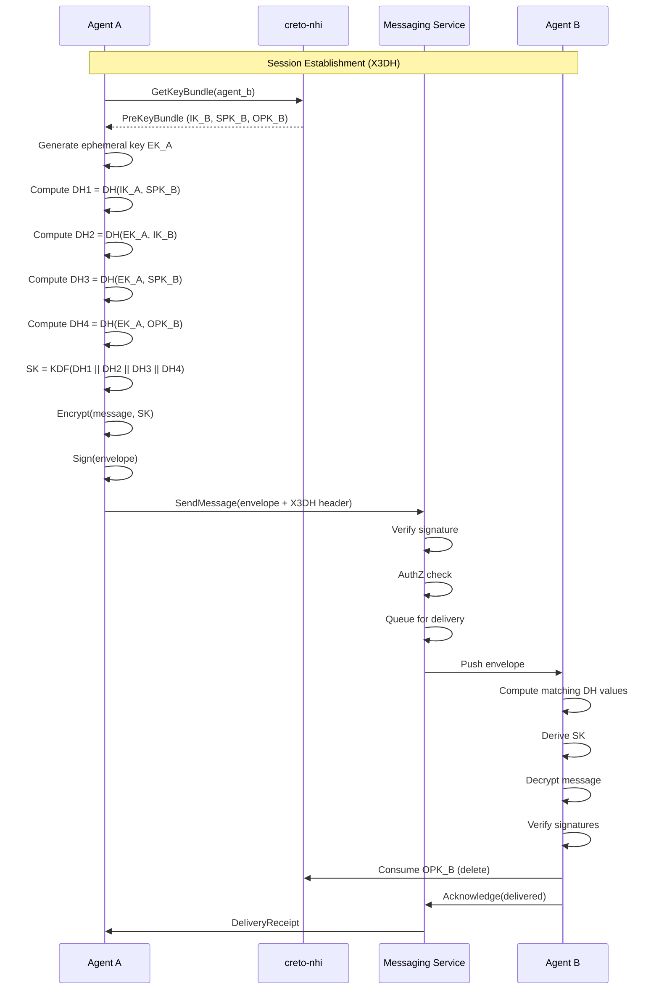
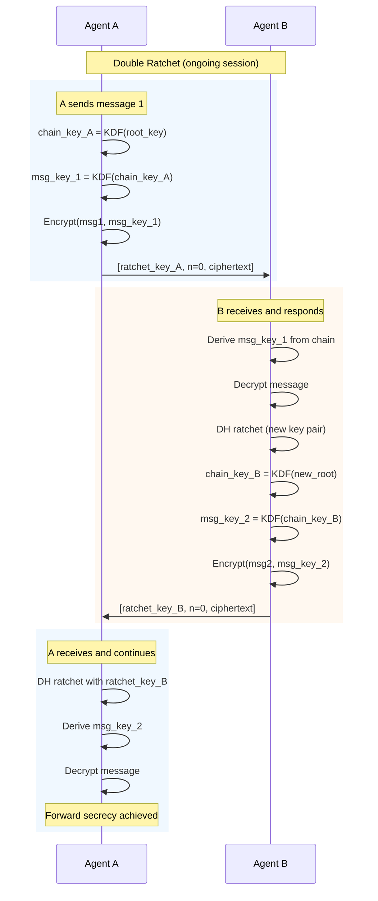
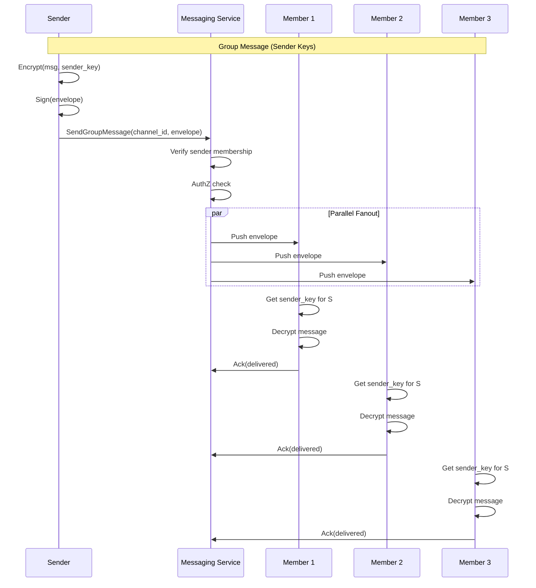

# MASTER Messaging Software Design Document

**Authoritative Reference for creto-messaging Implementation**

This document consolidates all Messaging SDD sections into a single, complete reference with full Signal Protocol implementation details adapted for Non-Human Identities (NHI).

---

## Table of Contents

1. [Executive Summary](#1-executive-summary)
2. [Signal Protocol for Agents (P0 Gap Resolution)](#2-signal-protocol-for-agents-p0-gap-resolution)
3. [X3DH Key Agreement](#3-x3dh-key-agreement)
4. [Double Ratchet Algorithm](#4-double-ratchet-algorithm)
5. [PQXDH Post-Quantum Extension](#5-pqxdh-post-quantum-extension)
6. [Core Data Model](#6-core-data-model)
7. [Message Envelope Format](#7-message-envelope-format)
8. [Key Management & Rotation](#8-key-management--rotation)
9. [Group Messaging (Sender Keys)](#9-group-messaging-sender-keys)
10. [Message Delivery System](#10-message-delivery-system)
11. [API Contracts](#11-api-contracts)
12. [Integration Contracts](#12-integration-contracts)
13. [Error Taxonomy](#13-error-taxonomy)
14. [Edge Cases & Failure Modes](#14-edge-cases--failure-modes)
15. [Sequence Diagrams](#15-sequence-diagrams)
16. [Performance Specifications](#16-performance-specifications)
17. [Security Model](#17-security-model)
18. [Operational Runbook](#18-operational-runbook)

---

## 1. Executive Summary

### 1.1 Purpose

Creto Messaging provides **end-to-end encrypted communication** for AI agents with cryptographic guarantees of confidentiality, authenticity, forward secrecy, and post-compromise security. Built on Signal Protocol patterns adapted for Non-Human Identities.

### 1.2 Design Philosophy

**Pattern: Extract from Signal Protocol, Rebuild with Sovereign Primitives**

| OSS Reference | What We Extracted | Creto Enhancement |
|---------------|-------------------|-------------------|
| **Signal Protocol** | X3DH, Double Ratchet | NHI keys replace phone numbers |
| **Signal PQXDH** | Post-quantum extension | ML-KEM-768 encapsulation |
| **libsignal** | Rust implementation patterns | Hybrid Ed25519 + ML-DSA-65 |
| **Matrix/MLS** | Group messaging patterns | Sender Keys with NHI |

### 1.2.1 CRITICAL: Pattern Sources vs. Runtime Dependencies

> **⚠️ NO CODE FROM LIBSIGNAL IS IMPORTED INTO creto-messaging**
>
> The table above shows **protocol specifications** studied during design.
> creto-messaging implements X3DH and Double Ratchet **from IETF/Signal specs**,
> not by importing libsignal. It is a **complete Rust implementation** using Creto primitives.
>
> **Actual Dependencies (Cargo.toml):**
> - `creto-nhi` (agent identity, replaces phone numbers)
> - `creto-crypto` (ML-KEM-768, ML-DSA-65, X25519, AES-256-GCM)
> - `creto-authz` (168ns delivery policy)
> - `creto-storage` (encrypted message persistence)
> - `creto-audit` (Merkle-anchored logs)
>
> **NOT Dependencies:** libsignal, signal-protocol, matrix-sdk

### 1.3 Key Capabilities

| Capability | Specification | Notes |
|------------|---------------|-------|
| Encryption Throughput | >100,000 msg/sec | AES-256-GCM |
| Forward Secrecy | Per-message | Double Ratchet |
| Post-Quantum Ready | ML-KEM-768 | NIST Level 3 |
| Delivery Latency | <10ms (p99) | Regional |
| AuthZ Check | 168ns inline | Per-message |

### 1.4 Creto Differentiators

1. **Agent NHI as Identity**: Cryptographic identity replaces phone numbers
2. **Hybrid Signatures**: Ed25519 + ML-DSA-65 for quantum resistance
3. **Delegation Chain**: Message metadata includes spawn hierarchy
4. **Policy-Gated Delivery**: AuthZ enforced before delivery
5. **Consensus Timestamps**: Prevents replay attacks

---

## 2. Signal Protocol for Agents (P0 Gap Resolution)

### 2.1 Problem Statement

Traditional Signal Protocol assumes:
- Human users with phone numbers
- Mobile devices with persistent storage
- Interactive key exchange

**Creto requires**:
- Machine identities (NHI) with cryptographic keys
- Ephemeral agent runtimes (sandboxes)
- Automated key management
- Post-quantum cryptography

### 2.2 Protocol Adaptation Overview

```
┌─────────────────────────────────────────────────────────────────┐
│                SIGNAL → CRETO ADAPTATION                        │
├─────────────────────────────────────────────────────────────────┤
│ Signal Component        → Creto Component                       │
├─────────────────────────────────────────────────────────────────┤
│ Phone Number            → Agent NHI (AgentIdentity)             │
│ Identity Key (Ed25519)  → NHI Identity Key (Ed25519 + ML-DSA)   │
│ Signed Pre-Key (X25519) → Signed Pre-Key (X25519 + ML-KEM)      │
│ One-Time Pre-Key        → One-Time Pre-Key (ML-KEM-768)         │
│ Signal Server           → Creto Messaging Service               │
│ Sealed Sender           → Delegation Chain Metadata             │
│ Key Directory           → creto-nhi Service                     │
│ Trust Model             → creto-authz Policy Engine             │
└─────────────────────────────────────────────────────────────────┘
```

### 2.3 Key Type Mapping

```rust
/// NHI Key Bundle (equivalent to Signal's PreKey Bundle)
#[derive(Clone, Serialize, Deserialize)]
pub struct NhiKeyBundle {
    /// Agent identity
    pub agent_nhi: AgentIdentity,

    /// Long-term identity keys (never rotated)
    pub identity_key_ed25519: Ed25519PublicKey,
    pub identity_key_ml_dsa: MlDsa65PublicKey,

    /// Signed pre-key (rotated monthly)
    pub signed_pre_key: SignedPreKey,
    pub signed_pre_key_signature: HybridSignature,

    /// One-time pre-keys (consumed on use)
    pub one_time_pre_keys: Vec<OneTimePreKey>,

    /// Bundle version for cache invalidation
    pub version: u64,

    /// Timestamp for freshness checks
    pub created_at: ConsensusTimestamp,
}

#[derive(Clone, Serialize, Deserialize)]
pub struct SignedPreKey {
    pub id: PreKeyId,
    pub public_key_x25519: X25519PublicKey,
    pub public_key_ml_kem: MlKem768PublicKey,
    pub created_at: ConsensusTimestamp,
    pub expires_at: ConsensusTimestamp,
}

#[derive(Clone, Serialize, Deserialize)]
pub struct OneTimePreKey {
    pub id: PreKeyId,
    pub public_key_ml_kem: MlKem768PublicKey,
}
```

---

## 3. X3DH Key Agreement

### 3.1 Protocol Overview

Extended Triple Diffie-Hellman (X3DH) establishes a shared secret between two parties who have never communicated. Creto extends this with ML-KEM for post-quantum security.

### 3.2 Creto X3DH Algorithm

```rust
/// X3DH Key Agreement (Creto adaptation)
///
/// Sender (Agent A) establishes shared secret with Recipient (Agent B)
/// without prior communication.

pub struct X3dhKeyAgreement {
    nhi_client: Arc<NhiClient>,
}

impl X3dhKeyAgreement {
    /// Initiate X3DH key agreement (sender side)
    pub async fn initiate(
        &self,
        sender_nhi: &AgentIdentity,
        recipient_nhi: &AgentIdentity,
    ) -> Result<X3dhInitiation, KeyAgreementError> {
        // 1. Fetch recipient's pre-key bundle
        let bundle = self.nhi_client
            .get_key_bundle(recipient_nhi)
            .await?;

        // 2. Verify signed pre-key signature
        self.verify_signed_pre_key(&bundle)?;

        // 3. Generate ephemeral key pair (X25519 + ML-KEM)
        let ephemeral_x25519 = X25519KeyPair::generate();
        let ephemeral_ml_kem = MlKem768KeyPair::generate();

        // 4. Consume one-time pre-key if available
        let one_time_key = bundle.one_time_pre_keys.first();

        // 5. Compute DH shared secrets (classical X3DH)
        // DH1 = DH(sender_identity, recipient_signed_prekey)
        let dh1 = self.nhi_client
            .ecdh(sender_nhi, &bundle.signed_pre_key.public_key_x25519)
            .await?;

        // DH2 = DH(sender_ephemeral, recipient_identity)
        let dh2 = ephemeral_x25519.diffie_hellman(
            &bundle.identity_key_ed25519.to_x25519()
        );

        // DH3 = DH(sender_ephemeral, recipient_signed_prekey)
        let dh3 = ephemeral_x25519.diffie_hellman(
            &bundle.signed_pre_key.public_key_x25519
        );

        // DH4 = DH(sender_ephemeral, recipient_one_time_key) if available
        let dh4 = one_time_key.map(|otk| {
            ephemeral_x25519.diffie_hellman(&otk.public_key_x25519)
        });

        // 6. Compute ML-KEM encapsulation (post-quantum extension)
        let (ml_kem_ciphertext, ml_kem_shared) = ml_kem_768::encapsulate(
            &bundle.signed_pre_key.public_key_ml_kem
        );

        // 7. Derive master secret using HKDF-SHA3-256
        let input_key_material = concat_secrets(&[
            &dh1, &dh2, &dh3,
            dh4.as_ref().unwrap_or(&[0u8; 32]),
            &ml_kem_shared,
        ]);

        let info = format!(
            "X3DH:{}:{}:{}",
            sender_nhi.to_string(),
            recipient_nhi.to_string(),
            bundle.version
        );

        let master_secret = hkdf_sha3_256(
            &input_key_material,
            &[], // salt
            info.as_bytes(),
            64,  // 32 bytes root key + 32 bytes chain key
        );

        let (root_key, chain_key) = master_secret.split_at(32);

        // 8. Build X3DH message header
        let header = X3dhHeader {
            sender_identity: sender_nhi.clone(),
            sender_ephemeral_x25519: ephemeral_x25519.public_key(),
            sender_ephemeral_ml_kem: ephemeral_ml_kem.public_key(),
            recipient_signed_prekey_id: bundle.signed_pre_key.id,
            recipient_one_time_key_id: one_time_key.map(|k| k.id),
            ml_kem_ciphertext,
        };

        Ok(X3dhInitiation {
            header,
            root_key: root_key.try_into().unwrap(),
            chain_key: chain_key.try_into().unwrap(),
        })
    }

    /// Process X3DH initiation (recipient side)
    pub async fn process(
        &self,
        recipient_nhi: &AgentIdentity,
        header: &X3dhHeader,
    ) -> Result<X3dhSession, KeyAgreementError> {
        // 1. Load private keys from NHI
        let identity_key = self.nhi_client
            .get_private_key(recipient_nhi, KeyType::Identity)
            .await?;

        let signed_pre_key = self.nhi_client
            .get_signed_pre_key(recipient_nhi, header.recipient_signed_prekey_id)
            .await?;

        // 2. Load one-time pre-key if specified (and delete after use)
        let one_time_key = if let Some(otk_id) = header.recipient_one_time_key_id {
            Some(self.nhi_client
                .consume_one_time_key(recipient_nhi, otk_id)
                .await?)
        } else {
            None
        };

        // 3. Compute DH shared secrets (mirror sender's computation)
        let dh1 = signed_pre_key.ecdh(&header.sender_identity.to_x25519());
        let dh2 = identity_key.ecdh(&header.sender_ephemeral_x25519);
        let dh3 = signed_pre_key.ecdh(&header.sender_ephemeral_x25519);
        let dh4 = one_time_key.as_ref().map(|otk| {
            otk.ecdh(&header.sender_ephemeral_x25519)
        });

        // 4. Decapsulate ML-KEM shared secret
        let ml_kem_shared = self.nhi_client
            .ml_kem_decapsulate(
                recipient_nhi,
                &header.ml_kem_ciphertext,
                header.recipient_signed_prekey_id,
            )
            .await?;

        // 5. Derive master secret (identical to sender)
        let input_key_material = concat_secrets(&[
            &dh1, &dh2, &dh3,
            dh4.as_ref().unwrap_or(&[0u8; 32]),
            &ml_kem_shared,
        ]);

        let info = format!(
            "X3DH:{}:{}:{}",
            header.sender_identity.to_string(),
            recipient_nhi.to_string(),
            self.get_bundle_version(recipient_nhi).await?,
        );

        let master_secret = hkdf_sha3_256(
            &input_key_material,
            &[],
            info.as_bytes(),
            64,
        );

        let (root_key, chain_key) = master_secret.split_at(32);

        Ok(X3dhSession {
            peer_nhi: header.sender_identity.clone(),
            root_key: root_key.try_into().unwrap(),
            chain_key: chain_key.try_into().unwrap(),
            peer_ratchet_key: header.sender_ephemeral_x25519.clone(),
        })
    }
}
```

### 3.3 X3DH Security Properties

| Property | Mechanism | Notes |
|----------|-----------|-------|
| **Mutual Authentication** | Identity key signatures | Both parties prove identity |
| **Forward Secrecy** | Ephemeral keys | Past messages protected if identity key compromised |
| **Post-Quantum** | ML-KEM encapsulation | Resistant to quantum attacks |
| **Deniability** | No long-term key in DH | Plausible deniability for sender |
| **Replay Protection** | One-time pre-keys + timestamps | Consumed keys can't be reused |

---

## 4. Double Ratchet Algorithm

### 4.1 Overview

The Double Ratchet provides **per-message forward secrecy** and **post-compromise security** through continuous key rotation.

### 4.2 Ratchet State

```rust
/// Double Ratchet session state
#[derive(Clone, Serialize, Deserialize)]
pub struct RatchetState {
    /// Our current DH ratchet key pair
    pub our_ratchet_key: X25519KeyPair,

    /// Peer's current DH ratchet public key
    pub peer_ratchet_key: Option<X25519PublicKey>,

    /// Root key (updated on DH ratchet step)
    pub root_key: [u8; 32],

    /// Sending chain key
    pub sending_chain_key: Option<[u8; 32]>,

    /// Receiving chain key
    pub receiving_chain_key: Option<[u8; 32]>,

    /// Sending message number
    pub sending_message_number: u64,

    /// Receiving message number
    pub receiving_message_number: u64,

    /// Previous sending chain length (for header)
    pub previous_chain_length: u64,

    /// Skipped message keys (for out-of-order delivery)
    pub skipped_keys: HashMap<(X25519PublicKey, u64), MessageKey>,

    /// Maximum skipped keys to store
    pub max_skip: u64,
}

/// Message encryption key derived from chain
#[derive(Clone, Zeroize)]
pub struct MessageKey([u8; 32]);
```

### 4.3 Ratchet Operations

```rust
impl RatchetState {
    /// Initialize from X3DH session
    pub fn from_x3dh(session: X3dhSession, is_initiator: bool) -> Self {
        if is_initiator {
            // Initiator sends first, has sending chain
            Self {
                our_ratchet_key: X25519KeyPair::generate(),
                peer_ratchet_key: Some(session.peer_ratchet_key),
                root_key: session.root_key,
                sending_chain_key: Some(session.chain_key),
                receiving_chain_key: None,
                sending_message_number: 0,
                receiving_message_number: 0,
                previous_chain_length: 0,
                skipped_keys: HashMap::new(),
                max_skip: 1000,
            }
        } else {
            // Responder receives first, has receiving chain
            Self {
                our_ratchet_key: X25519KeyPair::generate(),
                peer_ratchet_key: Some(session.peer_ratchet_key),
                root_key: session.root_key,
                sending_chain_key: None,
                receiving_chain_key: Some(session.chain_key),
                sending_message_number: 0,
                receiving_message_number: 0,
                previous_chain_length: 0,
                skipped_keys: HashMap::new(),
                max_skip: 1000,
            }
        }
    }

    /// DH Ratchet step (when receiving new ratchet key from peer)
    fn dh_ratchet(&mut self, peer_ratchet_key: X25519PublicKey) {
        // Save previous chain length
        self.previous_chain_length = self.sending_message_number;
        self.sending_message_number = 0;
        self.receiving_message_number = 0;

        // Update peer key
        self.peer_ratchet_key = Some(peer_ratchet_key.clone());

        // Derive new receiving chain
        let dh_output = self.our_ratchet_key.diffie_hellman(&peer_ratchet_key);
        let (new_root_key, receiving_chain_key) = kdf_rk(&self.root_key, &dh_output);
        self.root_key = new_root_key;
        self.receiving_chain_key = Some(receiving_chain_key);

        // Generate new ratchet key pair
        self.our_ratchet_key = X25519KeyPair::generate();

        // Derive new sending chain
        let dh_output = self.our_ratchet_key.diffie_hellman(&peer_ratchet_key);
        let (new_root_key, sending_chain_key) = kdf_rk(&self.root_key, &dh_output);
        self.root_key = new_root_key;
        self.sending_chain_key = Some(sending_chain_key);
    }

    /// Symmetric key ratchet (advance chain by one message)
    fn chain_ratchet(chain_key: &[u8; 32]) -> ([u8; 32], MessageKey) {
        // KDF to derive message key and next chain key
        let output = hkdf_sha3_256(
            chain_key,
            &[0x01], // message key constant
            b"MessageKey",
            32,
        );
        let message_key = MessageKey(output.try_into().unwrap());

        let output = hkdf_sha3_256(
            chain_key,
            &[0x02], // chain key constant
            b"ChainKey",
            32,
        );
        let next_chain_key: [u8; 32] = output.try_into().unwrap();

        (next_chain_key, message_key)
    }

    /// Encrypt a message
    pub fn encrypt(&mut self, plaintext: &[u8]) -> Result<RatchetMessage, RatchetError> {
        // Ensure we have a sending chain
        let chain_key = self.sending_chain_key
            .ok_or(RatchetError::NoSendingChain)?;

        // Derive message key
        let (next_chain, message_key) = Self::chain_ratchet(&chain_key);
        self.sending_chain_key = Some(next_chain);

        // Build header
        let header = RatchetHeader {
            ratchet_key: self.our_ratchet_key.public_key(),
            message_number: self.sending_message_number,
            previous_chain_length: self.previous_chain_length,
        };

        self.sending_message_number += 1;

        // Encrypt with AES-256-GCM
        let nonce = generate_nonce();
        let aad = header.to_bytes();
        let ciphertext = aes_256_gcm_encrypt(
            &message_key.0,
            &nonce,
            plaintext,
            &aad,
        )?;

        // Zeroize message key
        drop(message_key);

        Ok(RatchetMessage {
            header,
            nonce,
            ciphertext,
        })
    }

    /// Decrypt a message
    pub fn decrypt(&mut self, message: &RatchetMessage) -> Result<Vec<u8>, RatchetError> {
        // Check if this is from a new ratchet key
        let needs_dh_ratchet = self.peer_ratchet_key
            .as_ref()
            .map(|k| k != &message.header.ratchet_key)
            .unwrap_or(true);

        if needs_dh_ratchet {
            // Skip any messages we missed from old chain
            self.skip_messages(message.header.previous_chain_length)?;

            // Perform DH ratchet
            self.dh_ratchet(message.header.ratchet_key.clone());
        }

        // Skip to the right message number
        self.skip_messages(message.header.message_number)?;

        // Derive message key
        let chain_key = self.receiving_chain_key
            .ok_or(RatchetError::NoReceivingChain)?;
        let (next_chain, message_key) = Self::chain_ratchet(&chain_key);
        self.receiving_chain_key = Some(next_chain);
        self.receiving_message_number += 1;

        // Decrypt with AES-256-GCM
        let aad = message.header.to_bytes();
        let plaintext = aes_256_gcm_decrypt(
            &message_key.0,
            &message.nonce,
            &message.ciphertext,
            &aad,
        )?;

        // Zeroize message key
        drop(message_key);

        Ok(plaintext)
    }

    /// Skip messages (store keys for out-of-order delivery)
    fn skip_messages(&mut self, until: u64) -> Result<(), RatchetError> {
        if self.receiving_message_number + self.max_skip < until {
            return Err(RatchetError::TooManySkipped);
        }

        if let Some(ref mut chain_key) = self.receiving_chain_key {
            while self.receiving_message_number < until {
                let (next_chain, message_key) = Self::chain_ratchet(chain_key);

                // Store skipped key
                let key = (
                    self.peer_ratchet_key.clone().unwrap(),
                    self.receiving_message_number,
                );
                self.skipped_keys.insert(key, message_key);

                *chain_key = next_chain;
                self.receiving_message_number += 1;
            }
        }

        Ok(())
    }
}
```

### 4.4 Double Ratchet Security Properties

| Property | Mechanism | Blast Radius |
|----------|-----------|--------------|
| **Forward Secrecy** | Continuous key deletion | Single message if message key compromised |
| **Post-Compromise Security** | DH ratchet on receive | Heals within 1 round-trip after compromise |
| **Out-of-Order Delivery** | Skipped key storage | Up to `max_skip` messages |
| **Replay Protection** | Message number tracking | Duplicates rejected |

---

## 5. PQXDH Post-Quantum Extension

### 5.1 Overview

PQXDH (Post-Quantum X3DH) extends X3DH with ML-KEM-768 to provide quantum resistance while maintaining classical security.

### 5.2 Hybrid Key Encapsulation

```rust
/// PQXDH combines X25519 ECDH with ML-KEM-768 encapsulation
pub struct PqxdhKeyAgreement {
    x3dh: X3dhKeyAgreement,
}

impl PqxdhKeyAgreement {
    /// Initiate PQXDH (sender side)
    pub async fn initiate(
        &self,
        sender_nhi: &AgentIdentity,
        recipient_nhi: &AgentIdentity,
    ) -> Result<PqxdhInitiation, KeyAgreementError> {
        // Get recipient's PQXDH bundle (includes ML-KEM keys)
        let bundle = self.nhi_client
            .get_pqxdh_bundle(recipient_nhi)
            .await?;

        // 1. Classical X3DH components
        let x3dh_result = self.x3dh.initiate(sender_nhi, recipient_nhi).await?;

        // 2. ML-KEM-768 encapsulation for pqkem_ct
        let (pqkem_ct, pqkem_ss) = ml_kem_768::encapsulate(
            &bundle.pqkem_prekey.public_key
        );

        // 3. Combine secrets: SK = KDF(x3dh_sk || pqkem_ss)
        let combined_ikm = concat_secrets(&[
            &x3dh_result.shared_secret,
            &pqkem_ss,
        ]);

        let shared_secret = hkdf_sha3_256(
            &combined_ikm,
            &[],
            b"PQXDH:v1",
            64,
        );

        Ok(PqxdhInitiation {
            x3dh_header: x3dh_result.header,
            pqkem_ciphertext: pqkem_ct,
            shared_secret: shared_secret.try_into().unwrap(),
        })
    }

    /// Process PQXDH initiation (recipient side)
    pub async fn process(
        &self,
        recipient_nhi: &AgentIdentity,
        header: &PqxdhHeader,
    ) -> Result<PqxdhSession, KeyAgreementError> {
        // 1. Process classical X3DH
        let x3dh_session = self.x3dh.process(recipient_nhi, &header.x3dh_header).await?;

        // 2. Decapsulate ML-KEM
        let pqkem_ss = self.nhi_client
            .ml_kem_decapsulate(
                recipient_nhi,
                &header.pqkem_ciphertext,
                header.pqkem_prekey_id,
            )
            .await?;

        // 3. Combine secrets
        let combined_ikm = concat_secrets(&[
            &x3dh_session.shared_secret,
            &pqkem_ss,
        ]);

        let shared_secret = hkdf_sha3_256(
            &combined_ikm,
            &[],
            b"PQXDH:v1",
            64,
        );

        Ok(PqxdhSession {
            peer_nhi: header.x3dh_header.sender_identity.clone(),
            shared_secret: shared_secret.try_into().unwrap(),
        })
    }
}
```

### 5.3 PQXDH Bundle Format

```rust
/// PQXDH Pre-Key Bundle (extends X3DH bundle)
#[derive(Clone, Serialize, Deserialize)]
pub struct PqxdhBundle {
    /// Standard X3DH components
    pub x3dh_bundle: X3dhBundle,

    /// ML-KEM-768 signed pre-key
    pub pqkem_prekey: PqkemPreKey,

    /// Signature over pqkem_prekey using identity key
    pub pqkem_prekey_signature: HybridSignature,

    /// One-time PQKEM keys (consumed on use)
    pub pqkem_one_time_keys: Vec<PqkemOneTimeKey>,
}

#[derive(Clone, Serialize, Deserialize)]
pub struct PqkemPreKey {
    pub id: PreKeyId,
    pub public_key: MlKem768PublicKey,
    pub created_at: ConsensusTimestamp,
    pub expires_at: ConsensusTimestamp,
}
```

---

## 6. Core Data Model

### 6.1 Database Schema

```sql
-- ============================================================================
-- MESSAGING CORE SCHEMA
-- ============================================================================

-- Pre-key bundles (server stores public keys)
CREATE TABLE prekey_bundles (
    agent_nhi              TEXT PRIMARY KEY,
    identity_key_ed25519   BYTEA NOT NULL,
    identity_key_ml_dsa    BYTEA NOT NULL,
    signed_prekey_id       BIGINT NOT NULL,
    signed_prekey_x25519   BYTEA NOT NULL,
    signed_prekey_ml_kem   BYTEA NOT NULL,
    signed_prekey_sig      BYTEA NOT NULL,
    pqkem_prekey_id        BIGINT,
    pqkem_prekey           BYTEA,
    pqkem_prekey_sig       BYTEA,
    bundle_version         BIGINT NOT NULL DEFAULT 1,
    created_at             TIMESTAMPTZ NOT NULL DEFAULT NOW(),
    updated_at             TIMESTAMPTZ NOT NULL DEFAULT NOW()
);

-- One-time pre-keys (consumed on use)
CREATE TABLE one_time_prekeys (
    id                     BIGSERIAL PRIMARY KEY,
    agent_nhi              TEXT NOT NULL REFERENCES prekey_bundles(agent_nhi),
    prekey_id              BIGINT NOT NULL,
    public_key_ml_kem      BYTEA NOT NULL,
    created_at             TIMESTAMPTZ NOT NULL DEFAULT NOW(),
    consumed_at            TIMESTAMPTZ,
    consumed_by            TEXT,
    UNIQUE (agent_nhi, prekey_id)
);

CREATE INDEX idx_otk_available ON one_time_prekeys (agent_nhi)
    WHERE consumed_at IS NULL;

-- Message envelopes (encrypted messages in transit)
CREATE TABLE message_envelopes (
    message_id             UUID PRIMARY KEY DEFAULT gen_random_uuid(),
    sender_nhi             TEXT NOT NULL,
    recipient_nhi          TEXT NOT NULL,
    channel_id             UUID,

    -- Encrypted content
    ciphertext             BYTEA NOT NULL,
    nonce                  BYTEA NOT NULL,
    wrapped_key            BYTEA NOT NULL,
    key_id                 BIGINT NOT NULL,

    -- Ratchet header (if using Double Ratchet)
    ratchet_key            BYTEA,
    message_number         BIGINT,
    previous_chain_length  BIGINT,

    -- Signatures
    signature_ed25519      BYTEA NOT NULL,
    signature_ml_dsa       BYTEA NOT NULL,

    -- Metadata
    priority               SMALLINT NOT NULL DEFAULT 0,
    ttl_seconds            INT NOT NULL DEFAULT 86400,
    correlation_id         UUID,
    delegation_chain       JSONB,

    -- Delivery tracking
    created_at             TIMESTAMPTZ NOT NULL DEFAULT NOW(),
    expires_at             TIMESTAMPTZ NOT NULL,
    delivered_at           TIMESTAMPTZ,
    acknowledged_at        TIMESTAMPTZ,

    CONSTRAINT valid_ttl CHECK (ttl_seconds > 0 AND ttl_seconds <= 604800)
);

CREATE INDEX idx_envelopes_recipient ON message_envelopes (recipient_nhi, created_at)
    WHERE delivered_at IS NULL;
CREATE INDEX idx_envelopes_expiry ON message_envelopes (expires_at)
    WHERE delivered_at IS NULL;

-- Delivery receipts
CREATE TABLE delivery_receipts (
    id                     BIGSERIAL PRIMARY KEY,
    message_id             UUID NOT NULL REFERENCES message_envelopes(message_id),
    receipt_type           TEXT NOT NULL CHECK (receipt_type IN ('delivered', 'read', 'failed')),
    recipient_nhi          TEXT NOT NULL,
    timestamp              TIMESTAMPTZ NOT NULL DEFAULT NOW(),
    signature              BYTEA NOT NULL,
    failure_reason         TEXT
);

CREATE INDEX idx_receipts_message ON delivery_receipts (message_id);

-- Channels (group messaging)
CREATE TABLE channels (
    channel_id             UUID PRIMARY KEY DEFAULT gen_random_uuid(),
    name                   TEXT NOT NULL,
    channel_type           TEXT NOT NULL CHECK (channel_type IN ('direct', 'group', 'broadcast')),
    creator_nhi            TEXT NOT NULL,
    sender_key             BYTEA,  -- For group messaging
    sender_key_version     BIGINT DEFAULT 0,
    max_members            INT DEFAULT 100,
    created_at             TIMESTAMPTZ NOT NULL DEFAULT NOW(),
    updated_at             TIMESTAMPTZ NOT NULL DEFAULT NOW()
);

-- Channel memberships
CREATE TABLE channel_members (
    channel_id             UUID NOT NULL REFERENCES channels(channel_id),
    member_nhi             TEXT NOT NULL,
    role                   TEXT NOT NULL DEFAULT 'member' CHECK (role IN ('admin', 'member', 'readonly')),
    joined_at              TIMESTAMPTZ NOT NULL DEFAULT NOW(),
    sender_key_received    BIGINT DEFAULT 0,
    PRIMARY KEY (channel_id, member_nhi)
);

-- Ratchet session state (client-side, but server can store encrypted)
CREATE TABLE ratchet_sessions (
    session_id             UUID PRIMARY KEY DEFAULT gen_random_uuid(),
    local_nhi              TEXT NOT NULL,
    peer_nhi               TEXT NOT NULL,
    encrypted_state        BYTEA NOT NULL,  -- Encrypted with local key
    state_version          BIGINT NOT NULL DEFAULT 1,
    created_at             TIMESTAMPTZ NOT NULL DEFAULT NOW(),
    updated_at             TIMESTAMPTZ NOT NULL DEFAULT NOW(),
    UNIQUE (local_nhi, peer_nhi)
);
```

### 6.2 Rust Types

```rust
/// Message envelope (wire format)
#[derive(Clone, Serialize, Deserialize)]
pub struct MessageEnvelope {
    pub message_id: Uuid,
    pub sender_nhi: AgentIdentity,
    pub recipient_nhi: AgentIdentity,
    pub channel_id: Option<Uuid>,

    // Encrypted content
    pub ciphertext: Vec<u8>,
    pub nonce: [u8; 12],
    pub wrapped_key: Vec<u8>,
    pub key_id: u64,

    // Ratchet header (Double Ratchet mode)
    pub ratchet_header: Option<RatchetHeader>,

    // Hybrid signatures
    pub signature_ed25519: Ed25519Signature,
    pub signature_ml_dsa: MlDsa65Signature,

    // Metadata
    pub priority: Priority,
    pub ttl_seconds: u32,
    pub correlation_id: Option<Uuid>,
    pub delegation_chain: Vec<AgentIdentity>,
    pub timestamp: ConsensusTimestamp,
}

#[derive(Clone, Serialize, Deserialize)]
pub struct RatchetHeader {
    pub ratchet_key: X25519PublicKey,
    pub message_number: u64,
    pub previous_chain_length: u64,
}

#[derive(Clone, Copy, Serialize, Deserialize)]
#[repr(u8)]
pub enum Priority {
    Low = 0,
    Normal = 1,
    High = 2,
    Critical = 3,
}
```

---

## 7. Message Envelope Format

### 7.1 Wire Format

```
┌─────────────────────────────────────────────────────────────────┐
│                    MESSAGE ENVELOPE (v1)                        │
├─────────────────────────────────────────────────────────────────┤
│ Version          [1 byte]   = 0x01                              │
│ Flags            [1 byte]   = [ratchet][priority][...]          │
│ Message ID       [16 bytes] = UUID                              │
├─────────────────────────────────────────────────────────────────┤
│ Sender NHI Len   [2 bytes]  = varint                            │
│ Sender NHI       [variable] = AgentIdentity                     │
│ Recipient NHI Len[2 bytes]  = varint                            │
│ Recipient NHI    [variable] = AgentIdentity                     │
├─────────────────────────────────────────────────────────────────┤
│ Channel ID       [16 bytes] = UUID (optional, if flag set)      │
├─────────────────────────────────────────────────────────────────┤
│ Ratchet Header   [variable] = (if flag set)                     │
│   Ratchet Key    [32 bytes] = X25519 public key                 │
│   Message Number [8 bytes]  = u64                               │
│   Prev Chain Len [8 bytes]  = u64                               │
├─────────────────────────────────────────────────────────────────┤
│ Wrapped Key Len  [2 bytes]  = varint                            │
│ Wrapped Key      [variable] = ML-KEM ciphertext (~1088 bytes)   │
│ Key ID           [8 bytes]  = u64                               │
│ Nonce            [12 bytes] = AES-GCM nonce                     │
│ Ciphertext Len   [4 bytes]  = u32                               │
│ Ciphertext       [variable] = AES-256-GCM encrypted payload     │
├─────────────────────────────────────────────────────────────────┤
│ Delegation Len   [1 byte]   = number of agents in chain         │
│ Delegation Chain [variable] = [AgentIdentity, ...]              │
│ Timestamp        [8 bytes]  = ConsensusTimestamp                │
│ TTL              [4 bytes]  = seconds until expiry              │
│ Correlation ID   [16 bytes] = UUID (optional)                   │
├─────────────────────────────────────────────────────────────────┤
│ Sig Ed25519      [64 bytes] = Ed25519 signature                 │
│ Sig ML-DSA Len   [2 bytes]  = varint (~2420 bytes for ML-DSA-65)│
│ Sig ML-DSA       [variable] = ML-DSA-65 signature               │
└─────────────────────────────────────────────────────────────────┘
```

### 7.2 Canonical Bytes (for signing)

```rust
impl MessageEnvelope {
    /// Compute canonical representation for signing
    pub fn to_canonical_bytes(&self) -> Vec<u8> {
        let mut buf = Vec::with_capacity(4096);

        // Version
        buf.push(0x01);

        // Message ID
        buf.extend_from_slice(self.message_id.as_bytes());

        // Identities
        buf.extend_from_slice(&self.sender_nhi.to_bytes());
        buf.extend_from_slice(&self.recipient_nhi.to_bytes());

        // Channel (if present)
        if let Some(ref channel_id) = self.channel_id {
            buf.push(0x01);
            buf.extend_from_slice(channel_id.as_bytes());
        } else {
            buf.push(0x00);
        }

        // Ratchet header (if present)
        if let Some(ref header) = self.ratchet_header {
            buf.push(0x01);
            buf.extend_from_slice(&header.ratchet_key.as_bytes());
            buf.extend_from_slice(&header.message_number.to_le_bytes());
            buf.extend_from_slice(&header.previous_chain_length.to_le_bytes());
        } else {
            buf.push(0x00);
        }

        // Crypto material
        buf.extend_from_slice(&(self.wrapped_key.len() as u16).to_le_bytes());
        buf.extend_from_slice(&self.wrapped_key);
        buf.extend_from_slice(&self.key_id.to_le_bytes());
        buf.extend_from_slice(&self.nonce);
        buf.extend_from_slice(&(self.ciphertext.len() as u32).to_le_bytes());
        buf.extend_from_slice(&self.ciphertext);

        // Metadata
        buf.extend_from_slice(&self.timestamp.to_bytes());
        buf.extend_from_slice(&self.ttl_seconds.to_le_bytes());

        // Delegation chain
        buf.push(self.delegation_chain.len() as u8);
        for agent in &self.delegation_chain {
            buf.extend_from_slice(&agent.to_bytes());
        }

        buf
    }
}
```

---

## 8. Key Management & Rotation

### 8.1 Key Lifecycle

```
┌─────────────────────────────────────────────────────────────────┐
│                    KEY LIFECYCLE                                │
├─────────────────────────────────────────────────────────────────┤
│                                                                 │
│  Identity Keys (Ed25519 + ML-DSA-65)                           │
│  ├─ Creation: Agent registration                               │
│  ├─ Rotation: NEVER (or emergency compromise)                  │
│  └─ Storage: HSM / secure enclave                              │
│                                                                 │
│  Signed Pre-Keys (X25519 + ML-KEM-768)                         │
│  ├─ Creation: Every 30 days                                    │
│  ├─ Rotation: Monthly (old key valid 7 days overlap)           │
│  └─ Storage: Encrypted at rest                                 │
│                                                                 │
│  One-Time Pre-Keys (ML-KEM-768)                                │
│  ├─ Creation: Batch of 100 on registration                     │
│  ├─ Rotation: Consumed on use, replenish at 20 remaining       │
│  └─ Storage: Server-side (public keys only)                    │
│                                                                 │
│  Session Keys (Double Ratchet)                                 │
│  ├─ Creation: Per-message derivation                           │
│  ├─ Rotation: Every message (forward secrecy)                  │
│  └─ Storage: Memory only, never persisted                      │
│                                                                 │
└─────────────────────────────────────────────────────────────────┘
```

### 8.2 Key Rotation Service

```rust
pub struct KeyRotationService {
    nhi_client: Arc<NhiClient>,
    messaging_client: Arc<MessagingClient>,
    config: KeyRotationConfig,
}

#[derive(Clone, Debug)]
pub struct KeyRotationConfig {
    /// How often to rotate signed pre-keys
    pub signed_prekey_rotation: Duration,
    /// Overlap period for old pre-keys
    pub signed_prekey_overlap: Duration,
    /// Minimum one-time keys before replenish
    pub otk_min_threshold: usize,
    /// Batch size for OTK generation
    pub otk_batch_size: usize,
}

impl Default for KeyRotationConfig {
    fn default() -> Self {
        Self {
            signed_prekey_rotation: Duration::from_secs(30 * 24 * 3600), // 30 days
            signed_prekey_overlap: Duration::from_secs(7 * 24 * 3600),   // 7 days
            otk_min_threshold: 20,
            otk_batch_size: 100,
        }
    }
}

impl KeyRotationService {
    /// Check and perform necessary key rotations
    pub async fn check_rotation(&self, agent_nhi: &AgentIdentity) -> Result<(), KeyError> {
        // Check signed pre-key age
        let current_spk = self.nhi_client
            .get_current_signed_prekey(agent_nhi)
            .await?;

        if current_spk.age() > self.config.signed_prekey_rotation {
            self.rotate_signed_prekey(agent_nhi).await?;
        }

        // Check one-time key count
        let otk_count = self.messaging_client
            .get_otk_count(agent_nhi)
            .await?;

        if otk_count < self.config.otk_min_threshold {
            self.replenish_otks(agent_nhi).await?;
        }

        Ok(())
    }

    /// Rotate signed pre-key
    async fn rotate_signed_prekey(&self, agent_nhi: &AgentIdentity) -> Result<(), KeyError> {
        // 1. Generate new key pair
        let new_spk_x25519 = X25519KeyPair::generate();
        let new_spk_ml_kem = MlKem768KeyPair::generate();

        // 2. Sign with identity key
        let spk_data = concat(&[
            new_spk_x25519.public_key().as_bytes(),
            new_spk_ml_kem.public_key().as_bytes(),
        ]);

        let signature = self.nhi_client
            .sign_hybrid(agent_nhi, &spk_data)
            .await?;

        // 3. Store privately
        self.nhi_client
            .store_signed_prekey(agent_nhi, &new_spk_x25519, &new_spk_ml_kem)
            .await?;

        // 4. Upload public key to server
        self.messaging_client
            .upload_signed_prekey(SignedPreKeyUpload {
                agent_nhi: agent_nhi.clone(),
                public_key_x25519: new_spk_x25519.public_key(),
                public_key_ml_kem: new_spk_ml_kem.public_key(),
                signature,
            })
            .await?;

        // 5. Schedule old key deletion (after overlap period)
        self.schedule_key_deletion(agent_nhi, self.config.signed_prekey_overlap)
            .await?;

        Ok(())
    }

    /// Replenish one-time pre-keys
    async fn replenish_otks(&self, agent_nhi: &AgentIdentity) -> Result<(), KeyError> {
        let mut otks = Vec::with_capacity(self.config.otk_batch_size);

        for _ in 0..self.config.otk_batch_size {
            let key_pair = MlKem768KeyPair::generate();

            // Store private key locally
            self.nhi_client
                .store_one_time_key(agent_nhi, &key_pair)
                .await?;

            otks.push(OneTimePreKeyUpload {
                public_key: key_pair.public_key(),
            });
        }

        // Upload public keys to server
        self.messaging_client
            .upload_one_time_keys(agent_nhi, otks)
            .await?;

        Ok(())
    }
}
```

---

## 9. Group Messaging (Sender Keys)

### 9.1 Sender Keys Protocol

For group messaging, we use the Sender Keys pattern (similar to Signal's group messaging):

```rust
/// Sender Key for efficient group encryption
#[derive(Clone, Serialize, Deserialize)]
pub struct SenderKey {
    /// Key ID for tracking
    pub key_id: u64,

    /// The symmetric chain key
    pub chain_key: [u8; 32],

    /// Signing key for this sender
    pub signing_key: Ed25519PublicKey,

    /// Message counter
    pub iteration: u64,
}

pub struct GroupMessagingService {
    nhi_client: Arc<NhiClient>,
    messaging_client: Arc<MessagingClient>,
}

impl GroupMessagingService {
    /// Create a new group channel
    pub async fn create_group(
        &self,
        creator_nhi: &AgentIdentity,
        name: &str,
        initial_members: &[AgentIdentity],
    ) -> Result<GroupChannel, GroupError> {
        // 1. Generate sender key for creator
        let sender_key = self.generate_sender_key().await?;

        // 2. Create channel on server
        let channel = self.messaging_client
            .create_channel(CreateChannelRequest {
                creator_nhi: creator_nhi.clone(),
                name: name.to_string(),
                channel_type: ChannelType::Group,
                initial_members: initial_members.to_vec(),
            })
            .await?;

        // 3. Distribute sender key to all members via 1:1 messages
        for member in initial_members {
            self.distribute_sender_key(
                creator_nhi,
                member,
                &channel.id,
                &sender_key,
            ).await?;
        }

        Ok(GroupChannel {
            id: channel.id,
            name: channel.name,
            our_sender_key: sender_key,
            member_sender_keys: HashMap::new(),
        })
    }

    /// Send a message to the group
    pub async fn send_group_message(
        &self,
        sender_nhi: &AgentIdentity,
        channel: &mut GroupChannel,
        plaintext: &[u8],
    ) -> Result<MessageId, GroupError> {
        // 1. Derive message key from sender key chain
        let (message_key, next_chain_key) = derive_message_key(&channel.our_sender_key.chain_key);
        channel.our_sender_key.chain_key = next_chain_key;
        channel.our_sender_key.iteration += 1;

        // 2. Encrypt message with AES-256-GCM
        let nonce = generate_nonce();
        let ciphertext = aes_256_gcm_encrypt(
            &message_key,
            &nonce,
            plaintext,
            &channel.id.as_bytes(),
        )?;

        // 3. Sign with our signing key
        let signature = self.nhi_client
            .sign_ed25519(sender_nhi, &ciphertext)
            .await?;

        // 4. Build group message
        let message = GroupMessage {
            channel_id: channel.id,
            sender_nhi: sender_nhi.clone(),
            sender_key_id: channel.our_sender_key.key_id,
            iteration: channel.our_sender_key.iteration,
            nonce,
            ciphertext,
            signature,
        };

        // 5. Send to server for fanout
        let message_id = self.messaging_client
            .send_group_message(message)
            .await?;

        Ok(message_id)
    }

    /// Distribute sender key to a member (via 1:1 encrypted message)
    async fn distribute_sender_key(
        &self,
        from: &AgentIdentity,
        to: &AgentIdentity,
        channel_id: &Uuid,
        sender_key: &SenderKey,
    ) -> Result<(), GroupError> {
        let distribution = SenderKeyDistribution {
            channel_id: *channel_id,
            sender_key: sender_key.clone(),
        };

        let plaintext = serde_json::to_vec(&distribution)?;

        // Send via normal 1:1 encrypted channel
        self.messaging_client
            .send_direct_message(from, to, &plaintext, MessageType::SenderKeyDistribution)
            .await?;

        Ok(())
    }

    /// Handle receiving a sender key distribution
    pub async fn receive_sender_key(
        &self,
        channel: &mut GroupChannel,
        from: &AgentIdentity,
        distribution: SenderKeyDistribution,
    ) -> Result<(), GroupError> {
        // Verify channel ID matches
        if distribution.channel_id != channel.id {
            return Err(GroupError::ChannelMismatch);
        }

        // Store sender key for this member
        channel.member_sender_keys.insert(
            from.clone(),
            distribution.sender_key,
        );

        Ok(())
    }
}
```

### 9.2 Sender Key Rotation

```rust
impl GroupMessagingService {
    /// Rotate sender key (e.g., when member removed)
    pub async fn rotate_sender_key(
        &self,
        sender_nhi: &AgentIdentity,
        channel: &mut GroupChannel,
    ) -> Result<(), GroupError> {
        // 1. Generate new sender key
        let new_sender_key = self.generate_sender_key().await?;

        // 2. Get current members
        let members = self.messaging_client
            .get_channel_members(&channel.id)
            .await?;

        // 3. Distribute to all current members
        for member in &members {
            if member != sender_nhi {
                self.distribute_sender_key(
                    sender_nhi,
                    member,
                    &channel.id,
                    &new_sender_key,
                ).await?;
            }
        }

        // 4. Update local state
        channel.our_sender_key = new_sender_key;

        Ok(())
    }

    /// Remove member from group (triggers key rotation)
    pub async fn remove_member(
        &self,
        admin_nhi: &AgentIdentity,
        channel: &mut GroupChannel,
        member_to_remove: &AgentIdentity,
    ) -> Result<(), GroupError> {
        // 1. Remove from server
        self.messaging_client
            .remove_channel_member(&channel.id, member_to_remove)
            .await?;

        // 2. Rotate sender key (removed member won't receive new key)
        self.rotate_sender_key(admin_nhi, channel).await?;

        Ok(())
    }
}
```

---

## 10. Message Delivery System

### 10.1 Delivery Architecture

```
┌─────────────────────────────────────────────────────────────────┐
│                    DELIVERY PIPELINE                            │
├─────────────────────────────────────────────────────────────────┤
│                                                                 │
│  [Sender] ──┬──> [Signature Verify] ──> [AuthZ Gate]           │
│             │                              │                    │
│             │    ┌─────────────────────────┼─────────────┐      │
│             │    │     ENVELOPE PROCESSOR  │             │      │
│             │    │    ┌────────────────────▼──────────┐  │      │
│             │    │    │    Policy Check (168ns)       │  │      │
│             │    │    │    - Sender authorized?       │  │      │
│             │    │    │    - Recipient reachable?     │  │      │
│             │    │    │    - Rate limits OK?          │  │      │
│             │    │    └────────────────────┬──────────┘  │      │
│             │    │                         │             │      │
│             │    │    ┌────────────────────▼──────────┐  │      │
│             │    │    │    Delivery Router            │  │      │
│             │    │    │    - Direct delivery?         │  │      │
│             │    │    │    - Queue for offline?       │  │      │
│             │    │    │    - Fanout for group?        │  │      │
│             │    │    └────────────────────┬──────────┘  │      │
│             │    └─────────────────────────┼─────────────┘      │
│             │                              │                    │
│             │    ┌─────────────────────────▼─────────────┐      │
│             │    │     MESSAGE STORE                     │      │
│             │    │    ┌──────────────────────────────┐   │      │
│             │    │    │  Envelope Queue (PostgreSQL) │   │      │
│             │    │    │  TTL-based expiration        │   │      │
│             │    │    └──────────────────────────────┘   │      │
│             │    └─────────────────────────┬─────────────┘      │
│             │                              │                    │
│             │                              ▼                    │
│             │    [Recipient Online?] ──YES──> [Push via gRPC]   │
│             │              │                                    │
│             │             NO                                    │
│             │              │                                    │
│             │              ▼                                    │
│             │    [Queue until online or TTL expires]            │
│             │                                                   │
│             └───────────────────────────────────────────────────┘
│                                                                 │
└─────────────────────────────────────────────────────────────────┘
```

### 10.2 Delivery Receipt Handling

```rust
pub struct DeliveryService {
    db: Pool<Postgres>,
    authz_client: Arc<AuthzClient>,
    audit_client: Arc<AuditClient>,
}

impl DeliveryService {
    /// Process incoming envelope for delivery
    pub async fn deliver(
        &self,
        envelope: MessageEnvelope,
    ) -> Result<DeliveryResult, DeliveryError> {
        // 1. Verify signatures
        self.verify_envelope_signatures(&envelope).await?;

        // 2. Check authorization
        let authz_result = self.authz_client
            .check_permission(AuthzRequest {
                subject: envelope.sender_nhi.clone(),
                action: "messaging:send".to_string(),
                resource: format!("agent:{}", envelope.recipient_nhi),
                context: AuthzContext {
                    channel_id: envelope.channel_id,
                    delegation_chain: envelope.delegation_chain.clone(),
                },
            })
            .await?;

        if !authz_result.allowed {
            // Audit the rejection
            self.audit_client.log(AuditEvent {
                who: envelope.sender_nhi.clone(),
                what: "message_delivery_denied".to_string(),
                why: authz_result.reason.clone(),
                outcome: Outcome::Denied,
            }).await?;

            return Err(DeliveryError::Unauthorized(authz_result.reason));
        }

        // 3. Store envelope
        let message_id = self.store_envelope(&envelope).await?;

        // 4. Attempt immediate delivery if recipient online
        if let Some(connection) = self.get_active_connection(&envelope.recipient_nhi).await {
            match self.push_to_connection(&connection, &envelope).await {
                Ok(_) => {
                    self.mark_delivered(message_id).await?;
                    return Ok(DeliveryResult::Delivered(message_id));
                }
                Err(_) => {
                    // Fall through to queued
                }
            }
        }

        // 5. Queue for later delivery
        Ok(DeliveryResult::Queued {
            message_id,
            expires_at: envelope.timestamp.0 + Duration::from_secs(envelope.ttl_seconds as u64),
        })
    }

    /// Generate delivery receipt
    pub async fn acknowledge(
        &self,
        recipient_nhi: &AgentIdentity,
        message_id: Uuid,
        receipt_type: ReceiptType,
    ) -> Result<DeliveryReceipt, DeliveryError> {
        // 1. Create receipt
        let receipt = DeliveryReceipt {
            message_id,
            recipient_nhi: recipient_nhi.clone(),
            receipt_type,
            timestamp: ConsensusTimestamp::now(),
            signature: vec![], // Will be filled
        };

        // 2. Sign receipt
        let receipt_bytes = receipt.to_canonical_bytes();
        let signature = self.sign_receipt(recipient_nhi, &receipt_bytes).await?;

        let signed_receipt = DeliveryReceipt {
            signature,
            ..receipt
        };

        // 3. Store receipt
        sqlx::query!(
            r#"
            INSERT INTO delivery_receipts (message_id, receipt_type, recipient_nhi, signature)
            VALUES ($1, $2, $3, $4)
            "#,
            message_id,
            receipt_type.as_str(),
            recipient_nhi.to_string(),
            signed_receipt.signature,
        )
        .execute(&self.db)
        .await?;

        // 4. Update envelope status
        if receipt_type == ReceiptType::Delivered {
            sqlx::query!(
                "UPDATE message_envelopes SET delivered_at = NOW() WHERE message_id = $1",
                message_id,
            )
            .execute(&self.db)
            .await?;
        }

        Ok(signed_receipt)
    }
}
```

---

## 11. API Contracts

### 11.1 gRPC Service Definition

```protobuf
syntax = "proto3";

package creto.messaging.v1;

import "google/protobuf/timestamp.proto";

// Core messaging service
service MessagingService {
    // Pre-key management
    rpc UploadPreKeyBundle(UploadPreKeyBundleRequest) returns (UploadPreKeyBundleResponse);
    rpc GetPreKeyBundle(GetPreKeyBundleRequest) returns (PreKeyBundle);
    rpc UploadOneTimeKeys(UploadOneTimeKeysRequest) returns (UploadOneTimeKeysResponse);

    // Message operations
    rpc SendMessage(SendMessageRequest) returns (SendMessageResponse);
    rpc ReceiveMessages(ReceiveMessagesRequest) returns (stream MessageEnvelope);
    rpc AcknowledgeMessage(AcknowledgeRequest) returns (AcknowledgeResponse);

    // Channel operations
    rpc CreateChannel(CreateChannelRequest) returns (Channel);
    rpc JoinChannel(JoinChannelRequest) returns (JoinChannelResponse);
    rpc LeaveChannel(LeaveChannelRequest) returns (LeaveChannelResponse);
    rpc GetChannelMembers(GetChannelMembersRequest) returns (ChannelMembersResponse);

    // Real-time streaming
    rpc MessageStream(stream ClientMessage) returns (stream ServerMessage);
}

message PreKeyBundle {
    string agent_nhi = 1;
    bytes identity_key_ed25519 = 2;
    bytes identity_key_ml_dsa = 3;
    SignedPreKey signed_prekey = 4;
    bytes signed_prekey_signature = 5;
    repeated OneTimePreKey one_time_prekeys = 6;
    uint64 bundle_version = 7;
}

message SignedPreKey {
    uint64 id = 1;
    bytes public_key_x25519 = 2;
    bytes public_key_ml_kem = 3;
    google.protobuf.Timestamp created_at = 4;
    google.protobuf.Timestamp expires_at = 5;
}

message MessageEnvelope {
    string message_id = 1;
    string sender_nhi = 2;
    string recipient_nhi = 3;
    optional string channel_id = 4;

    bytes ciphertext = 5;
    bytes nonce = 6;
    bytes wrapped_key = 7;
    uint64 key_id = 8;

    optional RatchetHeader ratchet_header = 9;

    bytes signature_ed25519 = 10;
    bytes signature_ml_dsa = 11;

    Priority priority = 12;
    uint32 ttl_seconds = 13;
    optional string correlation_id = 14;
    repeated string delegation_chain = 15;
    uint64 timestamp = 16;
}

message RatchetHeader {
    bytes ratchet_key = 1;
    uint64 message_number = 2;
    uint64 previous_chain_length = 3;
}

enum Priority {
    PRIORITY_LOW = 0;
    PRIORITY_NORMAL = 1;
    PRIORITY_HIGH = 2;
    PRIORITY_CRITICAL = 3;
}
```

### 11.2 REST API Endpoints

```yaml
openapi: 3.0.3
info:
  title: Creto Messaging API
  version: 1.0.0

paths:
  /v1/keys/bundle:
    get:
      summary: Get pre-key bundle for an agent
      parameters:
        - name: agent_nhi
          in: query
          required: true
          schema:
            type: string
      responses:
        200:
          description: Pre-key bundle
          content:
            application/json:
              schema:
                $ref: '#/components/schemas/PreKeyBundle'

    post:
      summary: Upload pre-key bundle
      requestBody:
        required: true
        content:
          application/json:
            schema:
              $ref: '#/components/schemas/UploadPreKeyBundleRequest'
      responses:
        201:
          description: Bundle uploaded

  /v1/messages:
    post:
      summary: Send a message
      requestBody:
        required: true
        content:
          application/json:
            schema:
              $ref: '#/components/schemas/SendMessageRequest'
      responses:
        202:
          description: Message accepted
          content:
            application/json:
              schema:
                $ref: '#/components/schemas/SendMessageResponse'

  /v1/messages/pending:
    get:
      summary: Fetch pending messages
      parameters:
        - name: agent_nhi
          in: query
          required: true
          schema:
            type: string
        - name: limit
          in: query
          schema:
            type: integer
            default: 100
      responses:
        200:
          description: Pending messages
          content:
            application/json:
              schema:
                type: array
                items:
                  $ref: '#/components/schemas/MessageEnvelope'

  /v1/channels:
    post:
      summary: Create a channel
      requestBody:
        required: true
        content:
          application/json:
            schema:
              $ref: '#/components/schemas/CreateChannelRequest'
      responses:
        201:
          description: Channel created
          content:
            application/json:
              schema:
                $ref: '#/components/schemas/Channel'

components:
  schemas:
    PreKeyBundle:
      type: object
      required:
        - agent_nhi
        - identity_key_ed25519
        - identity_key_ml_dsa
        - signed_prekey
      properties:
        agent_nhi:
          type: string
        identity_key_ed25519:
          type: string
          format: base64
        identity_key_ml_dsa:
          type: string
          format: base64
        signed_prekey:
          $ref: '#/components/schemas/SignedPreKey'
        signed_prekey_signature:
          type: string
          format: base64
        one_time_prekeys:
          type: array
          items:
            $ref: '#/components/schemas/OneTimePreKey'
```

---

## 12. Integration Contracts

### 12.1 creto-nhi Integration

```rust
/// NHI client interface for messaging
#[async_trait]
pub trait NhiClientForMessaging {
    /// Get agent's pre-key bundle
    async fn get_key_bundle(&self, agent: &AgentIdentity) -> Result<NhiKeyBundle, NhiError>;

    /// Sign data with Ed25519
    async fn sign_ed25519(&self, agent: &AgentIdentity, data: &[u8]) -> Result<Ed25519Signature, NhiError>;

    /// Sign data with ML-DSA-65
    async fn sign_ml_dsa(&self, agent: &AgentIdentity, data: &[u8]) -> Result<MlDsa65Signature, NhiError>;

    /// Hybrid sign (Ed25519 + ML-DSA)
    async fn sign_hybrid(&self, agent: &AgentIdentity, data: &[u8]) -> Result<HybridSignature, NhiError>;

    /// Perform ECDH with our private key and peer's public key
    async fn ecdh(&self, agent: &AgentIdentity, peer_public: &X25519PublicKey) -> Result<SharedSecret, NhiError>;

    /// Decapsulate ML-KEM ciphertext
    async fn ml_kem_decapsulate(
        &self,
        agent: &AgentIdentity,
        ciphertext: &[u8],
        key_id: u64,
    ) -> Result<SharedSecret, NhiError>;

    /// Store and retrieve one-time keys
    async fn consume_one_time_key(&self, agent: &AgentIdentity, key_id: u64) -> Result<OneTimeKey, NhiError>;
}
```

### 12.2 creto-authz Integration

```rust
/// AuthZ check for message delivery
pub struct MessagingAuthzRequest {
    pub sender_nhi: AgentIdentity,
    pub recipient_nhi: AgentIdentity,
    pub action: MessagingAction,
    pub channel_id: Option<Uuid>,
    pub delegation_chain: Vec<AgentIdentity>,
}

pub enum MessagingAction {
    SendDirect,
    SendToChannel,
    CreateChannel,
    JoinChannel,
    InviteToChannel,
    RemoveFromChannel,
}

/// Policy evaluation result
pub struct MessagingAuthzResponse {
    pub allowed: bool,
    pub reason: Option<String>,
    pub rate_limit_remaining: Option<u64>,
    pub evaluated_policies: Vec<PolicyId>,
}
```

### 12.3 creto-audit Integration

```rust
/// Audit events for messaging
pub enum MessagingAuditEvent {
    MessageSent {
        sender: AgentIdentity,
        recipient: AgentIdentity,
        message_id: Uuid,
        channel_id: Option<Uuid>,
    },
    MessageDelivered {
        message_id: Uuid,
        recipient: AgentIdentity,
        latency_ms: u64,
    },
    MessageExpired {
        message_id: Uuid,
        reason: String,
    },
    KeyBundleUploaded {
        agent: AgentIdentity,
        bundle_version: u64,
    },
    SessionEstablished {
        initiator: AgentIdentity,
        responder: AgentIdentity,
        protocol: String,  // "X3DH" or "PQXDH"
    },
    DeliveryDenied {
        sender: AgentIdentity,
        recipient: AgentIdentity,
        reason: String,
    },
}
```

---

## 13. Error Taxonomy

### 13.1 Error Codes

| Code | Name | Category | Retry | Description |
|------|------|----------|-------|-------------|
| MSG-001 | `SIGNATURE_INVALID` | Security | No | Message signature verification failed |
| MSG-002 | `SIGNATURE_EXPIRED` | Security | No | Signature timestamp too old |
| MSG-003 | `RECIPIENT_NOT_FOUND` | Routing | No | Recipient NHI not registered |
| MSG-004 | `RECIPIENT_OFFLINE` | Routing | Yes | Recipient not connected (queued) |
| MSG-005 | `CHANNEL_NOT_FOUND` | Routing | No | Channel does not exist |
| MSG-006 | `NOT_CHANNEL_MEMBER` | Authorization | No | Sender not member of channel |
| MSG-007 | `DELIVERY_DENIED` | Authorization | No | AuthZ policy rejected delivery |
| MSG-008 | `RATE_LIMITED` | Quota | Yes | Too many messages, try later |
| MSG-009 | `MESSAGE_TOO_LARGE` | Validation | No | Payload exceeds maximum size |
| MSG-010 | `TTL_EXPIRED` | Expiration | No | Message TTL exceeded |
| MSG-011 | `PREKEY_EXHAUSTED` | KeyMgmt | Yes | No one-time keys available |
| MSG-012 | `PREKEY_INVALID` | KeyMgmt | No | Pre-key signature invalid |
| MSG-013 | `DECRYPTION_FAILED` | Crypto | No | Could not decrypt message |
| MSG-014 | `RATCHET_DESYNC` | Crypto | Yes | Session ratchet out of sync |
| MSG-015 | `SENDER_KEY_UNKNOWN` | Group | Yes | Missing sender key for group |

### 13.2 Error Response Format

```rust
#[derive(Debug, Serialize, Deserialize)]
pub struct MessagingError {
    pub code: String,
    pub message: String,
    pub details: Option<ErrorDetails>,
    pub retry_after: Option<Duration>,
    pub trace_id: TraceId,
}

#[derive(Debug, Serialize, Deserialize)]
pub struct ErrorDetails {
    pub field: Option<String>,
    pub expected: Option<String>,
    pub actual: Option<String>,
    pub suggestion: Option<String>,
}
```

---

## 14. Edge Cases & Failure Modes

### 14.1 Key Exhaustion

**Scenario**: Recipient has no one-time pre-keys available.

**Handling**:
```rust
impl X3dhKeyAgreement {
    async fn initiate_without_otk(
        &self,
        sender: &AgentIdentity,
        recipient: &AgentIdentity,
    ) -> Result<X3dhInitiation, KeyAgreementError> {
        // Fall back to using only signed pre-key
        // Security: Still secure, but loses one-time forward secrecy
        let bundle = self.nhi_client.get_key_bundle(recipient).await?;

        warn!(
            "No one-time keys available for {}, using signed pre-key only",
            recipient
        );

        // Proceed with DH1, DH2, DH3 only (no DH4)
        // ...
    }
}
```

### 14.2 Ratchet Desynchronization

**Scenario**: Message received with unknown ratchet key or message number gap > max_skip.

**Handling**:
```rust
impl RatchetState {
    fn handle_desync(
        &mut self,
        message: &RatchetMessage,
    ) -> Result<RecoveryAction, RatchetError> {
        if message.header.message_number > self.receiving_message_number + self.max_skip {
            // Too many messages missed, need session reset
            return Ok(RecoveryAction::ResetSession {
                reason: "Message gap too large".to_string(),
                last_known_message: self.receiving_message_number,
            });
        }

        // Check if we have a skipped key for this message
        let key = (
            message.header.ratchet_key.clone(),
            message.header.message_number,
        );

        if let Some(message_key) = self.skipped_keys.remove(&key) {
            // Decrypt with stored key
            return Ok(RecoveryAction::UseSkippedKey(message_key));
        }

        Err(RatchetError::Desync)
    }
}
```

### 14.3 Offline Message Accumulation

**Scenario**: Recipient offline for extended period, messages accumulate.

**Handling**:
```rust
impl DeliveryService {
    /// Clean up expired messages
    pub async fn cleanup_expired(&self) -> Result<CleanupStats, DeliveryError> {
        let expired = sqlx::query!(
            r#"
            DELETE FROM message_envelopes
            WHERE expires_at < NOW() AND delivered_at IS NULL
            RETURNING message_id, sender_nhi, recipient_nhi
            "#,
        )
        .fetch_all(&self.db)
        .await?;

        // Audit expired messages
        for msg in &expired {
            self.audit_client.log(AuditEvent {
                what: "message_expired".to_string(),
                resource: msg.message_id.to_string(),
                outcome: Outcome::Expired,
            }).await?;
        }

        Ok(CleanupStats {
            expired_count: expired.len(),
        })
    }

    /// Handle recipient coming online after extended offline
    pub async fn sync_pending_messages(
        &self,
        recipient_nhi: &AgentIdentity,
        last_seen_message: Option<Uuid>,
    ) -> Result<Vec<MessageEnvelope>, DeliveryError> {
        let messages = sqlx::query_as!(
            MessageEnvelope,
            r#"
            SELECT * FROM message_envelopes
            WHERE recipient_nhi = $1
              AND delivered_at IS NULL
              AND expires_at > NOW()
            ORDER BY created_at ASC
            LIMIT 1000
            "#,
            recipient_nhi.to_string(),
        )
        .fetch_all(&self.db)
        .await?;

        Ok(messages)
    }
}
```

### 14.4 Group Member Removal Race

**Scenario**: Member sends message while being removed from group.

**Handling**:
```rust
impl GroupMessagingService {
    pub async fn send_group_message(
        &self,
        sender: &AgentIdentity,
        channel: &GroupChannel,
        plaintext: &[u8],
    ) -> Result<MessageId, GroupError> {
        // Check membership at delivery time (server-side)
        // Message will be rejected if sender was removed
        let message = self.build_group_message(sender, channel, plaintext)?;

        match self.messaging_client.send_group_message(message).await {
            Ok(id) => Ok(id),
            Err(MessagingError { code: "NOT_CHANNEL_MEMBER", .. }) => {
                // We were removed, invalidate local state
                Err(GroupError::RemovedFromChannel)
            }
            Err(e) => Err(e.into()),
        }
    }
}
```

---

## 15. Sequence Diagrams

### 15.1 X3DH Session Establishment



### 15.2 Double Ratchet Message Exchange



### 15.3 Group Message Fanout



---

## 16. Performance Specifications

### 16.1 Latency Targets

| Operation | Target (p50) | Target (p99) | Notes |
|-----------|--------------|--------------|-------|
| Key bundle fetch | 5ms | 20ms | Cached after first fetch |
| X3DH initiation | 3ms | 10ms | Includes ECDH + ML-KEM |
| Message encrypt | 500µs | 2ms | AES-256-GCM + signatures |
| Message decrypt | 500µs | 2ms | Verify + decrypt |
| Delivery (online) | 5ms | 20ms | End-to-end |
| AuthZ check | 168ns | 500ns | Inline with delivery |
| Ratchet step | 100µs | 500µs | Per-message |

### 16.2 Throughput Targets

| Metric | Target | Notes |
|--------|--------|-------|
| Messages encrypted/sec | >100,000 | Single node, batched |
| Messages delivered/sec | >50,000 | Per messaging service instance |
| Concurrent connections | >10,000 | Per instance |
| Group fanout rate | >1,000 msg/sec | 100-member group |

### 16.3 Resource Limits

| Resource | Limit | Notes |
|----------|-------|-------|
| Max message size | 64 KB | Compressed payload |
| Max channel members | 1,000 | Sender key distribution |
| Max pending messages | 10,000 | Per recipient |
| Max TTL | 7 days | After which message expires |
| Max skipped keys | 1,000 | Double Ratchet buffer |
| One-time key batch | 100 | Replenish threshold: 20 |

---

## 17. Security Model

### 17.1 Threat Model

| Threat | Mitigation | Residual Risk |
|--------|------------|---------------|
| **Message interception** | E2E encryption (AES-256-GCM) | None if keys secure |
| **Message forgery** | Hybrid signatures (Ed25519 + ML-DSA) | None |
| **Replay attacks** | Message numbers + timestamps | Minimal |
| **Key compromise** | Forward secrecy (Double Ratchet) | Past messages protected |
| **Quantum attacks** | ML-KEM-768 + ML-DSA-65 | NIST Level 3 |
| **Metadata exposure** | Server sees sender/recipient | Use onion routing (future) |
| **Denial of service** | Rate limiting + AuthZ | Authorized agents only |

### 17.2 Cryptographic Audit Checklist

- [ ] All symmetric keys derived using HKDF-SHA3-256
- [ ] No key reuse across sessions
- [ ] Message keys zeroized immediately after use
- [ ] Chain keys rotated after each derivation
- [ ] Identity keys stored in HSM/secure enclave
- [ ] Signatures verified before decryption
- [ ] Hybrid crypto (classical + PQC) for all operations

---

## 18. Operational Runbook

### 18.1 Deployment

```bash
# Deploy messaging service
kubectl apply -f deploy/messaging/

# Verify health
kubectl get pods -l app=creto-messaging
curl -k https://messaging.creto.local/health

# Check key management
curl -k https://messaging.creto.local/metrics | grep prekey
```

### 18.2 Monitoring Alerts

| Alert | Condition | Severity | Action |
|-------|-----------|----------|--------|
| `MessagingHighLatency` | p99 > 100ms | Warning | Check load, scale out |
| `PreKeyExhaustion` | OTK count < 10 | Critical | Trigger key replenishment |
| `DeliveryFailureHigh` | Error rate > 1% | Warning | Check AuthZ policies |
| `RatchetDesyncHigh` | Desync rate > 0.1% | Warning | Check client implementations |
| `QueueBacklog` | Pending > 100K | Critical | Scale delivery workers |

### 18.3 Incident Response

**Scenario: Key Compromise Suspected**

1. Identify affected agent NHI
2. Revoke all pre-keys in NHI service
3. Force session reset for all peers
4. Generate and distribute new key bundle
5. Audit all messages from suspected window
6. Notify affected parties per compliance requirements

**Scenario: Delivery Backlog**

1. Check messaging service metrics
2. Identify bottleneck (DB, network, AuthZ)
3. Scale affected component
4. Enable batch delivery mode
5. Monitor queue drain rate

---

## Revision History

| Date | Version | Author | Changes |
|------|---------|--------|---------|
| 2025-12-25 | 1.0.0 | Architecture Team | Initial comprehensive SDD |
