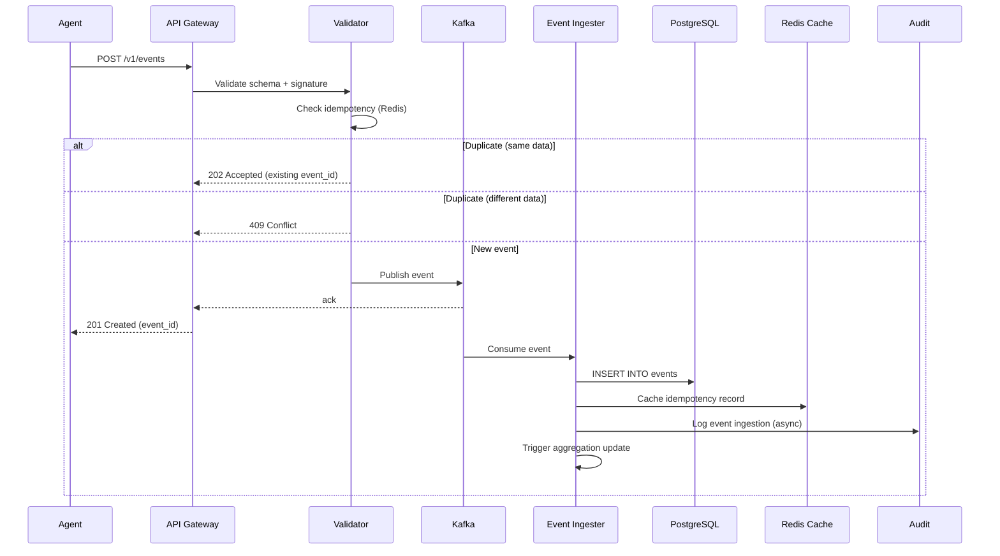
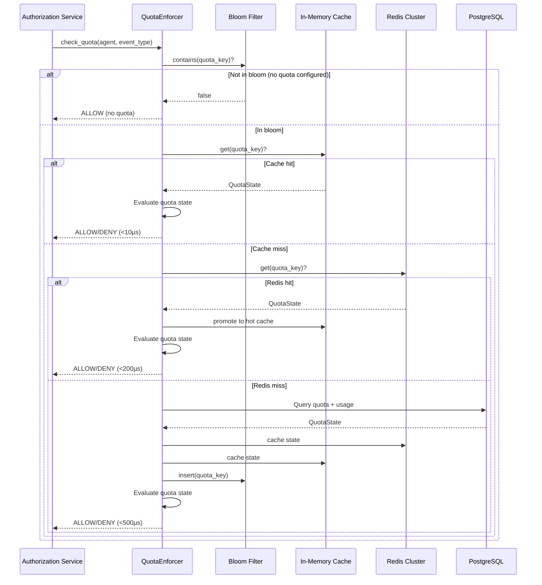
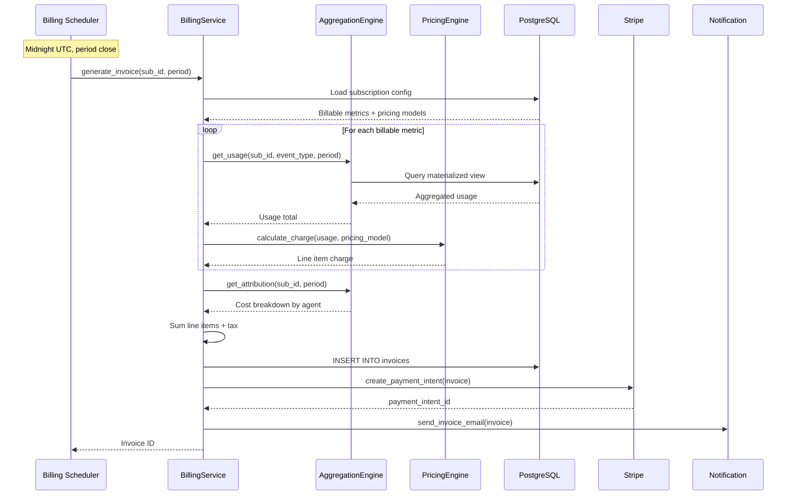
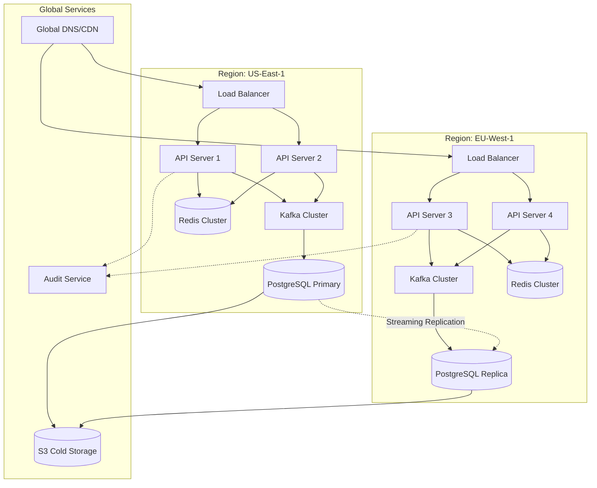
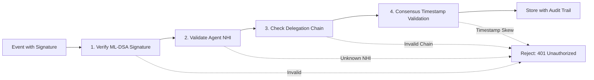

# SDD-MTR-02: Metering Architecture Design

## System Overview

**creto-metering** is architected as a distributed, event-driven system with the following design goals:

1. **High-throughput ingestion**: >10,000 events/second sustained
2. **Low-latency quota checks**: <10µs (p99) for cache hits
3. **Horizontal scalability**: Support 1M+ subscriptions
4. **Strong durability**: 99.999% (no billing data loss)
5. **Cryptographic verifiability**: Every event signed and auditable

The architecture follows a **Lambda architecture** pattern:
- **Speed layer**: Real-time quota enforcement via in-memory cache
- **Batch layer**: Aggregations computed from immutable event log
- **Serving layer**: Pre-computed materialized views for queries

## High-Level Architecture

```mermaid
graph TB
    subgraph "Agent Layer"
        Agent[AI Agent with NHI]
    end

    subgraph "Ingestion Layer"
        API[API Gateway<br/>HTTP/gRPC]
        Validator[Event Validator<br/>Schema + Signature]
        Kafka[Kafka Event Bus<br/>Durable Queue]
    end

    subgraph "Processing Layer"
        Ingester[Event Ingester<br/>10K events/sec]
        Aggregator[Aggregation Engine<br/>Incremental Updates]
        QuotaRefresh[Quota Cache Refresher<br/>Async]
    end

    subgraph "Storage Layer"
        PG[(PostgreSQL<br/>Events + Quotas)]
        Redis[(Redis Cluster<br/>Quota Cache)]
        S3[(S3 Cold Storage<br/>7-year retention)]
    end

    subgraph "Enforcement Layer"
        QuotaEnforcer[QuotaEnforcer<br/><10µs checks]
        AuthZ[Authorization Service<br/>creto-authz]
    end

    subgraph "Billing Layer"
        Pricer[Pricing Engine<br/>6 models]
        InvoiceGen[Invoice Generator<br/>Period-based]
        Stripe[Stripe Integration<br/>Webhooks]
    end

    subgraph "Audit Layer"
        AuditLog[Audit Service<br/>creto-audit]
    end

    Agent -->|1. Submit Event| API
    API --> Validator
    Validator -->|2. Validate| Kafka
    Kafka -->|3. Consume| Ingester
    Ingester -->|4. Store| PG
    Ingester -->|5. Trigger| Aggregator
    Ingester -->|6. Refresh| QuotaRefresh
    QuotaRefresh --> Redis

    AuthZ -->|check_quota()| QuotaEnforcer
    QuotaEnforcer -->|Cache Hit| Redis
    QuotaEnforcer -->|Cache Miss| PG

    Aggregator --> PG
    Pricer -->|Query Usage| PG
    Pricer --> InvoiceGen
    InvoiceGen --> Stripe

    Ingester -.->|Audit Events| AuditLog
    QuotaEnforcer -.->|Audit Quota Checks| AuditLog

    PG -->|Archive >90d| S3
```

## Component Design

### 1. EventIngestionService

**Responsibility**: Accept, validate, and durably store billable events at >10,000 events/sec.

**Interface**:
```rust
pub trait EventIngestionService: Send + Sync {
    /// Ingest a single event (HTTP POST /v1/events)
    async fn ingest_event(&self, req: EventRequest) -> Result<EventResponse, Error>;

    /// Ingest batch of events (HTTP POST /v1/events/batch)
    async fn ingest_batch(&self, reqs: Vec<EventRequest>) -> Result<BatchResponse, Error>;

    /// Get event by ID (for audit/dispute resolution)
    async fn get_event(&self, event_id: EventId) -> Result<Event, Error>;
}
```

**Implementation**:
```rust
pub struct EventIngestionServiceImpl {
    validator: Arc<EventValidator>,
    idempotency_cache: Arc<RedisIdempotencyCache>,
    kafka_producer: Arc<KafkaProducer>,
    signature_verifier: Arc<SignatureVerifier>,
    audit_client: Arc<AuditClient>,
}

impl EventIngestionService for EventIngestionServiceImpl {
    async fn ingest_event(&self, req: EventRequest) -> Result<EventResponse, Error> {
        // Step 1: Schema validation
        self.validator.validate_schema(&req)?;

        // Step 2: Idempotency check (Redis lookup)
        if let Some(existing) = self.idempotency_cache.get(&req.idempotency_key).await? {
            if existing.hash == req.canonical_hash() {
                return Ok(EventResponse::Accepted(existing.event_id)); // 202
            } else {
                return Err(Error::Conflict { // 409
                    existing_hash: existing.hash,
                    message: "Same idempotency_key, different data".into(),
                });
            }
        }

        // Step 3: Cryptographic signature verification (ML-DSA)
        self.signature_verifier.verify_event_signature(&req)?;

        // Step 4: Timestamp validation (consensus-ordered)
        self.validator.validate_timestamp(&req)?;

        // Step 5: Publish to Kafka (durable queue)
        let event_id = self.kafka_producer.produce(&req).await?;

        // Step 6: Cache idempotency record (7-day TTL)
        self.idempotency_cache.set(&req.idempotency_key, event_id, req.canonical_hash()).await?;

        // Step 7: Async audit log (non-blocking)
        self.audit_client.log_event_ingestion(event_id, &req).await.ok();

        Ok(EventResponse::Created(event_id)) // 201
    }

    async fn ingest_batch(&self, reqs: Vec<EventRequest>) -> Result<BatchResponse, Error> {
        if reqs.len() > 1000 {
            return Err(Error::PayloadTooLarge); // 413
        }

        // Process events in parallel (order not guaranteed)
        let results = futures::future::join_all(
            reqs.into_iter().map(|req| self.ingest_event(req))
        ).await;

        // Aggregate results
        let mut succeeded = 0;
        let mut failed = 0;
        let mut batch_results = vec![];

        for (idx, result) in results.into_iter().enumerate() {
            match result {
                Ok(resp) => {
                    succeeded += 1;
                    batch_results.push(BatchItemResult::Success(resp));
                }
                Err(err) => {
                    failed += 1;
                    batch_results.push(BatchItemResult::Failed { error: err });
                }
            }
        }

        Ok(BatchResponse {
            batch_id: Uuid::new_v4(),
            total: batch_results.len(),
            succeeded,
            failed,
            results: batch_results,
        })
    }
}
```

**Performance Characteristics**:
- **Latency**: p99 <500ms (includes Kafka produce + idempotency check)
- **Throughput**: >10,000 events/sec (batch API with 1000 events per request)
- **Availability**: 99.9% (Kafka provides durability even if DB temporarily unavailable)

**Scaling Strategy**:
- Stateless HTTP/gRPC servers (horizontal scaling)
- Kafka partitioning by `subscription_id` (parallel consumption)
- Redis sharding by `idempotency_key` hash (distributed cache)

---

### 2. QuotaEnforcer

**Responsibility**: Real-time quota checks integrated with Authorization service (<10µs latency).

**Interface**:
```rust
pub trait QuotaEnforcer: Send + Sync {
    /// Check if agent has quota for event_type (called from Authorization)
    async fn check_quota(
        &self,
        agent: &AgentIdentity,
        event_type: &str,
    ) -> Result<QuotaDecision, Error>;

    /// Pre-allocate quota for upcoming action (reserve before execution)
    async fn reserve_quota(
        &self,
        agent: &AgentIdentity,
        event_type: &str,
        quantity: u64,
    ) -> Result<ReservationId, Error>;

    /// Commit or rollback reservation
    async fn commit_reservation(&self, reservation_id: ReservationId) -> Result<(), Error>;
    async fn rollback_reservation(&self, reservation_id: ReservationId) -> Result<(), Error>;
}

pub enum QuotaDecision {
    Allow {
        remaining: u64,
        next_reset: Option<DateTime<Utc>>, // For periodic quotas
    },
    Deny {
        reason: QuotaExceeded,
        retry_after: Option<Duration>,
        current_usage: u64,
        limit: u64,
    },
}
```

**Implementation (Cache-First Architecture)**:
```rust
pub struct QuotaEnforcerImpl {
    bloom_filter: Arc<RwLock<BloomFilter<QuotaKey>>>, // In-memory, <2µs
    hot_cache: Arc<DashMap<QuotaKey, QuotaState>>, // In-memory hash map, <5µs
    redis_cache: Arc<RedisClient>, // Shared cache, <200µs
    postgres: Arc<PgPool>, // Source of truth, <500µs
    config: QuotaConfig,
}

impl QuotaEnforcer for QuotaEnforcerImpl {
    async fn check_quota(
        &self,
        agent: &AgentIdentity,
        event_type: &str,
    ) -> Result<QuotaDecision, Error> {
        let quota_key = QuotaKey::new(agent, event_type);

        // Layer 1: Bloom filter (probabilistic negative check)
        // Fast path: If bloom says "definitely no quota", return early
        if !self.bloom_filter.read().await.contains(&quota_key) {
            return Ok(QuotaDecision::Allow {
                remaining: u64::MAX, // No quota configured
                next_reset: None,
            });
        }

        // Layer 2: In-memory hot cache (DashMap for concurrent access)
        if let Some(state) = self.hot_cache.get(&quota_key) {
            return self.evaluate_quota_state(&state);
        }

        // Layer 3: Redis cache (shared across instances)
        if let Some(state) = self.redis_cache.get::<QuotaState>(&quota_key).await? {
            // Promote to hot cache
            self.hot_cache.insert(quota_key.clone(), state.clone());
            return self.evaluate_quota_state(&state);
        }

        // Layer 4: PostgreSQL (cold path)
        let state = self.load_quota_from_db(agent, event_type).await?;

        // Populate caches
        self.redis_cache.set(&quota_key, &state, Duration::from_secs(60)).await?;
        self.hot_cache.insert(quota_key.clone(), state.clone());
        self.bloom_filter.write().await.insert(&quota_key);

        self.evaluate_quota_state(&state)
    }

    fn evaluate_quota_state(&self, state: &QuotaState) -> Result<QuotaDecision, Error> {
        // Check if current period has quota remaining
        let current_period_usage = state.get_current_period_usage();

        if current_period_usage < state.limit {
            Ok(QuotaDecision::Allow {
                remaining: state.limit - current_period_usage,
                next_reset: state.next_reset_time(),
            })
        } else {
            // Quota exceeded - check overflow action
            match state.overflow_action {
                OverflowAction::Block => {
                    Ok(QuotaDecision::Deny {
                        reason: QuotaExceeded::LimitReached,
                        retry_after: state.time_until_reset(),
                        current_usage: current_period_usage,
                        limit: state.limit,
                    })
                }
                OverflowAction::AllowWithOverage => {
                    // Allow but mark for overage fee
                    Ok(QuotaDecision::Allow {
                        remaining: 0, // Over quota
                        next_reset: state.next_reset_time(),
                    })
                }
                OverflowAction::NotifyOnly => {
                    // Allow but trigger notification (async)
                    self.send_quota_exceeded_notification(state).await.ok();
                    Ok(QuotaDecision::Allow {
                        remaining: 0,
                        next_reset: state.next_reset_time(),
                    })
                }
            }
        }
    }

    async fn load_quota_from_db(
        &self,
        agent: &AgentIdentity,
        event_type: &str,
    ) -> Result<QuotaState, Error> {
        // Step 1: Map agent to subscription (via NHI → subscription lookup)
        let subscription_id = self.resolve_subscription(agent).await?;

        // Step 2: Load quota config
        let quota_config = sqlx::query_as::<_, QuotaConfig>(
            "SELECT * FROM quotas WHERE subscription_id = $1 AND event_type = $2"
        )
        .bind(&subscription_id)
        .bind(event_type)
        .fetch_optional(&self.postgres)
        .await?
        .ok_or(Error::QuotaNotFound)?;

        // Step 3: Query current usage for period
        let current_usage = self.get_current_period_usage(
            &subscription_id,
            event_type,
            quota_config.period,
        ).await?;

        Ok(QuotaState {
            subscription_id,
            event_type: event_type.to_string(),
            limit: quota_config.limit,
            period: quota_config.period,
            overflow_action: quota_config.overflow_action,
            current_usage,
            period_start: Self::calculate_period_start(quota_config.period),
        })
    }

    async fn get_current_period_usage(
        &self,
        subscription_id: &SubscriptionId,
        event_type: &str,
        period: QuotaPeriod,
    ) -> Result<u64, Error> {
        let period_start = Self::calculate_period_start(period);

        // Query usage from materialized view (fast)
        let usage = sqlx::query_scalar::<_, i64>(
            r#"
            SELECT COALESCE(SUM(event_count), 0)
            FROM usage_hourly
            WHERE subscription_id = $1
              AND event_type = $2
              AND hour >= $3
            "#
        )
        .bind(subscription_id)
        .bind(event_type)
        .bind(period_start)
        .fetch_one(&self.postgres)
        .await?;

        Ok(usage as u64)
    }
}
```

**Performance Optimization Techniques**:

1. **Bloom Filter**: Probabilistic data structure (1% false positive rate)
   - Memory: 10MB for 1M quotas
   - Latency: <2µs for membership test
   - Use case: Fast "no quota configured" check

2. **DashMap**: Concurrent hash map with sharded locks
   - Memory: ~100 bytes per entry
   - Latency: <5µs for read
   - Use case: Hot quotas (top 10% most-checked)

3. **Redis Cluster**: Distributed cache with sharding
   - Memory: ~1KB per quota state
   - Latency: <200µs for network round-trip
   - Use case: Shared state across instances

4. **PostgreSQL**: Source of truth with partitioning
   - Disk: Partitioned by time window
   - Latency: <500µs with proper indexes
   - Use case: Cold path + historical queries

**Cache Invalidation**:
```rust
impl QuotaEnforcerImpl {
    pub async fn invalidate_quota_cache(&self, subscription_id: &SubscriptionId, event_type: &str) {
        let quota_key = QuotaKey::new_from_subscription(subscription_id, event_type);

        // Purge all cache layers
        self.hot_cache.remove(&quota_key);
        self.redis_cache.del(&quota_key).await.ok();
        self.bloom_filter.write().await.remove(&quota_key);
    }

    pub async fn refresh_quota_cache_on_config_change(&self, config_change: QuotaConfigChange) {
        // Invalidate affected quotas
        for affected_key in config_change.affected_quotas {
            self.invalidate_quota_cache(&affected_key.subscription_id, &affected_key.event_type).await;
        }

        // Rebuild bloom filter (async, non-blocking)
        tokio::spawn({
            let bloom = Arc::clone(&self.bloom_filter);
            let postgres = Arc::clone(&self.postgres);
            async move {
                let all_quotas = Self::load_all_active_quotas(&postgres).await.unwrap();
                let mut new_bloom = BloomFilter::new(all_quotas.len(), 0.01);
                for quota in all_quotas {
                    new_bloom.insert(&QuotaKey::from_quota(&quota));
                }
                *bloom.write().await = new_bloom;
            }
        });
    }
}
```

---

### 3. AggregationEngine

**Responsibility**: Compute usage aggregations (COUNT, SUM, UNIQUE_COUNT, MAX) incrementally.

**Interface**:
```rust
pub trait AggregationEngine: Send + Sync {
    /// Get current period usage for subscription + event_type
    async fn get_usage(
        &self,
        subscription_id: &SubscriptionId,
        event_type: &str,
        period: TimePeriod,
    ) -> Result<AggregatedUsage, Error>;

    /// Trigger incremental update on new event
    async fn update_on_event_ingestion(&self, event: &Event) -> Result<(), Error>;

    /// Get attribution breakdown
    async fn get_attribution(
        &self,
        subscription_id: &SubscriptionId,
        period: TimePeriod,
    ) -> Result<AttributionReport, Error>;
}
```

**Aggregation Types**:
```rust
pub trait Aggregator<T>: Send + Sync {
    fn aggregate_type(&self) -> AggregationType;
    fn accumulate(&self, state: &mut T, event: &Event);
    fn finalize(&self, state: &T) -> Decimal;
}

// Example: COUNT aggregator
pub struct CountAggregator;
impl Aggregator<u64> for CountAggregator {
    fn aggregate_type(&self) -> AggregationType {
        AggregationType::Count
    }

    fn accumulate(&self, state: &mut u64, _event: &Event) {
        *state += 1;
    }

    fn finalize(&self, state: &u64) -> Decimal {
        Decimal::from(*state)
    }
}

// Example: SUM aggregator
pub struct SumAggregator {
    property_path: String, // e.g., "tokens"
}
impl Aggregator<Decimal> for SumAggregator {
    fn aggregate_type(&self) -> AggregationType {
        AggregationType::Sum
    }

    fn accumulate(&self, state: &mut Decimal, event: &Event) {
        if let Some(value) = event.properties.get(&self.property_path) {
            *state += Decimal::from_str(value.as_str().unwrap_or("0")).unwrap_or_default();
        }
    }

    fn finalize(&self, state: &Decimal) -> Decimal {
        *state
    }
}

// Example: UNIQUE_COUNT aggregator
pub struct UniqueCountAggregator {
    property_path: String, // e.g., "model"
}
impl Aggregator<HashSet<String>> for UniqueCountAggregator {
    fn aggregate_type(&self) -> AggregationType {
        AggregationType::UniqueCount
    }

    fn accumulate(&self, state: &mut HashSet<String>, event: &Event) {
        if let Some(value) = event.properties.get(&self.property_path) {
            state.insert(value.as_str().unwrap_or("").to_string());
        }
    }

    fn finalize(&self, state: &HashSet<String>) -> Decimal {
        Decimal::from(state.len())
    }
}

// Example: MAX aggregator
pub struct MaxAggregator {
    property_path: String, // e.g., "latency_ms"
}
impl Aggregator<Decimal> for MaxAggregator {
    fn aggregate_type(&self) -> AggregationType {
        AggregationType::Max
    }

    fn accumulate(&self, state: &mut Decimal, event: &Event) {
        if let Some(value) = event.properties.get(&self.property_path) {
            let val = Decimal::from_str(value.as_str().unwrap_or("0")).unwrap_or_default();
            *state = (*state).max(val);
        }
    }

    fn finalize(&self, state: &Decimal) -> Decimal {
        *state
    }
}
```

**Incremental Update Implementation**:
```rust
pub struct AggregationEngineImpl {
    postgres: Arc<PgPool>,
    redis: Arc<RedisClient>,
    aggregators: HashMap<String, Box<dyn Aggregator<dyn Any>>>,
}

impl AggregationEngine for AggregationEngineImpl {
    async fn update_on_event_ingestion(&self, event: &Event) -> Result<(), Error> {
        // Update materialized view incrementally
        sqlx::query(
            r#"
            INSERT INTO usage_hourly (subscription_id, event_type, hour, event_count, total_tokens, unique_models, max_latency)
            VALUES ($1, $2, date_trunc('hour', $3), 1, $4, $5, $6)
            ON CONFLICT (subscription_id, event_type, hour)
            DO UPDATE SET
                event_count = usage_hourly.event_count + 1,
                total_tokens = usage_hourly.total_tokens + COALESCE($4, 0),
                unique_models = array_unique(array_append(usage_hourly.unique_models, $5)),
                max_latency = GREATEST(usage_hourly.max_latency, $6)
            "#
        )
        .bind(&event.subscription_id)
        .bind(&event.event_type)
        .bind(&event.timestamp)
        .bind(event.properties.get("tokens").and_then(|v| v.as_i64()))
        .bind(event.properties.get("model").and_then(|v| v.as_str()))
        .bind(event.properties.get("latency_ms").and_then(|v| v.as_i64()))
        .execute(&self.postgres)
        .await?;

        // Invalidate cached aggregations for this subscription+period
        let cache_key = format!("agg:{}:{}:{}", event.subscription_id, event.event_type, event.timestamp.format("%Y-%m"));
        self.redis.del(&cache_key).await.ok();

        Ok(())
    }

    async fn get_usage(
        &self,
        subscription_id: &SubscriptionId,
        event_type: &str,
        period: TimePeriod,
    ) -> Result<AggregatedUsage, Error> {
        // Check cache first
        let cache_key = format!("agg:{}:{}:{}", subscription_id, event_type, period.cache_key());
        if let Some(cached) = self.redis.get::<AggregatedUsage>(&cache_key).await? {
            return Ok(cached);
        }

        // Query materialized view
        let usage = sqlx::query_as::<_, AggregatedUsage>(
            r#"
            SELECT
                SUM(event_count) as count,
                SUM(total_tokens) as sum_tokens,
                COUNT(DISTINCT unnest(unique_models)) as unique_models,
                MAX(max_latency) as max_latency
            FROM usage_hourly
            WHERE subscription_id = $1
              AND event_type = $2
              AND hour >= $3
              AND hour < $4
            "#
        )
        .bind(subscription_id)
        .bind(event_type)
        .bind(period.start())
        .bind(period.end())
        .fetch_one(&self.postgres)
        .await?;

        // Cache result (TTL = 5 minutes for current period, 1 day for historical)
        let ttl = if period.is_current() {
            Duration::from_secs(300)
        } else {
            Duration::from_secs(86400)
        };
        self.redis.set(&cache_key, &usage, ttl).await.ok();

        Ok(usage)
    }
}
```

---

### 4. BillingService

**Responsibility**: Apply pricing models and generate invoices.

**Interface**:
```rust
pub trait BillingService: Send + Sync {
    /// Calculate charges for subscription for period
    async fn calculate_charges(
        &self,
        subscription_id: &SubscriptionId,
        period: BillingPeriod,
    ) -> Result<Vec<LineItem>, Error>;

    /// Generate invoice for billing period
    async fn generate_invoice(
        &self,
        subscription_id: &SubscriptionId,
        period: BillingPeriod,
    ) -> Result<Invoice, Error>;

    /// Finalize invoice (mark as issued, trigger payment)
    async fn finalize_invoice(&self, invoice_id: InvoiceId) -> Result<(), Error>;
}
```

**Pricing Model Implementations**:
```rust
pub trait PricingModel: Send + Sync {
    fn calculate_charge(&self, usage: Decimal) -> Decimal;
}

// 1. Flat Fee
pub struct FlatFeePricing {
    amount: Decimal,
    currency: Currency,
    prorated: bool,
}
impl PricingModel for FlatFeePricing {
    fn calculate_charge(&self, _usage: Decimal) -> Decimal {
        self.amount // Ignore usage
    }
}

// 2. Per-Unit
pub struct PerUnitPricing {
    unit_price: Decimal,
    currency: Currency,
}
impl PricingModel for PerUnitPricing {
    fn calculate_charge(&self, usage: Decimal) -> Decimal {
        usage * self.unit_price
    }
}

// 3. Tiered Graduated
pub struct TieredGraduatedPricing {
    tiers: Vec<PricingTier>,
    currency: Currency,
}
impl PricingModel for TieredGraduatedPricing {
    fn calculate_charge(&self, usage: Decimal) -> Decimal {
        let mut remaining = usage;
        let mut total_charge = Decimal::ZERO;

        for tier in &self.tiers {
            let tier_size = tier.up_to.unwrap_or(Decimal::MAX);
            let tier_usage = remaining.min(tier_size);
            total_charge += tier_usage * tier.unit_price;
            remaining -= tier_usage;

            if remaining <= Decimal::ZERO {
                break;
            }
        }

        total_charge
    }
}

// 4. Tiered Volume
pub struct TieredVolumePricing {
    tiers: Vec<PricingTier>,
    currency: Currency,
}
impl PricingModel for TieredVolumePricing {
    fn calculate_charge(&self, usage: Decimal) -> Decimal {
        // Find the tier reached
        for tier in &self.tiers {
            if usage <= tier.up_to.unwrap_or(Decimal::MAX) {
                return usage * tier.unit_price;
            }
        }

        // Default to last tier
        usage * self.tiers.last().unwrap().unit_price
    }
}

// 5. Package
pub struct PackagePricing {
    package_size: u64,
    package_price: Decimal,
    overage_unit_price: Decimal,
    currency: Currency,
}
impl PricingModel for PackagePricing {
    fn calculate_charge(&self, usage: Decimal) -> Decimal {
        let package_size_dec = Decimal::from(self.package_size);

        if usage <= package_size_dec {
            self.package_price
        } else {
            let overage = usage - package_size_dec;
            self.package_price + (overage * self.overage_unit_price)
        }
    }
}

// 6. Prepaid Credits
pub struct PrepaidCreditsPricing {
    credit_rate: Decimal, // $/credit
    auto_topup: Option<AutoTopupConfig>,
}
impl PrepaidCreditsPricing {
    pub async fn deduct_credits(&self, wallet: &mut Wallet, amount: Decimal) -> Result<(), Error> {
        if wallet.balance < amount {
            // Check auto-top-up
            if let Some(topup) = &self.auto_topup {
                if wallet.balance < topup.threshold {
                    wallet.balance += topup.amount;
                    // Trigger payment gateway charge for topup
                }
            } else {
                return Err(Error::InsufficientCredits);
            }
        }

        wallet.balance -= amount;
        Ok(())
    }
}
```

**Invoice Generation**:
```rust
impl BillingService for BillingServiceImpl {
    async fn generate_invoice(
        &self,
        subscription_id: &SubscriptionId,
        period: BillingPeriod,
    ) -> Result<Invoice, Error> {
        // Step 1: Load subscription config (pricing models per event_type)
        let subscription = self.load_subscription(subscription_id).await?;

        // Step 2: Calculate charges for each billable metric
        let mut line_items = vec![];

        for metric_config in &subscription.billable_metrics {
            // Get usage for this metric
            let usage = self.aggregation_engine.get_usage(
                subscription_id,
                &metric_config.event_type,
                period.into(),
            ).await?;

            // Apply pricing model
            let charge = metric_config.pricing_model.calculate_charge(usage.total());

            line_items.push(LineItem {
                description: metric_config.description.clone(),
                metric_code: metric_config.event_type.clone(),
                quantity: usage.total(),
                unit_price: metric_config.pricing_model.unit_price(),
                amount: charge,
            });
        }

        // Step 3: Calculate attribution breakdown
        let attribution = self.aggregation_engine.get_attribution(
            subscription_id,
            period.into(),
        ).await?;

        // Step 4: Sum line items
        let subtotal: Decimal = line_items.iter().map(|li| li.amount).sum();
        let tax = self.tax_calculator.calculate_tax(&subscription, subtotal).await?;
        let total = subtotal + tax;

        // Step 5: Create invoice record
        let invoice = Invoice {
            invoice_id: InvoiceId::new(),
            subscription_id: subscription_id.clone(),
            period_start: period.start,
            period_end: period.end,
            line_items,
            subtotal,
            tax,
            total,
            attribution,
            status: InvoiceStatus::Draft,
            created_at: Utc::now(),
        };

        // Store invoice
        self.storage.create_invoice(&invoice).await?;

        // Audit log
        self.audit_client.log_invoice_generation(&invoice).await.ok();

        Ok(invoice)
    }

    async fn finalize_invoice(&self, invoice_id: InvoiceId) -> Result<(), Error> {
        // Mark invoice as issued
        self.storage.update_invoice_status(invoice_id, InvoiceStatus::Issued).await?;

        // Trigger Stripe payment intent
        let invoice = self.storage.get_invoice(invoice_id).await?;
        self.stripe_integration.create_payment_intent(&invoice).await?;

        // Send invoice email (async)
        self.notification_service.send_invoice_email(&invoice).await.ok();

        Ok(())
    }
}
```

---

## Data Flow Diagrams

### Event Ingestion Flow



### Quota Check Flow



### Invoice Generation Flow



---

## Deployment Architecture

### Multi-Region Deployment



**Characteristics**:
- **Active-Active**: Both regions accept writes
- **Database**: PostgreSQL primary in US-East, streaming replica in EU-West (read-only)
- **Cache**: Redis clusters independent per region (eventual consistency acceptable)
- **Kafka**: Independent clusters per region (events partitioned geographically)
- **Failover**: DNS-based failover (<30s to switch regions)

---

## Security Architecture

### Cryptographic Verification Pipeline



**Signature Verification**:
```rust
pub struct SignatureVerifier {
    crypto_client: Arc<CryptoClient>,
    nhi_registry: Arc<NhiRegistry>,
}

impl SignatureVerifier {
    pub async fn verify_event_signature(&self, event: &EventRequest) -> Result<(), Error> {
        // Step 1: Extract agent's public key from NHI
        let public_key = self.nhi_registry.get_public_key(&event.agent_nhi).await?;

        // Step 2: Construct canonical message (same as what agent signed)
        let canonical_message = self.construct_canonical_message(event);

        // Step 3: Verify ML-DSA signature
        let signature_valid = self.crypto_client.verify_signature(
            &event.signature,
            &canonical_message,
            &public_key,
            SignatureAlgorithm::MLDSA65,
        )?;

        if !signature_valid {
            return Err(Error::InvalidSignature {
                agent_nhi: event.agent_nhi.clone(),
                message: "ML-DSA signature verification failed".into(),
            });
        }

        // Step 4: Validate delegation chain signatures
        self.verify_delegation_chain(&event.delegation_chain).await?;

        Ok(())
    }

    fn construct_canonical_message(&self, event: &EventRequest) -> Vec<u8> {
        // Deterministic serialization (same order as agent)
        let mut hasher = Sha3_256::new();
        hasher.update(event.idempotency_key.as_bytes());
        hasher.update(event.agent_nhi.as_bytes());
        hasher.update(event.event_type.as_bytes());
        hasher.update(event.timestamp.to_rfc3339().as_bytes());
        hasher.update(serde_json::to_vec(&event.properties).unwrap());
        hasher.finalize().to_vec()
    }
}
```

---

## Scalability Strategy

### Horizontal Scaling Plan

| Component | Scaling Strategy | Bottleneck | Mitigation |
|-----------|------------------|------------|------------|
| **API Servers** | Stateless horizontal | Network bandwidth | CDN + load balancer |
| **Kafka** | Partition by subscription_id | Partition count (1000 max) | Repartition by region+sub_id |
| **Event Ingesters** | Consumer group parallelism | Database write throughput | Batch inserts (1000 events) |
| **PostgreSQL** | Vertical + read replicas | Write IOPS | Partitioning + tiered storage |
| **Redis** | Cluster sharding | Memory per node | Eviction policy (LRU) |
| **QuotaEnforcer** | Stateless horizontal | Cache coherence | Redis as source of truth |

### Database Partitioning Strategy

```sql
-- Partition events table by month (automated with pg_partman)
CREATE TABLE events (
    event_id UUID PRIMARY KEY,
    subscription_id UUID NOT NULL,
    agent_nhi TEXT NOT NULL,
    event_type TEXT NOT NULL,
    timestamp TIMESTAMPTZ NOT NULL,
    properties JSONB NOT NULL,
    signature BYTEA NOT NULL
) PARTITION BY RANGE (timestamp);

-- Create partitions (automated)
CREATE TABLE events_2024_12 PARTITION OF events
    FOR VALUES FROM ('2024-12-01') TO ('2025-01-01');

CREATE TABLE events_2025_01 PARTITION OF events
    FOR VALUES FROM ('2025-01-01') TO ('2025-02-01');

-- Indexes on each partition
CREATE INDEX idx_events_2024_12_subscription ON events_2024_12(subscription_id, timestamp);
CREATE INDEX idx_events_2024_12_type ON events_2024_12(event_type, timestamp);
CREATE INDEX idx_events_2024_12_properties ON events_2024_12 USING GIN (properties);
```

---

## Monitoring & Observability

### Key Metrics to Track

```rust
// Prometheus metrics
pub struct MeteringMetrics {
    // Ingestion
    pub events_ingested_total: Counter,
    pub event_ingestion_duration_seconds: Histogram,
    pub batch_size: Histogram,

    // Quota
    pub quota_checks_total: Counter,
    pub quota_check_duration_micros: Histogram,
    pub quota_cache_hit_ratio: Gauge,
    pub quota_denied_total: Counter,

    // Aggregation
    pub aggregation_query_duration_seconds: Histogram,
    pub aggregation_cache_hit_ratio: Gauge,

    // Billing
    pub invoices_generated_total: Counter,
    pub invoice_generation_duration_seconds: Histogram,
    pub line_items_per_invoice: Histogram,

    // Errors
    pub signature_verification_failures: Counter,
    pub idempotency_conflicts: Counter,
    pub database_errors: Counter,
}
```

### Distributed Tracing

```rust
// OpenTelemetry spans
#[instrument(skip(self), fields(event_id, subscription_id))]
async fn ingest_event(&self, req: EventRequest) -> Result<EventResponse, Error> {
    let span = tracing::span::current();
    span.record("subscription_id", &tracing::field::display(&req.subscription_id));

    // Trace through all layers
    let _validate_span = tracing::info_span!("validate_event").entered();
    self.validator.validate_schema(&req)?;
    drop(_validate_span);

    let _signature_span = tracing::info_span!("verify_signature").entered();
    self.signature_verifier.verify_event_signature(&req)?;
    drop(_signature_span);

    // ... rest of implementation
}
```

---

## Disaster Recovery

### Backup Strategy

| Data Type | Backup Frequency | Retention | Recovery SLA |
|-----------|------------------|-----------|--------------|
| **Events (hot)** | Streaming replication (real-time) | 7 days | RPO: 0s, RTO: 60s |
| **Events (warm)** | Daily snapshot | 90 days | RPO: 24h, RTO: 4h |
| **Events (cold)** | Immutable S3 | 7 years | RPO: N/A, RTO: N/A (batch only) |
| **Quotas** | Streaming replication | Forever | RPO: 0s, RTO: 60s |
| **Invoices** | Daily snapshot + WAL | Forever | RPO: 1h, RTO: 2h |

### Recovery Procedures

1. **Database Failure**: Promote replica to primary (<60s)
2. **Cache Failure**: Degrade to direct DB queries (performance impact only)
3. **Kafka Failure**: Buffer events in API layer, drain to new cluster (<5min)
4. **Region Failure**: DNS failover to secondary region (<30s)

---

**Next Documents**:
- SDD-MTR-03: Data Design (schemas, indexes, partitioning)
- SDD-MTR-04: API Design (gRPC/REST endpoints, request/response formats)
- SDD-MTR-05: Security Design (threat model, mitigations)
