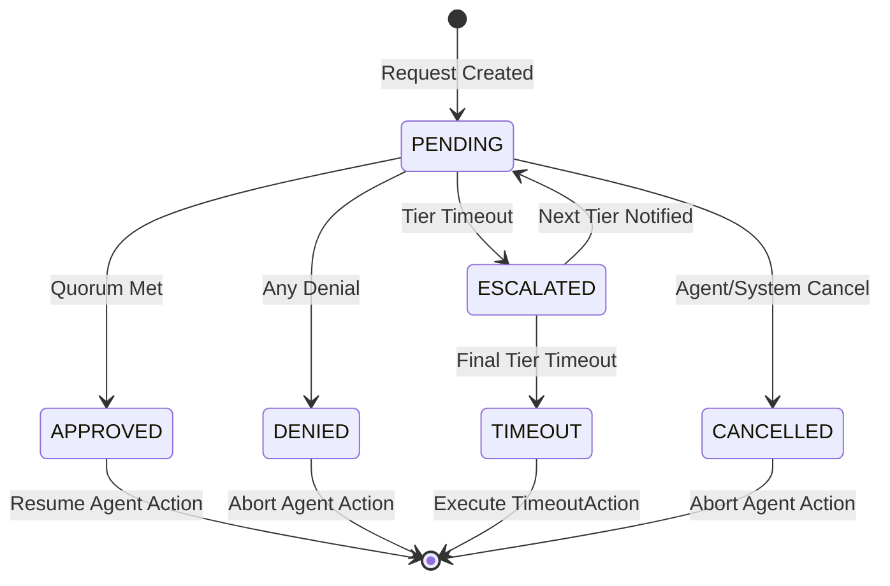

# SDD-OVS-00: Oversight Product Overview

## Executive Summary

**creto-oversight** is the Human-in-the-Loop (HITL) approval orchestration service for the Creto Sovereign platform. It enables organizations to require human approval before AI agents execute high-risk operations, with full cryptographic proof of authorization, delegation chain visibility, and agent reasoning context.

**Core Value Proposition:**
- **Policy-Driven Oversight:** Authorization policies trigger oversight requirements (not code decorators)
- **Context-Rich Approvals:** Approvers see delegation chain, agent reasoning, and risk assessment
- **Cryptographically Verifiable:** ML-DSA signed approvals provide non-repudiation
- **Durable & Resilient:** State machines survive process crashes via checkpoint/resume
- **Omnichannel Delivery:** Route to Slack, email, webhook based on policy configuration

---

## Vision Statement

> **Enable organizations to deploy autonomous AI agents with confidence by providing transparent, auditable, and enforceable human oversight at decision points that matter.**

AI agents are increasingly capable of executing business-critical actions: financial transactions, data access, external communications, and infrastructure changes. Organizations need the ability to:

1. **Define approval requirements declaratively** (policy, not code)
2. **Provide approvers with complete context** (why agent is acting, who delegated authority)
3. **Enforce approval requirements cryptographically** (prevent bypass)
4. **Audit all decisions immutably** (regulatory compliance)
5. **Deliver requests through familiar channels** (Slack, email, ServiceNow)

---

## Product Scope

### In Scope (v1.0)

**Core Approval Orchestration:**
- Policy-triggered oversight via Authorization service integration
- Multi-stage escalation chains with timeout-based promotion
- Quorum-based approval (any, all, N-of-M approvers)
- Request lifecycle state machine (PENDING → APPROVED/DENIED/ESCALATED/TIMEOUT)
- Checkpoint/resume for durability across process restarts

**Context Enrichment:**
- Agent NHI identity + full delegation chain verification
- Memory service integration for agent reasoning context
- Risk factor categorization (financial, compliance, data)
- Impact assessment (reversibility, cost, affected resources)

**Multi-Channel Notification:**
- Slack integration with interactive Blocks API messages
- Email delivery with secure one-time approval links
- Webhook integration for external systems (ServiceNow, Jira)
- Channel failover and retry logic

**Cryptographic Security:**
- ML-DSA or Ed25519 signed approval responses
- Signature verification before state transitions
- Immutable audit trail with Merkle-anchored proofs
- Protection against approval bypass and impersonation attacks

**Performance & Reliability:**
- <10ms request creation (p99)
- <1ms state transition (p99)
- <5s notification delivery (p95)
- 99.9% uptime SLA
- Zero data loss for checkpointed requests

### Out of Scope (Future Work)

- Approval delegation (approver authorizes deputy)
- Batch approvals (approve multiple similar requests)
- Conditional approvals ("approve if amount reduced to X")
- Mobile-native apps (dedicated iOS/Android apps)
- Risk scoring ML model
- Approval analytics dashboard
- Policy authoring UI (separate service)
- Channel-specific bot implementations (Slack bot is external)

---

## Design Principles

### 1. Policy-First Architecture

**Problem:** HumanLayer requires `@require_approval()` decorator on every function. Policy changes require code changes.

**Solution:** Authorization service evaluates policy and returns `Decision::RequiresOversight`. Single policy definition for both authorization and oversight.

```cedar
// Single policy for both authz and oversight
permit(principal, action == Action::"transfer_funds", resource)
when { resource.amount <= 10000 };

requires_oversight(principal, action == Action::"transfer_funds", resource)
when { resource.amount > 10000 }
with {
  approvers: ["cfo@company.com"],
  timeout: duration("2h"),
  quorum: ApprovalQuorum::Any
};
```

### 2. Context-Rich Approvals

**Problem:** Approvers lack information to make informed decisions quickly.

**Solution:** Every request includes:
- **Delegation chain:** Who delegated authority to this agent
- **Agent reasoning:** Why the agent is taking this action (from Memory)
- **Risk factors:** Categorized risks (financial, compliance, data)
- **Impact assessment:** Reversibility, cost, affected systems

**Example Approval Context:**
```json
{
  "agent_nhi": "agent:payment-bot-v3@company.creto",
  "delegation_chain": [
    "agent:payment-bot-v3",
    "agent:accounts-payable",
    "human:alice@company.com"
  ],
  "reasoning": "Invoice #INV-2024-1234 approved in AP system. Due date: 2024-12-31.",
  "risk_factors": [
    {"category": "Financial", "severity": "High", "description": "Large transaction exceeding $10K threshold"},
    {"category": "Compliance", "severity": "Medium", "description": "SOX dual control required"}
  ],
  "impact": {
    "affected_resources": ["bank_account:operating"],
    "reversible": false,
    "estimated_cost": 50000.00
  }
}
```

### 3. Non-Repudiation via Cryptographic Signatures

**Problem:** Database logs can be tampered with. "He said/she said" disputes.

**Solution:** Every approval response is signed with the approver's private key (ML-DSA or Ed25519). Signature includes:
- Request ID
- Decision (approve/deny)
- Timestamp (consensus-ordered)
- Approver identity

**Benefits:**
- Legally admissible proof of approval
- Prevents forged approvals
- Third-party verifiable (public key cryptography)

```rust
ApprovalResponse {
    approver: HumanIdentity {
        subject: "cfo@company.com",
        public_key: [...]
    },
    decision: ApprovalDecision::Approve,
    timestamp: 1703520000,
    signature: Signature {
        algorithm: "ML-DSA-65",
        value: [...]  // Signs: request_id || decision || timestamp
    }
}
```

### 4. Durability & Fault Tolerance

**Problem:** Process crashes lose in-flight approval requests. Agents stuck waiting forever.

**Solution:** Checkpoint-based durability:
- State machine checkpointed after every transition
- On startup, resume all `Pending` and `Escalated` requests
- Idempotent operations (duplicate notifications suppressed)
- Timeout tracking persists across restarts

**Checkpoint Format:**
```rust
OversightCheckpoint {
    request_id: Uuid,
    state: RequestState,
    responses: Vec<ApprovalResponse>,
    notifications_sent: Vec<NotificationDelivery>,
    escalation_history: Vec<EscalationEvent>,
    created_at: Timestamp,
    updated_at: Timestamp,
    version: u64  // Optimistic concurrency control
}
```

### 5. Omnichannel Notification

**Problem:** Approvers work in different tools (Slack, email, ServiceNow). Notifications must reach them where they are.

**Solution:** Channel abstraction with pluggable implementations:
- **Slack:** Blocks API messages with approve/deny buttons
- **Email:** HTML email with secure approval links
- **Webhook:** POST to external systems with callback

**Channel Selection:**
- Policy specifies preferred channels per tier
- Parallel delivery to multiple channels
- Failover to backup channels on failure
- Retry with exponential backoff

```rust
pub trait NotificationChannel: Send + Sync {
    async fn send_notification(
        &self,
        request: &OversightRequest,
        context: &RequestContext,
    ) -> Result<NotificationDelivery>;

    async fn verify_response(
        &self,
        response: &ApprovalResponse,
    ) -> Result<()>;
}
```

### 6. Auditability by Default

**Problem:** Incomplete audit trails lead to compliance failures.

**Solution:** Every state transition logged to immutable audit trail:
- Request created
- Notifications sent (with delivery status)
- Responses received (with signatures)
- State transitions
- Escalations
- Final decision

**Audit Log Integration:**
```rust
self.audit.log(AuditEvent {
    event_type: "oversight.request.approved",
    agent_nhi: request.agent_nhi.clone(),
    approver: response.approver.subject.clone(),
    request_id: request.request_id,
    decision: response.decision.clone(),
    signature: response.signature.clone(),
    timestamp: consensus_time(),
    merkle_proof: self.audit.get_proof(event_id)
});
```

---

## HumanLayer Pattern Extraction

### Core Patterns from HumanLayer OSS

| HumanLayer Feature | Creto Oversight Adaptation | Rationale |
|-------------------|---------------------------|-----------|
| `@require_approval()` decorator | Policy-triggered via Authorization | Unified policy language, not code annotation |
| `human_as_tool()` function | `RequestMoreInfo` decision type | Approver can ask agent for clarification |
| Channel abstraction (`Channel` trait) | `NotificationChannel` trait | Support Slack, email, webhook, extensible |
| Escalation chains (`ContactChannel`) | `EscalationChain` with timeout tiers | Multi-tier approval with timeout-based promotion |
| Checkpoint/resume (`ApprovalCheckpoint`) | `OversightCheckpoint` struct | Durability across process restarts |
| Response schema (`ApprovalResponse`) | `ApprovalResponse` with signatures | Add cryptographic verification |

### Creto Extensions Beyond HumanLayer

| Extension | Value Proposition |
|-----------|------------------|
| **NHI Integration** | Agent identity + delegation chain in approval context enables "who delegated this agent?" verification |
| **Memory Integration** | Agent reasoning context from Memory service enables "why is agent acting?" understanding |
| **Cryptographic Signatures** | ML-DSA signed approvals for non-repudiation and legal admissibility |
| **Immutable Audit** | Merkle-anchored audit trail provides tamper-proof compliance evidence |
| **Policy-Driven** | Authorization policy returns `RequiresOversight` (no code annotation required) |
| **Sub-millisecond State Transitions** | <1ms state machine updates enable high-throughput approval processing |

---

## Key Use Cases

### Use Case 1: Financial Transaction Approval

**Scenario:** Payment bot wants to transfer $50,000 to vendor invoice.

**Flow:**
1. Agent calls `transfer_funds(amount: 50000, recipient: "vendor@example.com")`
2. Authorization evaluates policy → returns `Decision::RequiresOversight`
3. Oversight creates request with context:
   - Delegation chain: `payment-bot → accounts-payable → Alice (CFO)`
   - Reasoning: "Invoice #INV-2024-1234 approved in AP system. Due date: 2024-12-31."
   - Risk: "High financial impact, SOX dual control required"
4. Notifications sent to CFO via Slack + Email
5. CFO reviews context in Slack, clicks "Approve"
6. Approval signed with CFO's private key
7. State → `Approved`, agent proceeds with transfer
8. Audit log records decision with signature

**Outcome:** CFO approved in 2 minutes, agent completed transfer, compliance satisfied.

### Use Case 2: Multi-Tier Escalation

**Scenario:** Database access request needs approval, but team lead is unresponsive.

**Escalation Chain:**
- Tier 1: Team Lead (1 hour timeout)
- Tier 2: Department Head (2 hour timeout)
- Tier 3: VP Engineering (4 hour timeout)
- Final: Auto-deny

**Flow:**
1. Agent requests database access
2. Notification sent to Team Lead via Slack
3. **No response after 1 hour** → State: `Escalated`
4. Notification sent to Department Head via Slack + Email
5. Department Head approves in 30 minutes
6. State → `Approved`, agent proceeds

**Outcome:** Request didn't stall due to unresponsive approver.

### Use Case 3: Quorum-Based Approval

**Scenario:** Privileged infrastructure change requires 2-of-3 security team approvals.

**Quorum:** `ApprovalQuorum::Threshold { required: 2 }`

**Flow:**
1. Agent requests infrastructure change
2. Notifications sent to 3 security team members in parallel
3. **Alice approves** (1/2 threshold met)
4. **Bob approves** (2/2 threshold met) → State: `Approved`
5. Charlie's approval is no longer required (quorum already satisfied)
6. Agent proceeds with change

**Outcome:** No single person can unilaterally authorize sensitive changes.

### Use Case 4: ServiceNow Ticket Integration

**Scenario:** Organization uses ServiceNow for change management. Oversight requests must create tickets.

**Webhook Configuration:**
- Policy specifies webhook channel: `https://company.service-now.com/api/oversight/requests`
- Webhook payload includes approval context
- ServiceNow creates ticket, assigns to approver
- Approver resolves ticket with decision
- ServiceNow POSTs approval response back to Creto

**Flow:**
1. Oversight request created
2. Webhook POST to ServiceNow with request context
3. ServiceNow ticket `CHG0012345` created
4. Approver reviews ticket, adds approval comment
5. ServiceNow POST approval response to Creto webhook endpoint
6. Oversight verifies signature, transitions state to `Approved`

**Outcome:** Approvals integrated into existing ITSM workflows.

---

## Architecture at a Glance

```
┌─────────────────────────────────────────────────────────────────┐
│                    CRETO OVERSIGHT SERVICE                       │
├─────────────────────────────────────────────────────────────────┤
│  ┌───────────────┐  ┌──────────────┐  ┌──────────────────────┐ │
│  │ PolicyEngine  │  │RequestManager│  │  ChannelRouter       │ │
│  │ (<1ms policy  │  │(state machine│  │(Slack/Email/Webhook) │ │
│  │  matching)    │  │ transitions) │  │                      │ │
│  └───────┬───────┘  └──────┬───────┘  └──────────┬───────────┘ │
│          │                 │                      │             │
│          v                 v                      v             │
│  ┌───────────────────────────────────────────────────────────┐ │
│  │             DurabilityManager                             │ │
│  │  (Checkpoint/Resume, PostgreSQL state store)              │ │
│  └───────────────────────────────────────────────────────────┘ │
└─────────────────────────────────────────────────────────────────┘
                            ↕
           ┌────────────────┼────────────────┐
           v                v                v
   ┌───────────────┐ ┌──────────────┐ ┌──────────────┐
   │ Authorization │ │   Memory     │ │    Audit     │
   │   Service     │ │   Service    │ │   Service    │
   └───────────────┘ └──────────────┘ └──────────────┘
```

**Key Components:**

1. **PolicyEngine:** Matches incoming requests against policy rules, extracts oversight requirements
2. **RequestManager:** State machine orchestration, quorum tracking, timeout management
3. **ChannelRouter:** Notification delivery routing, channel failover, response verification
4. **DurabilityManager:** Checkpoint/resume, PostgreSQL state persistence, recovery on startup

---

## State Machine Overview



**States:**
- `PENDING`: Awaiting human responses for current tier
- `APPROVED`: Quorum of approvals received, agent may proceed
- `DENIED`: Any approver denied, agent action aborted
- `ESCALATED`: Tier timeout, moved to next tier
- `TIMEOUT`: Final tier timeout, execute configured action (auto-deny/approve/block)
- `CANCELLED`: Agent or system cancelled request

**Transitions:**
- Atomic (transactional)
- Checkpointed for durability
- Logged to audit trail
- Invalid transitions rejected

---

## Non-Functional Characteristics

| Metric | Target | Measurement |
|--------|--------|-------------|
| **Request Creation Latency** | <10ms (p99) | Time from AuthZ returning `RequiresOversight` to checkpoint persisted |
| **State Transition Latency** | <1ms (p99) | Time from response submission to state update persisted |
| **Notification Delivery** | <5s (p95) | Time from request creation to notification visible in channel |
| **Checkpoint Write** | <5ms (p99) | Time to persist checkpoint to PostgreSQL |
| **Concurrent Requests** | ≥10,000 per instance | Number of `PENDING` requests without degradation |
| **Throughput** | ≥1,000 req/sec | Combined rate of creates + state transitions |
| **Uptime** | 99.9% (3 nines) | Percentage of time accepting requests |
| **Data Durability** | Zero loss | All checkpointed requests recoverable after crash |

---

## Integration Architecture

### Authorization Service Integration

```rust
// Authorization returns RequiresOversight decision
let authz_decision = authz_client.authorize(AuthzRequest {
    agent_nhi: agent_nhi.clone(),
    action: Action::TransferFunds,
    resource: Resource::BankAccount { amount: 50000 },
}).await?;

match authz_decision {
    Decision::Allow => { /* proceed */ },
    Decision::Deny => { /* reject */ },
    Decision::RequiresOversight { policy_id, requirement } => {
        // Create oversight request
        let request = oversight_client.create_request(OversightRequest {
            agent_nhi,
            action: Action::TransferFunds,
            resource,
            policy_id,
            requirement,
        }).await?;

        // Block agent until approval
        let outcome = oversight_client.wait_for_decision(request.request_id).await?;
        match outcome {
            OversightOutcome::Approved { override_token } => {
                // Use override token to bypass policy
                authz_client.authorize_with_override(override_token).await?;
            },
            OversightOutcome::Denied { reason } => {
                return Err(format!("Request denied: {}", reason));
            }
        }
    }
}
```

### Memory Service Integration

```rust
// Fetch agent reasoning context from Memory
let context = memory_client.get_context(GetContextRequest {
    agent_nhi: request.agent_nhi.clone(),
    action: request.action.clone(),
    last_n_interactions: 10,
}).await?;

// Include reasoning in approval request
request_context.reasoning = context.summary;
request_context.goal = context.current_goal;
```

### Audit Service Integration

```rust
// Log all state transitions to immutable audit trail
audit_client.log(AuditEvent {
    event_type: "oversight.request.approved",
    agent_nhi: request.agent_nhi.clone(),
    approver: response.approver.clone(),
    request_id: request.request_id,
    decision: response.decision.clone(),
    signature: response.signature.clone(),
    timestamp: consensus_time(),
    merkle_proof: audit_client.get_proof(event_id).await?
}).await?;
```

---

## Deployment Model

**Single-Tenant Deployment (v1.0):**
- Deployed as Kubernetes StatefulSet
- 3 replicas for HA (99.9% uptime)
- PostgreSQL for state persistence
- Redis for in-memory caching (policy matching, warm data)

**Multi-Tenant Deployment (Future):**
- Tenant isolation via namespace partitioning
- Dedicated PostgreSQL schemas per tenant
- Shared infrastructure, isolated data

**Cloud-Native:**
- Horizontally scalable (add replicas)
- Stateless application tier (state in PostgreSQL)
- Health checks, liveness/readiness probes
- OpenTelemetry tracing integration

---

## Success Criteria

**Functional Success:**
- ✅ 100% of high-risk actions require oversight (no policy bypass)
- ✅ 95% of approval requests resolved within first tier (no escalation)
- ✅ <1% of requests timeout (approvers responsive)

**Performance Success:**
- ✅ p99 request creation latency <10ms
- ✅ p99 notification delivery latency <5s
- ✅ p99 state transition latency <1ms

**Reliability Success:**
- ✅ 99.9% uptime
- ✅ Zero data loss (all requests recoverable)
- ✅ <0.1% notification delivery failures

**Security Success:**
- ✅ 100% of approvals cryptographically signed
- ✅ 100% of state transitions logged to audit
- ✅ Zero approval bypass incidents

---

## Roadmap

### v1.0 (MVP) - Q1 2025
- Policy-triggered oversight via Authorization
- Slack + Email notification channels
- Simple escalation chains (1-3 tiers)
- Checkpoint/resume durability
- ML-DSA signed approvals

### v1.1 (Quorum & Advanced Escalation) - Q2 2025
- Quorum-based approval (any, all, N-of-M)
- Dynamic approver resolution (role-based, ownership-based)
- Advanced escalation (parallel tiers, conditional routing)
- Webhook channel for ServiceNow/Jira integration

### v1.2 (Analytics & Optimization) - Q3 2025
- Approval analytics dashboard
- Risk scoring ML model
- Batch approvals for low-risk requests
- Policy effectiveness metrics

### v2.0 (Advanced Features) - Q4 2025
- Approval delegation (time-bound, scope-limited)
- Conditional approvals ("approve if amount reduced to X")
- Mobile-native apps (iOS/Android)
- Distributed consensus for multi-region deployments

---

## Open Questions

**Q1:** What is the default timeout for oversight requests?
- **Proposed:** 2 hours for first tier, configurable per policy

**Q2:** Should approvers be able to delegate approval authority?
- **Proposed:** v1 = no delegation, v2 = time-bound delegation with audit

**Q3:** How do we handle approver unavailability (vacation, PTO)?
- **Proposed:** Escalation chain includes backup approvers per tier

**Q4:** Should "approve with modifications" be supported?
- **Proposed:** v1 = binary approve/deny, v2 = conditional approval

**Q5:** What is the retention policy for completed requests?
- **Proposed:** 7 years for financial actions (SOX), 3 years for others

**Q6:** How do we prevent approval fatigue (too many requests)?
- **Proposed:** Risk scoring, batch approvals for low-risk, analytics dashboard for policy tuning

---

## References

### OSS Reference
- **HumanLayer:** https://github.com/humanlayer/humanlayer
- **HumanLayer Docs:** https://humanlayer.vercel.app/
- **Agent Control Plane:** https://github.com/humanlayer/agent-control-plane

### Internal References
- **Requirements:** `/docs/sdd/products/oversight/01-requirements.md`
- **Architecture:** `/docs/sdd/products/oversight/02-architecture.md`
- **Data Design:** `/docs/sdd/products/oversight/03-data-design.md`

### Compliance References
- **EU AI Act Article 14:** Human oversight requirements for high-risk AI systems
- **SOX 404:** Internal controls over financial reporting
- **HIPAA Minimum Necessary:** 45 CFR 164.502(b)

---

**END OF DOCUMENT**
