# SDD-OVS-02: Oversight Architecture Design

## 1. System Architecture Overview

### 1.1 High-Level Architecture

```
┌─────────────────────────────────────────────────────────────────────────────┐
│                         CRETO OVERSIGHT SERVICE                             │
│                                                                             │
│  ┌───────────────────────────────────────────────────────────────────────┐ │
│  │                         API LAYER                                     │ │
│  │  ┌──────────────┐  ┌──────────────┐  ┌──────────────────────────┐   │ │
│  │  │ gRPC Server  │  │ REST Gateway │  │  Webhook Receiver         │   │ │
│  │  │ (internal)   │  │ (external)   │  │  (channel responses)      │   │ │
│  │  └──────┬───────┘  └──────┬───────┘  └───────────┬──────────────┘   │ │
│  └─────────┼──────────────────┼──────────────────────┼──────────────────┘ │
│            │                  │                      │                    │
│  ┌─────────┴──────────────────┴──────────────────────┴──────────────────┐ │
│  │                      ORCHESTRATION LAYER                             │ │
│  │                                                                      │ │
│  │  ┌───────────────────┐  ┌──────────────────┐  ┌─────────────────┐  │ │
│  │  │  PolicyEngine     │  │ RequestManager   │  │ ResponseHandler │  │ │
│  │  │  - Match policies │  │ - State machine  │  │ - Verify sigs   │  │ │
│  │  │  - Extract reqs   │  │ - Quorum tracking│  │ - Update state  │  │ │
│  │  │  - Resolve approvers│ │ - Timeout mgmt │  │ - Audit logging │  │ │
│  │  └─────────┬─────────┘  └────────┬─────────┘  └────────┬────────┘  │ │
│  └────────────┼──────────────────────┼──────────────────────┼──────────┘ │
│               │                      │                      │            │
│  ┌────────────┴──────────────────────┴──────────────────────┴──────────┐ │
│  │                      NOTIFICATION LAYER                              │ │
│  │                                                                      │ │
│  │  ┌────────────────┐  ┌──────────────────┐  ┌───────────────────┐   │ │
│  │  │ ChannelRouter  │  │ SlackChannel     │  │ EmailChannel      │   │ │
│  │  │ - Route msgs   │  │ - Blocks API     │  │ - SMTP delivery   │   │ │
│  │  │ - Failover     │  │ - Interactive    │  │ - Secure links    │   │ │
│  │  │ - Retry logic  │  │ - Real-time resp │  │ - HTML templates  │   │ │
│  │  └────────┬───────┘  └──────────────────┘  └───────────────────┘   │ │
│  │           │                                                          │ │
│  │           │          ┌──────────────────┐                            │ │
│  │           └──────────┤ WebhookChannel   │                            │ │
│  │                      │ - POST external  │                            │ │
│  │                      │ - HMAC signature │                            │ │
│  │                      │ - Callback verify│                            │ │
│  │                      └──────────────────┘                            │ │
│  └──────────────────────────────────────────────────────────────────────┘ │
│                                                                             │
│  ┌───────────────────────────────────────────────────────────────────────┐ │
│  │                      DURABILITY LAYER                                 │ │
│  │                                                                       │ │
│  │  ┌──────────────────────┐  ┌─────────────────────────────────────┐  │ │
│  │  │ DurabilityManager    │  │        State Store                  │  │ │
│  │  │ - Checkpoint writes  │  │  ┌────────────┐  ┌───────────────┐  │  │ │
│  │  │ - Recovery on startup│  │  │ PostgreSQL │  │ Redis Cache   │  │  │ │
│  │  │ - Idempotency checks │  │  │ (durable)  │  │ (fast lookup) │  │  │ │
│  │  │ - Version control    │  │  └────────────┘  └───────────────┘  │  │ │
│  │  └──────────────────────┘  └─────────────────────────────────────┘  │ │
│  └───────────────────────────────────────────────────────────────────────┘ │
└─────────────────────────────────────────────────────────────────────────────┘
                                    ↕
        ┌───────────────────────────┼───────────────────────────┐
        │                           │                           │
        v                           v                           v
┌───────────────┐        ┌──────────────────┐       ┌──────────────────┐
│ Authorization │        │     Memory       │       │      Audit       │
│    Service    │        │    Service       │       │     Service      │
│               │        │                  │       │                  │
│ - Policy eval │        │ - Agent context  │       │ - Immutable log  │
│ - Override    │        │ - Reasoning      │       │ - Merkle proofs  │
└───────────────┘        └──────────────────┘       └──────────────────┘
```

### 1.2 Component Responsibilities

| Component | Responsibility | Performance Target |
|-----------|---------------|-------------------|
| **PolicyEngine** | Match incoming requests against policy rules, extract oversight requirements | <1ms policy lookup |
| **RequestManager** | Orchestrate state machine, track quorum, manage timeouts | <1ms state transition |
| **ResponseHandler** | Verify signatures, update state, log to audit | <500µs signature verification |
| **ChannelRouter** | Route notifications to appropriate channels with failover | <100ms routing decision |
| **SlackChannel** | Deliver Blocks API messages, handle button clicks | <3s message delivery |
| **EmailChannel** | Send HTML emails with secure approval links | <5s email delivery |
| **WebhookChannel** | POST to external systems with retry logic | <2s webhook POST |
| **DurabilityManager** | Checkpoint state, recover on startup, ensure idempotency | <5ms checkpoint write |

---

## 2. PolicyEngine Component

### 2.1 Architecture

```
┌─────────────────────────────────────────────────────────────┐
│                     PolicyEngine                            │
├─────────────────────────────────────────────────────────────┤
│                                                             │
│  ┌──────────────────────────────────────────────────────┐  │
│  │          PolicyIndex (In-Memory Cache)               │  │
│  │  ┌────────────────────────────────────────────────┐  │  │
│  │  │ HashMap<PolicyKey, OversightRequirement>       │  │  │
│  │  │ Key: (agent_pattern, action_pattern, resource) │  │  │
│  │  │ Value: Approvers, Timeout, Escalation, Quorum  │  │  │
│  │  └────────────────────────────────────────────────┘  │  │
│  │                                                      │  │
│  │  ┌────────────────────────────────────────────────┐  │  │
│  │  │ Bloom Filter (Fast Negative Lookup)            │  │  │
│  │  │ - Check if request *might* need oversight      │  │  │
│  │  │ - False positive OK, false negative NOT OK     │  │  │
│  │  └────────────────────────────────────────────────┘  │  │
│  └──────────────────────────────────────────────────────┘  │
│                                                             │
│  ┌──────────────────────────────────────────────────────┐  │
│  │         ApproverResolver                             │  │
│  │  - Resolve role-based approvers (finance_team)      │  │
│  │  - Resolve dynamic approvers (resource.owner)       │  │
│  │  - Verify approver exists in NHI registry          │  │
│  └──────────────────────────────────────────────────────┘  │
│                                                             │
│  ┌──────────────────────────────────────────────────────┐  │
│  │         EscalationChainBuilder                       │  │
│  │  - Construct multi-tier escalation chains           │  │
│  │  - Validate timeout configuration                   │  │
│  │  - Resolve backup approvers per tier                │  │
│  └──────────────────────────────────────────────────────┘  │
└─────────────────────────────────────────────────────────────┘
```

### 2.2 Policy Matching Algorithm

```rust
pub struct PolicyEngine {
    policy_index: Arc<RwLock<HashMap<PolicyKey, OversightRequirement>>>,
    bloom_filter: Arc<BloomFilter>,
    approver_resolver: Arc<ApproverResolver>,
    authz_client: Arc<AuthorizationClient>,
}

impl PolicyEngine {
    /// Match request against oversight policies
    /// Target: <1ms (p99)
    pub async fn match_policy(
        &self,
        request: &OversightMatchRequest,
    ) -> Result<Option<OversightRequirement>> {
        // Fast negative lookup with Bloom filter
        if !self.bloom_filter.might_match(&request.policy_key()) {
            return Ok(None);  // Definitely no oversight required
        }

        // Check in-memory policy index
        let policy_index = self.policy_index.read().await;
        if let Some(requirement) = policy_index.get(&request.policy_key()) {
            return Ok(Some(requirement.clone()));
        }

        // Fallback: Query Authorization service for policy evaluation
        let authz_decision = self.authz_client.authorize(request.to_authz_request()).await?;

        match authz_decision {
            Decision::RequiresOversight { policy_id, requirement } => {
                // Cache for future lookups
                drop(policy_index);
                let mut policy_index = self.policy_index.write().await;
                policy_index.insert(request.policy_key(), requirement.clone());

                Ok(Some(requirement))
            },
            _ => Ok(None)
        }
    }

    /// Resolve approvers from requirement specification
    /// Supports: individual IDs, role names, dynamic expressions
    pub async fn resolve_approvers(
        &self,
        approver_spec: &ApproverSpec,
        context: &RequestContext,
    ) -> Result<Vec<ApproverIdentity>> {
        match approver_spec {
            ApproverSpec::Individual(ids) => {
                // Direct approver IDs
                Ok(ids.iter().map(|id| ApproverIdentity {
                    subject: id.clone(),
                    name: self.resolve_name(id).await?,
                    public_key: self.resolve_public_key(id).await?,
                }).collect())
            },

            ApproverSpec::Role(role_name) => {
                // Role-based: query NHI registry for members
                let members = self.nhi_client.get_role_members(role_name).await?;
                Ok(members.into_iter().map(|member| ApproverIdentity {
                    subject: member.subject,
                    name: member.name,
                    public_key: member.public_key,
                }).collect())
            },

            ApproverSpec::Dynamic(expression) => {
                // Dynamic: evaluate expression with context
                // Example: "resource.owner" → extract owner from resource metadata
                let approver_id = self.evaluate_expression(expression, context).await?;
                self.resolve_approvers(&ApproverSpec::Individual(vec![approver_id]), context).await
            }
        }
    }
}
```

### 2.3 Performance Optimizations

**Bloom Filter for Fast Rejection:**
- 10 million entries, 0.01% false positive rate
- Lookup: O(1), ~100ns
- Prevents unnecessary policy index lookups

**In-Memory Policy Index:**
- HashMap with read-write lock
- Read-optimized (most operations are lookups)
- LRU eviction (max 100K policies cached)

**Policy Preloading:**
- On startup, preload frequently-used policies
- Background refresh every 60 seconds
- Invalidate cache on policy updates (via pub/sub)

---

## 3. RequestManager Component

### 3.1 State Machine Architecture

```mermaid
stateDiagram-v2
    [*] --> PENDING: create_request()

    state PENDING {
        [*] --> AwaitingResponses
        AwaitingResponses --> QuorumCheck: response_received()
        QuorumCheck --> AwaitingResponses: quorum not met
        QuorumCheck --> [*]: quorum met → APPROVED
        AwaitingResponses --> [*]: any denial → DENIED
        AwaitingResponses --> [*]: timeout → ESCALATED
    }

    PENDING --> APPROVED: quorum_met()
    PENDING --> DENIED: any_denial()
    PENDING --> ESCALATED: tier_timeout()
    PENDING --> CANCELLED: cancel_request()

    state ESCALATED {
        [*] --> NotifyingNextTier
        NotifyingNextTier --> [*]: → PENDING (next tier)
    }

    ESCALATED --> PENDING: next_tier_notified()
    ESCALATED --> TIMEOUT: final_tier_timeout()

    APPROVED --> [*]: resume_agent_action()
    DENIED --> [*]: abort_agent_action()
    TIMEOUT --> [*]: execute_timeout_action()
    CANCELLED --> [*]: abort_agent_action()

    note right of PENDING
        Concurrent responses handled
        via optimistic concurrency control
    end note

    note right of ESCALATED
        Escalation history tracked
        for audit trail
    end note
```



### 3.2 State Transition Implementation

```rust
pub struct RequestManager {
    state_store: Arc<StateStore>,
    audit_client: Arc<AuditClient>,
    notification_router: Arc<ChannelRouter>,
    timeout_scheduler: Arc<TimeoutScheduler>,
}

impl RequestManager {
    /// Create new oversight request
    /// Target: <10ms (p99)
    pub async fn create_request(
        &self,
        request: OversightRequest,
    ) -> Result<RequestId> {
        // Generate request ID
        let request_id = RequestId::new();

        // Initialize state
        let state = RequestState {
            request_id,
            state: State::Pending,
            tier_index: 0,
            responses: vec![],
            escalation_history: vec![],
            created_at: Timestamp::now(),
            updated_at: Timestamp::now(),
            version: 0,
        };

        // Persist checkpoint
        self.state_store.save_checkpoint(&state).await?;

        // Schedule timeout for first tier
        let timeout_duration = request.escalation_chain.tiers[0].timeout;
        self.timeout_scheduler.schedule(
            request_id,
            timeout_duration,
            TimeoutEvent::TierTimeout { tier_index: 0 }
        ).await?;

        // Send notifications to first tier approvers
        self.notification_router.notify_tier(
            &request,
            &request.escalation_chain.tiers[0],
        ).await?;

        // Audit log
        self.audit_client.log(AuditEvent {
            event_type: "oversight.request.created",
            request_id,
            agent_nhi: request.agent_nhi.clone(),
            policy_id: request.policy_id.clone(),
            timestamp: Timestamp::now(),
        }).await?;

        Ok(request_id)
    }

    /// Submit approval/denial response
    /// Target: <1ms (p99)
    pub async fn submit_response(
        &self,
        request_id: RequestId,
        response: ApprovalResponse,
    ) -> Result<StateTransitionOutcome> {
        // Load current state (with version for optimistic concurrency control)
        let mut state = self.state_store.load_checkpoint(request_id).await?;

        // Verify response signature
        self.verify_signature(&response).await?;

        // Verify approver is authorized for this request
        self.verify_approver_authorized(&state, &response).await?;

        // Check for duplicate response (idempotency)
        if state.responses.iter().any(|r| r.approver.subject == response.approver.subject) {
            return Ok(StateTransitionOutcome::Duplicate);
        }

        // Add response
        state.responses.push(response.clone());
        state.updated_at = Timestamp::now();

        // Determine state transition
        let new_state = match response.decision {
            ApprovalDecision::Deny => {
                // Any denial immediately denies request
                State::Denied
            },
            ApprovalDecision::Approve => {
                // Check if quorum is met
                if self.is_quorum_met(&state) {
                    State::Approved
                } else {
                    State::Pending  // Still awaiting more approvals
                }
            },
            ApprovalDecision::RequestMoreInfo { question } => {
                // Send question to agent (if interactive)
                self.send_question_to_agent(&state, &question).await?;
                State::Pending
            }
        };

        // Update state
        state.state = new_state.clone();
        state.version += 1;

        // Persist checkpoint (with optimistic concurrency check)
        self.state_store.save_checkpoint_with_version(&state).await?;

        // Cancel timeout if terminal state
        if matches!(new_state, State::Approved | State::Denied) {
            self.timeout_scheduler.cancel(request_id).await?;
        }

        // Audit log
        self.audit_client.log(AuditEvent {
            event_type: format!("oversight.request.{}", new_state.to_string().to_lowercase()),
            request_id,
            approver: Some(response.approver.subject.clone()),
            decision: Some(response.decision.clone()),
            signature: Some(response.signature.clone()),
            timestamp: Timestamp::now(),
        }).await?;

        Ok(StateTransitionOutcome::Success { new_state })
    }

    /// Handle tier timeout event
    pub async fn handle_tier_timeout(
        &self,
        request_id: RequestId,
        tier_index: usize,
    ) -> Result<()> {
        let mut state = self.state_store.load_checkpoint(request_id).await?;

        // Check if we're at the final tier
        let escalation_chain = self.load_escalation_chain(request_id).await?;

        if tier_index == escalation_chain.tiers.len() - 1 {
            // Final tier timeout → execute configured action
            state.state = State::Timeout;
            self.execute_timeout_action(&state, &escalation_chain.final_action).await?;
        } else {
            // Escalate to next tier
            state.state = State::Escalated;
            state.tier_index = tier_index + 1;
            state.escalation_history.push(EscalationEvent {
                from_tier: tier_index,
                to_tier: tier_index + 1,
                timestamp: Timestamp::now(),
            });

            // Notify next tier approvers
            self.notification_router.notify_tier(
                &self.load_request(request_id).await?,
                &escalation_chain.tiers[tier_index + 1],
            ).await?;

            // Schedule timeout for next tier
            let timeout_duration = escalation_chain.tiers[tier_index + 1].timeout;
            self.timeout_scheduler.schedule(
                request_id,
                timeout_duration,
                TimeoutEvent::TierTimeout { tier_index: tier_index + 1 }
            ).await?;

            // Transition back to PENDING for new tier
            state.state = State::Pending;
        }

        state.version += 1;
        self.state_store.save_checkpoint_with_version(&state).await?;

        Ok(())
    }

    /// Check if quorum is met
    fn is_quorum_met(&self, state: &RequestState) -> bool {
        let request = self.load_request_sync(state.request_id);
        let quorum = &request.escalation_chain.tiers[state.tier_index].quorum;

        let approval_count = state.responses.iter()
            .filter(|r| matches!(r.decision, ApprovalDecision::Approve))
            .count();

        match quorum {
            ApprovalQuorum::Any => approval_count >= 1,
            ApprovalQuorum::All => approval_count == request.escalation_chain.tiers[state.tier_index].approvers.len(),
            ApprovalQuorum::Threshold { required } => approval_count >= *required,
        }
    }
}
```

### 3.3 Concurrency Control

**Optimistic Concurrency Control:**
```rust
pub async fn save_checkpoint_with_version(
    &self,
    state: &RequestState,
) -> Result<()> {
    let result = sqlx::query!(
        r#"
        UPDATE oversight_requests
        SET state = $1, responses = $2, updated_at = $3, version = $4
        WHERE request_id = $5 AND version = $6
        "#,
        state.state.to_string(),
        serde_json::to_value(&state.responses)?,
        state.updated_at,
        state.version,
        state.request_id,
        state.version - 1,  // Expected previous version
    )
    .execute(&self.pool)
    .await?;

    if result.rows_affected() == 0 {
        return Err(Error::ConcurrentModification);
    }

    Ok(())
}
```

**Retry Logic:**
- On `ConcurrentModification` error, reload state and retry
- Max 3 retries with exponential backoff
- Idempotent operations (duplicate responses ignored)

---

## 4. ChannelRouter Component

### 4.1 Architecture

```
┌─────────────────────────────────────────────────────────────┐
│                     ChannelRouter                           │
├─────────────────────────────────────────────────────────────┤
│                                                             │
│  ┌──────────────────────────────────────────────────────┐  │
│  │          Channel Selection Algorithm                 │  │
│  │  1. Extract channel preferences from policy         │  │
│  │  2. Order by priority (primary → fallback)          │  │
│  │  3. Filter by approver preferences (if available)   │  │
│  └──────────────────────────────────────────────────────┘  │
│                                                             │
│  ┌──────────────────────────────────────────────────────┐  │
│  │          Parallel Delivery Engine                    │  │
│  │  - Send to all channels concurrently               │  │
│  │  - Track delivery status per channel               │  │
│  │  - First response wins (others marked redundant)   │  │
│  └──────────────────────────────────────────────────────┘  │
│                                                             │
│  ┌──────────────────────────────────────────────────────┐  │
│  │          Retry & Failover Logic                      │  │
│  │  - Exponential backoff for transient failures      │  │
│  │  - Circuit breaker for repeated channel failures   │  │
│  │  - Fallback to next channel after 3 failures       │  │
│  └──────────────────────────────────────────────────────┘  │
│                                                             │
│  ┌──────────────────────────────────────────────────────┐  │
│  │          Channel Registry                            │  │
│  │  HashMap<ChannelType, Box<dyn NotificationChannel>> │  │
│  │  - Slack, Email, Webhook implementations           │  │
│  │  - Plugin architecture for extensibility            │  │
│  └──────────────────────────────────────────────────────┘  │
└─────────────────────────────────────────────────────────────┘
```

### 4.2 Channel Interface

```rust
#[async_trait]
pub trait NotificationChannel: Send + Sync {
    /// Send notification to approver
    /// Returns delivery receipt with status
    async fn send_notification(
        &self,
        request: &OversightRequest,
        context: &RequestContext,
        approver: &ApproverIdentity,
    ) -> Result<NotificationDelivery>;

    /// Verify response came from this channel
    /// Prevents cross-channel forgery attacks
    async fn verify_response(
        &self,
        response: &ApprovalResponse,
    ) -> Result<()>;

    /// Get channel-specific approver identifier
    /// Example: email → email address, Slack → user ID
    async fn resolve_approver_id(
        &self,
        approver: &ApproverIdentity,
    ) -> Result<String>;
}
```

### 4.3 Routing Algorithm

```rust
impl ChannelRouter {
    pub async fn notify_tier(
        &self,
        request: &OversightRequest,
        tier: &EscalationTier,
    ) -> Result<Vec<NotificationDelivery>> {
        // Select channels based on policy configuration
        let channels = self.select_channels(&tier.channels).await?;

        // Send notifications in parallel to all approvers across all channels
        let mut tasks = vec![];

        for approver in &tier.approvers {
            for channel in &channels {
                let request = request.clone();
                let context = self.build_request_context(&request).await?;
                let approver = approver.clone();
                let channel = channel.clone();

                tasks.push(tokio::spawn(async move {
                    channel.send_notification(&request, &context, &approver).await
                }));
            }
        }

        // Wait for all deliveries
        let results = futures::future::join_all(tasks).await;

        // Collect delivery receipts
        let mut deliveries = vec![];
        for result in results {
            match result {
                Ok(Ok(delivery)) => deliveries.push(delivery),
                Ok(Err(e)) => {
                    // Log delivery failure, don't block request creation
                    tracing::error!("Notification delivery failed: {}", e);
                },
                Err(e) => {
                    tracing::error!("Task panicked: {}", e);
                }
            }
        }

        // Record deliveries in state store
        self.state_store.record_deliveries(request.request_id, &deliveries).await?;

        Ok(deliveries)
    }
}
```

---

## 5. Notification Channel Implementations

### 5.1 Slack Channel

```rust
pub struct SlackChannel {
    client: SlackClient,
    bot_token: String,
}

#[async_trait]
impl NotificationChannel for SlackChannel {
    async fn send_notification(
        &self,
        request: &OversightRequest,
        context: &RequestContext,
        approver: &ApproverIdentity,
    ) -> Result<NotificationDelivery> {
        // Resolve Slack user ID from approver email
        let slack_user_id = self.resolve_slack_user_id(&approver.subject).await?;

        // Build Blocks API message
        let blocks = self.build_blocks(request, context).await?;

        // Send DM to approver
        let response = self.client.chat_post_message(ChatPostMessageRequest {
            channel: slack_user_id.clone(),
            blocks: Some(blocks),
            text: format!("Approval required: {}", context.action_description),
        }).await?;

        Ok(NotificationDelivery {
            channel_type: ChannelType::Slack,
            recipient: slack_user_id,
            message_id: response.ts,
            delivered_at: Timestamp::now(),
            status: DeliveryStatus::Delivered,
        })
    }

    async fn verify_response(
        &self,
        response: &ApprovalResponse,
    ) -> Result<()> {
        // Verify Slack signing secret
        // Prevents forged responses from non-Slack sources
        let payload = response.channel_metadata.get("slack_payload")
            .ok_or(Error::MissingChannelMetadata)?;

        self.client.verify_signature(payload)?;

        Ok(())
    }
}

impl SlackChannel {
    /// Build Slack Blocks API message
    async fn build_blocks(
        &self,
        request: &OversightRequest,
        context: &RequestContext,
    ) -> Result<Vec<Block>> {
        Ok(vec![
            Block::Header {
                text: Text::plain("🔔 Approval Required"),
            },
            Block::Section {
                text: Text::markdown(format!(
                    "*Agent:* {}\n*Delegated by:* {}\n*Action:* {}",
                    request.agent_nhi.to_string(),
                    context.delegation_chain.last().unwrap().to_string(),
                    context.action_description,
                )),
            },
            Block::Section {
                text: Text::markdown(format!(
                    "*Reasoning:* {}",
                    context.reasoning,
                )),
            },
            Block::Section {
                text: Text::markdown(format!(
                    "*Risk Factors:*\n{}",
                    context.risk_factors.iter()
                        .map(|r| format!("• {} ({}): {}", r.category, r.severity, r.description))
                        .collect::<Vec<_>>()
                        .join("\n")
                )),
            },
            Block::Actions {
                elements: vec![
                    Button {
                        action_id: "approve",
                        text: Text::plain("✅ Approve"),
                        style: ButtonStyle::Primary,
                        value: request.request_id.to_string(),
                    },
                    Button {
                        action_id: "deny",
                        text: Text::plain("❌ Deny"),
                        style: ButtonStyle::Danger,
                        value: request.request_id.to_string(),
                    },
                    Button {
                        action_id: "more_info",
                        text: Text::plain("💬 Ask Question"),
                        style: ButtonStyle::Default,
                        value: request.request_id.to_string(),
                    },
                ],
            },
        ])
    }
}
```

### 5.2 Email Channel

```rust
pub struct EmailChannel {
    smtp_client: SmtpClient,
    template_engine: TemplateEngine,
    approval_link_generator: ApprovalLinkGenerator,
}

#[async_trait]
impl NotificationChannel for EmailChannel {
    async fn send_notification(
        &self,
        request: &OversightRequest,
        context: &RequestContext,
        approver: &ApproverIdentity,
    ) -> Result<NotificationDelivery> {
        // Generate secure one-time approval link
        let approval_token = self.approval_link_generator.generate(
            request.request_id,
            &approver.subject,
            ApprovalDecision::Approve,
        ).await?;

        let denial_token = self.approval_link_generator.generate(
            request.request_id,
            &approver.subject,
            ApprovalDecision::Deny,
        ).await?;

        // Render HTML email template
        let html_body = self.template_engine.render("approval_request", json!({
            "agent_name": request.agent_nhi.to_string(),
            "delegated_by": context.delegation_chain.last().unwrap().to_string(),
            "action_description": context.action_description,
            "reasoning": context.reasoning,
            "risk_factors": context.risk_factors,
            "approve_link": format!("https://oversight.company.com/approve?token={}", approval_token),
            "deny_link": format!("https://oversight.company.com/deny?token={}", denial_token),
            "expiration": request.escalation_chain.tiers[0].timeout.as_secs() / 3600,
        })).await?;

        // Send email
        let message_id = self.smtp_client.send(EmailMessage {
            to: approver.subject.clone(),
            subject: format!("Approval Required: {}", context.action_description),
            html_body,
            from: "oversight@company.com".to_string(),
        }).await?;

        Ok(NotificationDelivery {
            channel_type: ChannelType::Email,
            recipient: approver.subject.clone(),
            message_id,
            delivered_at: Timestamp::now(),
            status: DeliveryStatus::Delivered,
        })
    }
}
```

### 5.3 Webhook Channel

```rust
pub struct WebhookChannel {
    http_client: HttpClient,
}

#[async_trait]
impl NotificationChannel for WebhookChannel {
    async fn send_notification(
        &self,
        request: &OversightRequest,
        context: &RequestContext,
        approver: &ApproverIdentity,
    ) -> Result<NotificationDelivery> {
        let webhook_url = request.escalation_chain.tiers[0].webhook_url
            .as_ref()
            .ok_or(Error::MissingWebhookUrl)?;

        // Build webhook payload
        let payload = json!({
            "request_id": request.request_id,
            "agent_nhi": request.agent_nhi.to_string(),
            "delegation_chain": context.delegation_chain.iter().map(|a| a.to_string()).collect::<Vec<_>>(),
            "action": context.action_description,
            "reasoning": context.reasoning,
            "risk_factors": context.risk_factors,
            "approver": approver.subject,
            "callback_url": format!("https://oversight.company.com/api/v1/webhook/response"),
        });

        // Generate HMAC signature
        let signature = self.generate_hmac(&payload).await?;

        // POST to webhook endpoint
        let response = self.http_client.post(webhook_url)
            .header("X-Oversight-Signature", signature)
            .json(&payload)
            .send()
            .await?;

        if !response.status().is_success() {
            return Err(Error::WebhookDeliveryFailed);
        }

        Ok(NotificationDelivery {
            channel_type: ChannelType::Webhook,
            recipient: webhook_url.clone(),
            message_id: response.headers()
                .get("X-Message-ID")
                .and_then(|h| h.to_str().ok())
                .unwrap_or("unknown")
                .to_string(),
            delivered_at: Timestamp::now(),
            status: DeliveryStatus::Delivered,
        })
    }
}
```

---

## 6. DurabilityManager Component

### 6.1 Checkpoint/Resume Architecture

```rust
pub struct DurabilityManager {
    checkpoint_store: Arc<PostgresCheckpointStore>,
    cache: Arc<RedisCache>,
    recovery_manager: Arc<RecoveryManager>,
}

impl DurabilityManager {
    /// Save checkpoint after state transition
    /// Target: <5ms (p99)
    pub async fn save_checkpoint(
        &self,
        state: &RequestState,
    ) -> Result<()> {
        // Write to PostgreSQL (durable)
        self.checkpoint_store.save(state).await?;

        // Update Redis cache (fast lookup)
        self.cache.set(
            format!("checkpoint:{}", state.request_id),
            serde_json::to_string(state)?,
            Some(Duration::from_secs(3600)),  // 1 hour TTL
        ).await?;

        Ok(())
    }

    /// Load checkpoint
    /// Target: <1ms (p99) from cache, <10ms from PostgreSQL
    pub async fn load_checkpoint(
        &self,
        request_id: RequestId,
    ) -> Result<RequestState> {
        // Try cache first
        if let Some(cached) = self.cache.get(format!("checkpoint:{}", request_id)).await? {
            return Ok(serde_json::from_str(&cached)?);
        }

        // Fallback to PostgreSQL
        let state = self.checkpoint_store.load(request_id).await?;

        // Populate cache for future lookups
        self.cache.set(
            format!("checkpoint:{}", request_id),
            serde_json::to_string(&state)?,
            Some(Duration::from_secs(3600)),
        ).await?;

        Ok(state)
    }

    /// Recover pending requests on startup
    pub async fn recover_on_startup(&self) -> Result<()> {
        tracing::info!("Starting checkpoint recovery...");

        // Query PostgreSQL for all pending/escalated requests
        let pending_requests = self.checkpoint_store.load_pending_requests().await?;

        tracing::info!("Found {} pending requests to recover", pending_requests.len());

        for request in pending_requests {
            // Resume timeout scheduler
            let remaining_timeout = self.calculate_remaining_timeout(&request).await?;
            if remaining_timeout > Duration::ZERO {
                self.timeout_scheduler.schedule(
                    request.request_id,
                    remaining_timeout,
                    TimeoutEvent::TierTimeout { tier_index: request.tier_index }
                ).await?;
            } else {
                // Timeout already expired, trigger timeout handler immediately
                self.request_manager.handle_tier_timeout(
                    request.request_id,
                    request.tier_index,
                ).await?;
            }

            // Re-populate cache
            self.cache.set(
                format!("checkpoint:{}", request.request_id),
                serde_json::to_string(&request)?,
                Some(Duration::from_secs(3600)),
            ).await?;
        }

        tracing::info!("Checkpoint recovery complete");

        Ok(())
    }
}
```

### 6.2 PostgreSQL Schema (Checkpoint Store)

See `03-data-design.md` for full schema definition.

---

## 7. Performance Characteristics

### 7.1 Latency Targets

| Operation | Target (p99) | Measurement Point |
|-----------|-------------|-------------------|
| Policy matching | <1ms | PolicyEngine::match_policy() |
| Request creation | <10ms | RequestManager::create_request() |
| State transition | <1ms | RequestManager::submit_response() |
| Checkpoint write | <5ms | DurabilityManager::save_checkpoint() |
| Checkpoint read (cache hit) | <1ms | Redis GET |
| Checkpoint read (cache miss) | <10ms | PostgreSQL SELECT |
| Notification delivery (Slack) | <3s | SlackChannel::send_notification() |
| Notification delivery (Email) | <5s | EmailChannel::send_notification() |
| Signature verification | <500µs | ResponseHandler::verify_signature() |

### 7.2 Throughput Targets

| Metric | Target | Notes |
|--------|--------|-------|
| Requests/second | ≥1,000 | Combined creates + state transitions |
| Concurrent pending requests | ≥10,000 per instance | In-memory state + PostgreSQL |
| Notification deliveries/second | ≥500 | Across all channels |
| Checkpoint writes/second | ≥1,000 | Batched writes to PostgreSQL |

### 7.3 Resource Utilization

**CPU:**
- Idle: 5% (background tasks)
- Normal load (100 req/s): 20-30%
- Peak load (1,000 req/s): 70-80%

**Memory:**
- Base: 256 MB
- Per 1,000 pending requests: +50 MB
- Max (10,000 requests): 750 MB

**Network:**
- Ingress: 1-5 Mbps (request creation)
- Egress: 10-50 Mbps (notification delivery)

---

## 8. Deployment Architecture

### 8.1 Kubernetes Deployment

```yaml
apiVersion: apps/v1
kind: StatefulSet
metadata:
  name: creto-oversight
spec:
  replicas: 3
  serviceName: oversight
  selector:
    matchLabels:
      app: creto-oversight
  template:
    metadata:
      labels:
        app: creto-oversight
    spec:
      containers:
      - name: oversight
        image: creto/oversight:v1.0.0
        ports:
        - containerPort: 50051  # gRPC
        - containerPort: 8080   # HTTP/REST
        - containerPort: 9090   # Metrics
        env:
        - name: DATABASE_URL
          valueFrom:
            secretKeyRef:
              name: oversight-secrets
              key: database-url
        - name: REDIS_URL
          value: redis://redis-master:6379
        resources:
          requests:
            cpu: 500m
            memory: 512Mi
          limits:
            cpu: 2000m
            memory: 2Gi
        livenessProbe:
          grpc:
            port: 50051
          initialDelaySeconds: 10
          periodSeconds: 10
        readinessProbe:
          grpc:
            port: 50051
          initialDelaySeconds: 5
          periodSeconds: 5
```

### 8.2 High Availability Configuration

**Replica Count:** 3 instances minimum
- Tolerates 1 node failure
- Load balanced via Kubernetes Service
- Session affinity not required (stateless application tier)

**Database:**
- PostgreSQL with streaming replication (primary + 2 standby)
- Automatic failover via Patroni
- Connection pooling via PgBouncer

**Cache:**
- Redis Sentinel (1 master + 2 replicas)
- Automatic failover
- Cache invalidation via pub/sub

---

## 9. Security Architecture

### 9.1 Signature Verification Flow

```mermaid
sequenceDiagram
    participant Approver
    participant Channel (Slack)
    participant Oversight
    participant CryptoAgility
    participant Audit

    Approver->>Channel (Slack): Click "Approve" button
    Channel (Slack)->>Oversight: POST /api/v1/responses

    Oversight->>Oversight: Extract response payload
    Oversight->>CryptoAgility: verify_signature(response)

    alt Signature Valid
        CryptoAgility-->>Oversight: Signature OK
        Oversight->>Oversight: Update state to APPROVED
        Oversight->>Audit: Log approval with signature
        Oversight-->>Channel (Slack): 200 OK
        Channel (Slack)-->>Approver: "Request approved ✅"
    else Signature Invalid
        CryptoAgility-->>Oversight: Signature INVALID
        Oversight-->>Channel (Slack): 401 Unauthorized
        Oversight->>Audit: Log signature verification failure
        Channel (Slack)-->>Approver: "Error: Invalid signature"
    end
```



### 9.2 Threat Model

See `05-security.md` for detailed threat model and mitigations.

---

**END OF DOCUMENT**
