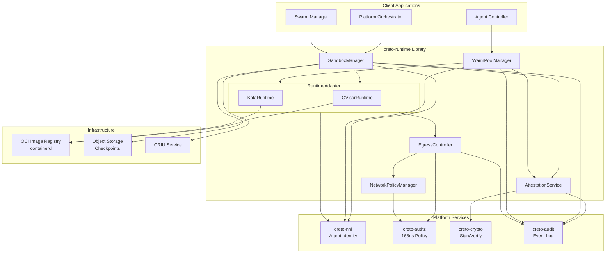
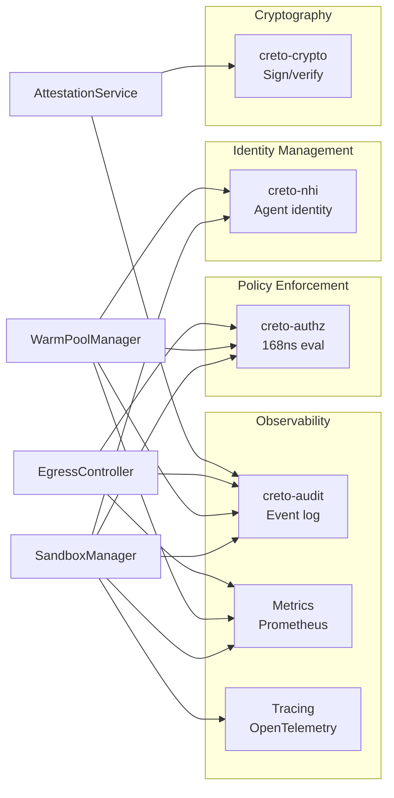
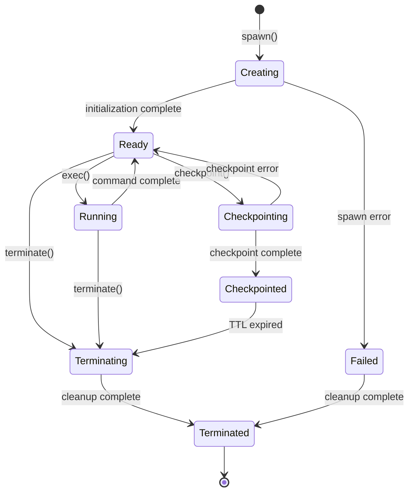
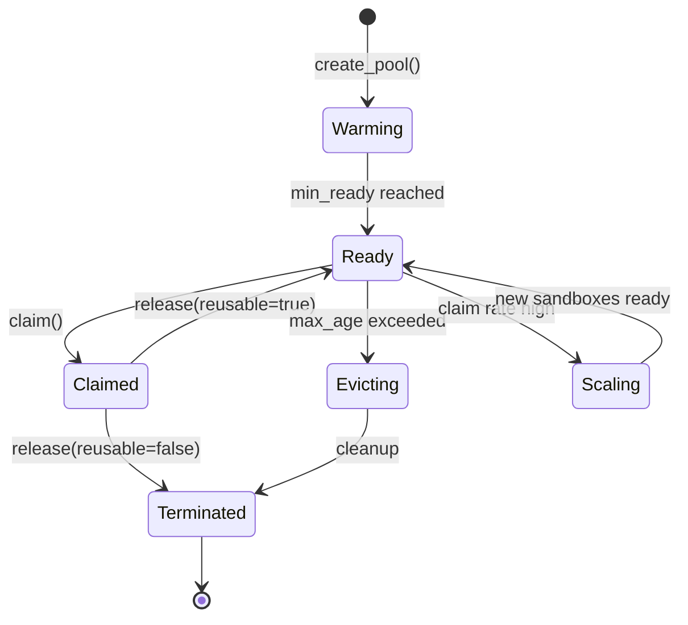

# RTM-02: Runtime Architecture Design

## Table of Contents
1. [System Architecture](#system-architecture)
2. [Component Design](#component-design)
3. [Runtime Backends](#runtime-backends)
4. [Warm Pool Architecture](#warm-pool-architecture)
5. [Network Egress Architecture](#network-egress-architecture)
6. [Attestation Architecture](#attestation-architecture)
7. [Checkpoint/Restore Architecture](#checkpoint-restore-architecture)
8. [Deployment Architecture](#deployment-architecture)

---

## System Architecture

### High-Level Component Diagram



### Architectural Layers

```
┌─────────────────────────────────────────────────────────────────┐
│                    Application Layer                            │
│  (Orchestrator, Controller, Swarm Manager embedding library)    │
└───────────────────────────┬─────────────────────────────────────┘
                            │ SandboxRuntime trait
                            ↓
┌─────────────────────────────────────────────────────────────────┐
│                    Management Layer                             │
│  ┌──────────────┐  ┌────────────────┐  ┌───────────────────┐   │
│  │SandboxManager│  │WarmPoolManager │  │AttestationService │   │
│  │              │  │                │  │                   │   │
│  │- Lifecycle   │  │- Pool mgmt     │  │- Sign/verify      │   │
│  │- TTL         │  │- Auto-scale    │  │- Platform evidence│   │
│  │- Exec        │  │- NHI binding   │  │                   │   │
│  └──────────────┘  └────────────────┘  └───────────────────┘   │
└───────────────────────────┬─────────────────────────────────────┘
                            │ RuntimeAdapter abstraction
                            ↓
┌─────────────────────────────────────────────────────────────────┐
│                    Runtime Backend Layer                        │
│  ┌──────────────────────┐        ┌───────────────────────────┐ │
│  │   GVisorRuntime      │        │    KataRuntime            │ │
│  │                      │        │                           │ │
│  │ - User-space kernel  │        │ - Lightweight VM          │ │
│  │ - ~200 syscalls      │        │ - Full kernel             │ │
│  │ - <2s cold start     │        │ - <5s cold start          │ │
│  │ - Netstack egress    │        │ - iptables egress         │ │
│  └──────────────────────┘        └───────────────────────────┘ │
└───────────────────────────┬─────────────────────────────────────┘
                            │ containerd CRI
                            ↓
┌─────────────────────────────────────────────────────────────────┐
│                    Infrastructure Layer                         │
│  ┌────────────┐  ┌────────────┐  ┌────────────┐  ┌──────────┐ │
│  │ containerd │  │    CRIU    │  │   etcd     │  │  S3/Blob │ │
│  │(OCI images)│  │(checkpoint)│  │(pool state)│  │(checkpnt)│ │
│  └────────────┘  └────────────┘  └────────────┘  └──────────┘ │
└─────────────────────────────────────────────────────────────────┘
```

### Cross-Cutting Concerns



---

## Component Design

### 1. SandboxManager

**Responsibilities**:
- Sandbox lifecycle management (create, start, stop, terminate)
- Command execution with I/O capture
- TTL enforcement and automatic cleanup
- Status monitoring and health checks

**Interface**:
```rust
pub struct SandboxManager {
    runtime_adapter: Arc<dyn RuntimeAdapter>,
    attestation_service: Arc<AttestationService>,
    egress_controller: Arc<EgressController>,
    nhi_client: Arc<NhiClient>,
    authz_client: Arc<AuthzClient>,
    audit_client: Arc<AuditClient>,
}

#[async_trait]
impl SandboxManager {
    /// Spawn new sandbox from specification
    pub async fn spawn(&self, spec: &SandboxSpec) -> Result<SandboxHandle, Error>;

    /// Terminate running sandbox
    pub async fn terminate(&self, id: &SandboxId) -> Result<(), Error>;

    /// Execute command in sandbox
    pub async fn exec(
        &self,
        id: &SandboxId,
        cmd: Command,
    ) -> Result<ExecOutput, Error>;

    /// Query sandbox status
    pub async fn status(&self, id: &SandboxId) -> Result<SandboxStatus, Error>;

    /// List all sandboxes
    pub async fn list(&self) -> Result<Vec<SandboxInfo>, Error>;

    /// Create checkpoint of sandbox
    pub async fn checkpoint(&self, id: &SandboxId) -> Result<CheckpointId, Error>;

    /// Restore sandbox from checkpoint
    pub async fn restore(
        &self,
        checkpoint_id: &CheckpointId,
        nhi_override: Option<AgentIdentity>,
    ) -> Result<SandboxHandle, Error>;
}
```

**State Machine**:


**Spawn Flow**:
```rust
async fn spawn_internal(&self, spec: &SandboxSpec) -> Result<SandboxHandle, Error> {
    // 1. Validate spec
    spec.validate()?;

    // 2. Check spawn authorization
    self.authz_client.check(AuthzRequest {
        principal: spec.agent_nhi.clone(),
        action: "sandbox.spawn",
        resource: "runtime:sandboxes",
    }).await?;

    // 3. Select runtime backend
    let runtime = self.runtime_adapter.select_backend(&spec.runtime_class)?;

    // 4. Fetch NHI-delegated secrets
    let secrets = self.fetch_secrets(&spec.secrets, &spec.agent_nhi).await?;

    // 5. Spawn via backend
    let handle = runtime.spawn(spec, &secrets).await?;

    // 6. Generate attestation
    let attestation = self.attestation_service.generate(&handle, spec).await?;

    // 7. Setup egress enforcement
    self.egress_controller.attach(&handle.id, &spec.network_policy).await?;

    // 8. Log to audit
    self.audit_client.log(AuditEvent::SandboxSpawned {
        sandbox_id: handle.id.clone(),
        agent_nhi: spec.agent_nhi.clone(),
        attestation_hash: attestation.hash(),
    }).await?;

    // 9. Schedule TTL cleanup
    if let Some(ttl) = spec.ttl {
        self.schedule_ttl_cleanup(handle.id.clone(), ttl);
    }

    Ok(SandboxHandle {
        id: handle.id,
        agent_nhi: spec.agent_nhi.clone(),
        attestation,
        status: SandboxStatus::Ready,
        created_at: Timestamp::now(),
    })
}
```

---

### 2. WarmPoolManager

**Responsibilities**:
- Maintain pools of pre-warmed sandboxes
- Auto-scale pool based on claim rate
- Bind NHI on claim (<100ms)
- Evict old sandboxes from pool
- Provide pool statistics

**Interface**:
```rust
pub struct WarmPoolManager {
    runtime_adapter: Arc<dyn RuntimeAdapter>,
    attestation_service: Arc<AttestationService>,
    nhi_client: Arc<NhiClient>,
    pool_state_store: Arc<PoolStateStore>,
    metrics: Arc<MetricsRecorder>,
}

impl WarmPoolManager {
    /// Create warm pool from template
    pub async fn create_pool(&self, config: WarmPoolConfig) -> Result<PoolId, Error>;

    /// Claim sandbox from pool (bind NHI)
    pub async fn claim(
        &self,
        pool_id: &PoolId,
        agent_nhi: &AgentIdentity,
        delegation_chain: &[AgentIdentity],
    ) -> Result<SandboxHandle, Error>;

    /// Release sandbox back to pool
    pub async fn release(&self, sandbox_id: &SandboxId, reusable: bool) -> Result<(), Error>;

    /// Get pool statistics
    pub async fn pool_stats(&self, pool_id: &PoolId) -> Result<PoolStatistics, Error>;

    /// Destroy pool
    pub async fn destroy_pool(&self, pool_id: &PoolId) -> Result<(), Error>;
}
```

**Pool State Machine**:


**Claim Flow (Target: <100ms)**:
```rust
async fn claim_internal(
    &self,
    pool_id: &PoolId,
    agent_nhi: &AgentIdentity,
) -> Result<SandboxHandle, Error> {
    let start = Instant::now();

    // 1. Select ready sandbox from pool (<1ms, in-memory)
    let sandbox = self.pool_state_store.pop_ready(pool_id).await?;

    // 2. Bind NHI to sandbox (<10ms)
    self.nhi_client.bind_identity(&sandbox.id, agent_nhi).await?;

    // 3. Inject NHI-delegated secrets (<50ms)
    let secrets = self.fetch_and_inject_secrets(&sandbox, agent_nhi).await?;

    // 4. Generate attestation (<30ms)
    let attestation = self.attestation_service.generate(&sandbox, agent_nhi).await?;

    // 5. Mark as in-use in pool state (<1ms)
    self.pool_state_store.mark_claimed(&sandbox.id).await?;

    // 6. Log claim event (<5ms)
    self.audit_client.log(AuditEvent::PoolClaimed {
        pool_id: pool_id.clone(),
        sandbox_id: sandbox.id.clone(),
        agent_nhi: agent_nhi.clone(),
    }).await?;

    // 7. Emit metrics
    let latency = start.elapsed();
    self.metrics.record_claim_latency(pool_id, latency);

    // Total: <100ms (p99 target)
    Ok(SandboxHandle {
        id: sandbox.id,
        agent_nhi: agent_nhi.clone(),
        attestation,
        status: SandboxStatus::Ready,
        created_at: Timestamp::now(),
    })
}
```

**Auto-Scaling Algorithm**:
```rust
async fn auto_scale_pool(&self, pool_id: &PoolId) {
    let stats = self.pool_stats(pool_id).await?;
    let config = self.get_pool_config(pool_id).await?;

    // Calculate desired ready count based on claim rate
    let claim_rate = stats.claims_per_minute;
    let desired_ready = (claim_rate * 1.5).ceil() as usize; // 50% headroom

    let desired_ready = desired_ready
        .max(config.min_ready)
        .min(config.max_ready);

    let current_ready = stats.ready_count;

    if current_ready < desired_ready {
        // Scale up: spawn more sandboxes
        let to_spawn = desired_ready - current_ready;
        for _ in 0..to_spawn {
            self.spawn_for_pool(pool_id).await?;
        }
    } else if current_ready > desired_ready * 2 {
        // Scale down: evict excess sandboxes
        let to_evict = current_ready - desired_ready;
        for _ in 0..to_evict {
            self.evict_oldest(pool_id).await?;
        }
    }
}
```

---

### 3. RuntimeAdapter (Backend Abstraction)

**Responsibilities**:
- Provide unified interface across runtime backends
- Backend selection based on RuntimeClass
- Runtime-specific configuration
- Capability querying

**Trait Definition**:
```rust
#[async_trait]
pub trait RuntimeAdapter: Send + Sync {
    /// Runtime identifier
    fn runtime_id(&self) -> &str;

    /// Query runtime capabilities
    fn capabilities(&self) -> RuntimeCapabilities;

    /// Spawn sandbox
    async fn spawn(
        &self,
        spec: &SandboxSpec,
        secrets: &[ResolvedSecret],
    ) -> Result<RawSandboxHandle, Error>;

    /// Terminate sandbox
    async fn terminate(&self, id: &SandboxId) -> Result<(), Error>;

    /// Execute command
    async fn exec(
        &self,
        id: &SandboxId,
        cmd: Command,
    ) -> Result<ExecOutput, Error>;

    /// Query status
    async fn status(&self, id: &SandboxId) -> Result<RawSandboxStatus, Error>;

    /// Create checkpoint
    async fn checkpoint(&self, id: &SandboxId) -> Result<CheckpointData, Error>;

    /// Restore from checkpoint
    async fn restore(&self, data: CheckpointData) -> Result<RawSandboxHandle, Error>;

    /// Collect platform evidence for attestation
    async fn platform_evidence(&self, id: &SandboxId) -> Result<Vec<u8>, Error>;
}
```

**RuntimeCapabilities**:
```rust
pub struct RuntimeCapabilities {
    pub isolation_model: IsolationModel,
    pub syscall_coverage: SyscallCoverage,
    pub cold_start_latency: Duration,  // p99
    pub memory_overhead: u64,          // bytes
    pub supports_gpu: bool,
    pub supports_checkpoint: bool,
    pub network_interception: NetworkInterceptionMethod,
}

pub enum IsolationModel {
    UserSpaceKernel,  // gVisor
    LightweightVM,    // Kata
    HardwareVM,       // Firecracker, Cloud Hypervisor
}

pub enum SyscallCoverage {
    Partial { count: usize },  // gVisor: ~200
    Full,                      // Kata: full kernel
}

pub enum NetworkInterceptionMethod {
    Netstack,      // gVisor: user-space network stack
    Iptables,      // Kata: iptables in guest
    Ebpf,          // Future: eBPF-based
}
```

---

### 4. EgressController (Network Policy Enforcement)

**Responsibilities**:
- Intercept outbound connections from sandboxes
- Evaluate NetworkPolicy rules
- Call Authorization service for RequireAuthz destinations
- Log egress attempts to audit
- Enforce DNS policy

**Architecture**:
```mermaid
graph TB
    subgraph "Sandbox (gVisor)"
        App[Agent Code]
        Netstack[gVisor Netstack<br/>user-space TCP/IP]
    end

    subgraph "Sandbox (Kata)"
        App2[Agent Code]
        Kernel[Guest Kernel]
        Iptables[iptables/nftables]
    end

    App -->|socket()| Netstack
    Netstack -->|intercept| EC[EgressController]

    App2 -->|socket()| Kernel
    Kernel -->|netfilter| Iptables
    Iptables -->|intercept| EC

    EC --> NPM[NetworkPolicyManager<br/>Rule evaluation]
    NPM --> Cache[Policy Cache<br/>Bloom filter + Redis]

    NPM -->|RequireAuthz| AuthZ[creto-authz<br/>168ns eval]

    EC --> Audit[creto-audit<br/>Log attempts]

    EC -->|Allow| Network[External Network]
    EC -->|Deny| App
```

**Implementation**:
```rust
pub struct EgressController {
    policy_manager: Arc<NetworkPolicyManager>,
    authz_client: Arc<AuthzClient>,
    audit_client: Arc<AuditClient>,
    cache: Arc<PolicyDecisionCache>,
}

impl EgressController {
    /// Attach egress enforcement to sandbox
    pub async fn attach(
        &self,
        sandbox_id: &SandboxId,
        policy: &NetworkPolicy,
    ) -> Result<(), Error>;

    /// Check egress connection (called by runtime)
    pub async fn check_egress(
        &self,
        sandbox_id: &SandboxId,
        destination: &EgressDestination,
        protocol: Protocol,
    ) -> Result<EgressDecision, Error>;
}

async fn check_egress_internal(
    &self,
    sandbox_id: &SandboxId,
    destination: &EgressDestination,
) -> Result<EgressDecision, Error> {
    let start = Instant::now();

    // 1. Check cache (bloom filter: <1μs)
    if let Some(cached) = self.cache.get(sandbox_id, destination) {
        return Ok(cached);
    }

    // 2. Evaluate NetworkPolicy rules (<100μs)
    let policy = self.policy_manager.get_policy(sandbox_id).await?;
    let action = policy.evaluate_egress(destination);

    let decision = match action {
        NetworkAction::Allow => EgressDecision::Allow,
        NetworkAction::Deny => EgressDecision::Deny,
        NetworkAction::RequireAuthz => {
            // 3. Call AuthZ service (168ns eval + network ~1ms)
            let authz_result = self.authz_client.check(AuthzRequest {
                principal: self.get_sandbox_nhi(sandbox_id).await?,
                action: "network.egress",
                resource: format!("network:{}", destination),
            }).await?;

            if authz_result.allowed {
                EgressDecision::Allow
            } else {
                EgressDecision::Deny
            }
        }
    };

    // 4. Cache decision (Redis: <5ms)
    self.cache.set(sandbox_id, destination, &decision).await?;

    // 5. Log to audit (<5ms)
    self.audit_client.log(AuditEvent::EgressAttempt {
        sandbox_id: sandbox_id.clone(),
        destination: destination.clone(),
        decision: decision.clone(),
    }).await?;

    let latency = start.elapsed();
    // Target: <1ms (p99)

    Ok(decision)
}
```

**DNS Policy Enforcement**:
```rust
pub struct DnsPolicy {
    pub allowed_resolvers: Vec<IpAddr>,
    pub blocked_domains: Vec<DomainPattern>,
    pub require_authz_domains: Vec<DomainPattern>,
}

impl DnsPolicy {
    pub fn check_dns_query(
        &self,
        resolver: &IpAddr,
        domain: &str,
    ) -> Result<DnsDecision, Error> {
        // 1. Check resolver allowed
        if !self.allowed_resolvers.contains(resolver) {
            return Ok(DnsDecision::Deny);
        }

        // 2. Check blocked domains
        for pattern in &self.blocked_domains {
            if pattern.matches(domain) {
                return Ok(DnsDecision::Deny);
            }
        }

        // 3. Check AuthZ-required domains
        for pattern in &self.require_authz_domains {
            if pattern.matches(domain) {
                return Ok(DnsDecision::RequireAuthz);
            }
        }

        Ok(DnsDecision::Allow)
    }
}
```

---

### 5. AttestationService

**Responsibilities**:
- Generate platform attestations linking sandbox to NHI
- Sign attestations with runtime signing key
- Collect platform evidence (runtime version, measurements)
- Provide verification function for third parties

**Architecture**:
```mermaid
graph TB
    subgraph "AttestationService"
        Gen[generate()]
        Sign[Sign with Ed25519 + ML-DSA]
        Verify[verify()]
    end

    SM[SandboxManager] -->|spawn| Gen
    WPM[WarmPoolManager] -->|claim| Gen

    Gen --> Hash[Hash image/config/FS]
    Gen --> Evidence[Collect platform evidence]
    Gen --> Build[Build attestation struct]

    Build --> Sign
    Sign --> Crypto[creto-crypto<br/>Hybrid signature]

    Sign --> Audit[creto-audit<br/>Anchor attestation]

    Verify --> Crypto
    Verify -->|third-party| External[External Verifier]
```

**Implementation**:
```rust
pub struct AttestationService {
    signing_key: Arc<SigningKey>,  // Ed25519 + ML-DSA hybrid
    crypto_client: Arc<CryptoClient>,
    audit_client: Arc<AuditClient>,
}

impl AttestationService {
    /// Generate attestation for sandbox
    pub async fn generate(
        &self,
        handle: &RawSandboxHandle,
        spec: &SandboxSpec,
    ) -> Result<Attestation, Error>;

    /// Verify attestation signature and claims
    pub async fn verify(&self, attestation: &Attestation) -> Result<VerificationResult, Error>;
}

async fn generate_internal(
    &self,
    handle: &RawSandboxHandle,
    spec: &SandboxSpec,
) -> Result<Attestation, Error> {
    // 1. Hash image layers (SHA-256)
    let image_hash = self.hash_image(&spec.image).await?;

    // 2. Hash sandbox configuration
    let config_hash = {
        let mut hasher = Sha256::new();
        hasher.update(&serde_json::to_vec(spec)?);
        hasher.finalize().into()
    };

    // 3. Hash initial filesystem state
    let init_hash = self.hash_initial_fs(&handle.id).await?;

    // 4. Collect platform evidence
    let platform_evidence = handle.runtime.platform_evidence(&handle.id).await?;

    // 5. Build attestation struct
    let attestation = Attestation {
        sandbox_id: handle.id.clone(),
        agent_nhi: spec.agent_nhi.clone(),
        delegation_chain: spec.delegation_chain.clone(),

        image_hash,
        config_hash,
        init_hash,

        platform: handle.runtime.platform_type(),
        platform_evidence,

        created_at: Timestamp::now(),
        valid_until: Timestamp::now() + spec.ttl.unwrap_or(Duration::from_secs(3600)),

        signature: Signature::default(),  // Filled below
    };

    // 6. Sign attestation (hybrid Ed25519 + ML-DSA)
    let signature = self.crypto_client.sign_hybrid(
        &self.signing_key,
        &attestation.canonical_bytes(),
    ).await?;

    let attestation = Attestation {
        signature,
        ..attestation
    };

    // 7. Anchor in audit log
    self.audit_client.log(AuditEvent::AttestationGenerated {
        sandbox_id: handle.id.clone(),
        attestation_hash: attestation.hash(),
    }).await?;

    Ok(attestation)
}
```

**Verification**:
```rust
pub async fn verify_internal(&self, attestation: &Attestation) -> Result<VerificationResult, Error> {
    // 1. Verify signature
    let signature_valid = self.crypto_client.verify_hybrid(
        &attestation.signature,
        &attestation.canonical_bytes(),
        &self.signing_key.public_key(),
    ).await?;

    if !signature_valid {
        return Ok(VerificationResult::Invalid {
            reason: "Invalid signature".into(),
        });
    }

    // 2. Check temporal validity
    let now = Timestamp::now();
    if now < attestation.created_at || now > attestation.valid_until {
        return Ok(VerificationResult::Expired);
    }

    // 3. Verify platform evidence (backend-specific)
    let platform_valid = match attestation.platform {
        AttestationPlatform::GVisor => {
            // Verify gVisor version in expected range
            self.verify_gvisor_evidence(&attestation.platform_evidence)?
        }
        AttestationPlatform::Kata => {
            // Verify Kata measurements match expected
            self.verify_kata_evidence(&attestation.platform_evidence)?
        }
    };

    if !platform_valid {
        return Ok(VerificationResult::Invalid {
            reason: "Platform evidence mismatch".into(),
        });
    }

    Ok(VerificationResult::Valid {
        agent_nhi: attestation.agent_nhi.clone(),
        delegation_chain: attestation.delegation_chain.clone(),
        platform: attestation.platform.clone(),
    })
}
```

---

## Runtime Backends

### GVisorRuntime

**Characteristics**:
- **Isolation**: User-space kernel (Sentry)
- **Syscall Coverage**: ~200 syscalls
- **Cold Start**: <2s (p99)
- **Memory Overhead**: ~50MB
- **Network**: Netstack (user-space TCP/IP)

**Architecture**:
```
┌───────────────────────────────────────────┐
│              Host OS (Linux)              │
│  ┌─────────────────────────────────────┐  │
│  │         containerd                  │  │
│  │  ┌───────────────────────────────┐  │  │
│  │  │     runsc (gVisor runtime)    │  │  │
│  │  │  ┌─────────────────────────┐  │  │  │
│  │  │  │   Sentry (user kernel)  │  │  │  │
│  │  │  │  ┌───────────────────┐  │  │  │  │
│  │  │  │  │  Agent Process    │  │  │  │  │
│  │  │  │  │  (sandboxed app)  │  │  │  │  │
│  │  │  │  └───────────────────┘  │  │  │  │
│  │  │  │  ┌───────────────────┐  │  │  │  │
│  │  │  │  │  Netstack         │  │  │  │  │
│  │  │  │  │  (egress intercept)│ │  │  │  │
│  │  │  │  └───────────────────┘  │  │  │  │
│  │  │  └─────────────────────────┘  │  │  │
│  │  │  ┌─────────────────────────┐  │  │  │
│  │  │  │   Gofer (FS proxy)      │  │  │  │
│  │  │  └─────────────────────────┘  │  │  │
│  │  └───────────────────────────────┘  │  │
│  └─────────────────────────────────────┘  │
└───────────────────────────────────────────┘
```

**Implementation**:
```rust
pub struct GVisorRuntime {
    runsc_path: PathBuf,
    platform: GVisorPlatform,  // ptrace, kvm, systrap
    containerd_client: ContainerdClient,
}

#[async_trait]
impl RuntimeAdapter for GVisorRuntime {
    fn runtime_id(&self) -> &str {
        "gvisor"
    }

    fn capabilities(&self) -> RuntimeCapabilities {
        RuntimeCapabilities {
            isolation_model: IsolationModel::UserSpaceKernel,
            syscall_coverage: SyscallCoverage::Partial { count: 200 },
            cold_start_latency: Duration::from_millis(2000),
            memory_overhead: 50 * 1024 * 1024,
            supports_gpu: false,
            supports_checkpoint: true,
            network_interception: NetworkInterceptionMethod::Netstack,
        }
    }

    async fn spawn(&self, spec: &SandboxSpec, secrets: &[ResolvedSecret]) -> Result<RawSandboxHandle, Error> {
        // 1. Create containerd container with runsc runtime
        let container_id = self.containerd_client.create_container(
            &spec.image,
            &ContainerConfig {
                runtime: "runsc",
                runtime_options: GVisorRuntimeOptions {
                    platform: self.platform,
                    network: "netstack",
                    file_access: "shared",
                },
                resources: spec.resource_limits.into(),
            },
        ).await?;

        // 2. Inject secrets as env vars or files
        for secret in secrets {
            self.inject_secret(&container_id, secret).await?;
        }

        // 3. Start container
        self.containerd_client.start_container(&container_id).await?;

        // 4. Setup netstack interception
        self.setup_netstack_egress(&container_id).await?;

        Ok(RawSandboxHandle {
            id: SandboxId::from(container_id),
            runtime: Arc::new(self.clone()),
        })
    }

    // Network interception via gVisor Netstack
    async fn setup_netstack_egress(&self, container_id: &str) -> Result<(), Error> {
        // gVisor Netstack allows us to intercept connections at user-space TCP/IP layer
        // Register callback with EgressController
        self.runsc_command(&[
            "netstack-hook",
            "--container", container_id,
            "--egress-callback", "http://localhost:8080/egress-check",
        ]).await?;

        Ok(())
    }
}
```

---

### KataRuntime

**Characteristics**:
- **Isolation**: Lightweight VM (QEMU/Firecracker/Cloud Hypervisor)
- **Syscall Coverage**: Full Linux kernel
- **Cold Start**: <5s (p99)
- **Memory Overhead**: ~100MB
- **Network**: iptables/nftables in guest VM

**Architecture**:
```
┌───────────────────────────────────────────┐
│              Host OS (Linux)              │
│  ┌─────────────────────────────────────┐  │
│  │         containerd                  │  │
│  │  ┌───────────────────────────────┐  │  │
│  │  │  kata-runtime                 │  │  │
│  │  │  ┌─────────────────────────┐  │  │  │
│  │  │  │  Hypervisor (QEMU)      │  │  │  │
│  │  │  │  ┌───────────────────┐  │  │  │  │
│  │  │  │  │   Guest VM        │  │  │  │  │
│  │  │  │  │  ┌─────────────┐  │  │  │  │  │
│  │  │  │  │  │Guest Kernel │  │  │  │  │  │
│  │  │  │  │  │ (iptables)  │  │  │  │  │  │
│  │  │  │  │  └─────────────┘  │  │  │  │  │
│  │  │  │  │  ┌─────────────┐  │  │  │  │  │
│  │  │  │  │  │Agent Process│  │  │  │  │  │
│  │  │  │  │  └─────────────┘  │  │  │  │  │
│  │  │  │  │                   │  │  │  │  │
│  │  │  │  └───────────────────┘  │  │  │  │
│  │  │  └─────────────────────────┘  │  │  │
│  │  │  ┌─────────────────────────┐  │  │  │
│  │  │  │  kata-agent (virtiofs)  │  │  │  │
│  │  │  └─────────────────────────┘  │  │  │
│  │  └───────────────────────────────┘  │  │
│  └─────────────────────────────────────┘  │
└───────────────────────────────────────────┘
```

**Implementation**:
```rust
pub struct KataRuntime {
    kata_runtime_path: PathBuf,
    hypervisor: Hypervisor,  // QEMU, Firecracker, CloudHypervisor
    containerd_client: ContainerdClient,
}

#[async_trait]
impl RuntimeAdapter for KataRuntime {
    fn capabilities(&self) -> RuntimeCapabilities {
        RuntimeCapabilities {
            isolation_model: IsolationModel::LightweightVM,
            syscall_coverage: SyscallCoverage::Full,
            cold_start_latency: Duration::from_millis(5000),
            memory_overhead: 100 * 1024 * 1024,
            supports_gpu: true,  // GPU passthrough possible
            supports_checkpoint: true,
            network_interception: NetworkInterceptionMethod::Iptables,
        }
    }

    async fn spawn(&self, spec: &SandboxSpec, secrets: &[ResolvedSecret]) -> Result<RawSandboxHandle, Error> {
        // 1. Create VM-based container
        let container_id = self.containerd_client.create_container(
            &spec.image,
            &ContainerConfig {
                runtime: "kata-runtime",
                runtime_options: KataRuntimeOptions {
                    hypervisor: self.hypervisor,
                    kernel: "/usr/share/kata-containers/vmlinuz",
                    initrd: "/usr/share/kata-containers/kata-containers-initrd.img",
                    enable_iommu: false,
                },
                resources: spec.resource_limits.into(),
            },
        ).await?;

        // 2. Inject secrets
        for secret in secrets {
            self.inject_secret(&container_id, secret).await?;
        }

        // 3. Start container (VM boot + container start)
        self.containerd_client.start_container(&container_id).await?;

        // 4. Setup iptables egress rules in guest
        self.setup_iptables_egress(&container_id).await?;

        Ok(RawSandboxHandle {
            id: SandboxId::from(container_id),
            runtime: Arc::new(self.clone()),
        })
    }

    // Network interception via iptables in guest VM
    async fn setup_iptables_egress(&self, container_id: &str) -> Result<(), Error> {
        // Exec into guest VM and setup iptables rules
        // All outbound traffic goes through nfqueue, userspace daemon checks with EgressController
        self.exec_in_guest(container_id, &[
            "iptables", "-A", "OUTPUT",
            "-j", "NFQUEUE", "--queue-num", "0",
        ]).await?;

        // Start userspace daemon in guest to process nfqueue packets
        self.exec_in_guest(container_id, &[
            "/usr/local/bin/egress-enforcer",
            "--callback", "http://host.kata.internal:8080/egress-check",
        ]).await?;

        Ok(())
    }
}
```

---

## Warm Pool Architecture

**Pool State Storage (etcd)**:
```rust
pub struct PoolStateStore {
    etcd_client: Arc<EtcdClient>,
}

// Key schema:
// /warmpool/{pool_id}/config          -> WarmPoolConfig
// /warmpool/{pool_id}/sandboxes/{id}  -> PoolSandboxState
// /warmpool/{pool_id}/stats           -> PoolStatistics

pub enum PoolSandboxState {
    Warming { started_at: Timestamp },
    Ready { ready_at: Timestamp },
    Claimed { claimed_at: Timestamp, agent_nhi: AgentIdentity },
    Evicting { started_at: Timestamp },
}

pub struct PoolStatistics {
    pub ready_count: usize,
    pub claimed_count: usize,
    pub warming_count: usize,
    pub claims_per_minute: f64,
    pub avg_claim_latency: Duration,
    pub p99_claim_latency: Duration,
}
```

**Auto-Scaling Algorithm**:
```rust
impl WarmPoolManager {
    async fn auto_scale_loop(&self) {
        loop {
            tokio::time::sleep(Duration::from_secs(10)).await;

            for pool_id in self.list_pools().await? {
                self.auto_scale_pool(&pool_id).await?;
            }
        }
    }

    async fn auto_scale_pool(&self, pool_id: &PoolId) -> Result<(), Error> {
        let stats = self.pool_stats(pool_id).await?;
        let config = self.get_pool_config(pool_id).await?;

        // Calculate desired ready count
        let claim_rate = stats.claims_per_minute;
        let headroom_factor = 1.5;  // 50% headroom
        let desired_ready = ((claim_rate * headroom_factor) as usize)
            .max(config.min_ready)
            .min(config.max_ready);

        let current_ready = stats.ready_count;
        let delta = desired_ready as isize - current_ready as isize;

        if delta > 0 {
            // Scale up
            for _ in 0..delta {
                self.spawn_for_pool(pool_id).await?;
            }
        } else if delta < -5 {
            // Scale down (only if significantly over-provisioned)
            for _ in 0..(-delta.min(-5)) {
                self.evict_oldest(pool_id).await?;
            }
        }

        Ok(())
    }
}
```

---

## Checkpoint/Restore Architecture

**Checkpoint Storage**:
```
S3/Blob Storage:
  /checkpoints/{checkpoint_id}/
    metadata.json     -> CheckpointMetadata
    memory.img        -> Memory dump
    cpu-state.json    -> CPU registers
    fs-delta.tar.gz   -> Filesystem delta
```

**Checkpoint Flow**:
```rust
impl SandboxManager {
    pub async fn checkpoint(&self, id: &SandboxId) -> Result<CheckpointId, Error> {
        // 1. Call CRIU to checkpoint process
        let checkpoint_data = self.runtime_adapter.checkpoint(id).await?;

        // 2. Generate checkpoint ID
        let checkpoint_id = CheckpointId::new();

        // 3. Upload to durable storage
        self.storage_client.upload_checkpoint(
            &checkpoint_id,
            &checkpoint_data,
        ).await?;

        // 4. Store metadata
        let metadata = CheckpointMetadata {
            checkpoint_id: checkpoint_id.clone(),
            sandbox_id: id.clone(),
            agent_nhi: self.get_sandbox_nhi(id).await?,
            original_spec: self.get_sandbox_spec(id).await?,
            created_at: Timestamp::now(),
        };

        self.storage_client.upload_metadata(
            &checkpoint_id,
            &metadata,
        ).await?;

        // 5. Log to audit
        self.audit_client.log(AuditEvent::SandboxCheckpointed {
            sandbox_id: id.clone(),
            checkpoint_id: checkpoint_id.clone(),
        }).await?;

        Ok(checkpoint_id)
    }

    pub async fn restore(
        &self,
        checkpoint_id: &CheckpointId,
        nhi_override: Option<AgentIdentity>,
    ) -> Result<SandboxHandle, Error> {
        // 1. Fetch checkpoint data
        let checkpoint_data = self.storage_client.download_checkpoint(checkpoint_id).await?;
        let metadata = self.storage_client.download_metadata(checkpoint_id).await?;

        // 2. Use original NHI or override
        let agent_nhi = nhi_override.unwrap_or(metadata.agent_nhi.clone());

        // 3. Restore via runtime backend
        let handle = self.runtime_adapter.restore(checkpoint_data).await?;

        // 4. Rebind NHI if overridden
        if nhi_override.is_some() {
            self.nhi_client.bind_identity(&handle.id, &agent_nhi).await?;
        }

        // 5. Generate new attestation
        let attestation = self.attestation_service.generate(
            &handle,
            &metadata.original_spec,
        ).await?;

        // 6. Log restore
        self.audit_client.log(AuditEvent::SandboxRestored {
            checkpoint_id: checkpoint_id.clone(),
            sandbox_id: handle.id.clone(),
            agent_nhi: agent_nhi.clone(),
        }).await?;

        Ok(SandboxHandle {
            id: handle.id,
            agent_nhi,
            attestation,
            status: SandboxStatus::Ready,
            created_at: Timestamp::now(),
        })
    }
}
```

---

## Deployment Architecture

### Single-Node Deployment

```
┌───────────────────────────────────────────────────────────────┐
│                    Runtime Host (64 vCPU, 256GB RAM)          │
│  ┌─────────────────────────────────────────────────────────┐  │
│  │             Application (Orchestrator)                  │  │
│  │  embeds creto-runtime library                           │  │
│  └───────────────────┬─────────────────────────────────────┘  │
│                      │                                         │
│  ┌───────────────────▼─────────────────────────────────────┐  │
│  │            creto-runtime Library                        │  │
│  │  - SandboxManager                                       │  │
│  │  - WarmPoolManager                                      │  │
│  │  - EgressController                                     │  │
│  │  - AttestationService                                   │  │
│  └───────────────────┬─────────────────────────────────────┘  │
│                      │                                         │
│  ┌───────────────────▼─────────────────────────────────────┐  │
│  │           containerd (OCI runtime)                      │  │
│  │  ┌────────────┐  ┌────────────┐  ┌────────────┐        │  │
│  │  │   runsc    │  │   runsc    │  │kata-runtime│        │  │
│  │  │  (gVisor)  │  │  (gVisor)  │  │   (Kata)   │        │  │
│  │  └────────────┘  └────────────┘  └────────────┘        │  │
│  └─────────────────────────────────────────────────────────┘  │
└───────────────────────────────────────────────────────────────┘
```

### Multi-Node Deployment (with Kubernetes Operator)

```
┌─────────────────────────────────────────────────────────────┐
│                    Kubernetes Cluster                       │
│  ┌───────────────────────────────────────────────────────┐  │
│  │         creto-runtime-operator (Deployment)           │  │
│  │  - Watches Sandbox CRDs                               │  │
│  │  - Embeds creto-runtime library                       │  │
│  │  - Manages WarmPools across nodes                     │  │
│  └───────────────────┬───────────────────────────────────┘  │
│                      │ watches                               │
│  ┌───────────────────▼───────────────────────────────────┐  │
│  │           Kubernetes API Server                       │  │
│  │  CRDs: Sandbox, SandboxWarmPool, SandboxClaim         │  │
│  └───────────────────────────────────────────────────────┘  │
│                      │                                       │
│  ┌───────────────────▼───────────────────────────────────┐  │
│  │           Runtime Nodes (3+)                          │  │
│  │  Each node runs:                                      │  │
│  │  - containerd                                         │  │
│  │  - runsc (gVisor)                                     │  │
│  │  - kata-runtime (Kata)                                │  │
│  └───────────────────────────────────────────────────────┘  │
└─────────────────────────────────────────────────────────────┘
         │                      │
         ↓                      ↓
  ┌──────────────┐      ┌──────────────┐
  │     etcd     │      │  S3/Blob     │
  │(pool state)  │      │(checkpoints) │
  └──────────────┘      └──────────────┘
```

---

## Revision History

| Date | Version | Author | Changes |
|------|---------|--------|---------|
| 2025-12-25 | 0.1 | Claude | Initial architecture design |
