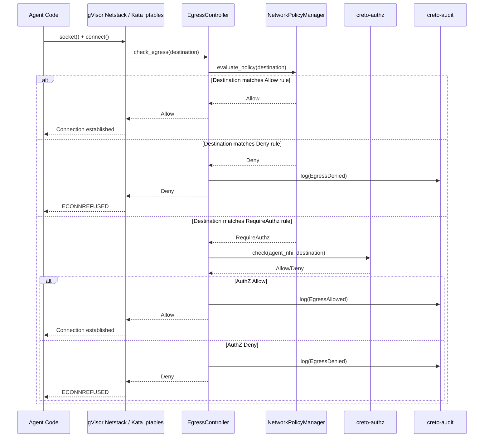
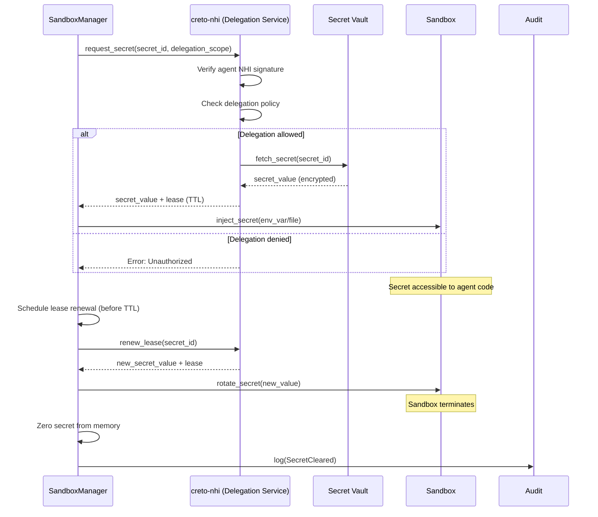

# RTM-05: Runtime Security Design

## Table of Contents
1. [Threat Model](#threat-model)
2. [Isolation Architecture](#isolation-architecture)
3. [Network Security](#network-security)
4. [Secret Management](#secret-management)
5. [Attestation Security](#attestation-security)
6. [Attack Surfaces](#attack-surfaces)
7. [Security Controls](#security-controls)
8. [Compliance Mapping](#compliance-mapping)

---

## Threat Model

### Trust Boundaries

```
┌─────────────────────────────────────────────────────────────┐
│                    Untrusted Zone                           │
│  ┌───────────────────────────────────────────────────────┐  │
│  │            Agent Code (Sandboxed)                     │  │
│  │  - AI-generated code (potentially malicious)          │  │
│  │  - User-provided scripts                              │  │
│  │  - Third-party dependencies                           │  │
│  └───────────────────────────────────────────────────────┘  │
└────────────────────┬────────────────────────────────────────┘
                     │ gVisor/Kata isolation boundary
                     ↓
┌─────────────────────────────────────────────────────────────┐
│                    Trusted Zone                             │
│  ┌───────────────────────────────────────────────────────┐  │
│  │         creto-runtime Service                         │  │
│  │  - SandboxManager                                     │  │
│  │  - EgressController                                   │  │
│  │  - AttestationService                                 │  │
│  └───────────────────────────────────────────────────────┘  │
│  ┌───────────────────────────────────────────────────────┐  │
│  │         Platform Services                             │  │
│  │  - creto-nhi (identity)                               │  │
│  │  - creto-authz (policy)                               │  │
│  │  - creto-audit (logging)                              │  │
│  └───────────────────────────────────────────────────────┘  │
└─────────────────────────────────────────────────────────────┘
```

### Threat Actors

| Actor | Motivation | Capabilities |
|-------|------------|--------------|
| **Malicious Agent** | Data exfiltration, lateral movement | Execute arbitrary code in sandbox |
| **Compromised Image** | Backdoor installation, persistence | Modify sandbox filesystem, processes |
| **External Attacker** | Sandbox escape, privilege escalation | Network-based attacks, exploit CVEs |
| **Insider Threat** | Credential theft, policy bypass | Access to runtime host, network |
| **Supply Chain Attack** | Compromise OCI images, dependencies | Malicious packages in agent code |

---

### Threat Scenarios

#### T-001: Sandbox Escape

**Description**: Agent code exploits kernel vulnerability to escape sandbox and access host resources.

**Attack Vector**:
1. Agent code triggers syscall bug in gVisor Sentry or guest kernel
2. Exploit gains code execution in host context
3. Attacker pivots to other sandboxes or platform services

**Mitigations**:
- **gVisor**: User-space kernel limits attack surface (~200 syscalls vs full kernel)
- **Kata**: Hardware VM isolation (even if guest kernel compromised, hypervisor protects host)
- **Regular Updates**: Patch gVisor/Kata on CVE disclosures
- **Monitoring**: Detect anomalous syscalls, kernel crashes

**Residual Risk**: Low (gVisor), Very Low (Kata)

---

#### T-002: Network Data Exfiltration

**Description**: Agent code exfiltrates sensitive data to attacker-controlled server.

**Attack Vector**:
1. Agent code collects sensitive data (credentials, PII, proprietary data)
2. Establishes outbound connection to attacker server
3. Transmits data over HTTP/DNS/ICMP

**Mitigations**:
- **Default Deny Egress**: NetworkPolicy blocks all egress by default
- **Authorization Enforcement**: RequireAuthz destinations checked via creto-authz (168ns)
- **DNS Policy**: Only allowed resolvers, domain filtering
- **Audit Logging**: All egress attempts logged (allowed and denied)

**Residual Risk**: Low (with proper NetworkPolicy configuration)

---

#### T-003: Credential Theft

**Description**: Agent code steals NHI-delegated secrets or credentials.

**Attack Vector**:
1. Agent code reads environment variables or files containing secrets
2. Sends credentials to attacker via exfiltration (T-002)
3. Attacker impersonates agent to access protected resources

**Mitigations**:
- **NHI Delegation**: Secrets scoped to agent NHI, time-limited (TTL)
- **Network Egress Control**: Limits exfiltration channels
- **Secret Rotation**: Automatic rotation on lease renewal
- **Memory Zeroing**: Secrets cleared from memory on sandbox termination
- **Audit Logging**: Secret access logged (no plaintext)

**Residual Risk**: Medium (secrets accessible to agent code by design)

---

#### T-004: Resource Exhaustion (DoS)

**Description**: Agent code consumes excessive resources, impacting other sandboxes or host.

**Attack Vector**:
1. Agent code spawns fork bomb (PID exhaustion)
2. Allocates all memory (OOM)
3. Consumes CPU, disk I/O, network bandwidth

**Mitigations**:
- **cgroups Limits**: Hard limits on CPU, memory, disk, PID, network
- **OOM Killer**: Sandbox terminated, host unaffected
- **Quota Enforcement**: Disk quotas, network bandwidth limits
- **Monitoring**: Alert on resource usage anomalies

**Residual Risk**: Very Low (cgroups isolation)

---

#### T-005: Attestation Forgery

**Description**: Attacker forges attestation to impersonate legitimate sandbox execution.

**Attack Vector**:
1. Attacker steals runtime signing key
2. Generates fake attestation with fabricated NHI, image hash
3. Presents forged attestation to auditor as evidence

**Mitigations**:
- **Hybrid Signature**: Ed25519 + ML-DSA (post-quantum resistant)
- **Key Protection**: Signing key stored in HSM (production) or encrypted at rest
- **Key Rotation**: 30-day rotation with overlap
- **Platform Evidence**: Include gVisor/Kata measurements (hard to forge)
- **Audit Anchoring**: Attestations anchored in Merkle tree, consensus-replicated

**Residual Risk**: Low (HSM protection), Medium (software key)

---

#### T-006: Time-of-Check-Time-of-Use (TOCTOU)

**Description**: Agent modifies configuration after AuthZ check but before enforcement.

**Attack Vector**:
1. Agent passes NetworkPolicy validation at spawn
2. Agent modifies iptables rules in sandbox (if privileged)
3. Bypasses egress enforcement

**Mitigations**:
- **Immutable NetworkPolicy**: Policy set at spawn, cannot be modified by sandbox
- **No Privileged Mode**: Sandboxes never run with CAP_NET_ADMIN or privileged flag
- **Policy Enforcement in Host**: gVisor Netstack or Kata iptables controlled by host, not guest

**Residual Risk**: Very Low (no sandbox privilege)

---

#### T-007: Side-Channel Attacks

**Description**: Attacker infers secrets via timing, cache, or speculative execution side-channels.

**Attack Vector**:
1. Malicious sandbox co-located on same host
2. Uses CPU cache timing to infer secrets from other sandboxes
3. Exploits Spectre/Meltdown variants

**Mitigations**:
- **VM Isolation (Kata)**: Hardware VM boundary prevents cross-sandbox cache attacks
- **CPU Isolation**: Dedicated CPU cores per sandbox (optional, high-security workloads)
- **Kernel Mitigations**: KPTI, IBRS, retpoline enabled
- **Scheduler Fairness**: Prevent timing inference via scheduling

**Residual Risk**: Medium (gVisor shared kernel), Low (Kata VM isolation)

---

#### T-008: Supply Chain Attack (Malicious Image)

**Description**: Attacker compromises OCI image in registry, sandboxes spawn with backdoor.

**Attack Vector**:
1. Attacker gains access to image registry
2. Replaces legitimate image with malicious version
3. Sandboxes spawn with pre-installed backdoor

**Mitigations**:
- **Image Signing**: Require signed images (cosign, Notary v2)
- **Digest Pinning**: Reference images by SHA-256 digest, not tag
- **Vulnerability Scanning**: Scan images for CVEs before spawn
- **Attestation**: Image hash included in attestation (tamper-evident)

**Residual Risk**: Low (image signing), Medium (unsigned images)

---

## Isolation Architecture

### gVisor Isolation Model

```
┌──────────────────────────────────────────────────────────┐
│                     Host OS (Linux)                      │
│  ┌────────────────────────────────────────────────────┐  │
│  │             Sentry (user-space kernel)             │  │
│  │  ┌──────────────────────────────────────────────┐  │  │
│  │  │          Agent Process                       │  │  │
│  │  │  - Syscalls intercepted by Sentry            │  │  │
│  │  │  - ~200 syscalls implemented                 │  │  │
│  │  │  - No direct host kernel access              │  │  │
│  │  └──────────────────────────────────────────────┘  │  │
│  │  ┌──────────────────────────────────────────────┐  │  │
│  │  │          Netstack (user TCP/IP)              │  │  │
│  │  │  - Egress interception before network        │  │  │
│  │  └──────────────────────────────────────────────┘  │  │
│  └────────────────────────────────────────────────────┘  │
│  ┌────────────────────────────────────────────────────┐  │
│  │             Gofer (FS proxy)                       │  │
│  │  - Proxies file access to host                    │  │
│  │  - No direct filesystem access                    │  │
│  └────────────────────────────────────────────────────┘  │
└──────────────────────────────────────────────────────────┘
```

**Security Properties**:
- **Syscall Filtering**: Only ~200 syscalls implemented (vs 300+ in full kernel)
- **User-Space Kernel**: Sentry bugs cannot directly exploit host kernel
- **No Hardware Access**: No direct access to hardware devices
- **Network Isolation**: Netstack controls all network I/O

**Limitations**:
- **Shared Kernel Structures**: Some shared memory, cache (side-channel risk)
- **Syscall Coverage**: Unsupported syscalls fail (compatibility issues)

---

### Kata Containers Isolation Model

```
┌──────────────────────────────────────────────────────────┐
│                     Host OS (Linux)                      │
│  ┌────────────────────────────────────────────────────┐  │
│  │         Hypervisor (QEMU/Firecracker)              │  │
│  │  ┌──────────────────────────────────────────────┐  │  │
│  │  │           Guest VM                           │  │  │
│  │  │  ┌────────────────────────────────────────┐  │  │  │
│  │  │  │   Guest Kernel (Linux)                 │  │  │  │
│  │  │  │  - Full kernel in VM                   │  │  │  │
│  │  │  │  - iptables for egress control         │  │  │  │
│  │  │  └────────────────────────────────────────┘  │  │  │
│  │  │  ┌────────────────────────────────────────┐  │  │  │
│  │  │  │   Agent Process                        │  │  │  │
│  │  │  │  - Runs in guest userspace             │  │  │  │
│  │  │  └────────────────────────────────────────┘  │  │  │
│  │  └──────────────────────────────────────────────┘  │  │
│  │  - Hardware VM boundary (VT-x/AMD-V)              │  │
│  └────────────────────────────────────────────────────┘  │
└──────────────────────────────────────────────────────────┘
```

**Security Properties**:
- **Hardware VM Isolation**: CPU enforces guest/host separation
- **Full Syscall Support**: Guest kernel implements all syscalls
- **No Shared Memory**: Guest and host memory isolated by MMU
- **Side-Channel Resistance**: Hardware isolation prevents cache timing attacks

**Limitations**:
- **Larger Attack Surface**: Full guest kernel (more CVEs than gVisor)
- **Slower Startup**: VM boot overhead (~5s vs gVisor ~2s)

---

### Comparison Matrix

| Aspect | gVisor | Kata Containers |
|--------|--------|-----------------|
| **Isolation Model** | User-space kernel | Hardware VM |
| **Syscall Coverage** | ~200 syscalls | Full kernel |
| **Escape Difficulty** | High (limited syscalls) | Very High (VM boundary) |
| **Side-Channel Risk** | Medium (shared cache) | Low (hardware isolation) |
| **Startup Time** | <2s (p99) | <5s (p99) |
| **Memory Overhead** | ~50MB | ~100MB |
| **Best For** | High-throughput, interactive | Highest security, regulated |

---

## Network Security

### Egress Enforcement Architecture



### Network Policy Example

```yaml
networkPolicy:
  defaultAction: Deny

  egressRules:
    # Allow internal services (private IP ranges)
    - destination:
        cidrBlock: 10.0.0.0/8
      action: Allow

    - destination:
        cidrBlock: 172.16.0.0/12
      action: Allow

    - destination:
        cidrBlock: 192.168.0.0/16
      action: Allow

    # Allow Kubernetes DNS
    - destination:
        serviceRef:
          name: kube-dns
          namespace: kube-system
      action: Allow

    # Require AuthZ for external APIs
    - destination:
        domain: "*.anthropic.com"
      action: RequireAuthz

    - destination:
        domain: "*.openai.com"
      action: RequireAuthz

    # Deny all other destinations (default)

  dnsPolicy:
    allowedResolvers:
      - 8.8.8.8
      - 1.1.1.1
    blockedDomains:
      - "*.evil.com"
      - "malware-c2.net"
    requireAuthzDomains:
      - "*.pastebin.com"  # Common exfiltration vector
```

---

### DNS Security

**Threat**: DNS tunneling for data exfiltration.

**Mitigations**:
1. **Allowed Resolvers**: Only permitted DNS servers (8.8.8.8, 1.1.1.1, internal)
2. **Query Inspection**: Log all DNS queries to audit
3. **Domain Filtering**: Block known malicious domains
4. **Rate Limiting**: Limit DNS queries per sandbox (prevent abuse)

**Implementation**:
```rust
pub async fn check_dns_query(
    &self,
    resolver: &IpAddr,
    domain: &str,
) -> Result<DnsDecision, Error> {
    // 1. Check resolver allowed
    if !self.policy.dns_policy.allowed_resolvers.contains(resolver) {
        self.audit.log(AuditEvent::DnsDenied {
            sandbox_id: self.sandbox_id.clone(),
            resolver: *resolver,
            domain: domain.to_string(),
            reason: "Resolver not allowed".into(),
        }).await?;
        return Ok(DnsDecision::Deny);
    }

    // 2. Check blocked domains
    for blocked in &self.policy.dns_policy.blocked_domains {
        if domain_matches(domain, blocked) {
            self.audit.log(AuditEvent::DnsDenied {
                sandbox_id: self.sandbox_id.clone(),
                resolver: *resolver,
                domain: domain.to_string(),
                reason: "Domain blocked".into(),
            }).await?;
            return Ok(DnsDecision::Deny);
        }
    }

    // 3. Check AuthZ-required domains
    for authz_domain in &self.policy.dns_policy.require_authz_domains {
        if domain_matches(domain, authz_domain) {
            return Ok(DnsDecision::RequireAuthz);
        }
    }

    // 4. Allow
    self.audit.log(AuditEvent::DnsAllowed {
        sandbox_id: self.sandbox_id.clone(),
        resolver: *resolver,
        domain: domain.to_string(),
    }).await?;

    Ok(DnsDecision::Allow)
}
```

---

## Secret Management

### NHI-Delegated Secret Flow



### Secret Injection Methods

#### Environment Variable
```rust
pub async fn inject_env_var(
    &self,
    sandbox_id: &SandboxId,
    secret: &ResolvedSecret,
    env_var_name: &str,
) -> Result<(), Error> {
    // Set environment variable in sandbox
    self.runtime.set_env(
        sandbox_id,
        env_var_name,
        String::from_utf8(secret.value.clone())?,
    ).await?;

    // Log injection (no plaintext)
    self.audit.log(AuditEvent::SecretInjected {
        sandbox_id: sandbox_id.clone(),
        secret_name: secret.name.clone(),
        mount: "env_var".into(),
    }).await?;

    Ok(())
}
```

#### File Mount
```rust
pub async fn inject_file(
    &self,
    sandbox_id: &SandboxId,
    secret: &ResolvedSecret,
    file_path: &str,
    mode: u32,
) -> Result<(), Error> {
    // Write secret to file in sandbox
    self.runtime.write_file(
        sandbox_id,
        file_path,
        &secret.value,
        mode,  // e.g., 0o400 (read-only)
    ).await?;

    // Log injection
    self.audit.log(AuditEvent::SecretInjected {
        sandbox_id: sandbox_id.clone(),
        secret_name: secret.name.clone(),
        mount: format!("file:{}", file_path),
    }).await?;

    Ok(())
}
```

### Secret Rotation

```rust
pub async fn rotate_secret(
    &self,
    sandbox_id: &SandboxId,
    secret_ref: &SecretRef,
) -> Result<(), Error> {
    // 1. Fetch new secret value from NHI
    let new_secret = self.nhi_client.fetch_secret(
        &secret_ref.source,
        &self.get_sandbox_nhi(sandbox_id).await?,
    ).await?;

    // 2. Update secret in sandbox
    match &secret_ref.mount {
        SecretMount::EnvVar { name } => {
            self.runtime.set_env(
                sandbox_id,
                name,
                String::from_utf8(new_secret.value.clone())?,
            ).await?;
        }
        SecretMount::File { path, mode } => {
            self.runtime.write_file(
                sandbox_id,
                path,
                &new_secret.value,
                *mode,
            ).await?;
        }
    }

    // 3. Log rotation
    self.audit.log(AuditEvent::SecretRotated {
        sandbox_id: sandbox_id.clone(),
        secret_name: secret_ref.name.clone(),
    }).await?;

    Ok(())
}
```

### Secret Cleanup

```rust
impl Drop for ResolvedSecret {
    fn drop(&mut self) {
        // Zero secret value in memory
        for byte in &mut self.value {
            unsafe {
                std::ptr::write_volatile(byte, 0);
            }
        }

        // Ensure compiler doesn't optimize out zeroing
        std::sync::atomic::compiler_fence(std::sync::atomic::Ordering::SeqCst);
    }
}

pub async fn terminate_with_secret_cleanup(
    &self,
    sandbox_id: &SandboxId,
) -> Result<(), Error> {
    // 1. Terminate sandbox
    self.runtime.terminate(sandbox_id).await?;

    // 2. Clear secrets from registry
    self.secret_registry.remove_all(sandbox_id).await?;

    // 3. Log cleanup
    self.audit.log(AuditEvent::SecretsCleared {
        sandbox_id: sandbox_id.clone(),
    }).await?;

    Ok(())
}
```

---

## Attestation Security

### Signature Scheme (Hybrid Ed25519 + ML-DSA)

```rust
pub async fn sign_attestation(
    &self,
    attestation: &Attestation,
) -> Result<Signature, Error> {
    let canonical_bytes = attestation.canonical_bytes();

    // 1. Sign with Ed25519 (classical security)
    let ed25519_sig = self.ed25519_key.sign(&canonical_bytes);

    // 2. Sign with ML-DSA-65 (post-quantum security)
    let ml_dsa_sig = self.ml_dsa_key.sign(&canonical_bytes);

    Ok(Signature {
        ed25519: ed25519_sig.to_bytes().to_vec(),
        ml_dsa: Some(ml_dsa_sig.to_bytes().to_vec()),
    })
}

pub async fn verify_attestation(
    &self,
    attestation: &Attestation,
) -> Result<VerificationResult, Error> {
    let canonical_bytes = attestation.canonical_bytes();

    // 1. Verify Ed25519 signature
    let ed25519_valid = self.ed25519_pubkey.verify(
        &canonical_bytes,
        &Signature::from_bytes(&attestation.signature.ed25519)?,
    ).is_ok();

    if !ed25519_valid {
        return Ok(VerificationResult::Invalid {
            reason: "Ed25519 signature invalid".into(),
        });
    }

    // 2. Verify ML-DSA signature (if present)
    if let Some(ml_dsa_bytes) = &attestation.signature.ml_dsa {
        let ml_dsa_valid = self.ml_dsa_pubkey.verify(
            &canonical_bytes,
            &MlDsaSignature::from_bytes(ml_dsa_bytes)?,
        ).is_ok();

        if !ml_dsa_valid {
            return Ok(VerificationResult::Invalid {
                reason: "ML-DSA signature invalid".into(),
            });
        }
    }

    // 3. Check temporal validity
    let now = Timestamp::now();
    if now < attestation.created_at || now > attestation.valid_until {
        return Ok(VerificationResult::Expired);
    }

    // 4. Verify platform evidence
    let platform_valid = self.verify_platform_evidence(attestation).await?;
    if !platform_valid {
        return Ok(VerificationResult::Invalid {
            reason: "Platform evidence mismatch".into(),
        });
    }

    Ok(VerificationResult::Valid {
        agent_nhi: attestation.agent_nhi.clone(),
        delegation_chain: attestation.delegation_chain.clone(),
        platform: attestation.platform.clone(),
    })
}
```

### Key Management

**Development**:
- Keys stored in encrypted file (`~/.creto/runtime-signing-key.enc`)
- Passphrase-protected (AES-256-GCM)

**Production**:
- Keys stored in HSM (AWS CloudHSM, Azure Key Vault, Thales Luna)
- Sign operations performed in HSM (key never leaves hardware)

**Key Rotation**:
```rust
pub async fn rotate_signing_key(&self) -> Result<(), Error> {
    // 1. Generate new key pair
    let new_ed25519_key = Ed25519KeyPair::generate();
    let new_ml_dsa_key = MlDsaKeyPair::generate();

    // 2. Store new key in HSM
    self.hsm.store_key("runtime-signing-key-v2", &new_ed25519_key).await?;
    self.hsm.store_key("runtime-signing-ml-dsa-v2", &new_ml_dsa_key).await?;

    // 3. Keep old key active for 30-day overlap
    self.active_keys.push(SigningKeySet {
        ed25519: new_ed25519_key,
        ml_dsa: new_ml_dsa_key,
        valid_from: Timestamp::now(),
        valid_until: Timestamp::now() + Duration::from_days(395),  // 13 months
    });

    // 4. Deprecate old key after overlap
    tokio::spawn(async move {
        tokio::time::sleep(Duration::from_days(30)).await;
        self.active_keys.retain(|k| k.valid_until > Timestamp::now());
    });

    Ok(())
}
```

---

## Attack Surfaces

### 1. Sandbox API

**Exposure**: Runtime API (gRPC, REST) exposed to client applications.

**Attacks**:
- **Unauthorized Spawn**: Attacker spawns sandbox without proper NHI
- **DoS via Spawn Flood**: Exhaust resources with excessive spawn requests
- **Spec Injection**: Malicious SandboxSpec bypasses restrictions

**Mitigations**:
- **AuthZ Check**: Every spawn requires Authorization approval
- **Rate Limiting**: Limit spawn rate per principal
- **Input Validation**: Strict validation of SandboxSpec fields

---

### 2. Container Runtime (containerd)

**Exposure**: creto-runtime calls containerd API.

**Attacks**:
- **containerd CVE**: Exploit vulnerability in containerd daemon
- **Image Pulling**: Malicious registry serves backdoored image

**Mitigations**:
- **containerd Updates**: Regular patching on CVE disclosures
- **Image Signing**: Require signed images (cosign)
- **Registry Authentication**: TLS + credentials for image pull

---

### 3. Host Filesystem

**Exposure**: Sandboxes access host filesystem via Gofer (gVisor) or virtiofs (Kata).

**Attacks**:
- **Path Traversal**: Agent code escapes mount point with `../../../etc/passwd`
- **Symlink Attack**: Symlink to host filesystem

**Mitigations**:
- **Read-Only Root**: Root filesystem mounted read-only
- **Volume Limits**: Writable volumes have size limits, isolated paths
- **No Host Mounts**: Never mount host directories into sandbox

---

### 4. Network Interface

**Exposure**: Sandboxes send/receive network traffic.

**Attacks**:
- **Data Exfiltration**: See T-002
- **Lateral Movement**: Scan internal network, pivot to other services
- **DDoS Amplification**: Use sandbox to amplify DDoS attacks

**Mitigations**:
- **Egress Enforcement**: See Network Security section
- **Connection Limits**: Limit concurrent connections per sandbox
- **Bandwidth Limits**: Throttle network I/O

---

### 5. Checkpoint Storage (S3)

**Exposure**: Checkpoints stored in S3-compatible object storage.

**Attacks**:
- **Checkpoint Theft**: Attacker steals checkpoint, extracts secrets
- **Checkpoint Tampering**: Modify checkpoint to inject malware on restore

**Mitigations**:
- **Encryption at Rest**: AES-256-GCM encryption for checkpoints
- **Access Control**: S3 bucket policy limits access to runtime service
- **Integrity Verification**: HMAC-SHA256 tag on checkpoint metadata

---

## Security Controls

### Defense in Depth

| Layer | Control | Purpose |
|-------|---------|---------|
| **Application** | AuthZ checks | Prevent unauthorized spawn |
| **Runtime** | Sandbox isolation | Contain malicious code |
| **Network** | Egress enforcement | Prevent exfiltration |
| **Platform** | NHI delegation | Limit credential scope |
| **Infrastructure** | cgroups limits | Prevent DoS |
| **Audit** | Immutable logging | Forensics, compliance |

---

### Security Checklist

**Pre-Deployment**:
- [ ] Enable attestation generation for all sandboxes
- [ ] Configure NetworkPolicy with default deny
- [ ] Require AuthZ for external API destinations
- [ ] Store signing keys in HSM (production)
- [ ] Enable DNS policy with allowed resolvers only
- [ ] Scan images for CVEs before spawn
- [ ] Enable audit logging to immutable storage

**Runtime**:
- [ ] Monitor sandbox resource usage
- [ ] Alert on egress denials (potential exfiltration)
- [ ] Detect anomalous syscalls (potential escape)
- [ ] Track attestation verification failures
- [ ] Monitor checkpoint storage access

**Post-Incident**:
- [ ] Review audit logs for timeline reconstruction
- [ ] Verify attestations for affected sandboxes
- [ ] Analyze checkpoint for malware
- [ ] Rotate signing keys if compromised
- [ ] Update NetworkPolicy if bypass detected

---

## Compliance Mapping

### FedRAMP SC-7 (Boundary Protection)

**Requirement**: Monitor and control communications at external managed interfaces.

**Implementation**:
- NetworkPolicy with default deny egress
- Authorization-enforced egress for RequireAuthz destinations
- Audit logging of all egress attempts
- DNS policy limits resolvers and domains

**Evidence**:
- Attestation proving NetworkPolicy configuration
- Audit trail of egress decisions
- Penetration test results (egress bypass attempts)

---

### HIPAA § 164.312(a)(1) (Access Control)

**Requirement**: Implement technical policies to allow access only to authorized persons.

**Implementation**:
- NHI-delegated secrets (scoped to agent identity)
- Attestation linking sandbox to agent NHI
- Resource isolation (sandbox cannot access other PHI)
- Automatic secret rotation

**Evidence**:
- Attestation records
- Audit trail of secret access
- Isolation test results (cross-sandbox access denied)

---

### PCI DSS 1.3.4 (Network Segmentation)

**Requirement**: Do not allow unauthorized outbound traffic from the cardholder data environment.

**Implementation**:
- Default deny egress policy
- Explicit allow rules for required destinations
- AuthZ enforcement for sensitive destinations
- Egress logging to audit

**Evidence**:
- NetworkPolicy configuration
- Egress denial audit logs
- Penetration test results (exfiltration attempts)

---

## Revision History

| Date | Version | Author | Changes |
|------|---------|--------|---------|
| 2025-12-25 | 0.1 | Claude | Initial security design |
