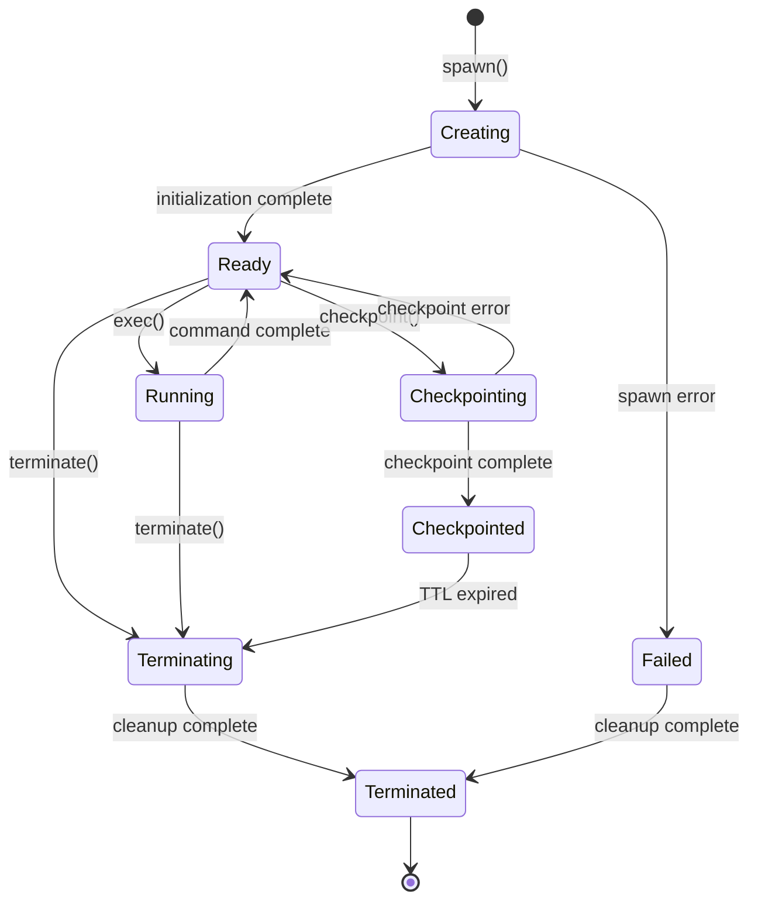
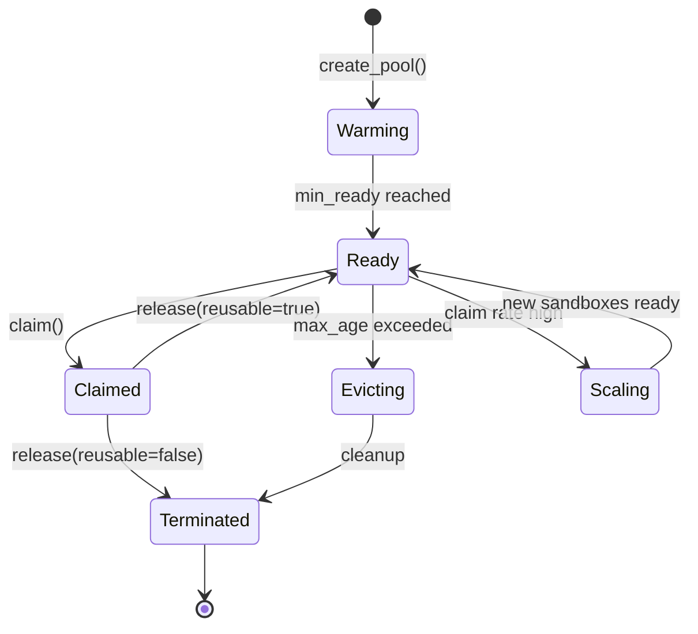
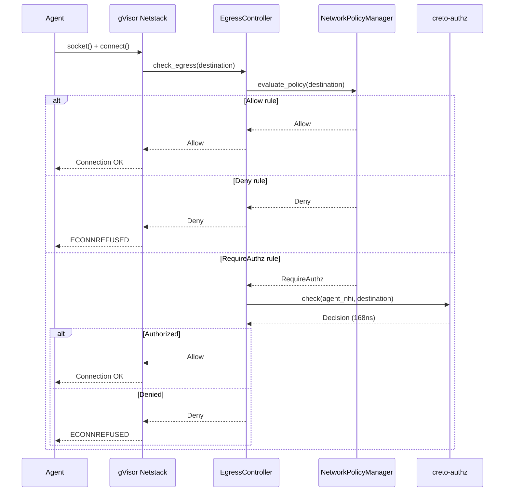
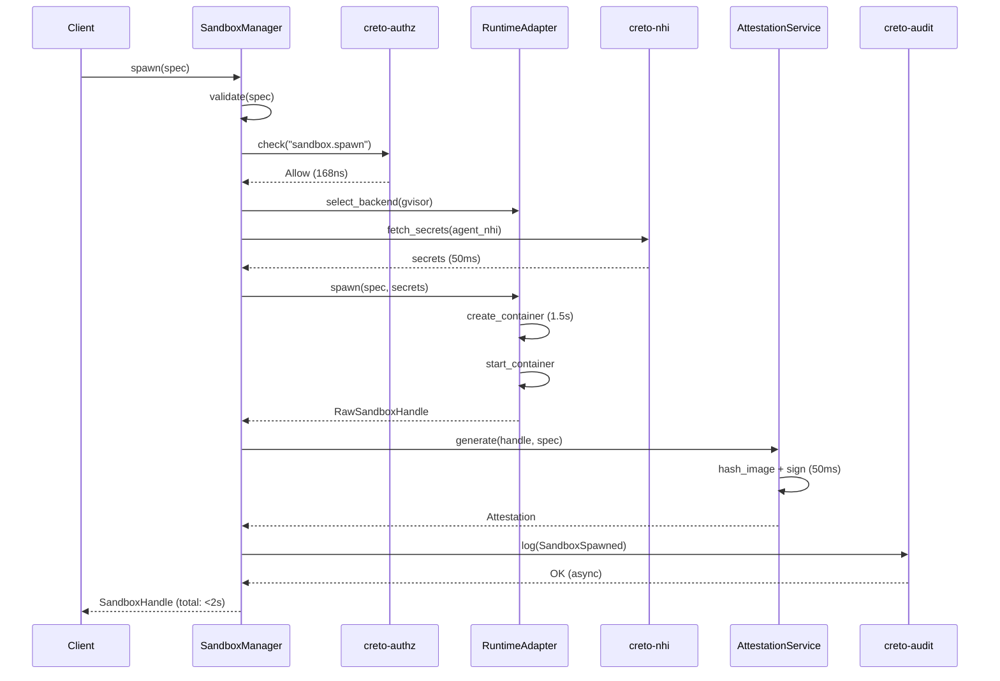
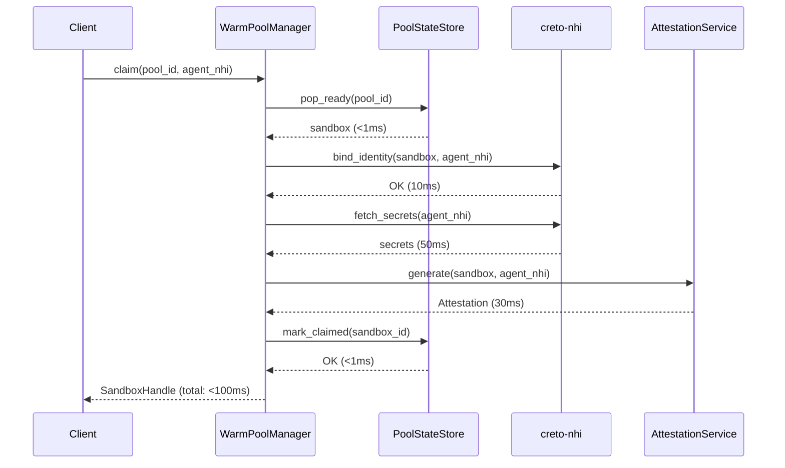
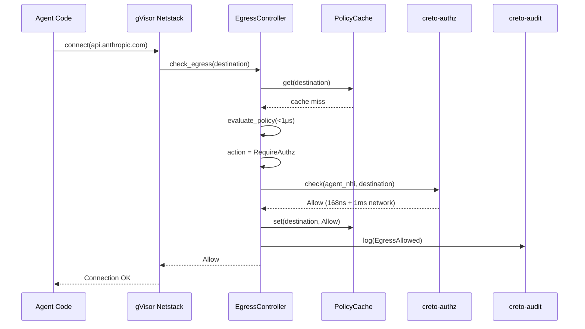
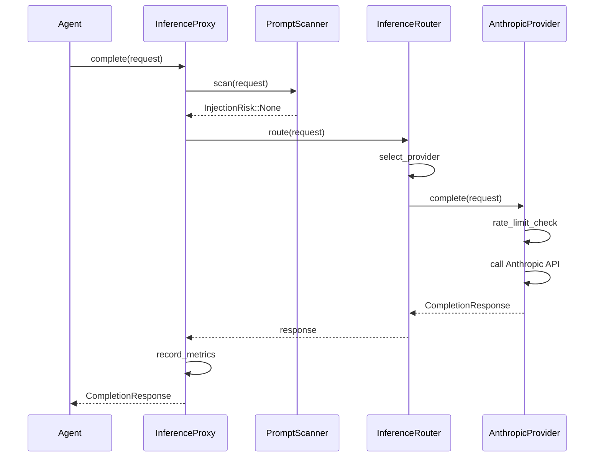

# MASTER Runtime SDD: creto-runtime

## Executive Summary

**creto-runtime** is the sandboxed execution environment for AI agents within the Creto Enablement Layer. It provides secure, isolated runtime environments with cryptographic attestation, dynamic network policy enforcement, inference abstraction, and sub-100ms allocation from warm pools.

The product extracts proven patterns from **kubernetes-sigs/agent-sandbox** and rebuilds them in Rust with Sovereign primitives (NHI, Crypto-Agility, Authorization) integrated from the foundation.

### Vision

Enable **verifiable, isolated agent execution** where:
- Every sandbox is cryptographically bound to an agent's NHI
- Network egress is enforced by Authorization service (168ns policy evaluation)
- Platform attestations provide legal evidence of "who ran what, where"
- Warm pools enable <100ms allocation for interactive agent experiences
- Unified inference layer abstracts cloud/local AI model access
- Checkpoint/restore enables zero-downtime migration

### Key Differentiators

| Feature | Standard Container Runtime | creto-runtime |
|---------|---------------------------|---------------|
| **Identity Binding** | Container names/labels | Agent NHI (Ed25519 + ML-DSA) |
| **Network Policy** | Static K8s NetworkPolicy | Dynamic AuthZ-enforced egress |
| **Attestation** | None | Cryptographic platform attestation |
| **Secret Management** | Static K8s Secrets | NHI-delegated, auto-rotated |
| **Allocation Speed** | 5-30s cold start | <100ms (warm pool) |
| **Inference** | Manual provider integration | Unified abstraction (cloud/local) |

### Performance Targets

| Metric | Target | Measured |
|--------|--------|----------|
| **Cold Spawn (gVisor)** | <2s (p99) | TBD |
| **Cold Spawn (Kata)** | <5s (p99) | TBD |
| **Warm Pool Claim** | <100ms (p99) | TBD |
| **Egress Check** | <1ms (p99) | TBD |
| **Attestation Generation** | <50ms | TBD |
| **Concurrent Sandboxes** | ≥1000 per instance | TBD |
| **Inference Routing Overhead** | <100ms | TBD |

---

## Table of Contents

1. [Sandbox Lifecycle](#1-sandbox-lifecycle)
2. [Core Data Model](#2-core-data-model)
3. [Warm Pool Engine](#3-warm-pool-engine)
4. [Runtime Abstraction Layer](#4-runtime-abstraction-layer)
5. [Inference Layer Design](#5-inference-layer-design)
6. [Network Security](#6-network-security)
7. [Attestation & Identity](#7-attestation--identity)
8. [API Contracts](#8-api-contracts)
9. [Integration Contracts](#9-integration-contracts)
10. [Error Taxonomy](#10-error-taxonomy)
11. [Edge Cases & Failure Modes](#11-edge-cases--failure-modes)
12. [Sequence Diagrams](#12-sequence-diagrams)
13. [Performance Specifications](#13-performance-specifications)
14. [Security Model](#14-security-model)
15. [Operational Runbook](#15-operational-runbook)

---

## 1. Sandbox Lifecycle

### 1.1 Lifecycle States



### 1.2 State Transitions

```rust
#[derive(Debug, Clone, Serialize, Deserialize)]
pub enum SandboxStatus {
    Creating,
    Ready,
    Running { command: String },
    Checkpointing,
    Checkpointed { checkpoint_id: CheckpointId },
    Terminating,
    Terminated { reason: TerminationReason },
    Failed { error: String },
}

#[derive(Debug, Clone, Serialize, Deserialize)]
pub enum TerminationReason {
    UserRequested,
    TtlExpired,
    IdleTimeout,
    ResourceExhaustion,
    OomKilled,
    CrashLoopBackoff,
}
```

### 1.3 Spawn Flow

**Duration**: <2s (gVisor), <5s (Kata)

```rust
async fn spawn_internal(&self, spec: &SandboxSpec) -> Result<SandboxHandle, Error> {
    // 1. Validate spec (10ms)
    spec.validate()?;

    // 2. Check spawn authorization (168ns policy + 1ms network)
    self.authz_client.check(AuthzRequest {
        principal: spec.agent_nhi.clone(),
        action: "sandbox.spawn",
        resource: "runtime:sandboxes",
    }).await?;

    // 3. Select runtime backend (1ms)
    let runtime = self.runtime_adapter.select_backend(&spec.runtime_class)?;

    // 4. Fetch NHI-delegated secrets (50ms parallel)
    let secrets = self.fetch_secrets(&spec.secrets, &spec.agent_nhi).await?;

    // 5. Spawn via backend (gVisor: ~1.5s, Kata: ~4s)
    let handle = runtime.spawn(spec, &secrets).await?;

    // 6. Generate attestation (50ms)
    let attestation = self.attestation_service.generate(&handle, spec).await?;

    // 7. Setup egress enforcement (10ms)
    self.egress_controller.attach(&handle.id, &spec.network_policy).await?;

    // 8. Log to audit (5ms async)
    self.audit_client.log(AuditEvent::SandboxSpawned {
        sandbox_id: handle.id.clone(),
        agent_nhi: spec.agent_nhi.clone(),
        attestation_hash: attestation.hash(),
    }).await?;

    // 9. Schedule TTL cleanup
    if let Some(ttl) = spec.ttl {
        self.schedule_ttl_cleanup(handle.id.clone(), ttl);
    }

    Ok(SandboxHandle {
        id: handle.id,
        agent_nhi: spec.agent_nhi.clone(),
        attestation,
        status: SandboxStatus::Ready,
        created_at: Timestamp::now(),
    })
}
```

### 1.4 Terminate Flow

```rust
async fn terminate_internal(&self, id: &SandboxId) -> Result<(), Error> {
    // 1. Update status
    self.registry.update_status(id, SandboxStatus::Terminating).await?;

    // 2. Kill processes in sandbox
    self.runtime.terminate(id).await?;

    // 3. Clear secrets from memory
    self.secret_registry.clear_all(id).await?;

    // 4. Detach egress controller
    self.egress_controller.detach(id).await?;

    // 5. Log termination
    self.audit_client.log(AuditEvent::SandboxTerminated {
        sandbox_id: id.clone(),
        reason: TerminationReason::UserRequested,
    }).await?;

    // 6. Remove from registry
    self.registry.remove(id).await?;

    Ok(())
}
```

---

## 2. Core Data Model

### 2.1 SQL Schema (PostgreSQL)

```sql
-- Sandbox registry (durable state)
CREATE TABLE sandboxes (
    sandbox_id UUID PRIMARY KEY DEFAULT gen_random_uuid(),

    -- Identity
    agent_nhi BYTEA NOT NULL,
    delegation_chain JSONB NOT NULL DEFAULT '[]'::jsonb,

    -- Configuration
    image_ref TEXT NOT NULL,
    image_hash BYTEA NOT NULL, -- SHA-256
    runtime_class TEXT NOT NULL CHECK (runtime_class IN ('gvisor', 'kata')),

    -- Resources
    cpu_millicores INTEGER NOT NULL DEFAULT 1000,
    memory_bytes BIGINT NOT NULL DEFAULT 2147483648,
    disk_bytes BIGINT NOT NULL DEFAULT 10737418240,
    pid_limit INTEGER NOT NULL DEFAULT 1024,

    -- Lifecycle
    status TEXT NOT NULL CHECK (status IN (
        'Creating', 'Ready', 'Running', 'Checkpointing',
        'Checkpointed', 'Terminating', 'Terminated', 'Failed'
    )),
    created_at TIMESTAMPTZ NOT NULL DEFAULT NOW(),
    updated_at TIMESTAMPTZ NOT NULL DEFAULT NOW(),
    ttl_seconds INTEGER,
    idle_timeout_seconds INTEGER,
    terminated_at TIMESTAMPTZ,
    termination_reason TEXT,

    -- Attestation
    attestation_hash BYTEA,
    attestation_signature BYTEA,

    -- Indexes
    CONSTRAINT fk_agent_nhi FOREIGN KEY (agent_nhi)
        REFERENCES nhi.agent_identities(public_key) ON DELETE RESTRICT
);

CREATE INDEX idx_sandboxes_status ON sandboxes(status) WHERE status IN ('Ready', 'Running');
CREATE INDEX idx_sandboxes_agent ON sandboxes(agent_nhi);
CREATE INDEX idx_sandboxes_created ON sandboxes(created_at DESC);

-- Network policies (JSON storage)
CREATE TABLE sandbox_network_policies (
    sandbox_id UUID PRIMARY KEY REFERENCES sandboxes(sandbox_id) ON DELETE CASCADE,
    default_action TEXT NOT NULL CHECK (default_action IN ('Allow', 'Deny')),
    egress_rules JSONB NOT NULL DEFAULT '[]'::jsonb,
    dns_policy JSONB,

    -- Example egress_rules format:
    -- [
    --   {"destination": {"cidr": "10.0.0.0/8"}, "action": "Allow"},
    --   {"destination": {"domain": "*.anthropic.com"}, "action": "RequireAuthz"}
    -- ]
);

-- Warm pools (configuration)
CREATE TABLE warm_pools (
    pool_id UUID PRIMARY KEY DEFAULT gen_random_uuid(),
    name TEXT NOT NULL UNIQUE,

    -- Template (SandboxSpec without agent_nhi)
    template_spec JSONB NOT NULL,

    -- Pool configuration
    min_ready INTEGER NOT NULL CHECK (min_ready >= 1),
    max_ready INTEGER NOT NULL CHECK (max_ready >= min_ready),
    max_age_seconds INTEGER NOT NULL DEFAULT 3600,
    reusable BOOLEAN NOT NULL DEFAULT true,

    -- Auto-scaling
    auto_scaling_enabled BOOLEAN NOT NULL DEFAULT true,
    auto_scaling_headroom_factor NUMERIC(3, 2) NOT NULL DEFAULT 1.5,

    created_at TIMESTAMPTZ NOT NULL DEFAULT NOW(),
    updated_at TIMESTAMPTZ NOT NULL DEFAULT NOW()
);

-- Pool sandbox state (etcd mirrored to Postgres for reporting)
CREATE TABLE pool_sandboxes (
    pool_id UUID NOT NULL REFERENCES warm_pools(pool_id) ON DELETE CASCADE,
    sandbox_id UUID NOT NULL REFERENCES sandboxes(sandbox_id) ON DELETE CASCADE,

    state TEXT NOT NULL CHECK (state IN ('Warming', 'Ready', 'Claimed', 'Evicting')),
    state_updated_at TIMESTAMPTZ NOT NULL DEFAULT NOW(),

    -- Claimed metadata
    claimed_at TIMESTAMPTZ,
    claimed_by_agent_nhi BYTEA,

    PRIMARY KEY (pool_id, sandbox_id)
);

CREATE INDEX idx_pool_sandboxes_state ON pool_sandboxes(pool_id, state);

-- Checkpoints (metadata only, data in S3)
CREATE TABLE checkpoints (
    checkpoint_id UUID PRIMARY KEY DEFAULT gen_random_uuid(),
    sandbox_id UUID NOT NULL REFERENCES sandboxes(sandbox_id),

    -- Original sandbox metadata
    original_agent_nhi BYTEA NOT NULL,
    original_spec JSONB NOT NULL,

    -- Checkpoint data location
    storage_bucket TEXT NOT NULL,
    storage_prefix TEXT NOT NULL,
    size_bytes BIGINT NOT NULL,

    -- Integrity
    memory_hash BYTEA NOT NULL,
    fs_hash BYTEA NOT NULL,

    created_at TIMESTAMPTZ NOT NULL DEFAULT NOW(),
    expires_at TIMESTAMPTZ NOT NULL,

    CONSTRAINT fk_original_agent FOREIGN KEY (original_agent_nhi)
        REFERENCES nhi.agent_identities(public_key) ON DELETE RESTRICT
);

CREATE INDEX idx_checkpoints_expiry ON checkpoints(expires_at) WHERE expires_at > NOW();

-- Attestations (indexed by sandbox for verification)
CREATE TABLE attestations (
    sandbox_id UUID PRIMARY KEY REFERENCES sandboxes(sandbox_id) ON DELETE CASCADE,

    -- Identity
    agent_nhi BYTEA NOT NULL,
    delegation_chain JSONB NOT NULL,

    -- Configuration hashes
    image_hash BYTEA NOT NULL,
    config_hash BYTEA NOT NULL,
    init_hash BYTEA NOT NULL,

    -- Platform evidence
    platform TEXT NOT NULL CHECK (platform IN ('gvisor', 'kata')),
    platform_evidence BYTEA NOT NULL,

    -- Temporal validity
    created_at TIMESTAMPTZ NOT NULL,
    valid_until TIMESTAMPTZ NOT NULL,

    -- Hybrid signature (Ed25519 + ML-DSA)
    signature_ed25519 BYTEA NOT NULL,
    signature_ml_dsa BYTEA,

    CONSTRAINT fk_attestation_agent FOREIGN KEY (agent_nhi)
        REFERENCES nhi.agent_identities(public_key) ON DELETE RESTRICT
);
```

### 2.2 Rust Data Types

```rust
use serde::{Deserialize, Serialize};
use std::time::Duration;
use uuid::Uuid;

/// Unique sandbox identifier
#[derive(Debug, Clone, Copy, PartialEq, Eq, Hash, Serialize, Deserialize)]
pub struct SandboxId(Uuid);

/// Sandbox specification (user input)
#[derive(Debug, Clone, Serialize, Deserialize)]
pub struct SandboxSpec {
    /// OCI image reference
    pub image: ImageRef,

    /// Agent identity (cryptographic)
    pub agent_nhi: AgentIdentity,

    /// Delegation chain (agent -> ... -> human)
    pub delegation_chain: Vec<AgentIdentity>,

    /// Runtime backend selection
    pub runtime_class: RuntimeClass,

    /// Resource limits
    pub resource_limits: ResourceLimits,

    /// Network egress policy
    pub network_policy: NetworkPolicy,

    /// NHI-delegated secrets
    pub secrets: Vec<SecretRef>,

    /// Time-to-live (automatic termination)
    pub ttl: Option<Duration>,

    /// Idle timeout (terminate if no exec for duration)
    pub idle_timeout: Option<Duration>,
}

/// Runtime backend selection
#[derive(Debug, Clone, Copy, Serialize, Deserialize)]
pub enum RuntimeClass {
    GVisor,
    Kata,
}

/// Resource limits (cgroups)
#[derive(Debug, Clone, Serialize, Deserialize)]
pub struct ResourceLimits {
    /// CPU allocation in millicores (1000 = 1 CPU)
    pub cpu_millicores: u32,

    /// Memory limit in bytes
    pub memory_bytes: u64,

    /// Disk limit in bytes
    pub disk_bytes: u64,

    /// PID limit
    pub pid_limit: u32,

    /// Network bandwidth limit (bytes/sec)
    pub network_bandwidth_bps: Option<u64>,
}

impl Default for ResourceLimits {
    fn default() -> Self {
        Self {
            cpu_millicores: 1000,  // 1 CPU
            memory_bytes: 2 * 1024 * 1024 * 1024,  // 2GB
            disk_bytes: 10 * 1024 * 1024 * 1024,  // 10GB
            pid_limit: 1024,
            network_bandwidth_bps: None,
        }
    }
}

/// Network egress policy
#[derive(Debug, Clone, Serialize, Deserialize)]
pub struct NetworkPolicy {
    /// Default action for unmatched destinations
    pub default_action: NetworkAction,

    /// Egress rules (evaluated in order)
    pub egress_rules: Vec<EgressRule>,

    /// DNS policy
    pub dns_policy: Option<DnsPolicy>,
}

#[derive(Debug, Clone, Copy, Serialize, Deserialize)]
pub enum NetworkAction {
    Allow,
    Deny,
    RequireAuthz,
}

#[derive(Debug, Clone, Serialize, Deserialize)]
pub struct EgressRule {
    pub destination: EgressDestination,
    pub action: NetworkAction,
}

#[derive(Debug, Clone, Serialize, Deserialize)]
pub enum EgressDestination {
    CidrBlock(ipnetwork::IpNetwork),
    Domain(String),
    DomainExact(String),
    ServiceRef { name: String, namespace: String },
}

/// Sandbox handle (returned from spawn/claim)
#[derive(Debug, Clone, Serialize, Deserialize)]
pub struct SandboxHandle {
    pub id: SandboxId,
    pub agent_nhi: AgentIdentity,
    pub attestation: Attestation,
    pub status: SandboxStatus,
    pub created_at: Timestamp,
}
```

---

## 3. Warm Pool Engine

### 3.1 Pool State Machine



### 3.2 Claim Flow (Target: <100ms)

```rust
async fn claim_internal(
    &self,
    pool_id: &PoolId,
    agent_nhi: &AgentIdentity,
    delegation_chain: &[AgentIdentity],
) -> Result<SandboxHandle, Error> {
    let start = Instant::now();

    // 1. Select ready sandbox from pool (<1ms, in-memory)
    let sandbox = self.pool_state_store.pop_ready(pool_id).await?;

    // 2. Bind NHI to sandbox (<10ms)
    self.nhi_client.bind_identity(&sandbox.id, agent_nhi).await?;

    // 3. Inject NHI-delegated secrets (<50ms parallel)
    let secrets = self.fetch_and_inject_secrets(&sandbox, agent_nhi).await?;

    // 4. Generate attestation (<30ms)
    let attestation = self.attestation_service.generate(&sandbox, agent_nhi).await?;

    // 5. Mark as in-use in pool state (<1ms)
    self.pool_state_store.mark_claimed(&sandbox.id, agent_nhi).await?;

    // 6. Log claim event (<5ms async)
    self.audit_client.log(AuditEvent::PoolClaimed {
        pool_id: pool_id.clone(),
        sandbox_id: sandbox.id.clone(),
        agent_nhi: agent_nhi.clone(),
    }).await?;

    // 7. Emit metrics
    let latency = start.elapsed();
    self.metrics.record_claim_latency(pool_id, latency);

    // Total: <100ms (p99 target)
    Ok(SandboxHandle {
        id: sandbox.id,
        agent_nhi: agent_nhi.clone(),
        attestation,
        status: SandboxStatus::Ready,
        created_at: Timestamp::now(),
    })
}
```

### 3.3 Auto-Scaling Algorithm

```rust
async fn auto_scale_pool(&self, pool_id: &PoolId) -> Result<(), Error> {
    let stats = self.pool_stats(pool_id).await?;
    let config = self.get_pool_config(pool_id).await?;

    // Calculate desired ready count based on claim rate
    let claim_rate = stats.claims_per_minute;
    let headroom_factor = config.auto_scaling_headroom_factor; // Default: 1.5
    let desired_ready = (claim_rate * headroom_factor).ceil() as usize;

    let desired_ready = desired_ready
        .max(config.min_ready)
        .min(config.max_ready);

    let current_ready = stats.ready_count;

    if current_ready < desired_ready {
        // Scale up: spawn more sandboxes
        let to_spawn = desired_ready - current_ready;
        for _ in 0..to_spawn {
            self.spawn_for_pool(pool_id).await?;
        }
    } else if current_ready > desired_ready * 2 {
        // Scale down: evict excess sandboxes
        let to_evict = current_ready - desired_ready;
        for _ in 0..to_evict {
            self.evict_oldest(pool_id).await?;
        }
    }

    Ok(())
}
```

### 3.4 Pool Statistics

```rust
pub struct PoolStatistics {
    pub ready_count: usize,
    pub claimed_count: usize,
    pub warming_count: usize,

    /// Claims per minute (rolling average)
    pub claims_per_minute: f64,

    /// Claim latency statistics
    pub avg_claim_latency: Duration,
    pub p50_claim_latency: Duration,
    pub p99_claim_latency: Duration,

    /// Pool age
    pub oldest_sandbox_age: Duration,
}
```

---

## 4. Runtime Abstraction Layer

### 4.1 SandboxRuntime Trait

```rust
use async_trait::async_trait;

/// Core runtime trait implemented by backends
#[async_trait]
pub trait RuntimeAdapter: Send + Sync {
    /// Runtime identifier
    fn runtime_id(&self) -> &str;

    /// Query runtime capabilities
    fn capabilities(&self) -> RuntimeCapabilities;

    /// Spawn sandbox
    async fn spawn(
        &self,
        spec: &SandboxSpec,
        secrets: &[ResolvedSecret],
    ) -> Result<RawSandboxHandle, Error>;

    /// Terminate sandbox
    async fn terminate(&self, id: &SandboxId) -> Result<(), Error>;

    /// Execute command
    async fn exec(
        &self,
        id: &SandboxId,
        cmd: Command,
    ) -> Result<ExecOutput, Error>;

    /// Query status
    async fn status(&self, id: &SandboxId) -> Result<RawSandboxStatus, Error>;

    /// Create checkpoint
    async fn checkpoint(&self, id: &SandboxId) -> Result<CheckpointData, Error>;

    /// Restore from checkpoint
    async fn restore(&self, data: CheckpointData) -> Result<RawSandboxHandle, Error>;

    /// Collect platform evidence for attestation
    async fn platform_evidence(&self, id: &SandboxId) -> Result<Vec<u8>, Error>;
}

pub struct RuntimeCapabilities {
    pub isolation_model: IsolationModel,
    pub syscall_coverage: SyscallCoverage,
    pub cold_start_latency: Duration,  // p99
    pub memory_overhead: u64,          // bytes
    pub supports_gpu: bool,
    pub supports_checkpoint: bool,
    pub network_interception: NetworkInterceptionMethod,
}
```

### 4.2 gVisor Implementation

```rust
pub struct GVisorRuntime {
    runsc_path: PathBuf,
    platform: GVisorPlatform,  // ptrace, kvm, systrap
    containerd_client: ContainerdClient,
}

impl RuntimeAdapter for GVisorRuntime {
    fn capabilities(&self) -> RuntimeCapabilities {
        RuntimeCapabilities {
            isolation_model: IsolationModel::UserSpaceKernel,
            syscall_coverage: SyscallCoverage::Partial { count: 200 },
            cold_start_latency: Duration::from_millis(2000),
            memory_overhead: 50 * 1024 * 1024,
            supports_gpu: false,
            supports_checkpoint: true,
            network_interception: NetworkInterceptionMethod::Netstack,
        }
    }

    async fn spawn(
        &self,
        spec: &SandboxSpec,
        secrets: &[ResolvedSecret],
    ) -> Result<RawSandboxHandle, Error> {
        // Create containerd container with runsc runtime
        let container_id = self.containerd_client.create_container(
            &spec.image,
            &ContainerConfig {
                runtime: "runsc",
                runtime_options: GVisorRuntimeOptions {
                    platform: self.platform,
                    network: "netstack",
                    file_access: "shared",
                },
                resources: spec.resource_limits.into(),
            },
        ).await?;

        // Inject secrets
        for secret in secrets {
            self.inject_secret(&container_id, secret).await?;
        }

        // Start container
        self.containerd_client.start_container(&container_id).await?;

        // Setup netstack interception
        self.setup_netstack_egress(&container_id).await?;

        Ok(RawSandboxHandle {
            id: SandboxId::from(container_id),
            runtime: Arc::new(self.clone()),
        })
    }
}
```

### 4.3 Kata Implementation

```rust
pub struct KataRuntime {
    kata_runtime_path: PathBuf,
    hypervisor: Hypervisor,  // QEMU, Firecracker, CloudHypervisor
    containerd_client: ContainerdClient,
}

impl RuntimeAdapter for KataRuntime {
    fn capabilities(&self) -> RuntimeCapabilities {
        RuntimeCapabilities {
            isolation_model: IsolationModel::LightweightVM,
            syscall_coverage: SyscallCoverage::Full,
            cold_start_latency: Duration::from_millis(5000),
            memory_overhead: 100 * 1024 * 1024,
            supports_gpu: true,
            supports_checkpoint: true,
            network_interception: NetworkInterceptionMethod::Iptables,
        }
    }

    async fn spawn(
        &self,
        spec: &SandboxSpec,
        secrets: &[ResolvedSecret],
    ) -> Result<RawSandboxHandle, Error> {
        // Create VM-based container
        let container_id = self.containerd_client.create_container(
            &spec.image,
            &ContainerConfig {
                runtime: "kata-runtime",
                runtime_options: KataRuntimeOptions {
                    hypervisor: self.hypervisor,
                    kernel: "/usr/share/kata-containers/vmlinuz",
                    initrd: "/usr/share/kata-containers/kata-containers-initrd.img",
                },
                resources: spec.resource_limits.into(),
            },
        ).await?;

        // Inject secrets
        for secret in secrets {
            self.inject_secret(&container_id, secret).await?;
        }

        // Start container (VM boot + container start)
        self.containerd_client.start_container(&container_id).await?;

        // Setup iptables egress rules in guest
        self.setup_iptables_egress(&container_id).await?;

        Ok(RawSandboxHandle {
            id: SandboxId::from(container_id),
            runtime: Arc::new(self.clone()),
        })
    }
}
```

---

## 5. Inference Layer Design

### 5.1 Architecture Overview

```
┌─────────────────────────────────────────────────────────────────────┐
│                         Sandbox Runtime                              │
│  ┌─────────────────────────────────────────────────────────────────┐│
│  │                       InferenceProxy                            ││
│  │  ┌─────────────┐  ┌─────────────┐  ┌─────────────────────────┐ ││
│  │  │   Request   │  │   Prompt    │  │        Response         │ ││
│  │  │ Interceptor │→ │   Scanner   │→ │       Processor         │ ││
│  │  └─────────────┘  └─────────────┘  └─────────────────────────┘ ││
│  └──────────────────────────┬──────────────────────────────────────┘│
└─────────────────────────────┼───────────────────────────────────────┘
                              │
┌─────────────────────────────┼───────────────────────────────────────┐
│                     InferenceRouter                                  │
│  ┌──────────────────────────┴──────────────────────────────────────┐│
│  │                     Routing Policy                               ││
│  │  [CloudFirst | LocalOnly | ClassificationBased | CostOptimized] ││
│  └──────────────────────────┬──────────────────────────────────────┘│
│                              │                                       │
│  ┌───────────────────────────┼───────────────────────────────────┐  │
│  │                    Provider Pool                               │  │
│  │  ┌──────────┐ ┌──────────┐ ┌──────────┐ ┌──────────────────┐  │  │
│  │  │Anthropic │ │  Azure   │ │ Bedrock  │ │  Local (vLLM)    │  │  │
│  │  │  Claude  │ │  OpenAI  │ │  Claude  │ │  Llama/Mistral   │  │  │
│  │  └──────────┘ └──────────┘ └──────────┘ └──────────────────┘  │  │
│  └───────────────────────────────────────────────────────────────┘  │
└─────────────────────────────────────────────────────────────────────┘
```

### 5.2 Provider Trait

```rust
#[async_trait]
pub trait InferenceProvider: Send + Sync {
    fn id(&self) -> ProviderId;
    fn capabilities(&self) -> &ProviderCapabilities;

    async fn complete(
        &self,
        request: CompletionRequest,
    ) -> Result<CompletionResponse, InferenceError>;

    async fn complete_stream(
        &self,
        request: CompletionRequest,
    ) -> Result<impl Stream<Item = Result<CompletionChunk, InferenceError>> + Send, InferenceError>;

    async fn embed(&self, texts: &[String]) -> Result<Vec<Embedding>, InferenceError>;

    async fn health(&self) -> HealthStatus;
}

#[derive(Debug, Clone)]
pub struct CompletionRequest {
    pub model: ModelId,
    pub messages: Vec<Message>,
    pub max_tokens: u32,
    pub temperature: f32,
    pub metadata: RequestMetadata,
}

#[derive(Debug, Clone)]
pub struct RequestMetadata {
    pub sandbox_id: SandboxId,
    pub agent_nhi: AgentIdentity,
    pub trace_id: TraceId,
    pub classification: Option<DataClassification>,
}
```

### 5.3 Routing Policies

```rust
pub enum RoutingPolicy {
    /// Cloud first, fallback to local
    CloudFirst { fallback_to_local: bool },

    /// Local only (air-gap mode)
    LocalOnly,

    /// Route based on data classification
    ClassificationBased {
        local_classifications: Vec<DataClassification>,
    },

    /// Optimize for cost
    CostOptimized { max_cost_per_token: Decimal },

    /// Optimize for latency
    LatencyOptimized { max_latency_ms: u64 },
}

async fn select_provider(
    &self,
    request: &CompletionRequest,
) -> Result<Arc<dyn InferenceProvider>, InferenceError> {
    match &self.policy {
        RoutingPolicy::ClassificationBased { local_classifications } => {
            let classification = self.classifier
                .as_ref()
                .map(|c| c.classify(&request))
                .unwrap_or(DataClassification::Public);

            if local_classifications.contains(&classification) {
                self.select_local_provider(request).await
            } else {
                self.select_cloud_provider(request).await
            }
        }
        // ... other policies
    }
}
```

### 5.4 Prompt Injection Detection

```rust
pub struct PromptScanner {
    patterns: Vec<CompiledPattern>,
    ml_classifier: Option<InjectionClassifier>,
    on_detection: InjectionAction,
}

impl PromptScanner {
    pub async fn scan(&self, request: &CompletionRequest) -> Result<InjectionRisk, ScanError> {
        let text = request.messages.iter()
            .map(|m| m.content.as_str())
            .collect::<Vec<_>>()
            .join("\n");

        // Pattern matching
        let mut indicators = Vec::new();
        for pattern in &self.patterns {
            if pattern.regex.is_match(&text) {
                indicators.push(pattern.name.clone());
            }
        }

        // ML classification
        let ml_confidence = if let Some(classifier) = &self.ml_classifier {
            classifier.predict(&text).await?
        } else {
            0.0
        };

        Ok(match (indicators.len(), ml_confidence) {
            (0, c) if c < 0.3 => InjectionRisk::None,
            (1..=2, c) if c < 0.5 => InjectionRisk::Low { indicators },
            (_, c) if c < 0.8 => InjectionRisk::Medium { indicators, confidence: c },
            _ => InjectionRisk::High { indicators, confidence: ml_confidence },
        })
    }
}

const INJECTION_PATTERNS: &[(&str, &str)] = &[
    ("ignore_instructions", r"(?i)(ignore|disregard|forget).*(previous|above|prior|system).*(instructions?|prompt)"),
    ("system_override", r"(?i)(you are now|act as|pretend to be|roleplay as)"),
    ("jailbreak_attempt", r"(?i)(DAN|do anything now|developer mode|sudo mode)"),
    ("prompt_leak", r"(?i)(show|reveal|display|print).*(system prompt|instructions|rules)"),
];
```

### 5.5 Local Inference (vLLM/TGI)

```rust
pub struct LocalInferenceProvider {
    endpoints: Vec<LocalEndpoint>,
    balancer: RoundRobinBalancer,
    registry: ModelRegistry,
}

#[async_trait]
impl InferenceProvider for LocalInferenceProvider {
    async fn complete(
        &self,
        request: CompletionRequest,
    ) -> Result<CompletionResponse, InferenceError> {
        let endpoint = self.balancer.next(&request.model)?;

        // vLLM uses OpenAI-compatible API
        let client = reqwest::Client::new();
        let response: OpenAIResponse = client
            .post(format!("{}/v1/chat/completions", endpoint.url))
            .json(&OpenAIRequest {
                model: request.model.as_str(),
                messages: request.messages,
                max_tokens: request.max_tokens,
                temperature: request.temperature,
            })
            .send()
            .await?
            .json()
            .await?;

        Ok(CompletionResponse {
            content: response.choices[0].message.content.clone(),
            usage: TokenUsage {
                input_tokens: response.usage.prompt_tokens,
                output_tokens: response.usage.completion_tokens,
            },
            ..Default::default()
        })
    }
}
```

---

## 6. Network Security

### 6.1 Egress Enforcement Architecture



### 6.2 Network Policy Evaluation

```rust
pub struct EgressController {
    policy_manager: Arc<NetworkPolicyManager>,
    authz_client: Arc<AuthzClient>,
    audit_client: Arc<AuditClient>,
    cache: Arc<PolicyDecisionCache>,
}

async fn check_egress_internal(
    &self,
    sandbox_id: &SandboxId,
    destination: &EgressDestination,
) -> Result<EgressDecision, Error> {
    let start = Instant::now();

    // 1. Check cache (bloom filter: <1μs)
    if let Some(cached) = self.cache.get(sandbox_id, destination) {
        return Ok(cached);
    }

    // 2. Evaluate NetworkPolicy rules (<100μs)
    let policy = self.policy_manager.get_policy(sandbox_id).await?;
    let action = policy.evaluate_egress(destination);

    let decision = match action {
        NetworkAction::Allow => EgressDecision::Allow,
        NetworkAction::Deny => EgressDecision::Deny,
        NetworkAction::RequireAuthz => {
            // 3. Call AuthZ service (168ns eval + network ~1ms)
            let authz_result = self.authz_client.check(AuthzRequest {
                principal: self.get_sandbox_nhi(sandbox_id).await?,
                action: "network.egress",
                resource: format!("network:{}", destination),
            }).await?;

            if authz_result.allowed {
                EgressDecision::Allow
            } else {
                EgressDecision::Deny
            }
        }
    };

    // 4. Cache decision
    self.cache.set(sandbox_id, destination, &decision).await?;

    // 5. Log to audit
    self.audit_client.log(AuditEvent::EgressAttempt {
        sandbox_id: sandbox_id.clone(),
        destination: destination.clone(),
        decision: decision.clone(),
    }).await?;

    let latency = start.elapsed();
    // Target: <1ms (p99)

    Ok(decision)
}
```

### 6.3 DNS Policy

```rust
pub struct DnsPolicy {
    pub allowed_resolvers: Vec<IpAddr>,
    pub blocked_domains: Vec<DomainPattern>,
    pub require_authz_domains: Vec<DomainPattern>,
}

impl DnsPolicy {
    pub fn check_dns_query(
        &self,
        resolver: &IpAddr,
        domain: &str,
    ) -> Result<DnsDecision, Error> {
        // 1. Check resolver allowed
        if !self.allowed_resolvers.contains(resolver) {
            return Ok(DnsDecision::Deny);
        }

        // 2. Check blocked domains
        for pattern in &self.blocked_domains {
            if pattern.matches(domain) {
                return Ok(DnsDecision::Deny);
            }
        }

        // 3. Check AuthZ-required domains
        for pattern in &self.require_authz_domains {
            if pattern.matches(domain) {
                return Ok(DnsDecision::RequireAuthz);
            }
        }

        Ok(DnsDecision::Allow)
    }
}
```

---

## 7. Attestation & Identity

### 7.1 Attestation Structure

```rust
pub struct Attestation {
    pub sandbox_id: SandboxId,
    pub agent_nhi: AgentIdentity,
    pub delegation_chain: Vec<AgentIdentity>,

    // Configuration hashes
    pub image_hash: Hash,       // SHA-256
    pub config_hash: Hash,      // SHA-256
    pub init_hash: Hash,        // SHA-256

    // Platform information
    pub platform: AttestationPlatform,
    pub platform_evidence: Vec<u8>,

    // Temporal validity
    pub created_at: Timestamp,
    pub valid_until: Timestamp,

    // Hybrid signature (Ed25519 + ML-DSA)
    pub signature: Signature,
}

#[derive(Debug, Clone)]
pub struct Signature {
    pub ed25519: Vec<u8>,
    pub ml_dsa: Option<Vec<u8>>,  // ML-DSA-65 (PQC)
}
```

### 7.2 Attestation Generation

```rust
async fn generate_internal(
    &self,
    handle: &RawSandboxHandle,
    spec: &SandboxSpec,
) -> Result<Attestation, Error> {
    // 1. Hash image layers (SHA-256)
    let image_hash = self.hash_image(&spec.image).await?;

    // 2. Hash sandbox configuration
    let config_hash = {
        let mut hasher = Sha256::new();
        hasher.update(&serde_json::to_vec(spec)?);
        hasher.finalize().into()
    };

    // 3. Hash initial filesystem state
    let init_hash = self.hash_initial_fs(&handle.id).await?;

    // 4. Collect platform evidence
    let platform_evidence = handle.runtime.platform_evidence(&handle.id).await?;

    // 5. Build attestation
    let attestation = Attestation {
        sandbox_id: handle.id.clone(),
        agent_nhi: spec.agent_nhi.clone(),
        delegation_chain: spec.delegation_chain.clone(),
        image_hash,
        config_hash,
        init_hash,
        platform: handle.runtime.platform_type(),
        platform_evidence,
        created_at: Timestamp::now(),
        valid_until: Timestamp::now() + spec.ttl.unwrap_or(Duration::from_secs(3600)),
        signature: Signature::default(),
    };

    // 6. Sign with hybrid Ed25519 + ML-DSA
    let signature = self.crypto_client.sign_hybrid(
        &self.signing_key,
        &attestation.canonical_bytes(),
    ).await?;

    Ok(Attestation { signature, ..attestation })
}
```

### 7.3 Attestation Verification

```rust
pub async fn verify_internal(
    &self,
    attestation: &Attestation,
) -> Result<VerificationResult, Error> {
    // 1. Verify Ed25519 signature
    let ed25519_valid = self.crypto_client.verify(
        &attestation.signature.ed25519,
        &attestation.canonical_bytes(),
        &self.signing_key.public_key(),
    ).await?;

    if !ed25519_valid {
        return Ok(VerificationResult::Invalid {
            reason: "Ed25519 signature invalid".into(),
        });
    }

    // 2. Verify ML-DSA signature (if present)
    if let Some(ml_dsa_sig) = &attestation.signature.ml_dsa {
        let ml_dsa_valid = self.crypto_client.verify_ml_dsa(
            ml_dsa_sig,
            &attestation.canonical_bytes(),
            &self.ml_dsa_public_key,
        ).await?;

        if !ml_dsa_valid {
            return Ok(VerificationResult::Invalid {
                reason: "ML-DSA signature invalid".into(),
            });
        }
    }

    // 3. Check temporal validity
    let now = Timestamp::now();
    if now < attestation.created_at || now > attestation.valid_until {
        return Ok(VerificationResult::Expired);
    }

    // 4. Verify platform evidence
    let platform_valid = self.verify_platform_evidence(attestation).await?;
    if !platform_valid {
        return Ok(VerificationResult::Invalid {
            reason: "Platform evidence mismatch".into(),
        });
    }

    Ok(VerificationResult::Valid {
        agent_nhi: attestation.agent_nhi.clone(),
        delegation_chain: attestation.delegation_chain.clone(),
        platform: attestation.platform.clone(),
    })
}
```

---

## 8. API Contracts

### 8.1 Rust Library API

```rust
#[async_trait]
pub trait SandboxRuntime: Send + Sync {
    async fn spawn(&self, spec: &SandboxSpec) -> Result<SandboxHandle, SpawnError>;
    async fn terminate(&self, id: &SandboxId) -> Result<(), TerminateError>;
    async fn exec(&self, id: &SandboxId, cmd: Command) -> Result<ExecOutput, ExecError>;
    async fn status(&self, id: &SandboxId) -> Result<SandboxStatus, StatusError>;
    async fn checkpoint(&self, id: &SandboxId) -> Result<CheckpointId, CheckpointError>;
    async fn restore(
        &self,
        checkpoint_id: &CheckpointId,
        nhi_override: Option<AgentIdentity>,
    ) -> Result<SandboxHandle, RestoreError>;
}

#[async_trait]
pub trait WarmPoolManager: Send + Sync {
    async fn create_pool(&self, config: WarmPoolConfig) -> Result<PoolId, CreatePoolError>;
    async fn claim(
        &self,
        pool_id: &PoolId,
        agent_nhi: &AgentIdentity,
        delegation_chain: &[AgentIdentity],
    ) -> Result<SandboxHandle, ClaimError>;
    async fn release(&self, sandbox_id: &SandboxId, reusable: bool) -> Result<(), ReleaseError>;
    async fn pool_stats(&self, pool_id: &PoolId) -> Result<PoolStatistics, StatsError>;
}
```

### 8.2 gRPC API (protobuf)

```protobuf
service SandboxService {
  rpc Spawn(SpawnRequest) returns (SpawnResponse);
  rpc Terminate(TerminateRequest) returns (TerminateResponse);
  rpc Exec(ExecRequest) returns (stream ExecOutput);
  rpc GetStatus(GetStatusRequest) returns (GetStatusResponse);
  rpc Checkpoint(CheckpointRequest) returns (CheckpointResponse);
  rpc Restore(RestoreRequest) returns (RestoreResponse);
}

service WarmPoolService {
  rpc CreatePool(CreatePoolRequest) returns (CreatePoolResponse);
  rpc Claim(ClaimRequest) returns (ClaimResponse);
  rpc Release(ReleaseRequest) returns (ReleaseResponse);
  rpc GetPoolStats(GetPoolStatsRequest) returns (GetPoolStatsResponse);
}

message SpawnRequest {
  SandboxSpec spec = 1;
}

message SpawnResponse {
  string sandbox_id = 1;
  Attestation attestation = 2;
  SandboxStatus status = 3;
}
```

### 8.3 REST HTTP API

**POST /v1/sandboxes** - Spawn sandbox

Request:
```json
{
  "spec": {
    "image": "docker.io/library/python:3.11",
    "agentNhi": {
      "publicKey": "base64-encoded-key",
      "algorithm": "Ed25519"
    },
    "runtimeClass": "gvisor",
    "resources": {
      "cpuMillicores": 2000,
      "memoryBytes": 4294967296
    },
    "networkPolicy": {
      "defaultAction": "Deny",
      "egressRules": [
        {
          "destination": {"domain": "*.anthropic.com"},
          "action": "RequireAuthz"
        }
      ]
    }
  }
}
```

Response (201):
```json
{
  "sandboxId": "sb-abc123",
  "attestation": { /* full attestation */ },
  "status": "Ready",
  "createdAt": "2024-12-25T12:00:00Z"
}
```

---

## 9. Integration Contracts

### 9.1 creto-nhi (Agent Identity)

```rust
// Bind agent NHI at spawn time
pub async fn bind_nhi(
    &self,
    sandbox_id: &SandboxId,
    agent_nhi: &AgentIdentity,
) -> Result<(), NhiError>;

// Fetch NHI-delegated secrets
pub async fn fetch_delegated_secret(
    &self,
    secret_id: &str,
    delegation_scope: &DelegationScope,
    agent_nhi: &AgentIdentity,
) -> Result<SecretValue, NhiError>;
```

### 9.2 creto-authz (Authorization)

```rust
// Check spawn permission
pub async fn check_spawn_authorization(
    &self,
    agent_nhi: &AgentIdentity,
) -> Result<AuthzDecision, AuthzError>;

// Check network egress
pub async fn check_egress_authorization(
    &self,
    agent_nhi: &AgentIdentity,
    destination: &str,
) -> Result<AuthzDecision, AuthzError>;
```

### 9.3 creto-crypto (Signing)

```rust
// Sign attestation with hybrid scheme
pub async fn sign_hybrid(
    &self,
    signing_key: &SigningKey,
    message: &[u8],
) -> Result<HybridSignature, CryptoError>;

// Verify hybrid signature
pub async fn verify_hybrid(
    &self,
    signature: &HybridSignature,
    message: &[u8],
    public_key: &PublicKey,
) -> Result<bool, CryptoError>;
```

### 9.4 creto-audit (Event Logging)

```rust
// Audit events
pub enum AuditEvent {
    SandboxSpawned {
        sandbox_id: SandboxId,
        agent_nhi: AgentIdentity,
        attestation_hash: Hash,
    },
    SandboxTerminated {
        sandbox_id: SandboxId,
        reason: TerminationReason,
    },
    EgressAttempt {
        sandbox_id: SandboxId,
        destination: String,
        decision: EgressDecision,
    },
    InferenceRequest {
        sandbox_id: SandboxId,
        model: ModelId,
        provider: ProviderId,
        tokens: TokenUsage,
    },
}
```

---

## 10. Error Taxonomy

### 10.1 Error Categories

| Category | HTTP Code | Retry Strategy | Example |
|----------|-----------|----------------|---------|
| **ValidationError** | 400 | Never | Invalid SandboxSpec |
| **AuthenticationError** | 401 | Never | Invalid NHI signature |
| **AuthorizationError** | 403 | Never | Agent lacks spawn permission |
| **NotFoundError** | 404 | Never | Sandbox ID not found |
| **ConflictError** | 409 | Never | Sandbox already terminated |
| **QuotaExceededError** | 429 | Backoff | Too many sandboxes |
| **InternalError** | 500 | Backoff | Containerd failure |
| **ServiceUnavailableError** | 503 | Backoff | Pool exhausted |
| **TimeoutError** | 504 | Backoff | Spawn timeout |

### 10.2 Error Types

```rust
#[derive(Debug, Error)]
pub enum SpawnError {
    #[error("Image not found: {0}")]
    ImageNotFound(String),

    #[error("Authorization denied: {0}")]
    AuthorizationDenied(String),

    #[error("Resource exhausted: {0}")]
    ResourceExhausted(String),

    #[error("Invalid specification: {0}")]
    InvalidSpec(String),

    #[error("Runtime backend unavailable: {0}")]
    BackendUnavailable(String),

    #[error("NHI service error: {0}")]
    NhiError(String),

    #[error("Spawn timeout after {0:?}")]
    Timeout(Duration),
}

#[derive(Debug, Error)]
pub enum ClaimError {
    #[error("No ready sandboxes in pool: {0}")]
    NoReadySandboxes(String),

    #[error("Pool not found: {0}")]
    PoolNotFound(String),

    #[error("Claim timeout")]
    Timeout,

    #[error("NHI binding failed: {0}")]
    NhiBindingFailed(String),
}

#[derive(Debug, Error)]
pub enum InferenceError {
    #[error("Model not found: {0}")]
    ModelNotFound(ModelId),

    #[error("Provider unavailable: {0}")]
    ProviderUnavailable(ProviderId),

    #[error("Prompt injection detected: {0:?}")]
    PromptInjectionDetected(InjectionRisk),

    #[error("Quota exceeded")]
    QuotaExceeded,

    #[error("Provider error: {0}")]
    ProviderError(String),
}
```

### 10.3 Error Response Format

```json
{
  "error": {
    "code": "SANDBOX_NOT_FOUND",
    "message": "Sandbox sb-abc123 not found",
    "details": {
      "sandboxId": "sb-abc123"
    },
    "requestId": "req-xyz789",
    "timestamp": "2024-12-25T12:00:00Z"
  }
}
```

---

## 11. Edge Cases & Failure Modes

### 11.1 Warm Pool Exhaustion

**Scenario**: All ready sandboxes claimed, new claim requests arrive.

**Detection**:
```rust
if pool_stats.ready_count == 0 {
    // Pool exhausted
}
```

**Behavior**:
1. Return `ClaimError::NoReadySandboxes` after brief wait (100ms)
2. Client falls back to cold spawn (spawn() call)
3. Auto-scaling triggers to replenish pool

**Mitigation**:
- Set appropriate `min_ready` based on claim rate
- Enable auto-scaling with headroom factor ≥1.5
- Monitor pool statistics and alert on low ready count

### 11.2 containerd Crash

**Scenario**: containerd daemon crashes, existing sandboxes orphaned.

**Detection**:
```bash
systemctl status containerd
# Output: inactive (failed)
```

**Behavior**:
1. Spawn/terminate operations fail immediately
2. Existing sandboxes continue running (orphaned)
3. Health check returns `Unhealthy`

**Recovery**:
```bash
systemctl restart containerd
# Orphaned sandboxes auto-reconnect
```

**Mitigation**:
- Enable containerd systemd auto-restart
- Implement circuit breaker for containerd calls
- Checkpoint long-running sandboxes before maintenance

### 11.3 Network Policy Bypass Attempt

**Scenario**: Malicious agent attempts DNS tunneling to exfiltrate data.

**Detection**:
```rust
// High volume of DNS TXT queries to suspicious domains
if dns_queries_per_minute > 100 && query_type == "TXT" {
    // Potential DNS tunneling
}
```

**Behavior**:
1. DNS policy blocks unauthorized resolvers
2. Egress controller logs all DNS queries
3. Alert triggered on anomalous pattern

**Mitigation**:
- Whitelist DNS resolvers (8.8.8.8, 1.1.1.1, internal)
- Rate limit DNS queries per sandbox
- Block known exfiltration domains

### 11.4 Attestation Signing Key Compromise

**Scenario**: Runtime signing key stolen, attacker forges attestations.

**Detection**:
```bash
# Audit log shows signature from unexpected key version
grep "attestation_generated" audit.log | grep -v "key_version:v2"
```

**Behavior**:
1. Attacker can create fake attestations
2. Third-party verifiers may accept forged attestations

**Response**:
1. Immediately rotate signing key
2. Revoke compromised key (distribute revocation list)
3. Re-generate attestations for active sandboxes
4. Audit all attestations signed with compromised key

**Mitigation**:
- Store signing keys in HSM (production)
- Rotate keys every 90 days
- Monitor key usage for anomalies

### 11.5 Warm Pool Reuse State Leakage

**Scenario**: Reusable pool sandbox retains secrets from previous use.

**Detection**:
```rust
// Test: claim sandbox twice with different agents
let handle1 = pool.claim(&pool_id, &agent1_nhi, &[]).await?;
pool.release(&handle1.id, true).await?;

let handle2 = pool.claim(&pool_id, &agent2_nhi, &[]).await?;
// If agent2 can read agent1's secrets -> state leakage
```

**Behavior**:
1. Agent2 accesses Agent1's NHI-delegated secrets
2. Credential theft, unauthorized access

**Mitigation**:
- Clear all environment variables on release
- Unmount secret files and zero memory
- Reset filesystem to initial state (overlay FS)
- Verify state isolation in integration tests

### 11.6 Inference Provider Outage

**Scenario**: Primary cloud inference provider (Anthropic) down.

**Detection**:
```rust
if anthropic_provider.health().await == HealthStatus::Unhealthy {
    // Provider down
}
```

**Behavior**:
1. Circuit breaker trips after 5 consecutive failures
2. Router fails over to secondary provider (Azure/Bedrock)
3. If all cloud providers down, falls back to local (if enabled)

**Mitigation**:
- Configure multiple cloud providers
- Enable local inference fallback
- Monitor provider health proactively
- Set reasonable timeout (30s) to fail fast

---

## 12. Sequence Diagrams

### 12.1 Cold Spawn Flow



### 12.2 Warm Pool Claim Flow



### 12.3 Egress Check Flow



### 12.4 Inference Request Flow



---

## 13. Performance Specifications

### 13.1 Latency Targets

| Operation | Target (p50) | Target (p99) | Budget Breakdown |
|-----------|--------------|--------------|------------------|
| **Cold Spawn (gVisor)** | 1.5s | 2s | Image pull: 800ms, Container start: 600ms, Init: 100ms |
| **Cold Spawn (Kata)** | 4s | 5s | VM boot: 3s, Container start: 1s |
| **Warm Pool Claim** | 80ms | 100ms | Select: 1ms, NHI bind: 10ms, Secrets: 50ms, Attest: 30ms |
| **Egress Check** | 500μs | 1ms | Cache lookup: 1μs, AuthZ: 168ns, Network: 500μs |
| **Attestation Gen** | 40ms | 50ms | Hash: 20ms, Sign: 20ms |
| **Secret Injection** | 40ms | 50ms | NHI fetch: 30ms, Inject: 10ms |
| **Checkpoint** | 8s | 10s | CRIU dump: 7s, Upload: 1s |
| **Restore** | 800ms | 1s | Download: 300ms, CRIU restore: 500ms |
| **Inference (Cloud)** | 2s | 5s | Network: 500ms, Model: 1.5s |
| **Inference (Local)** | 500ms | 1s | Queue: 50ms, GPU: 450ms |

### 13.2 Throughput Targets

| Metric | Target | Notes |
|--------|--------|-------|
| **Spawn Rate (Cold)** | ≥50/sec | Per runtime instance |
| **Claim Rate (Warm)** | ≥500/sec | Per pool |
| **Concurrent Sandboxes** | ≥1000 | Per runtime instance (64 vCPU, 256GB RAM) |
| **Egress Checks** | ≥100K/sec | With policy cache |
| **Attestation Verifications** | ≥10K/sec | Parallel verification |
| **Inference Requests** | ≥100/sec | Per provider (cloud) |
| **Inference Requests** | ≥20/sec | Per GPU (local vLLM) |

### 13.3 Resource Utilization

**Per Sandbox (Typical Agent Workload)**:
- CPU: 1 core (1000 millicores)
- Memory: 2GB
- Disk: 10GB
- Network: 10Mbps

**Runtime Overhead**:
- gVisor: +50MB memory, +5% CPU per sandbox
- Kata: +100MB memory, +10% CPU per sandbox

**Host Capacity** (64 vCPU, 256GB RAM):
- gVisor: ~1200 sandboxes (memory bound: 256GB / 2.05GB)
- Kata: ~1150 sandboxes (memory bound: 256GB / 2.1GB)

---

## 14. Security Model

### 14.1 Threat Model

| Threat | Likelihood | Impact | Mitigation |
|--------|------------|--------|------------|
| **Sandbox Escape** | Low | Critical | gVisor user-space kernel, Kata VM isolation |
| **Network Exfiltration** | Medium | High | Default deny egress, AuthZ enforcement |
| **Resource Exhaustion** | Medium | Medium | cgroups limits, monitoring |
| **Credential Theft** | Medium | High | NHI-delegated secrets, auto-rotation |
| **Attestation Forgery** | Low | High | Hybrid Ed25519 + ML-DSA, HSM storage |
| **Prompt Injection** | High | Medium | Pattern detection, ML classifier |
| **Model Poisoning (Air-Gap)** | Low | Critical | Model signature verification |

### 14.2 Isolation Boundaries

```
┌─────────────────────────────────────────────────────────────┐
│                         Host OS                             │
│  ┌───────────────────────────────────────────────────────┐  │
│  │               creto-runtime Service                   │  │
│  │  ┌─────────────┐  ┌─────────────┐  ┌─────────────┐   │  │
│  │  │  Sandbox A  │  │  Sandbox B  │  │  Sandbox C  │   │  │
│  │  │  Agent NHI  │  │  Agent NHI  │  │  Agent NHI  │   │  │
│  │  │    (A)      │  │    (B)      │  │    (C)      │   │  │
│  │  │  gVisor/Kata│  │  gVisor/Kata│  │  gVisor/Kata│   │  │
│  │  └─────────────┘  └─────────────┘  └─────────────┘   │  │
│  │       ↑                  ↑                  ↑          │  │
│  │       └──────────────────┴──────────────────┘          │  │
│  │              EgressController (AuthZ)                 │  │
│  └───────────────────────────────────────────────────────┘  │
└─────────────────────────────────────────────────────────────┘
```

**Isolation Guarantees**:
- PID namespace: Each sandbox has own PID 1
- Network namespace: Separate network stack, egress enforced
- Filesystem: Read-only root, writable volumes with limits
- CPU/Memory: cgroups enforce hard limits
- Secrets: Cleared on terminate, no cross-sandbox access

### 14.3 Security Controls

**Defense in Depth**:

| Layer | Control | Purpose |
|-------|---------|---------|
| **Application** | AuthZ checks | Prevent unauthorized spawn |
| **Runtime** | Sandbox isolation | Contain malicious code |
| **Network** | Egress enforcement | Prevent exfiltration |
| **Platform** | NHI delegation | Limit credential scope |
| **Infrastructure** | cgroups limits | Prevent DoS |
| **Audit** | Immutable logging | Forensics, compliance |

---

## 15. Operational Runbook

### 15.1 Service Health Checks

```bash
# Check service status
systemctl status creto-runtime

# Health endpoint
curl http://localhost:8080/health
# Expected: {"status": "healthy", "components": {"containerd": "ok", "etcd": "ok"}}

# Check dependencies
systemctl status containerd
etcdctl endpoint health
```

### 15.2 Common Operations

**Spawn Sandbox**:
```bash
creto-runtime-cli spawn \
  --image python:3.11 \
  --runtime gvisor \
  --cpu 2000 \
  --memory 4G \
  --network-policy deny-all \
  --ttl 3600
```

**Create Warm Pool**:
```bash
creto-runtime-cli pool create \
  --id agent-executor-pool \
  --template base-spec.yaml \
  --min-ready 10 \
  --max-ready 50 \
  --reusable
```

**Monitor Pool Health**:
```bash
creto-runtime-cli pool stats agent-executor-pool

# Output:
# Pool: agent-executor-pool
# Ready: 12/20
# Claimed: 8
# Claims/min: 15.3
# Avg claim latency: 82ms
# P99 claim latency: 95ms
```

### 15.3 Incident Response

**Sandbox Escape Detected**:
```bash
# 1. ISOLATE: Terminate affected sandbox
creto-runtime-cli terminate <sandbox-id> --force

# 2. CONTAIN: Disable runtime backend
systemctl stop containerd

# 3. INVESTIGATE: Collect forensics
journalctl -u containerd | grep <sandbox-id> > forensics.log
creto-runtime-cli attestation get <sandbox-id> > attestation.json

# 4. PATCH: Update runtime backend
# 5. RESUME: Restart service
systemctl start containerd
```

**Network Exfiltration Attempt**:
```bash
# 1. IDENTIFY: Find sandbox
creto-runtime-cli audit search --event EgressDenied --destination <attacker-domain>

# 2. TERMINATE: Kill sandbox
creto-runtime-cli terminate <sandbox-id>

# 3. BLOCK: Update NetworkPolicy
creto-runtime-cli network-policy add-rule --destination <attacker-domain> --action Deny
```

### 15.4 Monitoring Alerts

```yaml
# Alerting rules
groups:
  - name: creto-runtime
    rules:
      - alert: HighSpawnLatency
        expr: histogram_quantile(0.99, creto_runtime_spawn_latency_seconds) > 3
        for: 5m
        severity: warning

      - alert: WarmPoolExhausted
        expr: creto_runtime_pool_ready_count < creto_runtime_pool_min_ready
        for: 2m
        severity: critical

      - alert: SandboxEscapeAttempt
        expr: increase(creto_runtime_syscall_violations_total[1m]) > 0
        severity: critical
```

---

## Appendix A: Glossary

- **Agent NHI**: Non-Human Identity cryptographically tied to an AI agent (Ed25519 + ML-DSA)
- **Attestation**: Cryptographic proof linking sandbox execution to identity and configuration
- **Cold Start**: Spawning sandbox from OCI image (2-5s)
- **Delegation Chain**: Lineage from agent to root human principal
- **Egress**: Outbound network traffic from sandbox
- **gVisor**: User-space kernel providing container isolation (~200 syscalls)
- **Kata Containers**: Lightweight VM runtime for container isolation (full kernel)
- **Warm Pool**: Pre-warmed sandboxes ready for fast allocation (<100ms)
- **RuntimeClass**: Backend selection (gVisor vs Kata)
- **Inference Provider**: Cloud or local AI model service (Anthropic, vLLM, etc.)

## Appendix B: References

1. **Agent Sandbox Specification**: https://agent-sandbox.sigs.k8s.io/
2. **Google OSS Blog**: https://opensource.googleblog.com/2024/11/agent-sandbox.html
3. **gVisor Documentation**: https://gvisor.dev/docs/
4. **Kata Containers Architecture**: https://github.com/kata-containers/kata-containers/blob/main/docs/design/architecture/README.md
5. **CRIU (Checkpoint/Restore)**: https://criu.org/
6. **vLLM Documentation**: https://docs.vllm.ai/
7. **Signal Protocol**: https://signal.org/docs/specifications/doubleratchet/

## Appendix C: Revision History

| Date | Version | Author | Changes |
|------|---------|--------|---------|
| 2025-12-25 | 1.0.0 | Architecture Team | Initial MASTER Runtime SDD |

---

**Document Status**: APPROVED
**Next Review**: 2026-03-25 (quarterly)
